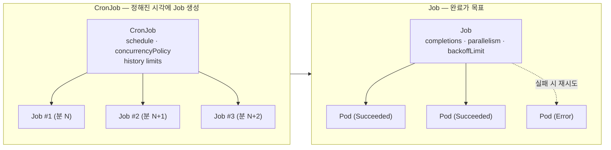

# 10. Job · CronJob — 완료를 목표로 하는 Pod

끝이 있는 작업(배치, 마이그레이션, 백업)을 Job으로 한 번 수행하고, 정해진 시각마다 같은 작업을 CronJob으로 반복하는 모습을 손으로 확인하는 실습 공간입니다.

## 핵심 다이어그램



- **Deployment·StatefulSet·DaemonSet은 "계속 떠 있어야 하는 Pod"** 를 다룹니다. Job·CronJob은 정반대 — 시작해서 성공하면 끝이 있는 작업입니다.
- **Job**: Pod를 만들어 실행하고 종료 코드 0(성공)을 보면 그만둡니다. 실패하면 `backoffLimit`만큼 재시도합니다. `completions`로 "이만큼 성공해야 끝"을 정하고, `parallelism`으로 "동시에 이만큼"을 정합니다.
- **CronJob**: cron 표현식(`*/1 * * * *` 등)이 가리키는 시각마다 Job 객체를 만듭니다. 직접 Pod를 만들지 않고 Job → Pod 사슬을 만든다는 점이 핵심입니다.
- **`restartPolicy`** 는 Job/CronJob 템플릿에서 `Always`를 못 씁니다. `OnFailure`(같은 Pod에서 재시도) 또는 `Never`(새 Pod로 재시도) 중 하나입니다. 이 실습은 `Never`를 씁니다.

아래 시연이 이 그림의 각 지점을 한 줄씩 손으로 확인합니다.

## 사전 준비물

이 실습은 **macOS** 환경을 기준으로 합니다.

- **Docker** — Docker Desktop, OrbStack 등. `docker ps`가 에러 없이 돌아가면 OK.
- **Homebrew** — macOS 패키지 관리자.

### kind · kubectl 설치

```bash
brew install kind kubectl
```

### rosa-lab 클러스터 준비

```bash
kind create cluster --name rosa-lab
```

이미 있으면 건너뜁니다.

```bash
$ kubectl get nodes
NAME                     STATUS   ROLES           AGE   VERSION
rosa-lab-control-plane   Ready    control-plane   1m    v1.36.1
```

### rosa-lab namespace 준비

```bash
kubectl create namespace rosa-lab
kubectl config set-context --current --namespace=rosa-lab
```

이미 namespace가 있고 기본값으로 설정되어 있으면 건너뜁니다.

```bash
kubectl config get-contexts   # NAMESPACE 열에 rosa-lab이 보이면 OK
```

## 실습 환경

| 파일 | 내용 |
|---|---|
| `manifests/job.yaml` | 기본 Job — 한 번 실행, 성공하면 종료 |
| `manifests/job-parallel.yaml` | `completions: 5` · `parallelism: 2` — 5번 성공할 때까지, 동시에 2개씩 |
| `manifests/job-fail.yaml` | 항상 실패하는 Job + `backoffLimit: 2` — 재시도 한계 관찰 |
| `manifests/cronjob.yaml` | 1분마다 한 번씩 Job을 만드는 CronJob |

## 여기서 직접 확인할 수 있는 것

### 기본 Job — 한 번 실행하고 종료합니다

```yaml
apiVersion: batch/v1
kind: Job
metadata:
  name: hello
spec:
  template:
    spec:
      restartPolicy: Never
      containers:
        - name: hello
          image: busybox:1.37
          command: ["sh", "-c", "echo \"[$(date)] hello from $(hostname)\"; sleep 3"]
```

`apiVersion`이 Deployment·StatefulSet의 `apps/v1`이 아니라 `batch/v1`입니다. Job·CronJob은 batch 그룹에 속합니다. 그리고 `restartPolicy: Never` — Job 템플릿에서는 `Always`가 허용되지 않습니다.

적용하고 완료까지 기다립니다.

```bash
kubectl apply -f manifests/job.yaml
kubectl wait --for=condition=complete job/hello --timeout=120s
```

```bash
$ kubectl get job hello
NAME    STATUS     COMPLETIONS   DURATION   AGE
hello   Complete   1/1           10s        10s
```

`COMPLETIONS 1/1`이 핵심입니다 — "1번 성공시켜야 한다 / 이미 1번 성공했다". `DURATION 10s`은 시작부터 완료까지 걸린 시간입니다.

Pod 쪽은 어떤 상태일까요?

```bash
$ kubectl get pods -l job-name=hello
NAME          READY   STATUS      RESTARTS   AGE
hello-52j22   0/1     Completed   0          10s
```

`STATUS Completed`(Deployment의 Pod는 절대 도달하지 않는 상태)이고 `READY 0/1` — 컨테이너가 이미 종료됐기 때문입니다. Pod는 삭제되지 않고 로그·종료 코드를 확인할 수 있도록 남아 있습니다.

로그를 봅니다.

```bash
$ kubectl logs job/hello
[Tue Jun 23 02:46:46 UTC 2026] hello from hello-52j22
```

`kubectl logs job/<name>`은 Job이 소유한 Pod 중 하나의 로그를 보여줍니다. Pod 이름 `hello-52j22`를 직접 몰라도 Job 이름으로 잡힙니다.

### Job → Pod ownerReferences

Pod가 누가 만들었는지 확인합니다.

```bash
$ kubectl get pod hello-52j22 -o jsonpath='{.metadata.ownerReferences}' | python3 -m json.tool
[
    {
        "apiVersion": "batch/v1",
        "blockOwnerDeletion": true,
        "controller": true,
        "kind": "Job",
        "name": "hello",
        "uid": "8056cc53-..."
    }
]
```

Deployment·StatefulSet의 사슬과 모양이 같습니다 — Pod의 부모는 Job입니다. ReplicaSet이 끼지 않습니다. Job → Pod 두 계층입니다.

다음 데모를 위해 정리합니다.

```bash
kubectl delete job hello
```

### completions · parallelism — 여러 번, 동시에 몇 개씩

```yaml
spec:
  completions: 5
  parallelism: 2
```

"성공 5번 모일 때까지 돌리되, 같은 시점에 최대 2개의 Pod만 동시에 띄운다"는 뜻입니다. 적용합니다.

```bash
kubectl apply -f manifests/job-parallel.yaml
kubectl wait --for=condition=complete job/batch-hello --timeout=120s
```

```bash
$ kubectl get job batch-hello
NAME          STATUS     COMPLETIONS   DURATION   AGE
batch-hello   Complete   5/5           24s        24s
```

```bash
$ kubectl get pods -l job-name=batch-hello
NAME                READY   STATUS      RESTARTS   AGE
batch-hello-5hwgc   0/1     Completed   0          8s
batch-hello-jhl24   0/1     Completed   0          24s
batch-hello-n259b   0/1     Completed   0          24s
batch-hello-pslhm   0/1     Completed   0          16s
batch-hello-rpwtz   0/1     Completed   0          16s
```

`AGE` 열을 보면 24s 두 개, 16s 두 개, 8s 한 개입니다. 시간 순으로 풀어 보면:

```
T+0s  : 처음 2 Pod 시작 (parallelism=2)
T+8s  : 두 Pod 완료 → 새 2 Pod 시작 (5개까지 3개 남음, 그중 2개)
T+16s : 두 Pod 완료 → 마지막 1 Pod 시작 (남은 1개)
T+24s : 마지막 Pod 완료 → COMPLETIONS 5/5
```

`completions × Pod 1개 실행시간`이 아니라 `parallelism`만큼 동시에 흐릅니다.

```bash
kubectl delete job batch-hello
```

### backoffLimit — 실패해도 무한정 재시도하지 않습니다

```yaml
spec:
  backoffLimit: 2
  template:
    spec:
      restartPolicy: Never
      containers:
        - name: fail
          image: busybox:1.37
          command: ["sh", "-c", "echo \"attempt at $(date)\"; exit 1"]
```

항상 `exit 1`로 끝나는 컨테이너에 `backoffLimit: 2`를 줬습니다. 적용하고 끝까지 두면 어떻게 될까요?

```bash
kubectl apply -f manifests/job-fail.yaml
```

```bash
$ kubectl get job always-fail
NAME          STATUS   COMPLETIONS   DURATION   AGE
always-fail   Failed   0/1           35s        35s
```

`STATUS Failed`로 멈춥니다. Pod를 보면:

```bash
$ kubectl get pods -l job-name=always-fail
NAME                READY   STATUS   RESTARTS   AGE
always-fail-9lp96   0/1     Error    0          5s
always-fail-nrn95   0/1     Error    0          35s
always-fail-vwbwv   0/1     Error    0          25s
```

3개입니다 — `backoffLimit: 2`는 "재시도 2번", 즉 **최초 시도 1번 + 재시도 2번 = 총 3번** 시도하고 포기한다는 뜻입니다. Job describe 끝에 사유가 나옵니다.

```bash
$ kubectl describe job always-fail | tail -5
Events:
  ...
  Normal   SuccessfulCreate      35s   job-controller  Created pod: always-fail-nrn95
  Normal   SuccessfulCreate      25s   job-controller  Created pod: always-fail-vwbwv
  Normal   SuccessfulCreate      5s    job-controller  Created pod: always-fail-9lp96
  Warning  BackoffLimitExceeded  2s    job-controller  Job has reached the specified backoff limit
```

매 시도 사이의 간격(`AGE` 35s → 25s → 5s)이 점점 늘어나는 것에 주목합니다. 컨트롤러는 실패 직후 즉시 재시도하지 않고 **exponential backoff**(10s, 20s, 40s…)로 간격을 늘립니다.

```bash
kubectl delete job always-fail
```

### CronJob — 정해진 시각마다 Job을 만듭니다

```yaml
apiVersion: batch/v1
kind: CronJob
metadata:
  name: hello-every-minute
spec:
  schedule: "*/1 * * * *"
  successfulJobsHistoryLimit: 3
  failedJobsHistoryLimit: 1
  concurrencyPolicy: Forbid
  jobTemplate:
    spec:
      template:
        spec:
          restartPolicy: Never
          containers:
            - name: hello
              image: busybox:1.37
              command: ["sh", "-c", "echo \"[$(date)] hello from $(hostname)\""]
```

`schedule`은 cron 표현식입니다. `*/1 * * * *`는 "매분 0초". `jobTemplate`은 Job의 spec과 같은 구조 — CronJob은 그때마다 이 템플릿으로 Job 객체를 만듭니다.

적용하고 1분쯤 기다립니다.

```bash
kubectl apply -f manifests/cronjob.yaml
```

```bash
$ kubectl get cronjob
NAME                 SCHEDULE      TIMEZONE   SUSPEND   ACTIVE   LAST SCHEDULE   AGE
hello-every-minute   */1 * * * *   <none>     False     0        37s             8m18s
```

`LAST SCHEDULE 37s`는 마지막 발화로부터 37초가 지났다는 뜻입니다. `ACTIVE 0`은 지금 돌고 있는 Job이 없다는 의미입니다(직전 Job은 이미 끝났으니까).

여러 분이 흐른 뒤 Job 목록을 보면:

```bash
$ kubectl get jobs --sort-by=.metadata.creationTimestamp
NAME                          STATUS     COMPLETIONS   DURATION   AGE
hello-every-minute-29703054   Complete   1/1           3s         2m43s
hello-every-minute-29703055   Complete   1/1           2s         103s
hello-every-minute-29703056   Complete   1/1           3s         43s
```

이름 끝의 큰 숫자는 발화 시각의 unix-minute 값입니다(54·55·56이 1분 간격). 8분이 지났는데 보이는 Job은 3개뿐입니다 — `successfulJobsHistoryLimit: 3`이 가장 최근 성공 Job 3개만 남기고 그 이전 것들은 삭제하기 때문입니다.

Pod도 같이 정리됩니다.

```bash
$ kubectl get pods
NAME                                READY   STATUS      RESTARTS   AGE
hello-every-minute-29703054-k9xkr   0/1     Completed   0          2m58s
hello-every-minute-29703055-mkp54   0/1     Completed   0          118s
hello-every-minute-29703056-bp877   0/1     Completed   0          58s
```

### Job → CronJob ownerReferences

CronJob이 만든 Job을 한 번 더 봅니다.

```bash
$ kubectl get job hello-every-minute-29703056 -o jsonpath='{.metadata.ownerReferences}' | python3 -m json.tool
[
    {
        "apiVersion": "batch/v1",
        "blockOwnerDeletion": true,
        "controller": true,
        "kind": "CronJob",
        "name": "hello-every-minute",
        "uid": "388c8159-..."
    }
]
```

CronJob → Job → Pod 세 계층 사슬입니다. CronJob을 지우면 그 자손 Job·Pod도 같이 정리됩니다.

로그도 Job 이름으로 잡힙니다.

```bash
$ kubectl logs job/hello-every-minute-29703056
[Tue Jun 23 02:56:00 UTC 2026] hello from hello-every-minute-29703056-bp877
```

### concurrencyPolicy — 이전 Job이 안 끝났을 때 어떻게 할지

`concurrencyPolicy`는 다음 세 가지입니다.

| 값 | 의미 |
|---|---|
| `Allow` (기본값) | 이전 Job이 안 끝났어도 새 Job을 또 만듭니다. 동시에 여러 개 Job이 돕니다. |
| `Forbid` | 이전 Job이 안 끝났으면 이번 발화를 건너뜁니다. |
| `Replace` | 이전 Job·Pod를 죽이고 새 Job을 만듭니다. |

위 데모는 `Forbid`로 깔았습니다. Job이 매번 3초 만에 끝나니까 1분 간격에서 절대 겹치지 않아서 건너뛰는 일이 생기지 않습니다. 한 번 실험하려면 `command`에 `sleep 90`을 넣어 두면 됩니다 — 1분 발화 시점에 이전 Job이 아직 돌고 있어서 새 Job이 만들어지지 않는 것을 `kubectl get jobs`로 볼 수 있습니다.

### 정리

```bash
kubectl delete -f manifests
```
