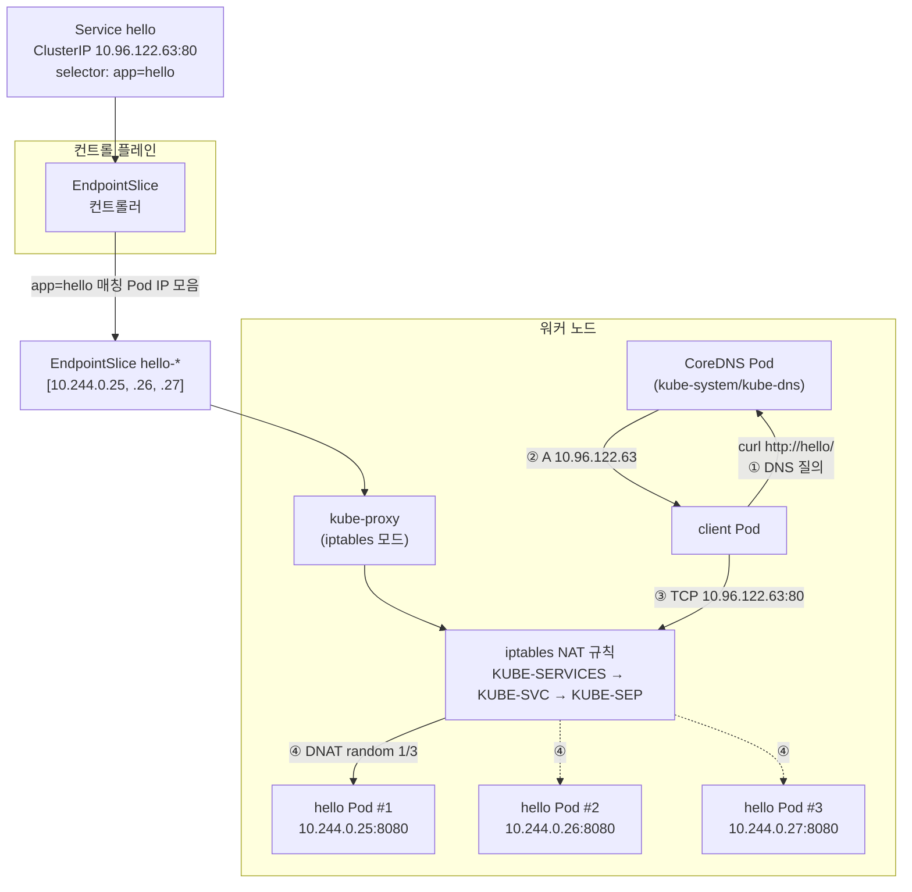

# 11. Service — ClusterIP · kube-proxy · Endpoint · CoreDNS

Pod IP가 끊임없이 바뀌어도 안정적인 가상 IP·DNS 이름을 두는 방법을 손으로 확인하는 실습 공간입니다. Service 객체 하나가 EndpointSlice·kube-proxy(iptables)·CoreDNS 세 컴포넌트를 어떻게 묶어 쓰는지 그 흐름을 직접 봅니다.

## 핵심 다이어그램



- **Service는 가상 IP(ClusterIP) 하나를 받습니다.** 이 IP는 어떤 노드 위 어떤 인터페이스에도 실제로 붙어 있지 않습니다 — 그저 iptables 규칙이 매칭하는 destination일 뿐입니다.
- **EndpointSlice 컨트롤러**는 Service의 `selector`로 Pod를 골라 그 IP·포트 목록을 EndpointSlice 객체에 적습니다. Pod가 뜨고 죽을 때마다 자동으로 갱신됩니다.
- **kube-proxy**는 노드마다 떠 있는 컴포넌트로, EndpointSlice를 보고 iptables 규칙(또는 ipvs)을 노드에 깔아 둡니다. 패킷이 Service IP로 오면 random 분기로 백엔드 Pod IP 중 하나로 DNAT됩니다.
- **CoreDNS**는 `kube-system` 네임스페이스의 Deployment + Service(`kube-dns`)입니다. Service 생성·삭제를 watch해서 이름 ↔ ClusterIP 매핑을 가지고 있다가 Pod의 DNS 질의에 응답합니다.

아래 시연이 이 그림의 각 화살표를 한 줄씩 손으로 확인합니다.

## 사전 준비물

이 실습은 **macOS** 환경을 기준으로 합니다.

- **Docker** — Docker Desktop, OrbStack 등. `docker ps`가 에러 없이 돌아가면 OK.
- **Homebrew** — macOS 패키지 관리자.

### kind · kubectl 설치

```bash
brew install kind kubectl
```

### rosa-lab 클러스터 준비

```bash
kind create cluster --name rosa-lab
```

이미 있으면 건너뜁니다.

```bash
$ kubectl get nodes
NAME                     STATUS   ROLES           AGE   VERSION
rosa-lab-control-plane   Ready    control-plane   1m    v1.36.1
```

### rosa-lab namespace 준비

```bash
kubectl create namespace rosa-lab
kubectl config set-context --current --namespace=rosa-lab
```

이미 namespace가 있고 기본값으로 설정되어 있으면 건너뜁니다.

```bash
kubectl config get-contexts   # NAMESPACE 열에 rosa-lab이 보이면 OK
```

## 실습 환경

| 파일 | 내용 |
|---|---|
| `manifests/deployment.yaml` | 3 replica의 `hello` Deployment. `hashicorp/http-echo`가 `hello from $POD_NAME`을 8080으로 응답 |
| `manifests/service.yaml` | `app=hello` 셀렉터로 묶는 ClusterIP Service (port 80 → targetPort 8080) |
| `manifests/client.yaml` | `nicolaka/netshoot` 기반 client Pod — `curl`·`dig`·`nslookup` 등 디버깅 도구 포함 |

## 여기서 직접 확인할 수 있는 것

### 적용 — Deployment·Service·client Pod

```bash
kubectl apply -f manifests/
kubectl wait --for=condition=available deploy/hello --timeout=120s
kubectl wait --for=condition=ready pod/client --timeout=120s
```

```bash
$ kubectl get pods,svc -o wide
NAME                        READY   STATUS    RESTARTS   AGE   IP            NODE
pod/client                  1/1     Running   0          34s   10.244.0.24   rosa-lab-control-plane
pod/hello-c7494b988-ptg4r   1/1     Running   0          34s   10.244.0.27   rosa-lab-control-plane
pod/hello-c7494b988-vm7q9   1/1     Running   0          34s   10.244.0.26   rosa-lab-control-plane
pod/hello-c7494b988-ztvdk   1/1     Running   0          34s   10.244.0.25   rosa-lab-control-plane

NAME            TYPE        CLUSTER-IP     EXTERNAL-IP   PORT(S)   AGE
service/hello   ClusterIP   10.96.122.63   <none>        80/TCP    34s
```

Pod IP는 `10.244.0.25 / .26 / .27` 세 개, Service의 ClusterIP는 `10.96.122.63`입니다. 둘은 **다른 대역**입니다 — Pod 대역은 `10.244.0.0/16`, Service 대역은 `10.96.0.0/12`.

### EndpointSlice — Service가 가리키는 실제 Pod IP 목록

Service 객체는 "어떤 Pod에 보낼지"를 직접 들고 있지 않습니다. 대신 EndpointSlice 컨트롤러가 셀렉터로 Pod를 골라 별도 객체에 그 IP를 적어 둡니다.

```bash
$ kubectl get endpointslices -l kubernetes.io/service-name=hello
NAME          ADDRESSTYPE   PORTS   ENDPOINTS                             AGE
hello-nldlh   IPv4          8080    10.244.0.25,10.244.0.26,10.244.0.27   34s
```

Pod 3개의 IP가 `targetPort: 8080`과 함께 그대로 들어 있습니다. 옛날 객체 `Endpoints`도 호환을 위해 같이 만들어 둡니다.

```bash
$ kubectl get endpoints hello
NAME    ENDPOINTS                                            AGE
hello   10.244.0.25:8080,10.244.0.26:8080,10.244.0.27:8080   34s
```

### ClusterIP로 직접 호출 — load balancing

ClusterIP는 클러스터 안에서만 보입니다. client Pod에서 `curl`해 봅니다.

```bash
$ for i in 1 2 3 4 5; do kubectl exec client -- curl -s http://10.96.122.63/; done
hello from hello-c7494b988-ztvdk
hello from hello-c7494b988-vm7q9
hello from hello-c7494b988-ptg4r
hello from hello-c7494b988-vm7q9
hello from hello-c7494b988-vm7q9
```

매 요청이 매번 다른 Pod로 분기됩니다. 분포는 정확히 1/3씩이 아니라 매 요청이 **독립적인 random**이라 단발성 표본은 편차가 큽니다(아래 iptables 규칙에서 그 이유가 드러납니다).

### DNS로 호출 — CoreDNS · `/etc/resolv.conf` · search 도메인

ClusterIP를 외워서 쓰지는 않습니다. Service 이름으로 부릅니다.

```bash
$ kubectl exec client -- curl -s http://hello/
hello from hello-c7494b988-ptg4r

$ kubectl exec client -- curl -s http://hello.rosa-lab.svc.cluster.local/
hello from hello-c7494b988-ptg4r
```

`hello`라는 짧은 이름이 어떻게 풀렸을까요? Pod의 `/etc/resolv.conf`를 봅니다.

```bash
$ kubectl exec client -- cat /etc/resolv.conf
search rosa-lab.svc.cluster.local svc.cluster.local cluster.local
nameserver 10.96.0.10
options ndots:5
```

세 가지가 핵심입니다.

- **`nameserver 10.96.0.10`** — CoreDNS Service(`kube-system/kube-dns`)의 ClusterIP입니다. 모든 Pod의 DNS 질의는 여기로 갑니다.
- **`search rosa-lab.svc.cluster.local ...`** — `hello`처럼 점 없는 이름을 질의하면 search 도메인을 하나씩 붙여 시도합니다. 그래서 `hello` → `hello.rosa-lab.svc.cluster.local`로 풀립니다.
- **`options ndots:5`** — 도메인에 점(`.`)이 5개 미만이면 절대 도메인이 아니라 보고 search 도메인을 먼저 시도합니다.

CoreDNS 자체는 `kube-system`의 Deployment + Service입니다.

```bash
$ kubectl get svc kube-dns -n kube-system
NAME       TYPE        CLUSTER-IP   EXTERNAL-IP   PORT(S)                  AGE
kube-dns   ClusterIP   10.96.0.10   <none>        53/UDP,53/TCP,9153/TCP   32m

$ kubectl get pods -n kube-system -l k8s-app=kube-dns
NAME                       READY   STATUS    RESTARTS   AGE
coredns-589f44dc88-4b4g5   1/1     Running   0          32m
coredns-589f44dc88-pnp2l   1/1     Running   0          32m
```

`dig`로 실제 응답을 확인합니다.

```bash
$ kubectl exec client -- dig +noall +answer hello.rosa-lab.svc.cluster.local
hello.rosa-lab.svc.cluster.local. 30 IN A 10.96.122.63
```

A 레코드가 ClusterIP를 그대로 돌려줍니다. 그래서 `curl http://hello/`이 결국 `curl http://10.96.122.63/`이 됩니다.

SRV 레코드까지 자동으로 생성되어 있습니다(`<port-name>._tcp.<svc>...`).

```bash
$ kubectl exec client -- dig +noall +answer SRV _http._tcp.hello.rosa-lab.svc.cluster.local
_http._tcp.hello.rosa-lab.svc.cluster.local. 30 IN SRV 0 100 80 hello.rosa-lab.svc.cluster.local.
```

`port: 80`(서비스 포트의 `name: http`)이 `targetPort: 8080`이 아니라 80으로 잡힌다는 점에 주목합니다 — SRV는 Service 포트를 가리킵니다.

### kube-proxy가 깔아 둔 iptables 규칙

ClusterIP `10.96.122.63`이 실제로는 아무 NIC에도 없는데 어떻게 통신이 될까요? kube-proxy가 노드의 iptables(NAT 테이블)에 규칙을 깔아 두기 때문입니다. kube-proxy 모드부터 확인합니다.

```bash
$ kubectl get cm kube-proxy -n kube-system -o jsonpath='{.data.config\.conf}' | grep mode:
mode: iptables
```

kind 기본은 `iptables` 모드입니다(다른 옵션: `ipvs`, `nftables`). 이제 control-plane 노드 안으로 들어가서 규칙을 봅니다.

```bash
$ docker exec rosa-lab-control-plane iptables -t nat -L KUBE-SERVICES -n | grep hello
KUBE-SVC-YESMHZFMZ7K23P2X  tcp  --  0.0.0.0/0  10.96.122.63  /* rosa-lab/hello:http cluster IP */ tcp dpt:80
```

`KUBE-SERVICES` 체인은 "destination이 ClusterIP인 패킷"을 잡아 그 서비스 전용 체인(`KUBE-SVC-...`)으로 보냅니다. 그 체인 안에는:

```bash
$ docker exec rosa-lab-control-plane iptables -t nat -L KUBE-SVC-YESMHZFMZ7K23P2X -n
target                     prot   source         destination
KUBE-MARK-MASQ             tcp    !10.244.0.0/16 10.96.122.63   /* rosa-lab/hello:http cluster IP */ tcp dpt:80
KUBE-SEP-H4R6DFHDBOI2WQ6N  all    0.0.0.0/0      0.0.0.0/0      /* rosa-lab/hello:http -> 10.244.0.25:8080 */ statistic mode random probability 0.33333333349
KUBE-SEP-QLPQ3OHCXT5DDUNJ  all    0.0.0.0/0      0.0.0.0/0      /* rosa-lab/hello:http -> 10.244.0.26:8080 */ statistic mode random probability 0.50000000000
KUBE-SEP-WWDQF7V5LDQW4GIE  all    0.0.0.0/0      0.0.0.0/0      /* rosa-lab/hello:http -> 10.244.0.27:8080 */
```

위에서부터 차례대로 매칭을 시도하는 구조라서 확률이 1/3·1/2·기본값입니다.

- 첫 규칙: 1/3 확률로 `KUBE-SEP-H4R...`(10.244.0.25)로 보내고 끝.
- 매칭 안 됐을 때(2/3 확률) 다음 규칙: 1/2 확률로 `KUBE-SEP-QLP...`(10.244.0.26).
- 거기도 안 됐으면(1/3) 마지막 규칙: 무조건 `KUBE-SEP-WWD...`(10.244.0.27).

합치면 각 백엔드가 1/3씩 가져갑니다. 그래서 random이지만 평균적으론 균등합니다.

각 `KUBE-SEP-...` 체인은 DNAT 한 줄짜리입니다.

```bash
$ docker exec rosa-lab-control-plane iptables -t nat -L KUBE-SEP-H4R6DFHDBOI2WQ6N -n
target          prot   source        destination
KUBE-MARK-MASQ  all    10.244.0.25   0.0.0.0/0      /* rosa-lab/hello:http */
DNAT            tcp    0.0.0.0/0     0.0.0.0/0      /* rosa-lab/hello:http */ tcp to:10.244.0.25:8080
```

`DNAT ... tcp to:10.244.0.25:8080` — 이 한 줄이 "Service IP로 보낸 패킷"을 진짜 Pod IP·포트로 바꿉니다. 응답이 돌아올 때는 자동으로 다시 Service IP로 돌아옵니다(conntrack).

### Pod가 죽고 새로 떠도 Service IP는 그대로

자가 치유 데모를 한 번 더 합니다. Pod 1개를 직접 지웁니다.

```bash
$ kubectl delete pod hello-c7494b988-ztvdk
pod "hello-c7494b988-ztvdk" deleted
```

Deployment가 즉시 새 Pod를 만들고, EndpointSlice 컨트롤러가 IP 목록을 바꿔 줍니다.

```bash
$ kubectl get pods -l app=hello -o wide
NAME                    READY   STATUS    RESTARTS   AGE   IP            NODE
hello-c7494b988-ptg4r   1/1     Running   0          97s   10.244.0.27   rosa-lab-control-plane
hello-c7494b988-tsj8p   1/1     Running   0          2s    10.244.0.29   rosa-lab-control-plane
hello-c7494b988-vm7q9   1/1     Running   0          97s   10.244.0.26   rosa-lab-control-plane

$ kubectl get endpointslice -l kubernetes.io/service-name=hello -o jsonpath='{.items[0].endpoints[*].addresses}'
["10.244.0.26"] ["10.244.0.27"] ["10.244.0.29"]
```

`10.244.0.25`가 빠지고 새 Pod IP `10.244.0.29`가 들어왔습니다. iptables 규칙도 같이 바뀌었을까요?

```bash
$ docker exec rosa-lab-control-plane iptables -t nat -L KUBE-SVC-YESMHZFMZ7K23P2X -n | grep KUBE-SEP
KUBE-SEP-QLPQ3OHCXT5DDUNJ  all  --  0.0.0.0/0  0.0.0.0/0  /* rosa-lab/hello:http -> 10.244.0.26:8080 */ statistic mode random probability 0.33333333349
KUBE-SEP-WWDQF7V5LDQW4GIE  all  --  0.0.0.0/0  0.0.0.0/0  /* rosa-lab/hello:http -> 10.244.0.27:8080 */ statistic mode random probability 0.50000000000
KUBE-SEP-J2OLL5T5YW56VTL5  all  --  0.0.0.0/0  0.0.0.0/0  /* rosa-lab/hello:http -> 10.244.0.29:8080 */
```

`10.244.0.25`가 사라지고 `10.244.0.29`가 들어왔습니다. 그동안 Service IP는?

```bash
$ kubectl get svc hello
NAME    TYPE        CLUSTER-IP     EXTERNAL-IP   PORT(S)   AGE
hello   ClusterIP   10.96.122.63   <none>        80/TCP    108s
```

그대로 `10.96.122.63`입니다. 새 Pod에도 트래픽이 갑니다.

```bash
$ for i in $(seq 1 12); do kubectl exec client -- curl -s http://hello/; done | sort | uniq -c
   3 hello from hello-c7494b988-ptg4r
   6 hello from hello-c7494b988-tsj8p
   3 hello from hello-c7494b988-vm7q9
```

이게 Service의 핵심 가치입니다 — **Pod IP는 휘발성, Service IP·DNS 이름은 안정성**.

### 정리

```bash
kubectl delete -f manifests
```
