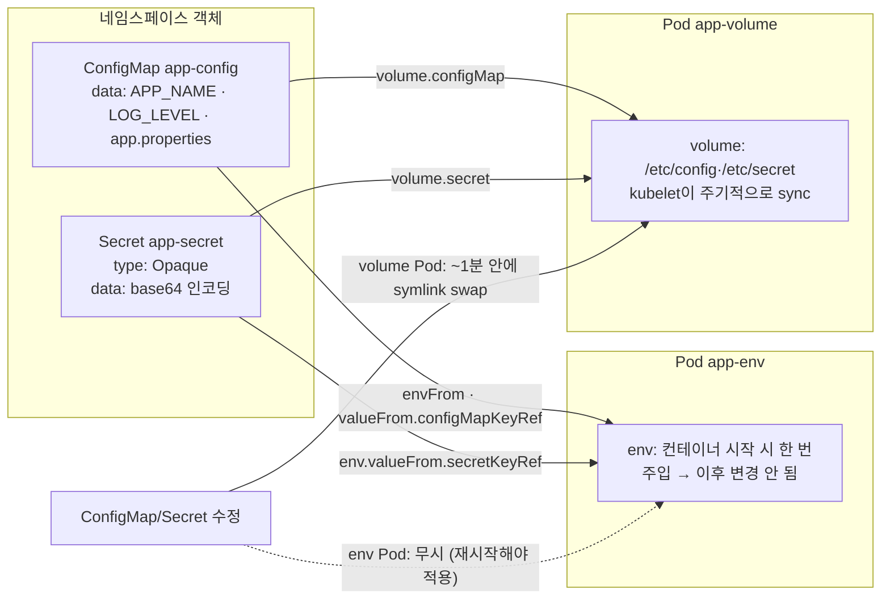

# 12. ConfigMap과 Secret

설정(`server.port=8080`)이나 자격(DB 비밀번호)을 이미지 안에 박지 않고 클러스터 객체로 떼어내는 두 가지 방법을 손으로 확인하는 실습 공간입니다. ConfigMap·Secret를 만들고, Pod에서 환경 변수와 볼륨 마운트 두 방식으로 받아 쓰고, 객체를 바꿨을 때 누가 따라오고 누가 안 따라오는지 직접 봅니다.

## 핵심 다이어그램



- **ConfigMap·Secret은 같은 모양의 key/value 객체**입니다. 차이는 두 가지뿐 — Secret은 값이 `data` 필드에서 base64로 인코딩되어 저장되고, 별도 타입(`Opaque`, `kubernetes.io/tls` 등)을 가지며, 기본적으로 etcd에서 메모리 매핑·tmpfs 마운트 등 약간의 취급 차이가 있습니다. **base64는 암호화가 아니라 인코딩**입니다.
- **Pod에 주입하는 두 가지 방식.**
  - **환경 변수** — 컨테이너가 시작될 때 한 번 주입됩니다. 이후 ConfigMap·Secret을 바꿔도 컨테이너 안 환경 변수는 그대로입니다. 새 값을 받으려면 Pod를 재시작해야 합니다.
  - **볼륨 마운트** — 각 키가 파일이 되어 디렉터리에 노출됩니다. kubelet이 일정 주기(수십 초~약 1분)로 변경을 감지해 atomic하게 파일을 교체합니다.
- **immutable 옵션** — `immutable: true`를 주면 객체를 더 만든 뒤로는 `data`를 못 바꿉니다. 의도치 않은 변경을 막고 kubelet의 watch 부하도 줄입니다.

아래 시연이 이 그림의 각 화살표를 한 줄씩 손으로 확인합니다.

## 사전 준비물

이 실습은 **macOS** 환경을 기준으로 합니다.

- **Docker** — Docker Desktop, OrbStack 등. `docker ps`가 에러 없이 돌아가면 OK.
- **Homebrew** — macOS 패키지 관리자.

### kind · kubectl 설치

```bash
brew install kind kubectl
```

### rosa-lab 클러스터 준비

```bash
kind create cluster --name rosa-lab
```

이미 있으면 건너뜁니다.

```bash
$ kubectl get nodes
NAME                     STATUS   ROLES           AGE   VERSION
rosa-lab-control-plane   Ready    control-plane   1m    v1.36.1
```

### rosa-lab namespace 준비

```bash
kubectl create namespace rosa-lab
kubectl config set-context --current --namespace=rosa-lab
```

이미 namespace가 있고 기본값으로 설정되어 있으면 건너뜁니다.

```bash
kubectl config get-contexts   # NAMESPACE 열에 rosa-lab이 보이면 OK
```

## 실습 환경

| 파일 | 내용 |
|---|---|
| `manifests/configmap.yaml` | `app-config` — literal value 2개(`APP_NAME`, `LOG_LEVEL`) + 파일 1개(`app.properties`) |
| `manifests/secret.yaml` | `app-secret` — `Opaque` 타입, `stringData`로 `DB_USER`·`DB_PASSWORD` 입력 |
| `manifests/pod-env.yaml` | env 방식 Pod — `envFrom`(ConfigMap 전체)·`valueFrom.secretKeyRef`(Secret 키 선택) |
| `manifests/pod-volume.yaml` | volume 방식 Pod — `/etc/config`·`/etc/secret`에 파일 마운트 |

## 여기서 직접 확인할 수 있는 것

### 적용 — ConfigMap·Secret·Pod 두 개

```bash
kubectl apply -f manifests/
kubectl wait --for=condition=ready pod/app-env --timeout=60s
kubectl wait --for=condition=ready pod/app-volume --timeout=60s
```

### ConfigMap 객체 — data는 평문 그대로

```bash
$ kubectl get cm app-config -o yaml | head -10
apiVersion: v1
data:
  APP_NAME: rosa-lab-app
  LOG_LEVEL: info
  app.properties: |
    server.port=8080
    server.timeout=30s
    feature.beta=false
kind: ConfigMap
```

`data:` 아래에 key/value가 그대로 들어 있습니다. 값이 여러 줄(`|`)이면 그게 그대로 하나의 파일 내용으로 노출됩니다.

### Secret 객체 — stringData는 base64로 인코딩되어 data에 들어갑니다

매니페스트에는 평문으로 적었습니다.

```yaml
apiVersion: v1
kind: Secret
metadata:
  name: app-secret
type: Opaque
stringData:
  DB_USER: rosa
  DB_PASSWORD: s3cret-pw
```

`stringData`는 작성 편의용입니다. apiserver가 저장할 때는 `data`(base64) 필드로 바꿉니다.

```bash
$ kubectl get secret app-secret -o yaml | head -8
apiVersion: v1
data:
  DB_PASSWORD: czNjcmV0LXB3
  DB_USER: cm9zYQ==
kind: Secret
```

`czNjcmV0LXB3`는 base64일 뿐, 누구나 풀 수 있습니다.

```bash
$ kubectl get secret app-secret -o jsonpath='{.data.DB_PASSWORD}' | base64 -d
s3cret-pw
```

`kubectl get secret`만 할 수 있으면 평문이나 마찬가지입니다. Secret을 "안전"하게 만드는 건 **RBAC**(누가 secret을 읽을 수 있는지)와 **etcd 암호화 옵션**(at-rest 암호화)이지, base64가 아닙니다.

### env 방식 — 컨테이너 시작 시 한 번 주입

Pod의 컨테이너 spec은 두 가지 방법을 같이 씁니다.

```yaml
envFrom:
  - configMapRef:
      name: app-config       # ConfigMap의 모든 키를 환경 변수로
env:
  - name: DB_PASSWORD
    valueFrom:
      secretKeyRef:
        name: app-secret
        key: DB_PASSWORD     # Secret 특정 키만 골라서
```

- `envFrom`은 "객체 전체를 변수로 풀어라". `data`의 각 키가 그대로 변수 이름이 됩니다.
- `env[].valueFrom`은 "이 변수 이름을 이 키 값으로 채워라". 변수 이름과 객체 키 이름이 다를 때 쓰기 좋습니다.

```bash
$ kubectl logs app-env
=== ConfigMap (envFrom) ===
APP_NAME=rosa-lab-app
LOG_LEVEL=info
=== Secret (valueFrom) ===
DB_USER=rosa
DB_PASSWORD=s3cret-pw
```

### volume 방식 — 키마다 파일 한 개, atomic하게 교체됨

```yaml
volumeMounts:
  - name: config
    mountPath: /etc/config
volumes:
  - name: config
    configMap:
      name: app-config
```

`/etc/config` 디렉터리 안에 ConfigMap의 각 키 이름이 파일로 생깁니다.

```bash
$ kubectl logs app-volume | head -10
=== /etc/config (ConfigMap) ===
total 12
drwxrwxrwx    3 root     root          4096 Jun 23 05:42 .
drwxr-xr-x    1 root     root          4096 Jun 23 05:42 ..
drwxr-xr-x    2 root     root          4096 Jun 23 05:42 ..2026_06_23_05_42_15.2927352412
lrwxrwxrwx    1 root     root            32 Jun 23 05:42 ..data -> ..2026_06_23_05_42_15.2927352412
lrwxrwxrwx    1 root     root            15 Jun 23 05:42 APP_NAME -> ..data/APP_NAME
lrwxrwxrwx    1 root     root            16 Jun 23 05:42 LOG_LEVEL -> ..data/LOG_LEVEL
lrwxrwxrwx    1 root     root            21 Jun 23 05:42 app.properties -> ..data/app.properties
```

`ls -la`를 보면 단순한 파일 목록이 아닙니다. kubelet이 atomic update를 보장하기 위해 다음 구조를 만들었습니다.

- `..2026_06_23_05_42_15.<random>` — 진짜 데이터가 들어 있는 timestamp 디렉터리.
- `..data` → 위 디렉터리로의 symlink.
- 각 키(`APP_NAME`, `LOG_LEVEL` 등) → `..data/<키>`로의 symlink.

업데이트가 오면 kubelet은 새 timestamp 디렉터리에 새 값을 다 쓴 다음, `..data` symlink만 그쪽으로 갈아 끼웁니다. 그래서 컨테이너는 "반쪽만 갱신된" 파일을 절대 보지 않습니다.

파일 내용은 ConfigMap 값 그대로입니다.

```bash
$ kubectl exec app-volume -- cat /etc/config/app.properties
server.port=8080
server.timeout=30s
feature.beta=false
```

Secret도 같은 방식이지만 마운트는 기본적으로 `tmpfs`로 떠서 노드 디스크에는 안 떨어집니다.

### ConfigMap 수정 — env Pod는 무시, volume Pod는 자동 갱신

`LOG_LEVEL: info → debug`, `APP_NAME: rosa-lab-app → rosa-lab-app-v2`로 바꿔 봅니다.

```bash
$ kubectl patch cm app-config --type merge -p '{"data":{"LOG_LEVEL":"debug","APP_NAME":"rosa-lab-app-v2"}}'
configmap/app-config patched
```

env Pod를 봅니다.

```bash
$ kubectl exec app-env -- sh -c 'echo "APP_NAME=$APP_NAME"; echo "LOG_LEVEL=$LOG_LEVEL"'
APP_NAME=rosa-lab-app
LOG_LEVEL=info
```

그대로입니다 — **컨테이너 환경 변수는 시작 시점에 고정**됩니다. 안에서 변수를 다시 읽어도 새 값이 안 옵니다.

volume Pod는 잠시 기다리면 따라옵니다.

```bash
$ kubectl exec app-volume -- cat /etc/config/LOG_LEVEL   # 직후
info

$ # 약 52초 뒤
$ kubectl exec app-volume -- cat /etc/config/LOG_LEVEL
debug
```

`..data` symlink가 새 timestamp 디렉터리로 바뀐 것을 볼 수 있습니다.

```bash
$ kubectl exec app-volume -- ls -la /etc/config
drwxr-xr-x    2 root     root          4096 Jun 23 05:43 ..2026_06_23_05_43_40.2023827454
lrwxrwxrwx    1 root     root            32 Jun 23 05:43 ..data -> ..2026_06_23_05_43_40.2023827454
...
```

옛 timestamp 디렉터리(`..2026_06_23_05_42_15.*`)는 사라지고 새 timestamp 디렉터리(`..2026_06_23_05_43_40.*`)가 생겼습니다 — symlink swap이 한 번 일어났다는 뜻입니다.

env Pod를 재시작하면 그 때야 새 값을 받습니다.

```bash
$ kubectl delete pod app-env && kubectl apply -f manifests/pod-env.yaml
pod "app-env" deleted
pod/app-env created

$ kubectl logs app-env
=== ConfigMap (envFrom) ===
APP_NAME=rosa-lab-app-v2
LOG_LEVEL=debug
...
```

ConfigMap·Secret을 바꿔도 **앱이 자동으로 다시 읽지는 않습니다**. volume 마운트 파일이 바뀌어도 그 파일을 watch하지 않는 앱이면 새 값을 모릅니다. 실제 워크로드에서는 다음 셋 중 하나로 처리합니다.

1. **Deployment의 Pod template annotation에 ConfigMap 해시를 박아 두기** — ConfigMap이 바뀌면 annotation도 바뀌어 rolling update가 자동으로 일어남.
2. **앱이 파일 변경을 감지해 reload** — 일부 앱(nginx, fluent-bit 등)이 SIGHUP 등으로 지원.
3. **sidecar / init 컨테이너로 처리** — 변경 감지하고 메인 컨테이너에 신호.

### Immutable ConfigMap — 만든 뒤로는 못 바꿈

```yaml
apiVersion: v1
kind: ConfigMap
metadata:
  name: locked-config
immutable: true
data:
  VERSION: v1
```

만들고 나서 바꾸려 하면 거부됩니다.

```bash
$ kubectl patch cm locked-config --type merge -p '{"data":{"VERSION":"v2"}}'
The ConfigMap "locked-config" is invalid: data: Forbidden: field is immutable when `immutable` is set
```

새 값을 쓰려면 Secret과 함께 새 이름(`locked-config-v2`)으로 만들고 Pod도 새 이름을 가리키게 갈아 끼웁니다 — 버전 단위로 다루기 위한 패턴입니다.

### 정리

```bash
kubectl delete -f manifests
```
