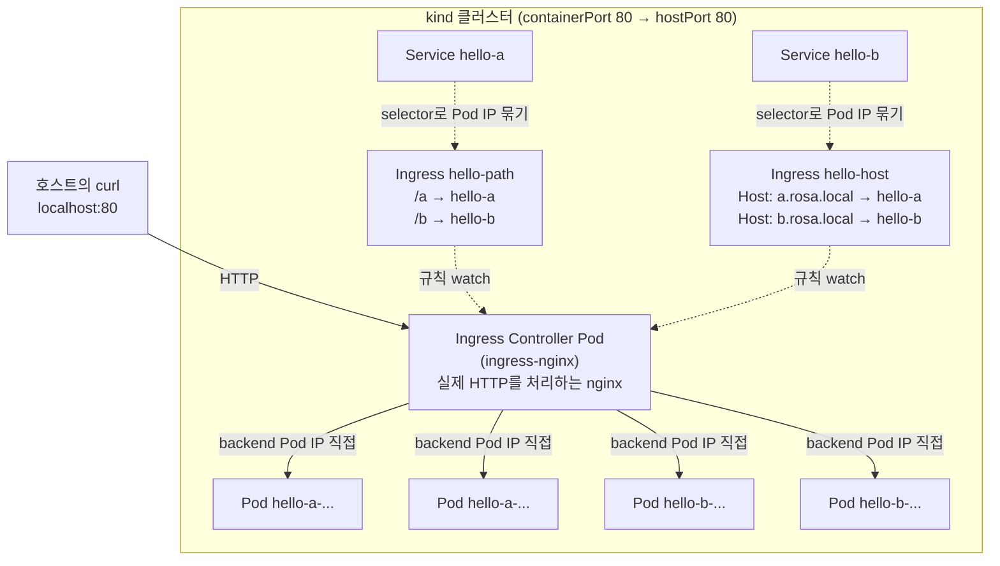

# 13. Ingress — HTTP 진입점

클러스터 안의 여러 Service를 외부 HTTP 진입점 하나로 묶고, host·path로 갈라 보내는 방법을 손으로 확인하는 실습 공간입니다. Ingress 객체와 Ingress Controller(여기서는 ingress-nginx)의 역할 분담, 그리고 Service보다 한 단계 위에서 작동하는 L7 라우팅을 봅니다.

## 핵심 다이어그램



- **Ingress 객체와 Ingress Controller는 다른 것입니다.** Ingress 객체는 "이런 규칙으로 라우팅해 달라"는 선언이고, 실제로 그 HTTP를 받아 처리하는 것은 Controller(nginx·traefik·HAProxy·istio 등) Pod입니다. 클러스터에 Controller가 없으면 Ingress 객체를 만들어도 아무 일도 일어나지 않습니다.
- **L7 HTTP/HTTPS만 다룹니다.** TCP·UDP는 Ingress의 영역이 아닙니다. 그건 Service의 `type: LoadBalancer`나 Gateway API가 맡습니다.
- **두 가지 라우팅 기준** — `path` 기반(`/a`, `/b`)과 `host` 기반(`Host: a.rosa.local`). 둘을 섞을 수도 있습니다.
- **Controller는 Service를 거치지 않고 Pod IP에 직접 connect** — Service의 iptables를 우회해 Pod IP를 동적으로 갱신합니다. Service 객체는 Pod를 모으는 셀렉터·DNS 이름으로 쓰일 뿐, 트래픽 패스에는 들어가지 않습니다.

아래 시연이 이 그림의 각 화살표를 한 줄씩 손으로 확인합니다.

## 사전 준비물

이 실습은 **macOS** 환경을 기준으로 합니다.

- **Docker** — Docker Desktop, OrbStack 등. `docker ps`가 에러 없이 돌아가면 OK.
- **Homebrew** — macOS 패키지 관리자.

### kind · kubectl 설치

```bash
brew install kind kubectl
```

### 80/443을 호스트로 노출하는 rosa-lab 클러스터 준비

Ingress 시연은 호스트의 `curl localhost`로 클러스터 안 컨테이너에 닿아야 합니다. kind 노드 컨테이너의 80·443을 호스트의 80·443으로 매핑한 클러스터가 필요합니다. 이미 같은 이름의 클러스터가 있으면 먼저 지웁니다.

```bash
kind delete cluster --name rosa-lab
kind create cluster --config kind-cluster.yaml
```

`kind-cluster.yaml`은 두 가지를 합니다.

- `extraPortMappings` — 컨테이너 80·443을 호스트 80·443으로 노출.
- `node-labels: "ingress-ready=true"` — ingress-nginx가 nodeSelector로 이 라벨을 찾아 Pod를 control-plane에 띄울 수 있게 표시.

```bash
$ kubectl get node --show-labels | tr ',' '\n' | grep ingress-ready
ingress-ready=true
```

### rosa-lab namespace 준비

```bash
kubectl create namespace rosa-lab
kubectl config set-context --current --namespace=rosa-lab
```

이미 namespace가 있고 기본값으로 설정되어 있으면 건너뜁니다.

### Ingress Controller(ingress-nginx) 설치

kind 환경 전용 매니페스트가 따로 준비되어 있습니다 — node taint·hostPort 등이 맞춰져 있어 별도 LoadBalancer 없이 동작합니다.

```bash
kubectl apply -f https://kind.sigs.k8s.io/examples/ingress/deploy-ingress-nginx.yaml
kubectl wait --namespace ingress-nginx \
  --for=condition=ready pod \
  --selector=app.kubernetes.io/component=controller \
  --timeout=180s
```

설치되면 `nginx`라는 IngressClass와 controller Pod가 뜹니다.

```bash
$ kubectl get ingressclass
NAME    CONTROLLER             PARAMETERS   AGE
nginx   k8s.io/ingress-nginx   <none>       34s

$ kubectl get pods -n ingress-nginx
NAME                                        READY   STATUS      RESTARTS      AGE
ingress-nginx-admission-create-w8fgf        0/1     Completed   0             34s
ingress-nginx-admission-patch-q6nmf         0/1     Completed   2 (29s ago)   34s
ingress-nginx-controller-7d8f4ccc4c-pdljp   1/1     Running     0             34s
```

`admission-create/patch`는 일회성 Job — webhook 인증서 발급용입니다. `controller`가 실제 HTTP를 처리하는 nginx입니다.

## 실습 환경

| 파일 | 내용 |
|---|---|
| `kind-cluster.yaml` | 80·443 hostPort 매핑 + `ingress-ready=true` node label |
| `manifests/backends.yaml` | 두 백엔드 — `hello-a`, `hello-b` Deployment + Service. 각각 다른 응답 텍스트 |
| `manifests/ingress-path.yaml` | path 기반 — `/a` → hello-a, `/b` → hello-b |
| `manifests/ingress-host.yaml` | host 기반 — `a.rosa.local` → hello-a, `b.rosa.local` → hello-b |

## 여기서 직접 확인할 수 있는 것

### 백엔드 적용

```bash
kubectl apply -f manifests/backends.yaml
kubectl wait --for=condition=available deploy/hello-a deploy/hello-b --timeout=120s
```

```bash
$ kubectl get svc
NAME      TYPE        CLUSTER-IP      EXTERNAL-IP   PORT(S)   AGE
hello-a   ClusterIP   10.96.205.147   <none>        80/TCP    9s
hello-b   ClusterIP   10.96.230.210   <none>        80/TCP    9s
```

두 Service 모두 `ClusterIP` — 외부에서는 직접 못 닿습니다. Ingress가 그 진입점이 됩니다.

### Path 기반 라우팅 — `/a`와 `/b`로 가르기

```yaml
apiVersion: networking.k8s.io/v1
kind: Ingress
metadata:
  name: hello-path
spec:
  ingressClassName: nginx
  rules:
    - http:
        paths:
          - path: /a
            pathType: Prefix
            backend:
              service:
                name: hello-a
                port:
                  number: 80
          - path: /b
            pathType: Prefix
            backend:
              service:
                name: hello-b
                port:
                  number: 80
```

`ingressClassName: nginx`는 "이 Ingress는 IngressClass `nginx`(즉 ingress-nginx Controller)가 처리한다"는 뜻입니다. 클러스터에 Controller가 여러 종류 떠 있어도 같은 Ingress 객체가 두 번 잡히지 않습니다.

```bash
$ kubectl apply -f manifests/ingress-path.yaml
$ kubectl get ingress
NAME         CLASS   HOSTS   ADDRESS   PORTS   AGE
hello-path   nginx   *                 80      3s
```

`HOSTS *`는 host 매칭 없이 모든 Host를 받겠다는 뜻입니다(여기선 path만 봅니다).

호스트의 `curl`로 진짜 외부에서 부르듯이 시도합니다.

```bash
$ for i in 1 2 3; do curl -s http://localhost/a; done
service A — hello-a-84c96b59bd-g9njp
service A — hello-a-84c96b59bd-9h842
service A — hello-a-84c96b59bd-g9njp

$ for i in 1 2 3; do curl -s http://localhost/b; done
service B — hello-b-59757b7f4d-9q4hv
service B — hello-b-59757b7f4d-9q4hv
service B — hello-b-59757b7f4d-9q4hv
```

`/a` 요청은 `hello-a`의 두 Pod로 분기, `/b`는 `hello-b`로. 매칭 안 되는 path는 404.

```bash
$ curl -s -o /dev/null -w "HTTP %{http_code}\n" http://localhost/unknown
HTTP 404
```

### Host 기반 라우팅 — 같은 IP에 가상 호스트 여러 개

```yaml
spec:
  ingressClassName: nginx
  rules:
    - host: a.rosa.local
      http:
        paths:
          - path: /
            pathType: Prefix
            backend:
              service:
                name: hello-a
                port:
                  number: 80
    - host: b.rosa.local
      http:
        paths:
          - path: /
            pathType: Prefix
            ...
```

```bash
$ kubectl apply -f manifests/ingress-host.yaml
$ kubectl get ingress
NAME         CLASS   HOSTS                       ADDRESS     PORTS   AGE
hello-host   nginx   a.rosa.local,b.rosa.local   localhost   80      45s
hello-path   nginx   *                                       80      ...
```

DNS는 손대지 않았으니 호스트 헤더를 직접 줘서 시도합니다.

```bash
$ curl -s -H "Host: a.rosa.local" http://localhost/
service A — hello-a-84c96b59bd-9h842

$ curl -s -H "Host: b.rosa.local" http://localhost/
service B — hello-b-59757b7f4d-x9xmb

$ curl -s -o /dev/null -w "HTTP %{http_code}\n" -H "Host: nope.local" http://localhost/
HTTP 404
```

Controller가 그 뒤에서 만들어 둔 nginx config를 들여다보면 host별 server block이 생성된 것을 직접 확인할 수 있습니다.

```bash
$ kubectl exec -n ingress-nginx deploy/ingress-nginx-controller -- \
    sh -c "grep -E 'server_name (a|b)\.rosa' /etc/nginx/nginx.conf"
		server_name a.rosa.local ;
		server_name b.rosa.local ;
```

Ingress 객체가 그대로 nginx 설정으로 번역되어 있습니다. 객체를 바꾸면 controller가 watch해서 nginx config을 즉시 갱신합니다.

### Controller는 Pod IP에 직접 connect합니다

`hello-a`의 Service Endpoints:

```bash
$ kubectl get endpoints hello-a hello-b
NAME      ENDPOINTS                           AGE
hello-a   10.244.0.8:8080,10.244.0.9:8080     107s
hello-b   10.244.0.10:8080,10.244.0.11:8080   107s
```

ingress-nginx가 들고 있는 동적 upstream 목록을 컨트롤러의 내부 API에서 뽑아 봅니다.

```bash
$ kubectl exec -n ingress-nginx deploy/ingress-nginx-controller -- \
    curl -s http://127.0.0.1:10246/configuration/backends | \
    python3 -c "import json,sys; [print(f\"{b['name']}: {[(e['address'], e['port']) for e in b.get('endpoints', [])]}\") for b in json.load(sys.stdin) if b['name'].startswith('rosa-lab-hello-')]"
rosa-lab-hello-a-80: [('10.244.0.8', '8080'), ('10.244.0.9', '8080')]
rosa-lab-hello-b-80: [('10.244.0.11', '8080'), ('10.244.0.10', '8080')]
```

같은 Pod IP·targetPort입니다. Controller가 EndpointSlice를 watch해서 Lua balancer에 즉시 반영하기 때문에, Pod가 갈리거나 새로 떠도 nginx config 재생성·reload 없이 backend 목록이 동적으로 바뀝니다. **Service의 ClusterIP·iptables 규칙은 이 패스에 들어가지 않습니다** — L4 분산이 아니라 L7 reverse proxy니까요.

### 정리

```bash
kubectl delete -f manifests
kubectl delete -f https://kind.sigs.k8s.io/examples/ingress/deploy-ingress-nginx.yaml
```
