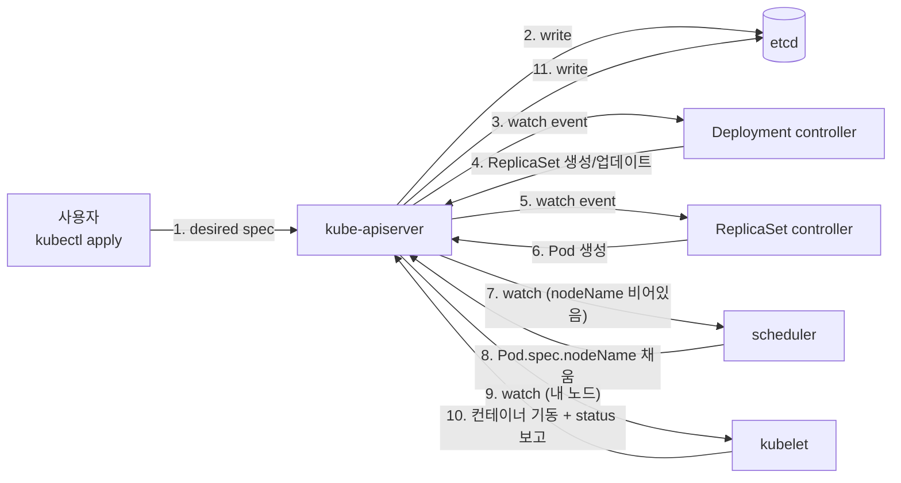
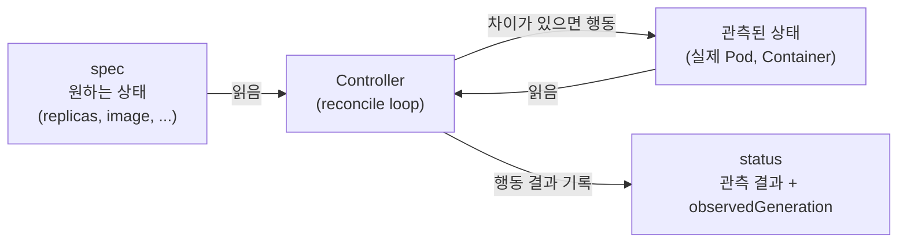

# 14. 쿠버네티스 reconcile loop

쿠버네티스의 컨트롤러는 명령을 받지 않습니다. `spec`(원하는 상태)과 `status`(관측된 상태)의 차이를 보고 행동합니다. Pod를 지우면 왜 다시 생기는지, 라벨을 떼면 왜 새 Pod가 하나 더 생기는지 — 이 한 가지 사고방식으로 모두 설명되는 것을 손으로 확인하는 실습 공간입니다.

## 핵심 다이어그램





- **spec과 status는 분리되어 있습니다.** spec은 사용자가 쓰고, status는 컨트롤러가 씁니다.
- **컨트롤러는 명령을 받지 않습니다.** kube-apiserver의 watch 스트림을 구독하다가, spec과 status의 차이가 보이면 차이를 좁히는 쪽으로 행동합니다.
- **`generation`은 spec이 바뀔 때마다 증가합니다.** `observedGeneration`은 컨트롤러가 마지막으로 처리한 generation입니다. 두 값이 같으면 컨트롤러가 따라잡은 상태입니다.
- **selector는 이름이 아니라 라벨로 Pod를 식별합니다.** ReplicaSet은 "내가 만든 Pod"를 추적하는 것이 아니라 "selector에 맞는 Pod의 개수"를 셉니다.

아래 시연이 이 그림의 각 지점을 한 줄씩 손으로 확인합니다.

## 사전 준비물

이 실습은 **macOS** 환경을 기준으로 합니다.

- **Docker** — Docker Desktop, OrbStack 등. `docker ps`가 에러 없이 돌아가면 OK.
- **Homebrew** — macOS 패키지 관리자.

### kind · kubectl 설치

```bash
brew install kind kubectl
```

### rosa-lab 클러스터 준비

```bash
kind create cluster --name rosa-lab
```

이미 클러스터가 있으면 건너뜁니다.

```bash
kind get clusters   # rosa-lab이 보이면 OK
```

### rosa-lab namespace 준비

```bash
kubectl create namespace rosa-lab
kubectl config set-context --current --namespace=rosa-lab
```

이미 namespace가 있고 기본값으로 설정되어 있으면 건너뜁니다.

```bash
kubectl config get-contexts   # NAMESPACE 열에 rosa-lab이 보이면 OK
```

## 실습 환경

| 파일 | 내용 |
|---|---|
| `manifests/deployment.yaml` | replicas=3 짜리 단순 Deployment — reconcile을 관찰할 표본 |

## 여기서 직접 확인할 수 있는 것

### spec과 status는 다른 사람이 씁니다

Deployment를 만들고, 같은 리소스의 `spec`과 `status`를 함께 봅니다.

```bash
kubectl apply -f manifests/deployment.yaml
```

```bash
kubectl get deploy hello -n rosa-lab -o jsonpath='{"metadata.generation: "}{.metadata.generation}{"\nspec.replicas: "}{.spec.replicas}{"\nstatus.observedGeneration: "}{.status.observedGeneration}{"\nstatus.replicas: "}{.status.replicas}{"\nstatus.readyReplicas: "}{.status.readyReplicas}{"\n"}'
```

```
metadata.generation: 1
spec.replicas: 3
status.observedGeneration: 1
status.replicas: 3
status.readyReplicas: 3
```

- `spec.replicas: 3` — 사용자가 매니페스트에 쓴 값.
- `status.replicas: 3` — Deployment controller가 ReplicaSet status를 모아 채운 값.
- `status.readyReplicas: 3` — kubelet의 readinessProbe 결과까지 반영된 값.

쓴 사람이 다르고, 쓰는 시점이 다릅니다. 사용자는 `spec`만 쓰고, 나머지는 컨트롤러가 채웁니다.

`status.conditions`도 같이 봅니다.

```bash
kubectl get deploy hello -n rosa-lab -o jsonpath='{range .status.conditions[*]}{"- "}{.type}{"="}{.status}{" reason="}{.reason}{"\n"}{end}'
```

```
- Available=True reason=MinimumReplicasAvailable
- Progressing=True reason=NewReplicaSetAvailable
```

이 두 줄은 Deployment controller가 자기가 본 상태를 사람이 읽을 수 있게 요약한 것입니다. `kubectl describe`가 마지막에 보여주는 줄이기도 합니다.

### generation과 observedGeneration — 컨트롤러가 따라잡습니다

spec을 바꾸면 `metadata.generation`이 1 증가합니다. 컨트롤러가 그 generation을 처리하면 `status.observedGeneration`이 같은 값으로 올라옵니다.

```bash
kubectl scale deploy hello -n rosa-lab --replicas=5
```

```bash
kubectl get deploy hello -n rosa-lab -o jsonpath='{"generation: "}{.metadata.generation}{"\nobservedGeneration: "}{.status.observedGeneration}{"\nspec.replicas: "}{.spec.replicas}{"\nstatus.readyReplicas: "}{.status.readyReplicas}{"\n"}'
```

`scale` 직후에 바로 보면 이런 모양이 나옵니다.

```
generation: 2
observedGeneration: 2
spec.replicas: 5
status.readyReplicas: 3
```

generation은 이미 2로 올랐고 Deployment controller도 이미 처리(observedGeneration=2)했습니다 — 새 ReplicaSet에 `replicas: 5`를 써놨다는 뜻입니다. 그런데 `readyReplicas`는 아직 3입니다. 새 Pod 2개의 컨테이너가 아직 ready가 아니기 때문입니다.

몇 초 기다리면 status가 spec을 따라잡습니다.

```bash
sleep 5
kubectl get deploy hello -n rosa-lab -o jsonpath='{"status.readyReplicas: "}{.status.readyReplicas}{"\n"}'
```

```
status.readyReplicas: 5
```

이게 "선언한 상태가 실제 상태가 되는" 과정입니다. 컨트롤러가 spec을 본 → 자기 일을 한 → status를 갱신했다.

### Pod 하나를 지우면 누가 무엇을 하는가

`replicas: 3`인 상태로 되돌리고, Pod 하나를 직접 지워봅니다.

```bash
kubectl scale deploy hello -n rosa-lab --replicas=3
sleep 4
kubectl get pods -n rosa-lab -l app=hello
```

```
NAME                    READY   STATUS    RESTARTS   AGE
hello-6c694bc8f-989s6   1/1     Running   0          61s
hello-6c694bc8f-fzpfd   1/1     Running   0          61s
hello-6c694bc8f-vbgk2   1/1     Running   0          61s
```

이름 하나 골라서 지웁니다.

```bash
kubectl delete pod hello-6c694bc8f-989s6 -n rosa-lab
sleep 1
kubectl get pods -n rosa-lab -l app=hello -o wide
```

```
NAME                    READY   STATUS    RESTARTS   AGE     IP            NODE                     ...
hello-6c694bc8f-989s6   0/1     Error     0          2m16s   10.244.0.14   rosa-lab-control-plane   ...
hello-6c694bc8f-fzpfd   1/1     Running   0          2m16s   10.244.0.13   rosa-lab-control-plane   ...
hello-6c694bc8f-vbgk2   1/1     Running   0          2m16s   10.244.0.12   rosa-lab-control-plane   ...
hello-6c694bc8f-z5xlk   1/1     Running   0          1s      10.244.0.17   rosa-lab-control-plane   ...
```

지운 Pod(`989s6`)는 종료 처리 중이고, 새 Pod(`z5xlk`)가 이미 1초 만에 떠 있습니다. 이름은 매번 새로 뽑힙니다 — ReplicaSet은 같은 Pod를 부활시키는 게 아니라 selector에 맞는 Pod의 개수를 채우는 것뿐입니다.

이때 무엇이 어떤 순서로 일어났는지 events에 적혀 있습니다.

```bash
kubectl get events -n rosa-lab --sort-by='.lastTimestamp' | tail -7
```

```
10s   Normal   SuccessfulCreate   replicaset/hello-6c694bc8f      Created pod: hello-6c694bc8f-z5xlk
10s   Normal   Scheduled          pod/hello-6c694bc8f-z5xlk       Successfully assigned rosa-lab/hello-6c694bc8f-z5xlk to rosa-lab-control-plane
10s   Normal   Pulled             pod/hello-6c694bc8f-z5xlk       Container image "hashicorp/http-echo:1.0" already present on machine
10s   Normal   Created            pod/hello-6c694bc8f-z5xlk       Container created
10s   Normal   Started            pod/hello-6c694bc8f-z5xlk       Container started
10s   Normal   Killing            pod/hello-6c694bc8f-989s6       Stopping container hello
```

이벤트의 `kind/name` 열이 누가 행동했는지를 보여줍니다.

- `replicaset/hello-...` — ReplicaSet controller가 새 Pod를 만들었습니다(`SuccessfulCreate`).
- `pod/hello-...` 의 `Scheduled` — scheduler가 그 Pod에 노드를 골라줬습니다.
- `pod/hello-...` 의 `Pulled` / `Created` / `Started` — 노드의 kubelet이 컨테이너를 띄웠습니다.
- `pod/hello-6c694bc8f-989s6` 의 `Killing` — kubelet이 삭제된 Pod의 컨테이너를 정리합니다.

각 컴포넌트가 자기 일만 합니다. ReplicaSet controller는 Pod 객체만 만들고, "어느 노드에서 돌릴까"는 모릅니다. scheduler는 `nodeName`만 채우고, 컨테이너를 띄우진 않습니다. kubelet은 자기 노드의 Pod만 봅니다.

이걸 묶는 게 kube-apiserver의 watch입니다. Pod가 생기면 nodeName이 빈 채로 etcd에 들어가고, scheduler가 그걸 보고 nodeName을 채우고, 그 변경을 보고 kubelet이 행동합니다. 누구도 누구에게 "이거 해줘"라고 전화하지 않습니다.

### Pod와 ReplicaSet의 연결 — ownerReferences

새 Pod가 ReplicaSet 소속인 것은 `ownerReferences`에 박혀 있습니다.

```bash
kubectl get pod hello-6c694bc8f-z5xlk -n rosa-lab -o jsonpath='{"ownerRef.kind: "}{.metadata.ownerReferences[0].kind}{"\nownerRef.name: "}{.metadata.ownerReferences[0].name}{"\n"}'
```

```
ownerRef.kind: ReplicaSet
ownerRef.name: hello-6c694bc8f
```

ReplicaSet도 마찬가지로 Deployment를 가리킵니다.

```bash
kubectl get rs -n rosa-lab -l app=hello -o jsonpath='{"ownerRef.kind: "}{.items[0].metadata.ownerReferences[0].kind}{"\nownerRef.name: "}{.items[0].metadata.ownerReferences[0].name}{"\n"}'
```

```
ownerRef.kind: Deployment
ownerRef.name: hello
```

이 체인이 있으니 `kubectl delete deployment hello`만 해도 그 아래 ReplicaSet · Pod가 같이 사라집니다(garbage collection).

### 라벨을 떼면 ReplicaSet은 새로 하나 더 만듭니다

ReplicaSet의 selector는 `app=hello`입니다. selector에 맞는 Pod의 개수만 셉니다. 그래서 Pod 하나의 `app` 라벨을 떼면 — ReplicaSet 입장에선 "selector에 맞는 Pod가 2개로 줄었다"입니다.

```bash
kubectl get pods -n rosa-lab --show-labels
```

```
NAME                    READY   STATUS    RESTARTS   AGE     LABELS
hello-6c694bc8f-fzpfd   1/1     Running   0          2m44s   app=hello,pod-template-hash=6c694bc8f
hello-6c694bc8f-vbgk2   1/1     Running   0          2m44s   app=hello,pod-template-hash=6c694bc8f
hello-6c694bc8f-z5xlk   1/1     Running   0          29s     app=hello,pod-template-hash=6c694bc8f
```

`fzpfd`에서 `app` 라벨을 뗍니다.

```bash
kubectl label pod hello-6c694bc8f-fzpfd -n rosa-lab app-
sleep 2
kubectl get pods -n rosa-lab --show-labels
```

```
NAME                    READY   STATUS    RESTARTS   AGE     LABELS
hello-6c694bc8f-fzpfd   1/1     Running   0          2m49s   pod-template-hash=6c694bc8f
hello-6c694bc8f-nflhp   1/1     Running   0          2s      app=hello,pod-template-hash=6c694bc8f
hello-6c694bc8f-vbgk2   1/1     Running   0          2m49s   app=hello,pod-template-hash=6c694bc8f
hello-6c694bc8f-z5xlk   1/1     Running   0          34s     app=hello,pod-template-hash=6c694bc8f
```

Pod 4개가 됐습니다. `fzpfd`는 그대로 살아있고(라벨만 떨어졌을 뿐), ReplicaSet이 selector를 채우려고 `nflhp`를 새로 만들었습니다.

라벨이 떨어진 `fzpfd`의 `ownerReferences`도 같이 봅니다.

```bash
kubectl get pod hello-6c694bc8f-fzpfd -n rosa-lab -o jsonpath='{"ownerRef.kind="}{.metadata.ownerReferences[0].kind}{" name="}{.metadata.ownerReferences[0].name}{"\n"}'
```

```
ownerRef.kind= name=
```

비어 있습니다. ReplicaSet은 selector에 안 맞는 Pod를 자기 소유에서 **release**합니다. 그래서 이제 `fzpfd`는 ReplicaSet 입장에서 "내 것이 아닌 Pod"고, Deployment를 지워도 같이 안 지워집니다.

반대 방향도 됩니다. 라벨을 다시 붙이면 ReplicaSet은 "selector에 맞는 Pod가 4개네, replicas=3인데 하나 많다"고 보고 가장 어린 Pod를 죽입니다.

```bash
kubectl label pod hello-6c694bc8f-fzpfd -n rosa-lab app=hello --overwrite
sleep 2
kubectl get pods -n rosa-lab --show-labels
```

```
NAME                    READY   STATUS    RESTARTS   AGE    LABELS
hello-6c694bc8f-fzpfd   1/1     Running   0          3m6s   app=hello,pod-template-hash=6c694bc8f
hello-6c694bc8f-vbgk2   1/1     Running   0          3m6s   app=hello,pod-template-hash=6c694bc8f
hello-6c694bc8f-z5xlk   1/1     Running   0          51s    app=hello,pod-template-hash=6c694bc8f
```

`nflhp`가 사라졌습니다. ReplicaSet이 또 한번 selector를 세서, 이번엔 "너무 많다" 쪽으로 차이를 좁혔습니다.

이 양방향 동작이 reconcile입니다. ReplicaSet은 "내가 만든 Pod"의 목록을 들고 있지 않습니다. 매번 selector로 Pod를 다시 셉니다.

- selector에 맞는 Pod인데 ownerRef가 없다 → **adopt**(ownerRef를 자기로 채움)
- selector에 안 맞는데 ownerRef는 자기다 → **release**(ownerRef를 떼어냄)
- selector에 맞는 Pod 개수가 부족하다 → **create**
- selector에 맞는 Pod 개수가 너무 많다 → **delete**

ReplicaSet뿐 아니라 거의 모든 컨트롤러가 같은 패턴으로 동작합니다.

### 차이의 원천 — etcd와 watch

지금까지 본 모든 동작의 출발점은 kube-apiserver입니다. 모든 객체(spec, status)는 etcd에 저장되고, 변경은 `resourceVersion` 증가로 표시됩니다. 컨트롤러들은 그 변경을 watch로 받습니다 — 폴링이 아닙니다.

`kubectl get -w`로 watch 스트림을 직접 봅니다.

```bash
kubectl get pods -n rosa-lab -l app=hello -w &
WATCH_PID=$!
sleep 1
kubectl delete pod -n rosa-lab -l app=hello --field-selector status.phase=Running | head -1
sleep 4
kill $WATCH_PID 2>/dev/null
```

watch 출력에는 같은 Pod의 상태 변화가 한 줄씩 흘러나옵니다 — `Running → Terminating`, 그리고 새 Pod의 `Pending → ContainerCreating → Running`. 각 줄이 kube-apiserver가 보낸 watch 이벤트 하나에 대응합니다.

컨트롤러들도 이 스트림을 같은 방식으로 받습니다. 차이는 "사람이 본다 vs. 코드가 본다"뿐입니다.

### 정리

```bash
kubectl delete -f manifests/deployment.yaml
```

ownerReferences가 있는 ReplicaSet · Pod는 같이 사라집니다. release된 orphan Pod가 남아 있다면 따로 지웁니다.

```bash
kubectl get pods -n rosa-lab
kubectl delete pod -n rosa-lab --all
```

## 이 편의 산출물

- `spec`(원하는 상태)과 `status`(관측된 상태)를 분리해서 본 경험. 누가 무엇을 쓰는지 한 번에 답할 수 있다.
- `generation` / `observedGeneration` 한 쌍의 의미. 컨트롤러가 "따라잡았는가"를 숫자로 본다.
- Pod를 지웠을 때 발생하는 이벤트의 흐름 — ReplicaSet `SuccessfulCreate` → scheduler `Scheduled` → kubelet `Pulled/Created/Started`. 각 컴포넌트가 무엇을 자기 일로 보는지 한 줄씩 짚을 수 있다.
- 라벨 한 줄을 떼고 붙여본 경험. selector 기반의 adopt/release/create/delete 4가지 동작을 직접 본다.
- "쿠버네티스에서 reconcile loop은 무엇인가?"에 대해 매니페스트 한 장과 명령 다섯 줄로 답할 수 있는 상태.
