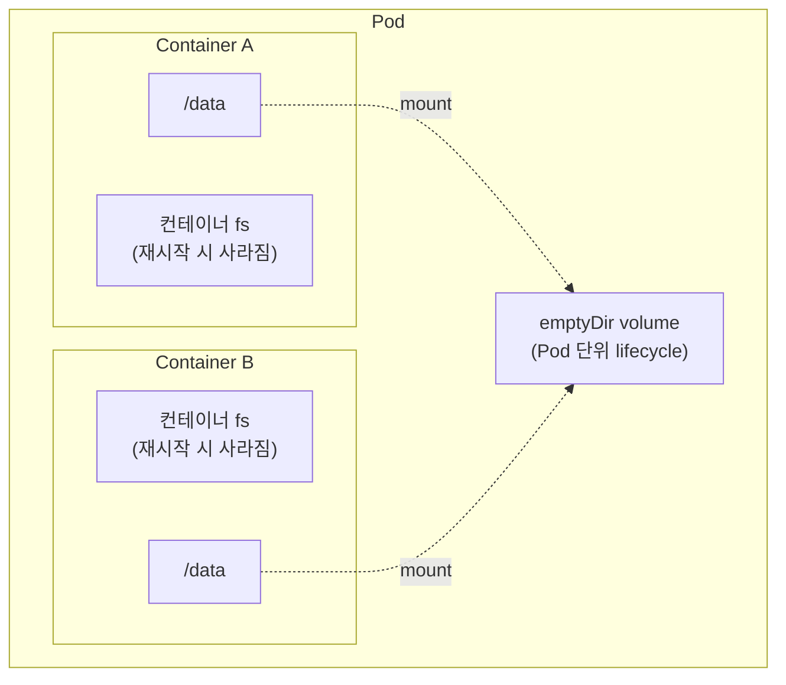
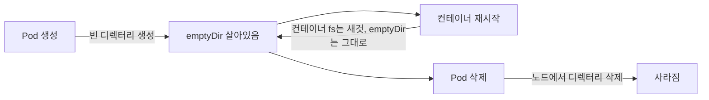

# 15. Volume · emptyDir — Pod 안 임시 저장

컨테이너 파일시스템에 쓴 파일은 컨테이너가 재시작되면 사라집니다. 같은 Pod 안 두 컨테이너끼리도 서로의 파일시스템을 볼 수 없습니다. `emptyDir` 한 줄로 이 두 문제를 모두 해결하는 모습 — 컨테이너 재시작 후에도 살아남는 데이터, 두 컨테이너가 같이 읽고 쓰는 디렉터리, 그리고 Pod가 사라지면 노드 디스크에서도 같이 사라지는 lifecycle — 을 손으로 확인하는 실습 공간입니다.

## 핵심 다이어그램





- **컨테이너 파일시스템(rootfs)은 컨테이너 한 번의 lifecycle만 유지합니다.** 컨테이너가 재시작되면 새 rootfs로 다시 시작합니다.
- **Volume은 Pod에 붙어 있습니다.** 컨테이너가 아니라 Pod 단위로 만들어지고, Pod가 살아있는 동안만 존재합니다.
- **`emptyDir`는 Pod 시작 시 빈 디렉터리로 만들어지는 가장 단순한 Volume입니다.** 같은 Pod 안 여러 컨테이너가 같은 emptyDir를 마운트하면 디렉터리를 공유합니다.
- **`emptyDir.medium: Memory`**는 디스크 대신 tmpfs로 만들어 줍니다. 빠르고, 노드 메모리를 차지하고, 노드 디스크에 흔적이 남지 않습니다.

아래 시연이 이 그림의 각 지점을 한 줄씩 손으로 확인합니다.

## 사전 준비물

이 실습은 **macOS** 환경을 기준으로 합니다.

- **Docker** — Docker Desktop, OrbStack 등. `docker ps`가 에러 없이 돌아가면 OK.
- **Homebrew** — macOS 패키지 관리자.

### kind · kubectl 설치

```bash
brew install kind kubectl
```

### rosa-lab 클러스터 준비

```bash
kind create cluster --name rosa-lab
```

이미 클러스터가 있으면 건너뜁니다.

```bash
kind get clusters   # rosa-lab이 보이면 OK
```

### rosa-lab namespace 준비

```bash
kubectl create namespace rosa-lab
kubectl config set-context --current --namespace=rosa-lab
```

이미 namespace가 있고 기본값으로 설정되어 있으면 건너뜁니다.

```bash
kubectl config get-contexts   # NAMESPACE 열에 rosa-lab이 보이면 OK
```

## 실습 환경

| 파일 | 내용 |
|---|---|
| `manifests/pod-no-volume.yaml` | Volume 없는 Pod — 컨테이너 fs의 ephemeral 특성 확인용 |
| `manifests/pod-emptydir.yaml` | emptyDir 마운트 — 컨테이너 재시작에도 살아남는 데이터 확인용 |
| `manifests/pod-shared.yaml` | 두 컨테이너(writer/reader)가 같은 emptyDir 공유 |
| `manifests/pod-memory.yaml` | `medium: Memory` — tmpfs로 만드는 emptyDir |

> 모든 매니페스트에서 컨테이너의 `command`를 `["sleep", "3600"]`으로 둡니다. 컨테이너 안 PID 1을 sleep으로 만들기 위함입니다 — 뒤에서 컨테이너를 외부에서 강제 종료할 때 깔끔하게 죽기 위해서입니다.

## 여기서 직접 확인할 수 있는 것

### 컨테이너 파일시스템은 재시작에 살아남지 못합니다

먼저 Volume 없는 Pod를 만들고, 컨테이너 파일시스템에 파일을 씁니다.

```bash
kubectl apply -f manifests/pod-no-volume.yaml
kubectl wait pod no-volume -n rosa-lab --for=condition=Ready --timeout=60s
```

`/tmp/note.txt`에 한 줄을 씁니다.

```bash
kubectl exec -n rosa-lab no-volume -- sh -c 'echo "before restart" > /tmp/note.txt; cat /tmp/note.txt'
```

```
before restart
```

PID 1이 정말 sleep인지 확인합니다.

```bash
kubectl exec -n rosa-lab no-volume -- ps -o pid,comm
```

```
PID   COMMAND
    1 sleep
   11 ps
```

이제 컨테이너를 외부에서 강제 종료합니다. `kubectl exec ... -- kill 1`은 통하지 않습니다 — Linux 커널은 PID 1에 대해 명시적인 시그널 핸들러가 등록되어 있지 않으면 SIGTERM·SIGKILL을 무시합니다. 그래서 노드 안에서 컨테이너 런타임 도구(`crictl`)로 직접 컨테이너를 멈춥니다.

```bash
docker exec rosa-lab-control-plane crictl ps | grep no-volume
```

```
57fffa48...  6df9636795d37  About a minute ago  Running  app  0  bf0ac1d097e07  no-volume  rosa-lab
```

`crictl stop`을 보내면 컨테이너가 종료되고, kubelet의 `restartPolicy: Always`(Pod의 기본값)에 따라 새 컨테이너로 다시 시작됩니다.

```bash
CID=$(docker exec rosa-lab-control-plane crictl ps -q --name app --label io.kubernetes.pod.name=no-volume)
docker exec rosa-lab-control-plane crictl stop $CID
sleep 5
kubectl get pod no-volume -n rosa-lab
```

```
NAME        READY   STATUS    RESTARTS     AGE
no-volume   1/1     Running   1 (5s ago)   2m1s
```

`RESTARTS: 1`이 됐습니다. 컨테이너 한 번 재시작됐다는 뜻입니다. 같은 파일을 확인합니다.

```bash
kubectl exec -n rosa-lab no-volume -- ls /tmp/note.txt
```

```
ls: /tmp/note.txt: No such file or directory
command terminated with exit code 1
```

사라졌습니다. 컨테이너 fs는 컨테이너 한 번의 lifecycle만 유지합니다. 재시작은 새 rootfs로 시작합니다 — 같은 Pod 안인데도.

### emptyDir는 컨테이너 재시작에 살아남습니다

이번엔 Pod에 emptyDir를 붙이고 `/data`에 마운트합니다.

```yaml
spec:
  containers:
    - name: app
      ...
      volumeMounts:
        - name: scratch
          mountPath: /data
  volumes:
    - name: scratch
      emptyDir: {}
```

```bash
kubectl delete pod no-volume -n rosa-lab
kubectl apply -f manifests/pod-emptydir.yaml
kubectl wait pod with-emptydir -n rosa-lab --for=condition=Ready --timeout=60s
```

같은 컨테이너 안에서 두 위치에 파일을 씁니다 — `/data`(emptyDir 위)와 `/tmp/scratch.txt`(컨테이너 fs 위).

```bash
kubectl exec -n rosa-lab with-emptydir -- sh -c 'echo "stays in /data" > /data/note.txt; echo "stays in /tmp" > /tmp/scratch.txt; ls /data /tmp/scratch.txt; mount | grep " /data "'
```

```
/tmp/scratch.txt

/data:
note.txt
/dev/vda1 on /data type ext4 (rw,relatime,discard)
```

마지막 줄에 주목합니다. `/data`는 컨테이너 안에서 보면 노드의 디스크 `/dev/vda1`이 bind mount된 위치입니다 — emptyDir의 실체는 노드 디스크의 어떤 디렉터리입니다.

같은 방식으로 컨테이너를 강제 종료합니다.

```bash
CID=$(docker exec rosa-lab-control-plane crictl ps -q --name app --label io.kubernetes.pod.name=with-emptydir)
docker exec rosa-lab-control-plane crictl stop $CID
sleep 6
kubectl get pod with-emptydir -n rosa-lab
```

```
NAME            READY   STATUS    RESTARTS     AGE
with-emptydir   1/1     Running   1 (6s ago)   27s
```

재시작 후 두 위치를 비교합니다.

```bash
kubectl exec -n rosa-lab with-emptydir -- ls /tmp/scratch.txt
kubectl exec -n rosa-lab with-emptydir -- sh -c 'ls /data; cat /data/note.txt'
```

```
ls: /tmp/scratch.txt: No such file or directory
command terminated with exit code 1

note.txt
stays in /data
```

`/tmp/scratch.txt`는 사라지고, `/data/note.txt`는 그대로 있습니다. 같은 Pod, 같은 컨테이너, 같은 재시작 한 번인데 결과가 다릅니다.

차이를 가르는 건 마운트입니다. `/tmp`는 컨테이너 rootfs고, `/data`는 emptyDir(Pod 단위) bind mount입니다. 컨테이너가 재시작될 때 rootfs는 새것이 되지만, Pod의 Volume mount는 그대로 새 컨테이너에 다시 붙습니다.

### 같은 emptyDir를 두 컨테이너가 공유합니다

emptyDir가 Pod 단위라면, 같은 Pod 안 두 컨테이너가 같은 emptyDir를 마운트할 수 있습니다. 한쪽이 쓰면 다른 쪽이 봅니다.

```yaml
spec:
  containers:
    - name: writer
      image: busybox:1.37
      command:
        - sh
        - -c
        - |
          i=0
          while true; do
            i=$((i+1))
            echo "tick $i at $(date)" >> /data/log.txt
            sleep 2
          done
      volumeMounts:
        - name: shared
          mountPath: /data
    - name: reader
      image: busybox:1.37
      command: ["sleep", "3600"]
      volumeMounts:
        - name: shared
          mountPath: /data
  volumes:
    - name: shared
      emptyDir: {}
```

`writer`는 2초마다 한 줄씩 `/data/log.txt`에 쓰고, `reader`는 아무것도 하지 않습니다.

```bash
kubectl delete pod with-emptydir -n rosa-lab
kubectl apply -f manifests/pod-shared.yaml
kubectl wait pod shared -n rosa-lab --for=condition=Ready --timeout=60s
sleep 6
kubectl exec -n rosa-lab shared -c reader -- tail -5 /data/log.txt
```

```
tick 2 at Tue Jun 23 09:38:26 UTC 2026
tick 3 at Tue Jun 23 09:38:28 UTC 2026
tick 4 at Tue Jun 23 09:38:30 UTC 2026
tick 5 at Tue Jun 23 09:38:32 UTC 2026
tick 6 at Tue Jun 23 09:38:34 UTC 2026
```

reader가 writer의 파일을 보고 있습니다. 두 컨테이너 사이에 네트워크 연결도, 명시적인 IPC도 없습니다. 같은 Pod 안이라 같은 Volume을 마운트한 것뿐입니다.

이 패턴이 사이드카(sidecar)의 기본 형태입니다 — 메인 컨테이너가 파일에 로그를 쓰고, 사이드카 컨테이너가 같은 emptyDir를 읽어 어딘가로 전송하는 식.

### emptyDir의 실체 — 노드 디스크의 한 디렉터리

방금 본 `/dev/vda1 on /data type ext4` 줄이 단서였습니다. emptyDir는 노드 파일시스템에 만들어지는 디렉터리입니다. 위치는 정해져 있습니다 — `/var/lib/kubelet/pods/<pod-uid>/volumes/kubernetes.io~empty-dir/<volume-name>/`.

```bash
PODUID=$(kubectl get pod shared -n rosa-lab -o jsonpath='{.metadata.uid}')
echo "POD UID=$PODUID"
docker exec rosa-lab-control-plane sh -c "ls -la /var/lib/kubelet/pods/$PODUID/volumes/kubernetes.io~empty-dir/"
```

```
POD UID=cde5bc92-dac1-4160-8074-d0c2adf04372
total 12
drwxr-xr-x 3 root root 4096 Jun 23 09:38 .
drwxr-x--- 4 root root 4096 Jun 23 09:38 ..
drwxrwxrwx 2 root root 4096 Jun 23 09:38 shared
```

마지막 `shared`가 매니페스트의 `volumes[].name`과 같습니다. 그 안을 보면 컨테이너에서 본 것과 똑같습니다.

```bash
docker exec rosa-lab-control-plane sh -c "tail -3 /var/lib/kubelet/pods/$PODUID/volumes/kubernetes.io~empty-dir/shared/log.txt"
```

```
tick 18 at Tue Jun 23 09:38:58 UTC 2026
tick 19 at Tue Jun 23 09:39:00 UTC 2026
tick 20 at Tue Jun 23 09:39:02 UTC 2026
```

같은 파일을 노드 fs에서도 직접 읽을 수 있습니다. emptyDir의 구현은 단순합니다 — kubelet이 Pod 디렉터리 아래 빈 디렉터리를 하나 만들고, 그걸 각 컨테이너의 mountPath로 bind mount해 줄 뿐입니다.

### Pod가 사라지면 노드 디스크에서도 사라집니다

방금 본 디렉터리는 Pod의 lifecycle을 따릅니다. Pod를 지우면 kubelet이 Pod 디렉터리 전체를 정리합니다.

```bash
PODUID=$(kubectl get pod shared -n rosa-lab -o jsonpath='{.metadata.uid}')
kubectl delete pod shared -n rosa-lab
sleep 3
docker exec rosa-lab-control-plane sh -c "ls /var/lib/kubelet/pods/$PODUID/volumes/kubernetes.io~empty-dir/ 2>&1 || echo gone"
```

```
ls: cannot access '/var/lib/kubelet/pods/cde5bc92-.../volumes/kubernetes.io~empty-dir/': No such file or directory
gone
```

디렉터리째로 사라졌습니다. 이게 emptyDir의 한계입니다 — Pod 단위의 lifecycle이라, Pod가 다른 노드로 스케줄되거나 재생성되면 데이터가 따라가지 않습니다. 영속 데이터가 필요하면 PV / PVC를 써야 합니다.

### medium: Memory — 디스크 대신 tmpfs

`emptyDir.medium: Memory`로 두면 디스크가 아니라 tmpfs(메모리 기반 파일시스템)로 만들어집니다. `sizeLimit`으로 크기 상한을 둘 수 있습니다.

```yaml
volumes:
  - name: ram
    emptyDir:
      medium: Memory
      sizeLimit: 32Mi
```

```bash
kubectl apply -f manifests/pod-memory.yaml
kubectl wait pod memory-volume -n rosa-lab --for=condition=Ready --timeout=60s
kubectl exec -n rosa-lab memory-volume -- sh -c 'mount | grep " /ram "; df -hT /ram'
```

```
tmpfs on /ram type tmpfs (rw,relatime,size=32768k,noswap)
Filesystem           Type            Size      Used Available Use% Mounted on
tmpfs                tmpfs          32.0M         0     32.0M   0% /ram
```

`/ram`이 tmpfs로 마운트되어 있고 `sizeLimit`이 그대로 반영됐습니다.

언제 쓰는가:
- 캐시처럼 빠르게 읽고 써야 하는 임시 데이터
- 디스크에 흔적을 남기지 않아야 하는 민감한 임시 파일(컨테이너 안 secret 디코딩 결과 같은)

주의: tmpfs는 노드의 메모리를 씁니다. `sizeLimit`을 두지 않으면 노드 메모리를 무제한으로 점유할 수 있고, 컨테이너의 메모리 limit과 별개로 노드 메모리 압박의 원인이 됩니다.

### 정리

```bash
kubectl delete pod memory-volume -n rosa-lab
kubectl get pods -n rosa-lab
```

ownerReference가 없는 단독 Pod라 명시적으로 지워줘야 합니다.

## 이 편의 산출물

- 컨테이너 파일시스템과 Pod 볼륨의 lifecycle 차이를 같은 컨테이너에서 두 위치 비교로 본 경험. `/tmp`는 사라지고 `/data`는 남는 한 줄로 답할 수 있다.
- `emptyDir`의 실체가 노드 fs의 `/var/lib/kubelet/pods/<uid>/volumes/kubernetes.io~empty-dir/<name>/` 디렉터리임을 두 눈으로 확인한 상태.
- 같은 Pod 안 두 컨테이너가 같은 emptyDir로 데이터를 주고받는 sidecar 패턴의 기본형.
- `medium: Memory`로 tmpfs Volume을 만들 수 있고, `sizeLimit`이 mount 옵션으로 반영된다는 점.
- Pod를 지우면 emptyDir도 같이 사라진다는 점, 그래서 영속 데이터엔 부적합하다는 점.
