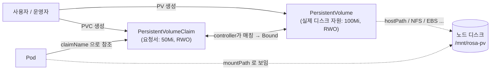

# 16. PV · PVC — Pod 밖 영속 저장

Pod가 삭제되어도 데이터가 남아야 한다면 Pod 안의 Volume이 아니라 Pod 밖에 있는 저장소를 쓰는 수밖에 없습니다. 쿠버네티스는 그 저장소를 두 단계로 추상화합니다 — PersistentVolume(클러스터에 있는 실제 디스크)과 PersistentVolumeClaim(Pod가 디스크에 요청하는 신청서). 이 두 객체가 어떻게 매칭되어 Pod에 마운트되는지, Pod를 지워도 데이터가 어떻게 남는지, 그리고 PVC를 지운 PV는 어떤 상태로 남는지를 손으로 확인하는 실습 공간입니다.

## 핵심 다이어그램




- **PV는 클러스터 단위 자원입니다.** 네임스페이스에 속하지 않습니다. 운영자가 "디스크 자원 한 칸이 여기 있다"고 선언하는 객체입니다.
- **PVC는 네임스페이스 단위 요청입니다.** 개발자(또는 매니페스트)가 "RWO 50Mi 디스크 한 칸이 필요하다"고 요청하는 객체입니다.
- **둘 사이는 persistentvolume-controller가 매칭합니다.** storageClassName · accessModes · capacity가 호환되는 PV와 PVC를 찾아 Bound로 만들어 줍니다.
- **Pod는 PV를 직접 모릅니다.** PVC 이름만 알면 됩니다. 그 뒤로 어떤 PV가 어떤 디스크를 가리키는지는 Pod의 관심사가 아닙니다.

아래 시연이 이 그림의 각 지점을 한 줄씩 손으로 확인합니다.

## 사전 준비물

이 실습은 **macOS** 환경을 기준으로 합니다.

- **Docker** — Docker Desktop, OrbStack 등. `docker ps`가 에러 없이 돌아가면 OK.
- **Homebrew** — macOS 패키지 관리자.

### kind · kubectl 설치

```bash
brew install kind kubectl
```

### rosa-lab 클러스터 준비

```bash
kind create cluster --name rosa-lab
```

이미 클러스터가 있으면 건너뜁니다.

```bash
kind get clusters   # rosa-lab이 보이면 OK
```

### rosa-lab namespace 준비

```bash
kubectl create namespace rosa-lab
kubectl config set-context --current --namespace=rosa-lab
```

이미 namespace가 있고 기본값으로 설정되어 있으면 건너뜁니다.

```bash
kubectl config get-contexts   # NAMESPACE 열에 rosa-lab이 보이면 OK
```

## 실습 환경

| 파일 | 내용 |
|---|---|
| `manifests/pv.yaml` | hostPath PV (100Mi, RWO, reclaim=Retain) |
| `manifests/pvc.yaml` | 50Mi 요청 PVC, 같은 storageClassName |
| `manifests/pod-writer.yaml` | PVC 마운트 → `/data/note.txt`에 한 줄 쓰는 Pod |
| `manifests/pod-reader.yaml` | 같은 PVC 마운트 → 읽기만 하는 Pod |

> hostPath는 단일 노드(kind 같은 로컬 클러스터) 실습용입니다. 운영 환경에서는 NFS, CSI 드라이버, 클라우드 디스크(EBS, PD, Disk) 같은 백엔드를 씁니다 — 객체 구조는 그대로고 PV의 source 필드만 달라집니다.

## 여기서 직접 확인할 수 있는 것

### PV 없이 PVC만 만들면 Pending에 머뭅니다

PVC는 단독으로는 아무 의미가 없습니다. 매칭될 PV가 있어야 Bound가 됩니다.

```bash
kubectl apply -f manifests/pvc.yaml
sleep 2
kubectl get pvc -n rosa-lab
```

```
NAME         STATUS    VOLUME   CAPACITY   ACCESS MODES   STORAGECLASS   AGE
rosa-claim   Pending                                      rosa-manual    2s
```

왜 Pending인지 events로 확인합니다.

```bash
kubectl describe pvc rosa-claim -n rosa-lab | tail -5
```

```
Events:
  Type     Reason              Age   From                         Message
  ----     ------              ----  ----                         -------
  Warning  ProvisioningFailed  5s    persistentvolume-controller  storageclass.storage.k8s.io "rosa-manual" not found
```

persistentvolume-controller가 두 가지를 시도합니다:

1. **storageClassName으로 동적 프로비저닝** — `rosa-manual` StorageClass가 없으니 실패 → Warning.
2. **storageClassName이 같은 Available PV 찾기** — 아직 PV가 없으니 매칭 못함 → 계속 Pending.

PV를 만들어 줍니다.

### PV를 만들면 controller가 묶어줍니다

```yaml
apiVersion: v1
kind: PersistentVolume
metadata:
  name: rosa-pv-100m
spec:
  capacity:
    storage: 100Mi
  accessModes:
    - ReadWriteOnce
  persistentVolumeReclaimPolicy: Retain
  storageClassName: rosa-manual
  hostPath:
    path: /mnt/rosa-pv
    type: DirectoryOrCreate
```

```bash
kubectl apply -f manifests/pv.yaml
sleep 10
kubectl get pv,pvc -n rosa-lab
```

```
NAME                            CAPACITY   ACCESS MODES   RECLAIM POLICY   STATUS   CLAIM                 STORAGECLASS   AGE
persistentvolume/rosa-pv-100m   100Mi      RWO            Retain           Bound    rosa-lab/rosa-claim   rosa-manual    22s

NAME                               STATUS   VOLUME         CAPACITY   ACCESS MODES   STORAGECLASS   AGE
persistentvolumeclaim/rosa-claim   Bound    rosa-pv-100m   100Mi      RWO            rosa-manual    34s
```

핵심 두 줄:

- PV의 `CLAIM` 열에 `rosa-lab/rosa-claim`이 적혔습니다 — PV가 어느 PVC와 묶였는지를 PV가 기억합니다.
- PVC의 `CAPACITY` 열이 50Mi가 아니라 **100Mi**입니다 — PVC 요청은 "50Mi 이상이면 OK"이고, Bound된 PV가 가진 100Mi 전체를 받아옵니다. 디스크 한 칸을 통째로 받는 모델입니다.

이 매칭은 일대일입니다. 같은 PV에 다른 PVC가 또 묶이지 않습니다.

### Pod는 PVC 이름만 압니다

writer Pod의 매니페스트에서 PV 관련 정보를 찾아봐도, 보이는 건 PVC 이름 하나뿐입니다.

```yaml
spec:
  containers:
    - name: app
      ...
      volumeMounts:
        - name: store
          mountPath: /data
  volumes:
    - name: store
      persistentVolumeClaim:
        claimName: rosa-claim
```

```bash
kubectl apply -f manifests/pod-writer.yaml
kubectl wait pod writer -n rosa-lab --for=condition=Ready --timeout=60s
kubectl exec -n rosa-lab writer -- cat /data/note.txt
```

```
written by writer at Tue Jun 23 10:06:20 UTC 2026
```

Pod는 PV의 storage backend(hostPath, NFS, EBS …)를 알 필요가 없습니다. PVC가 그 디스크를 가리키고 있고, 그 PVC를 마운트하면 그만입니다 — 이 분리가 PVC의 존재 이유입니다.

같은 파일이 노드 디스크의 PV path에 직접 보입니다.

```bash
docker exec rosa-lab-control-plane ls -la /mnt/rosa-pv/
docker exec rosa-lab-control-plane cat /mnt/rosa-pv/note.txt
```

```
total 12
drwxr-xr-x 2 root root 4096 Jun 23 10:06 .
drwxr-xr-x 1 root root 4096 Jun 23 10:06 ..
-rw-r--r-- 1 root root   50 Jun 23 10:06 note.txt

written by writer at Tue Jun 23 10:06:20 UTC 2026
```

`/mnt/rosa-pv`는 PV의 `hostPath.path`에 적은 경로입니다. Pod 안에서는 `/data`로 보이지만, 노드에서 보면 그냥 노드 fs의 한 디렉터리입니다.

### Pod를 지워도 데이터는 남습니다

여기서부터 emptyDir와의 결정적 차이가 드러납니다.

```bash
kubectl delete pod writer -n rosa-lab
docker exec rosa-lab-control-plane cat /mnt/rosa-pv/note.txt
kubectl get pv,pvc -n rosa-lab
```

```
written by writer at Tue Jun 23 10:06:20 UTC 2026

NAME                            CAPACITY   ACCESS MODES   RECLAIM POLICY   STATUS   CLAIM                 STORAGECLASS   AGE
persistentvolume/rosa-pv-100m   100Mi      RWO            Retain           Bound    rosa-lab/rosa-claim   rosa-manual    91s

NAME                               STATUS   VOLUME         CAPACITY   ACCESS MODES   STORAGECLASS   AGE
persistentvolumeclaim/rosa-claim   Bound    rosa-pv-100m   100Mi      RWO            rosa-manual    103s
```

- Pod는 사라졌습니다.
- 노드의 `/mnt/rosa-pv/note.txt`는 그대로입니다.
- PV·PVC는 둘 다 여전히 Bound입니다 — Pod가 지워졌다고 PVC가 해제되진 않습니다.

다른 Pod로 같은 PVC를 마운트하면 같은 데이터를 봅니다.

```bash
kubectl apply -f manifests/pod-reader.yaml
kubectl wait pod reader -n rosa-lab --for=condition=Ready --timeout=60s
kubectl exec -n rosa-lab reader -- cat /data/note.txt
```

```
written by writer at Tue Jun 23 10:06:20 UTC 2026
```

reader는 writer를 모릅니다. 이름도 다르고 매니페스트도 다릅니다. 둘이 같은 데이터를 보는 이유는 같은 PVC를 참조했기 때문입니다.

### PVC를 지우면 PV는 Released가 됩니다

`reclaimPolicy: Retain`이라 PVC를 지워도 PV의 데이터는 보존됩니다. PV의 상태만 바뀝니다.

```bash
kubectl delete pod reader -n rosa-lab
kubectl delete pvc rosa-claim -n rosa-lab
sleep 3
kubectl get pv,pvc -n rosa-lab
```

```
NAME                            CAPACITY   ACCESS MODES   RECLAIM POLICY   STATUS     CLAIM                 STORAGECLASS   AGE
persistentvolume/rosa-pv-100m   100Mi      RWO            Retain           Released   rosa-lab/rosa-claim   rosa-manual    2m32s
```

- 상태: `Bound → Released`.
- `CLAIM` 열에 옛 claim 이름(`rosa-lab/rosa-claim`)이 그대로 남아 있습니다.
- 데이터(`/mnt/rosa-pv/note.txt`)는 그대로입니다.

데이터는 그대로지만, 이 PV는 **새 PVC가 자동으로 잡지 못합니다**. 같은 이름 PVC를 다시 만들어 봐도 매칭되지 않습니다.

```bash
docker exec rosa-lab-control-plane cat /mnt/rosa-pv/note.txt
kubectl apply -f manifests/pvc.yaml
sleep 5
kubectl get pv,pvc -n rosa-lab
```

```
written by writer at Tue Jun 23 10:06:20 UTC 2026

NAME                            ...   STATUS     CLAIM                 ...   AGE
persistentvolume/rosa-pv-100m   ...   Released   rosa-lab/rosa-claim   ...   2m46s

NAME                               STATUS    VOLUME   CAPACITY   ...   AGE
persistentvolumeclaim/rosa-claim   Pending                       ...   5s
```

PV는 Released 그대로, PVC는 Pending. 이게 Retain의 안전장치입니다 — 옛 데이터가 남아 있는 PV가 무심코 다른 신청서에 잡혀 덮어쓰이지 않도록, 운영자가 한 번 더 정리하게 강제합니다.

### Released PV를 다시 쓰려면

운영자가 데이터를 확인한 뒤 두 가지 중 선택합니다.

1. **재사용 — `claimRef`를 비웁니다.** PV가 Available로 돌아가서, 호환되는 PVC가 다시 묶을 수 있게 됩니다.
2. **폐기 — PV를 지웁니다.** Retain이라 PV 객체를 지워도 노드 디스크의 디렉터리·파일은 그대로 남으므로, 그것도 따로 지웁니다.

재사용 경로를 봅니다.

```bash
kubectl get pv rosa-pv-100m -o jsonpath='{.spec.claimRef}'
kubectl patch pv rosa-pv-100m -p '{"spec":{"claimRef":null}}'
sleep 10
kubectl get pv,pvc -n rosa-lab
```

```
{"apiVersion":"v1","kind":"PersistentVolumeClaim","name":"rosa-claim","namespace":"rosa-lab","resourceVersion":"539","uid":"3ec49eaf-..."}
persistentvolume/rosa-pv-100m patched

NAME                            ...   STATUS   CLAIM                 ...   AGE
persistentvolume/rosa-pv-100m   ...   Bound    rosa-lab/rosa-claim   ...   3m32s

NAME                               STATUS   VOLUME         CAPACITY   ...   AGE
persistentvolumeclaim/rosa-claim   Bound    rosa-pv-100m   100Mi      ...   51s
```

`spec.claimRef`를 비우자 PV가 일시적으로 Available이 됐고, 기다리고 있던 새 PVC가 즉시 잡아서 Bound로 돌아왔습니다.

같은 PV에 옛 데이터가 그대로 있으니, 새 Pod에서 그대로 읽힙니다.

```bash
kubectl apply -f manifests/pod-reader.yaml
kubectl wait pod reader -n rosa-lab --for=condition=Ready --timeout=60s
kubectl exec -n rosa-lab reader -- cat /data/note.txt
```

```
written by writer at Tue Jun 23 10:06:20 UTC 2026
```

PVC 삭제 → 새 PVC 생성 → 다시 Bound. 그 사이 데이터 한 글자도 손대지 않았습니다. Retain의 진짜 효용이 여기 있습니다 — Pod의 lifecycle, PVC의 lifecycle, 디스크 데이터의 lifecycle을 따로 다룰 수 있다는 점.

### reclaimPolicy의 다른 값들

| 값 | PVC 삭제 시 PV 동작 | 데이터 | 주 사용처 |
|---|---|---|---|
| `Retain` | PV는 Released로 남음 | 보존 | 정적 PV, 중요 데이터 |
| `Delete` | PV 객체도 자동 삭제, 백엔드 스토리지도 같이 정리 시도 | 보통 사라짐 | StorageClass 동적 프로비저닝의 기본값 |
| `Recycle` | (deprecated) `rm -rf` 후 Available | 사라짐 | — |

정적 PV(운영자가 미리 만들어 둔 것)는 보통 `Retain`을 씁니다. 동적 PV(StorageClass가 PVC 요청을 받아 그때그때 만든 것)는 `Delete`가 기본입니다.

### 정리

```bash
kubectl delete pod reader -n rosa-lab
kubectl delete pvc rosa-claim -n rosa-lab
kubectl delete pv rosa-pv-100m
docker exec rosa-lab-control-plane rm -rf /mnt/rosa-pv
```

Retain은 PV 객체를 지워도 노드 디스크의 디렉터리·파일을 자동으로 정리해주지 않습니다. 마지막 줄에서 노드 디스크의 실제 디렉터리도 직접 지웁니다.

## 이 편의 산출물

- PV(클러스터 단위 자원)와 PVC(네임스페이스 단위 요청)의 분리를 객체 두 개로 직접 만들어 본 경험. PV 없이 PVC만 있으면 Pending, PV가 생기면 Bound로 바뀌는 흐름.
- Pod 매니페스트가 PV의 backend(hostPath, EBS …)를 모른 채 PVC 이름 하나로 디스크에 접근하는 구조.
- Pod 삭제 후에도 데이터·PV·PVC가 그대로 남고, 다른 Pod가 같은 PVC를 마운트하면 같은 데이터를 보는 점.
- `reclaimPolicy: Retain`의 의미 — PVC를 지우면 PV는 Released, 데이터는 보존, 새 PVC가 자동으로 못 잡음. `claimRef`를 비우면 다시 Available로 풀려나는 운영 흐름.
- "Pod의 lifecycle, PVC의 lifecycle, 디스크 데이터의 lifecycle을 따로 관리한다"는 한 줄로 PV/PVC가 왜 두 객체인지 답할 수 있는 상태.
