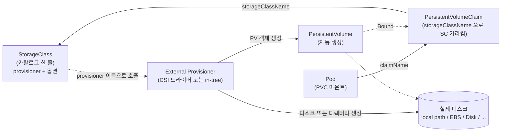
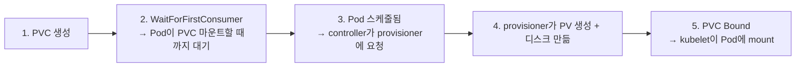

# 17. StorageClass · CSI

운영자가 디스크를 미리 만들어 두는 모델은 환경 수와 PVC 수가 늘면 깨집니다. StorageClass는 "디스크 종류 카탈로그"고, CSI(Container Storage Interface)는 그 카탈로그를 채워주는 외부 provisioner들이 따르는 약속입니다. PVC만 만들면 provisioner가 자동으로 PV와 실제 디스크를 만들어 주고, PVC가 사라지면 같이 정리해 주는 흐름을 직접 만들어 보는 실습 공간입니다.

## 핵심 다이어그램





- **StorageClass는 클러스터 단위 카탈로그**입니다. 운영자가 "이 클러스터에는 이런 종류의 디스크가 있다"를 한 줄씩 등록해 둡니다.
- **PVC는 storageClassName으로 그 카탈로그를 가리킵니다.** 어떤 backend가 어디서 디스크를 따오는지는 PVC 입장에선 모릅니다.
- **provisioner는 PV와 실제 디스크를 만드는 외부 컴포넌트**입니다. in-tree(쿠버네티스 코드에 내장) → CSI(외부 드라이버)로 흐름이 바뀌었고, 지금은 새 backend는 거의 다 CSI입니다.
- **`volumeBindingMode: WaitForFirstConsumer`**는 PVC가 Pending에 멈춰 있다가, Pod이 그 PVC를 마운트하려고 스케줄될 때 비로소 PV가 생성되게 합니다 — Pod이 어느 노드에 가는지 본 뒤 디스크를 그 노드에 만들기 위한 모드입니다.

아래 시연이 이 그림의 각 지점을 한 줄씩 손으로 확인합니다.

## 사전 준비물

이 실습은 **macOS** 환경을 기준으로 합니다.

- **Docker** — Docker Desktop, OrbStack 등. `docker ps`가 에러 없이 돌아가면 OK.
- **Homebrew** — macOS 패키지 관리자.

### kind · kubectl 설치

```bash
brew install kind kubectl
```

### rosa-lab 클러스터 준비

```bash
kind create cluster --name rosa-lab
```

이미 클러스터가 있으면 건너뜁니다.

```bash
kind get clusters   # rosa-lab이 보이면 OK
```

### rosa-lab namespace 준비

```bash
kubectl create namespace rosa-lab
kubectl config set-context --current --namespace=rosa-lab
```

이미 namespace가 있고 기본값으로 설정되어 있으면 건너뜁니다.

```bash
kubectl config get-contexts   # NAMESPACE 열에 rosa-lab이 보이면 OK
```

## 실습 환경

| 파일 | 내용 |
|---|---|
| `manifests/pvc.yaml` | 기본 StorageClass(`standard`)를 가리키는 PVC |
| `manifests/pod.yaml` | 그 PVC를 마운트하고 `/data/note.txt`를 쓰는 Pod |
| `manifests/sc-retain.yaml` | 같은 provisioner를 `reclaimPolicy: Retain`으로 노출하는 새 StorageClass |
| `manifests/pvc-retain.yaml` | `standard-retain`을 가리키는 PVC |
| `manifests/pod-retain.yaml` | 그 PVC를 마운트하는 Pod |

> kind 클러스터에는 기본으로 `standard` StorageClass와 `rancher.io/local-path` provisioner가 설치되어 있습니다. EKS·GKE·AKS도 환경별로 기본 StorageClass(`gp3`, `standard-rwo`, `default` 등)와 CSI 드라이버를 자동 설치합니다 — 이름과 옵션은 다르지만 객체 구조는 같습니다.

## 여기서 직접 확인할 수 있는 것

### 기본 StorageClass — provisioner와 정책

`kubectl get sc`로 클러스터의 카탈로그를 봅니다.

```bash
kubectl get sc -o wide
```

```
NAME                 PROVISIONER             RECLAIMPOLICY   VOLUMEBINDINGMODE      ALLOWVOLUMEEXPANSION   AGE
standard (default)   rancher.io/local-path   Delete          WaitForFirstConsumer   false                  4s
```

읽는 법:

- `(default)` — `storageClassName`을 안 적은 PVC가 자동으로 잡는 클래스. 클러스터에 하나만 둘 수 있습니다.
- `PROVISIONER` — `rancher.io/local-path`. 이 이름의 외부 컴포넌트가 PVC를 보고 PV·디스크를 만들 책임자입니다.
- `RECLAIMPOLICY: Delete` — PVC를 지우면 PV와 디스크도 같이 사라집니다. 동적 PV의 기본값입니다.
- `VOLUMEBINDINGMODE: WaitForFirstConsumer` — Pod이 그 PVC를 쓰겠다고 스케줄될 때까지 PV를 만들지 않습니다.

PROVISIONER로 적힌 이름은 클러스터 어딘가에서 돌고 있는 Pod입니다. 어디 있는지 찾아봅니다.

```bash
kubectl get pods -A -l app=local-path-provisioner -o wide
```

```
NAMESPACE            NAME                                      READY   STATUS    RESTARTS   AGE   IP           NODE                     ...
local-path-storage   local-path-provisioner-855c7b7774-8vq6q   1/1     Running   0          25s   10.244.0.3   rosa-lab-control-plane   ...
```

이 Pod 하나가 클러스터의 모든 PVC를 보고 있다가, `standard` SC를 가리키는 PVC가 생기면 PV와 디스크를 만들어 줍니다.

### PVC만 만들면 Pending에 멈춥니다 — WaitForFirstConsumer

```bash
kubectl apply -f manifests/pvc.yaml
sleep 3
kubectl get pvc,pv -n rosa-lab
```

```
NAME                               STATUS    VOLUME   CAPACITY   ACCESS MODES   STORAGECLASS   AGE
persistentvolumeclaim/auto-claim   Pending                                      standard       3s
```

왜 Pending인지 확인합니다.

```bash
kubectl describe pvc auto-claim -n rosa-lab | tail -5
```

```
Events:
  Type    Reason                Age              From                         Message
  ----    ------                ----             ----                         -------
  Normal  WaitForFirstConsumer  6s (x2 over 7s)  persistentvolume-controller  waiting for first consumer to be created before binding
```

여기서 동적 프로비저닝의 흐름이 정적 PV와 갈라집니다.

- 정적 PV(운영자가 미리 만든 PV)는 PVC가 생기는 즉시 매칭을 시도합니다.
- 동적 PV는 SC의 `volumeBindingMode`를 따릅니다. `WaitForFirstConsumer`라면 "이 PVC를 쓰는 Pod이 어느 노드에 가는지 알 때까지" 기다립니다 — 노드 종속 디스크(local-path, AWS EBS 등)에서 Pod과 디스크를 같은 노드에 두기 위함입니다.

### Pod을 만들면 그제서야 PV가 생깁니다

```bash
kubectl apply -f manifests/pod.yaml
sleep 8
kubectl get pvc,pv -n rosa-lab
kubectl get pod app -n rosa-lab
```

```
NAME                               STATUS   VOLUME                                     CAPACITY   ACCESS MODES   STORAGECLASS   AGE
persistentvolumeclaim/auto-claim   Bound    pvc-218adb4e-a562-47f5-9ad6-4db3bb743eb4   100Mi      RWO            standard       21s

NAME                                                        CAPACITY   ACCESS MODES   RECLAIM POLICY   STATUS   CLAIM                 STORAGECLASS   ...   AGE
persistentvolume/pvc-218adb4e-a562-47f5-9ad6-4db3bb743eb4   100Mi      RWO            Delete           Bound    rosa-lab/auto-claim   standard       ...   5s

NAME   READY   STATUS              RESTARTS   AGE
app    0/1     ContainerCreating   0          8s
```

PV가 자동으로 생겼습니다. 몇 가지 짚을 만한 점:

- PV 이름: `pvc-<uuid>` 형태. provisioner가 자동으로 뽑은 이름입니다.
- `RECLAIM POLICY: Delete` — PVC의 SC가 가진 정책을 그대로 받았습니다.
- 나이(AGE): PVC가 21초인데 PV는 5초. Pod이 생기고 나서 5초 전에 PV가 만들어졌다는 뜻입니다 — WaitForFirstConsumer 동작을 시간으로 확인할 수 있는 단서입니다.

PV의 디테일도 봅니다.

```bash
kubectl get pv -o jsonpath='{range .items[0]}{"name: "}{.metadata.name}{"\nreclaimPolicy: "}{.spec.persistentVolumeReclaimPolicy}{"\nhostPath.path: "}{.spec.hostPath.path}{"\nnodeAffinity: "}{.spec.nodeAffinity.required.nodeSelectorTerms[0].matchExpressions[0]}{"\n"}{end}'
```

```
name: pvc-218adb4e-a562-47f5-9ad6-4db3bb743eb4
reclaimPolicy: Delete
hostPath.path: /var/local-path-provisioner/pvc-218adb4e-a562-47f5-9ad6-4db3bb743eb4_rosa-lab_auto-claim
nodeAffinity: {"key":"kubernetes.io/hostname","operator":"In","values":["rosa-lab-control-plane"]}
```

- `hostPath.path` — provisioner가 자동으로 잡은 경로. 이름에 `<pv-name>_<namespace>_<pvc-name>` 패턴이 박혀 있어 어떤 PVC와 관련된 디스크인지 사람도 추적할 수 있습니다.
- `nodeAffinity` — 이 PV는 `rosa-lab-control-plane` 노드에서만 마운트할 수 있습니다. local-path는 노드 디스크에 만들어지므로 다른 노드의 Pod에는 못 붙습니다. WaitForFirstConsumer를 쓰는 이유가 여기 있습니다 — Pod이 다른 노드에 갔다면 그 노드에 PV를 만들어야 했을 것입니다.

### provisioner의 로그가 모든 단계를 보여줍니다

provisioner는 PVC를 감시하다가 자기 차례가 오면 행동을 로그에 남깁니다.

```bash
kubectl logs -n local-path-storage -l app=local-path-provisioner --tail=15
```

```
time="..." level=info msg="Creating volume pvc-218adb4e-... at rosa-lab-control-plane:/var/local-path-provisioner/pvc-218adb4e-..._rosa-lab_auto-claim"
time="..." level=info msg="create the helper pod helper-pod-create-pvc-218adb4e-... into local-path-storage"
... event ... reason="Provisioning" message="External provisioner is provisioning volume for claim \"rosa-lab/auto-claim\""
time="..." level=info msg="Volume pvc-218adb4e-... has been created on rosa-lab-control-plane:/var/local-path-provisioner/pvc-218adb4e-..._rosa-lab_auto-claim"
time="..." level=info msg="Start of helper-pod-create-pvc-218adb4e-... logs"
time="..." level=info msg="End of helper-pod-create-pvc-218adb4e-... logs"
... event ... reason="ProvisioningSucceeded" message="Successfully provisioned volume pvc-218adb4e-..."
```

흐름은:

1. PVC 감시 → 자기 storageClassName(`rancher.io/local-path`)에 해당하는 새 PVC를 발견
2. `helper pod`을 띄워서 노드 디스크에 디렉터리를 만들기 — local-path는 노드 fs에 디렉터리를 만들기 위해 그 노드에서 도는 임시 Pod을 사용합니다
3. PV 객체를 생성하고 hostPath 등 필드를 채움
4. PVC의 events에 `ProvisioningSucceeded` 기록

PVC의 events에서도 같은 사건을 볼 수 있습니다 — `External provisioner is provisioning volume for claim`이 그 자국입니다.

Pod 안에서 데이터가 마운트되었는지 확인합니다.

```bash
kubectl exec -n rosa-lab app -- cat /data/note.txt
docker exec rosa-lab-control-plane ls /var/local-path-provisioner/
```

```
data on dynamic PV at Wed Jun 24 01:43:40 UTC 2026
pvc-218adb4e-a562-47f5-9ad6-4db3bb743eb4_rosa-lab_auto-claim
```

노드에 디렉터리가 만들어졌고, Pod 안에서는 `/data`로 보입니다.

### PVC를 지우면 PV와 디스크가 같이 사라집니다 (Delete)

`reclaimPolicy: Delete`의 동작입니다.

```bash
kubectl delete pod app -n rosa-lab
kubectl delete pvc auto-claim -n rosa-lab
sleep 5
kubectl get pv
docker exec rosa-lab-control-plane ls /var/local-path-provisioner/
```

```
No resources found

(빈 출력)
```

PV가 사라졌고, 노드 디스크의 디렉터리도 정리됐습니다. provisioner가 다시 helper pod을 띄워 디렉터리를 지운 결과입니다.

정적 PV(운영자가 직접 만든 PV)의 기본인 `Retain`과는 정반대입니다 — 동적 PV는 "필요할 때 만들고 안 쓰면 정리"가 디폴트입니다. 데이터 보존이 중요하다면 SC를 따로 만들어야 합니다.

### 같은 provisioner, 다른 정책 — 새 StorageClass

SC는 똑같은 provisioner를 다른 옵션으로 노출할 수 있습니다. 같은 local-path provisioner를 `Retain`으로 묶은 SC를 추가합니다.

```yaml
apiVersion: storage.k8s.io/v1
kind: StorageClass
metadata:
  name: standard-retain
provisioner: rancher.io/local-path
reclaimPolicy: Retain
volumeBindingMode: WaitForFirstConsumer
```

```bash
kubectl apply -f manifests/sc-retain.yaml
kubectl get sc -o wide
```

```
NAME                 PROVISIONER             RECLAIMPOLICY   VOLUMEBINDINGMODE      ...   AGE
standard (default)   rancher.io/local-path   Delete          WaitForFirstConsumer   ...   3m47s
standard-retain      rancher.io/local-path   Retain          WaitForFirstConsumer   ...   0s
```

이제 클러스터의 카탈로그에 두 줄이 있습니다 — 같은 backend, 다른 lifecycle 정책. 매니페스트 작성자는 데이터 보존이 필요하면 `standard-retain`을, 임시 데이터면 `standard`를 가리킵니다.

새 SC를 가리키는 PVC와 Pod을 만들고, PVC를 지웠을 때 무엇이 남는지 봅니다.

```bash
kubectl apply -f manifests/pvc-retain.yaml
kubectl apply -f manifests/pod-retain.yaml
kubectl wait pod app-retain -n rosa-lab --for=condition=Ready --timeout=60s
kubectl get pv,pvc -n rosa-lab
```

```
NAME                                                        CAPACITY   ACCESS MODES   RECLAIM POLICY   STATUS   CLAIM                   STORAGECLASS      ...
persistentvolume/pvc-1cf1f8ac-e90c-49db-9b6e-aabd8ba4162c   50Mi       RWO            Retain           Bound    rosa-lab/retain-claim   standard-retain   ...

NAME                                 STATUS   VOLUME                                     CAPACITY   ACCESS MODES   STORAGECLASS      AGE
persistentvolumeclaim/retain-claim   Bound    pvc-1cf1f8ac-e90c-49db-9b6e-aabd8ba4162c   50Mi       RWO            standard-retain   4s
```

PV의 `RECLAIM POLICY`가 `Retain`입니다. SC의 정책이 그대로 PV에 박혔습니다.

PVC를 지웁니다.

```bash
PVNAME=$(kubectl get pvc retain-claim -n rosa-lab -o jsonpath='{.spec.volumeName}')
kubectl delete pod app-retain -n rosa-lab
kubectl delete pvc retain-claim -n rosa-lab
sleep 4
kubectl get pv
docker exec rosa-lab-control-plane ls /var/local-path-provisioner/
```

```
NAME                                       CAPACITY   ACCESS MODES   RECLAIM POLICY   STATUS     CLAIM                   STORAGECLASS      ...
pvc-1cf1f8ac-e90c-49db-9b6e-aabd8ba4162c   50Mi       RWO            Retain           Released   rosa-lab/retain-claim   standard-retain   ...

pvc-1cf1f8ac-e90c-49db-9b6e-aabd8ba4162c_rosa-lab_retain-claim
```

같은 provisioner인데:

- PV는 `Released`로 살아있습니다 (정적 PV의 Retain과 똑같은 동작).
- 노드 디스크의 디렉터리도 그대로 남아 있습니다.

차이를 가른 건 SC의 `reclaimPolicy` 한 줄입니다. provisioner는 같습니다.

### CSI는 어디 있는가

이 편의 local-path-provisioner는 in-tree·외부 provisioner가 섞인 옛 모양입니다. 현대 클러스터(EKS · GKE · AKS · 자체 k8s)는 거의 모든 storage backend가 **CSI 드라이버**로 동작합니다. 사용자가 만지는 객체는 동일합니다:

- `StorageClass` — 카탈로그 한 줄, `provisioner` 필드에 CSI 드라이버 이름(예: `ebs.csi.aws.com`, `pd.csi.storage.gke.io`, `disk.csi.azure.com`)을 적습니다.
- `PVC` — 어떤 SC를 가리킬지만 적습니다. CSI 드라이버가 누구인지는 모릅니다.

CSI 드라이버는 노드마다 하나씩 도는 DaemonSet(노드에서 마운트 담당)과 클러스터에 하나 도는 Deployment(provisioner / attacher / resizer)로 구성됩니다. 새 storage backend를 도입할 때 더 이상 쿠버네티스 코어 코드를 수정할 필요가 없도록 만들어진 표준입니다.

요컨대 여기서 본 사고방식은 EKS의 EBS, GKE의 PD, AKS의 Disk에 그대로 옮길 수 있습니다 — `provisioner` 필드의 이름과 SC의 옵션만 다릅니다.

### 정리

```bash
kubectl delete pv $PVNAME 2>/dev/null
docker exec rosa-lab-control-plane rm -rf /var/local-path-provisioner/pvc-*
kubectl delete sc standard-retain
kubectl get pv,sc
```

Retain PV는 PV 객체를 지워도 노드 디스크의 디렉터리가 남으므로 그것도 직접 정리합니다.

## 이 편의 산출물

- StorageClass(`kubectl get sc`)를 "클러스터에 등록된 디스크 종류 카탈로그"로 읽는 능력. 한 줄에서 provisioner · reclaimPolicy · volumeBindingMode를 분리해 본다.
- PVC만 만들어도 `WaitForFirstConsumer` 때문에 Pending에 멈춰 있다가, Pod이 스케줄될 때 PV가 자동 생성되는 흐름을 시간으로 확인한 경험.
- 자동 생성된 PV의 이름·hostPath·nodeAffinity가 provisioner의 정책에 의해 어떻게 채워지는지를 본 상태.
- provisioner의 로그(`kubectl logs -n local-path-storage ...`)로 "외부 컴포넌트가 PVC를 보고 PV·디스크를 만든다"는 모델을 한 줄씩 확인한 경험.
- 같은 provisioner를 `Delete`와 `Retain` 두 SC로 노출하면 PV의 동작이 완전히 갈리는 점 — 매니페스트 한 줄(`reclaimPolicy`)이 데이터 lifecycle을 정한다.
- "EKS·GKE·AKS의 CSI 드라이버도 객체 구조는 같다"는 한 줄로 답할 수 있는 상태.
