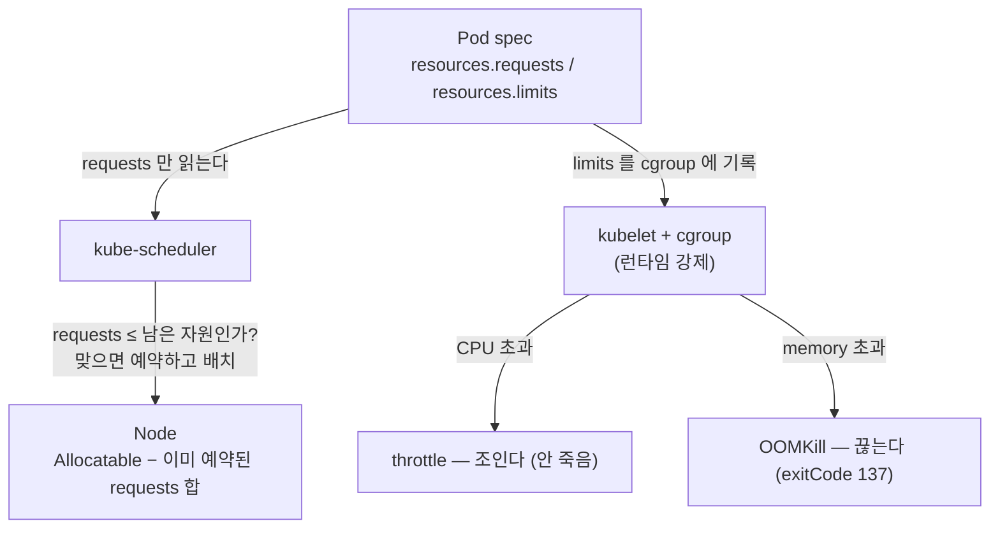
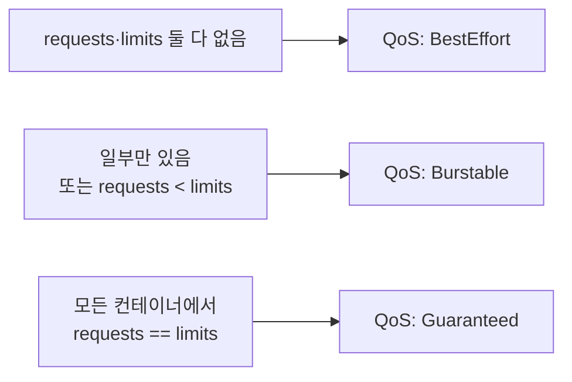

# 18. requests / limits — 자원 예약

Pod spec에 적는 `resources.requests`와 `resources.limits`는 같은 자리에 나란히 있지만 읽는 주체가 다릅니다. **requests는 스케줄러가 배치할 때 보는 예약량**이고, **limits는 kubelet과 커널 cgroup이 런타임에 강제하는 천장**입니다. 스케줄러는 limits를 보지 않고, 커널은 requests를 보지 않습니다. 이 비대칭을 노드의 할당 표, Pending 이벤트, cgroup 파일, OOMKilled 상태로 한 줄씩 확인하는 실습 공간입니다.

## 핵심 다이어그램





- **requests는 예약(약속)입니다.** 스케줄러는 노드의 Allocatable에서 이미 예약된 requests 합을 빼고, 남은 자리에 새 Pod의 requests가 들어가는지만 봅니다. 실제 사용량이 아니라 예약량입니다.
- **limits는 천장입니다.** kubelet이 컨테이너의 cgroup에 limits를 기록하고, 그 다음부터는 리눅스 커널이 강제합니다. 쿠버네티스가 매번 개입하지 않습니다.
- **CPU와 memory는 초과 시 동작이 다릅니다.** CPU는 압축 가능한 자원이라 limit을 넘으면 *조여집니다(throttle)* — 프로세스는 살아서 느려집니다. memory는 압축 불가능이라 limit을 넘으면 커널이 프로세스를 *죽입니다(OOMKill)*.
- **QoS 클래스는 requests/limits 조합에서 자동으로 도출됩니다.** 노드 자원이 부족해 Pod을 쫓아낼 때(eviction) BestEffort가 먼저, Guaranteed가 마지막입니다.

아래 시연이 이 그림의 각 지점을 한 줄씩 손으로 확인합니다.

## 사전 준비물

이 실습은 **macOS** 환경을 기준으로 합니다.

- **Docker** — Docker Desktop, OrbStack 등. `docker ps`가 에러 없이 돌아가면 OK.
- **Homebrew** — macOS 패키지 관리자.

### kind · kubectl 설치

```bash
brew install kind kubectl
```

### rosa-lab 클러스터 준비

```bash
kind create cluster --name rosa-lab
```

이미 클러스터가 있으면 건너뜁니다.

```bash
kind get clusters   # rosa-lab이 보이면 OK
```

### rosa-lab namespace 준비

```bash
kubectl create namespace rosa-lab
kubectl config set-context --current --namespace=rosa-lab
```

이미 namespace가 있고 기본값으로 설정되어 있으면 건너뜁니다.

```bash
kubectl config get-contexts   # NAMESPACE 열에 rosa-lab이 보이면 OK
```

## 실습 환경

| 파일 | 내용 |
|---|---|
| `manifests/pod-besteffort.yaml` | requests·limits 없는 Pod → QoS BestEffort |
| `manifests/pod-burstable.yaml` | requests < limits Pod → QoS Burstable |
| `manifests/pod-guaranteed.yaml` | requests == limits Pod → QoS Guaranteed |
| `manifests/pod-unschedulable.yaml` | memory requests를 노드보다 크게 잡아 Pending에 멈추는 Pod |
| `manifests/pod-oom.yaml` | memory limit 64Mi를 넘기는 Pod → OOMKilled |
| `manifests/pod-cpu.yaml` | cpu limit 100m에서 무한 루프 → throttle |

> CPU 단위 `100m`은 0.1 코어(millicore), memory 단위 `64Mi`는 64 mebibyte입니다. requests를 안 적으면 limits 값이 requests로 복사되고, 둘 다 안 적으면 그 자원에는 예약도 천장도 없습니다.

## 여기서 직접 확인할 수 있는 것

### QoS 클래스는 requests/limits 조합에서 도출된다

세 Pod을 한 번에 띄우고, 각자 어떤 QoS를 받았는지 봅니다.

```bash
kubectl apply -f manifests/pod-besteffort.yaml -f manifests/pod-burstable.yaml -f manifests/pod-guaranteed.yaml
sleep 8
kubectl get pods -n rosa-lab -o custom-columns='NAME:.metadata.name,STATUS:.status.phase,QOS:.status.qosClass'
```

```
NAME         STATUS    QOS
besteffort   Running   BestEffort
burstable    Running   Burstable
guaranteed   Running   Guaranteed
```

같은 busybox 이미지인데 QoS가 셋으로 갈렸습니다. spec에 적은 requests/limits만으로 결정됩니다.

- `besteffort` — requests·limits 둘 다 없음 → **BestEffort**. 자원이 부족하면 가장 먼저 쫓겨납니다.
- `burstable` — requests(`100m`/`64Mi`) < limits(`250m`/`128Mi`) → **Burstable**. 예약한 만큼은 보장받고, 여유가 있으면 limits까지 더 씁니다.
- `guaranteed` — 모든 컨테이너에서 requests == limits(`100m`/`128Mi`) → **Guaranteed**. 가장 마지막까지 보호됩니다.

### requests는 노드에 예약된다 — Allocated resources

스케줄러는 노드의 `Allocatable`에서 이미 예약된 requests를 뺀 자리에 새 Pod을 둡니다. 노드의 할당 표를 봅니다.

```bash
kubectl describe node rosa-lab-control-plane | grep -A5 "Allocated resources:"
```

```
Allocated resources:
  (Total limits may be over 100 percent, i.e., overcommitted.)
  Resource           Requests     Limits
  --------           --------     ------
  cpu                1150m (14%)  450m (5%)
  memory             482Mi (12%)  646Mi (16%)
```

- `Requests` 열이 스케줄러가 보는 숫자입니다. burstable(`100m`)과 guaranteed(`100m`)의 requests가 더해져 올라갔습니다. besteffort는 requests가 없어 이 합에 0을 기여합니다.
- `Limits` 열은 참고용입니다. 표 머리의 *"Total limits may be over 100 percent, i.e., overcommitted"* 가 핵심입니다 — limits 합은 노드 용량을 넘어도 됩니다. 스케줄러가 보는 건 requests뿐이기 때문입니다.

여기서 requests와 limits의 첫 번째 비대칭이 보입니다: **requests 합은 노드를 넘을 수 없지만, limits 합은 넘어도 된다(overcommit).**

### requests가 노드보다 크면 스케줄러가 못 둔다 — FailedScheduling

이 클러스터 노드의 memory는 수 GB입니다. memory requests를 `9000Gi`로 잡은 Pod을 던지면 어떤 노드도 그 예약을 받아줄 수 없습니다.

```bash
kubectl apply -f manifests/pod-unschedulable.yaml
sleep 5
kubectl get pod too-big -n rosa-lab
```

```
NAME      READY   STATUS    RESTARTS   AGE
too-big   0/1     Pending   0          5s
```

`Pending`에 멈췄습니다. 이유는 이벤트에 적혀 있습니다.

```bash
kubectl describe pod too-big -n rosa-lab | grep -A6 "Events:"
```

```
Events:
  Type     Reason            Age   From               Message
  ----     ------            ----  ----               -------
  Warning  FailedScheduling  5s    default-scheduler  0/1 nodes are available: 1 Insufficient memory. ...
```

- `FailedScheduling` — 스케줄러가 둘 곳을 못 찾았습니다.
- `Insufficient memory` — 정확히 memory requests를 만족하는 노드가 없다는 뜻입니다. 컨테이너는 아직 단 1바이트도 안 썼습니다. **예약 숫자(requests)만으로** 배치가 거부된 것입니다.

이게 18편의 핵심 한 줄입니다 — 스케줄러는 실제 사용량이 아니라 requests라는 약속을 보고 Pod를 둡니다.

```bash
kubectl delete pod too-big -n rosa-lab
```

### limits는 cgroup에 박힌다 — 런타임 천장

limits는 스케줄링과 무관합니다. kubelet이 컨테이너의 리눅스 cgroup에 직접 기록하고, 그 다음은 커널이 강제합니다. cgroup 파일을 컨테이너 안에서 직접 읽어 확인합니다.

```bash
kubectl exec guaranteed -n rosa-lab -- cat /sys/fs/cgroup/cpu.max
kubectl exec besteffort -n rosa-lab -- cat /sys/fs/cgroup/cpu.max
```

```
10000 100000
max 100000
```

`cpu.max`는 `<quota> <period>` 형식입니다. 100000µs(0.1초) 주기 안에 쓸 수 있는 CPU 시간입니다.

- guaranteed: `10000 100000` — 주기당 10000µs, 즉 0.1 코어(`100m` limit)가 그대로 박혔습니다.
- besteffort: `max 100000` — quota가 `max`, 즉 천장이 없습니다. limit을 안 적었기 때문입니다.

limits 한 줄이 커널 cgroup의 quota로 번역되어 있습니다. 쿠버네티스는 이 값을 한 번 써 두고 빠지고, 강제는 커널이 합니다.

### memory limit을 넘기면 커널이 끊는다 — OOMKilled

`pod-oom.yaml`은 memory limit이 `64Mi`인데, `tail /dev/zero`로 메모리를 무한정 할당합니다. limit을 넘는 순간 무슨 일이 일어나는지 봅니다.

```bash
kubectl apply -f manifests/pod-oom.yaml
sleep 10
kubectl get pod oom -n rosa-lab
```

```
NAME   READY   STATUS      RESTARTS   AGE
oom    0/1     OOMKilled   0          11s
```

컨테이너의 종료 상태를 자세히 봅니다.

```bash
kubectl get pod oom -n rosa-lab -o jsonpath='{.status.containerStatuses[0].state}' ; echo
```

```
{"terminated":{"exitCode":137,"reason":"OOMKilled","startedAt":"...","finishedAt":"..."}}
```

- `reason: OOMKilled` — 리눅스 OOM killer가 프로세스를 죽였습니다.
- `exitCode: 137` — 128 + 9, 즉 SIGKILL(9)로 종료됐다는 표준 신호입니다.

memory는 압축 불가능한 자원입니다. limit을 넘으면 느려지는 게 아니라 즉시 끊깁니다. 쿠버네티스가 판단한 게 아니라 커널이 cgroup 한계에서 직접 죽인 것이고, 쿠버네티스는 그 결과를 `OOMKilled`로 보고할 뿐입니다.

```bash
kubectl delete pod oom -n rosa-lab
```

### CPU limit을 넘기면 죽이지 않고 조인다 — throttle

memory와 달리 CPU는 압축 가능한 자원입니다. `pod-cpu.yaml`은 cpu limit `100m`에서 무한 루프(`while true`)를 돌립니다. 죽지 않고 *조여지는지* 봅니다.

```bash
kubectl apply -f manifests/pod-cpu.yaml
sleep 12
kubectl get pod cpu-burn -n rosa-lab
```

```
NAME       READY   STATUS    RESTARTS   AGE
cpu-burn   1/1     Running   0          12s
```

`Running`입니다 — 100% CPU를 먹으려 드는데도 안 죽었습니다. 대신 cgroup의 throttling 통계에 자국이 남습니다.

```bash
kubectl exec cpu-burn -n rosa-lab -- grep -E "nr_periods|nr_throttled|throttled_usec" /sys/fs/cgroup/cpu.stat
```

```
nr_periods 124
nr_throttled 121
throttled_usec 1021513
```

- `nr_periods` — cgroup이 CPU 회계를 한 주기 수.
- `nr_throttled` — 그중 limit에 걸려 멈춰 세워진 주기 수. 124번 중 121번 조였습니다.
- `throttled_usec` — 누적으로 멈춰 있던 시간(µs).

몇 초 뒤 다시 읽으면 숫자가 계속 올라갑니다 — throttling이 일회성이 아니라 매 주기 일어나고 있다는 증거입니다.

```bash
sleep 8
kubectl exec cpu-burn -n rosa-lab -- grep -E "nr_periods|nr_throttled" /sys/fs/cgroup/cpu.stat
```

```
nr_periods 302
nr_throttled 297
```

`nr_throttled`가 121 → 297로 늘었습니다. CPU limit은 프로세스를 죽이지 않고, 주기마다 quota를 다 쓰면 다음 주기까지 세워 둡니다. 그래서 limit을 너무 낮게 잡으면 앱은 살아있지만 느려집니다 — OOMKill보다 발견하기 어려운 실패 모양입니다.

### 정리

```bash
kubectl delete pod besteffort burstable guaranteed cpu-burn -n rosa-lab --ignore-not-found
kubectl get pods -n rosa-lab
```

클러스터 자체를 정리하려면:

```bash
kind delete cluster --name rosa-lab
```

## 이 편의 산출물

- 같은 자리에 적는 requests와 limits를 **읽는 주체가 다르다**(requests=스케줄러, limits=커널 cgroup)는 비대칭을 객체로 분리해 본 상태.
- `kubectl get pod -o ...qosClass`로 BestEffort · Burstable · Guaranteed가 requests/limits 조합에서 자동 도출됨을 확인한 경험.
- `kubectl describe node`의 Allocated resources에서 requests 합은 노드를 못 넘지만 limits 합은 overcommit된다는 점을 숫자로 본 상태.
- requests를 노드보다 크게 잡으면 컨테이너가 1바이트도 쓰기 전에 `FailedScheduling: Insufficient memory`로 Pending에 멈추는 흐름 — "스케줄러는 예약 숫자를 본다"를 직접 재현.
- limits가 `/sys/fs/cgroup/cpu.max`에 quota로 박히는 모습, memory 초과는 `OOMKilled`(exitCode 137)로 끊기고 CPU 초과는 `nr_throttled` 증가로 조여지는 차이를 cgroup 파일로 확인한 경험.
- "CPU limit은 죽이지 않고 느리게 만든다"는, OOMKill보다 찾기 어려운 실패 모양을 한 줄로 설명할 수 있는 상태.
