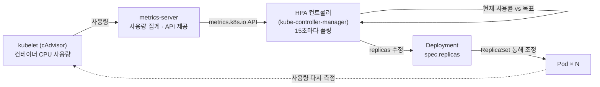
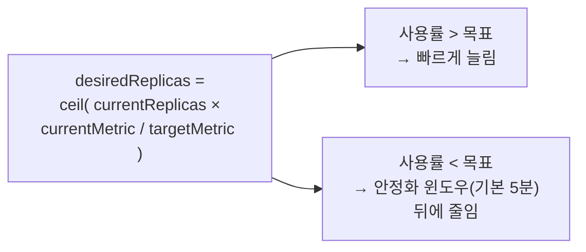

# 19. HPA — Pod 수 자동 조절

HorizontalPodAutoscaler는 Pod의 평균 자원 사용률을 목표치와 비교해 Deployment의 replica 수를 직접 바꾸는 컨트롤러입니다. "누가" 늘리는가는 kube-controller-manager 안의 HPA 컨트롤러이고, "어떤 신호로"는 metrics-server가 모아 주는 CPU 사용률입니다 — 그 사용률은 18편에서 본 `requests`에 대한 백분율입니다. 부하를 주고 replica가 1에서 9로 늘었다가 다시 1로 줄어드는 과정을, HPA가 계산하는 공식과 함께 한 줄씩 확인하는 실습 공간입니다.

## 핵심 다이어그램





- **신호는 requests 대비 사용률입니다.** HPA가 보는 `cpu: 33%/50%`의 `33%`는 절대 CPU가 아니라 컨테이너의 `requests.cpu`에 대한 백분율입니다. requests가 없으면 분모가 없어 HPA는 사용률을 계산하지 못합니다 — 18편의 `requests`가 여기서 다시 쓰입니다.
- **공식은 비례식입니다.** `desiredReplicas = ceil(currentReplicas × 현재사용률 / 목표사용률)`. 현재 1대가 250%인데 목표가 50%면, 1 × 250 / 50 = 5대가 목표가 됩니다.
- **컨트롤러는 15초마다 다시 잰다.** 한 번에 목표로 점프하지 않고, 폴링할 때마다 사용률을 다시 읽어 replica를 재계산합니다. 늘릴 때는 빠르게, 줄일 때는 신중합니다.
- **scale-up과 scale-down은 비대칭입니다.** 늘리는 건 즉시지만, 줄이는 건 기본 5분의 안정화 윈도우(stabilization window) 동안 "이전보다 적게 필요"가 유지돼야 실행됩니다 — 짧은 부하 변동에 replica가 출렁이는 것을 막기 위함입니다.

아래 시연이 이 그림의 각 지점을 한 줄씩 손으로 확인합니다.

## 사전 준비물

이 실습은 **macOS** 환경을 기준으로 합니다.

- **Docker** — Docker Desktop, OrbStack 등. `docker ps`가 에러 없이 돌아가면 OK.
- **Homebrew** — macOS 패키지 관리자.

### kind · kubectl 설치

```bash
brew install kind kubectl
```

### rosa-lab 클러스터 준비

```bash
kind create cluster --name rosa-lab
```

이미 클러스터가 있으면 건너뜁니다.

```bash
kind get clusters   # rosa-lab이 보이면 OK
```

### rosa-lab namespace 준비

```bash
kubectl create namespace rosa-lab
kubectl config set-context --current --namespace=rosa-lab
```

이미 namespace가 있고 기본값으로 설정되어 있으면 건너뜁니다.

```bash
kubectl config get-contexts   # NAMESPACE 열에 rosa-lab이 보이면 OK
```

### metrics-server 준비

HPA는 사용률을 metrics-server에서 읽습니다. kind 클러스터에는 기본 설치되어 있지 않으므로 직접 올립니다. (metrics-server 자체는 22편에서 자세히 다룹니다.)

```bash
kubectl apply -f https://github.com/kubernetes-sigs/metrics-server/releases/latest/download/components.yaml
```

kind의 kubelet 인증서는 self-signed라 metrics-server가 기본 설정으로는 사용량을 못 읽습니다. `--kubelet-insecure-tls` 옵션을 추가합니다. (실습용 kind 한정 설정입니다.)

```bash
kubectl patch deployment metrics-server -n kube-system --type=json \
  -p='[{"op":"add","path":"/spec/template/spec/containers/0/args/-","value":"--kubelet-insecure-tls"}]'
kubectl rollout status deployment metrics-server -n kube-system
```

`kubectl top nodes`가 숫자를 출력하면 준비된 것입니다.

```bash
kubectl top nodes
```

```
NAME                     CPU(cores)   CPU(%)   MEMORY(bytes)   MEMORY(%)
rosa-lab-control-plane   321m         4%       698Mi           17%
```

## 실습 환경

| 파일 | 내용 |
|---|---|
| `manifests/deploy.yaml` | CPU를 많이 쓰는 `php-apache` Deployment (`requests.cpu: 200m`) — HPA의 분모 |
| `manifests/service.yaml` | 부하를 보낼 진입점 ClusterIP Service |
| `manifests/hpa.yaml` | 목표 CPU 사용률 50%, replica 1~10 범위의 HPA |
| `manifests/load.yaml` | Service로 무한 요청을 보내 CPU를 끌어올리는 부하 생성 Pod |

> `deploy.yaml`에 `requests.cpu: 200m`이 있는 게 핵심입니다. HPA의 목표는 "requests의 50%"이므로, requests가 없으면 HPA는 `<unknown>`을 띄우고 동작하지 않습니다.

## 여기서 직접 확인할 수 있는 것

### 앱과 HPA를 올리고, 부하 없는 상태를 본다

```bash
kubectl apply -f manifests/deploy.yaml -f manifests/service.yaml -f manifests/hpa.yaml
kubectl rollout status deployment php-apache -n rosa-lab
```

HPA가 metrics-server에서 첫 측정을 읽기까지 15~30초쯤 걸립니다. 그 뒤 상태를 봅니다.

```bash
kubectl get hpa php-apache -n rosa-lab
```

```
NAME         REFERENCE               TARGETS       MINPODS   MAXPODS   REPLICAS   AGE
php-apache   Deployment/php-apache   cpu: 0%/50%   1         10        1          58s
```

- `TARGETS: cpu: 0%/50%` — 현재 사용률 0%, 목표 50%. 아무도 안 부르니 CPU를 안 씁니다.
- `REPLICAS: 1` — 목표 미만이므로 최소값 1대를 유지합니다.

`describe`로 HPA가 보는 분모를 확인합니다.

```bash
kubectl describe hpa php-apache -n rosa-lab | grep -A4 "Metrics:"
```

```
Metrics:                                               ( current / target )
  resource cpu on pods  (as a percentage of request):  0% (1m) / 50%
```

`as a percentage of request` — HPA는 절대 CPU(1m)를 requests(200m)로 나눠 백분율을 만듭니다. 이게 18편 `requests`가 HPA에서 다시 쓰이는 지점입니다.

### 부하를 주면 replica가 늘어난다 — scale-up

`load.yaml`은 Service에 쉬지 않고 요청을 보냅니다. 적용한 뒤 30초 간격으로 HPA를 봅니다.

```bash
kubectl apply -f manifests/load.yaml
for i in 1 2 3 4 5 6; do sleep 30; echo "--- t+$((i*30))s ---"; kubectl get hpa php-apache -n rosa-lab --no-headers; done
```

```
--- t+30s ---
php-apache   Deployment/php-apache   cpu: 0%/50%     1   10   1   97s
--- t+60s ---
php-apache   Deployment/php-apache   cpu: 250%/50%   1   10   4   2m7s
--- t+90s ---
php-apache   Deployment/php-apache   cpu: 61%/50%    1   10   9   2m37s
--- t+120s ---
php-apache   Deployment/php-apache   cpu: 34%/50%    1   10   9   3m8s
--- t+180s ---
php-apache   Deployment/php-apache   cpu: 33%/50%    1   10   9   4m8s
```

흐름을 읽습니다.

- t+60s: 사용률이 `250%`까지 치솟았습니다. 1대로는 목표 50%를 한참 넘습니다. 공식 `ceil(1 × 250 / 50) = 5`에 따라 늘리기 시작합니다.
- t+90s: replica가 9까지 갔습니다. Pod이 늘면 부하가 분산돼 대당 사용률이 `61%`로 내려옵니다.
- t+120s 이후: `33%`로 목표 아래에서 안정됩니다. 9대가 부하를 나눠 받는 상태입니다.

HPA가 내린 결정은 이벤트에 남습니다.

```bash
kubectl describe hpa php-apache -n rosa-lab | grep SuccessfulRescale
```

```
Normal  SuccessfulRescale  New size: 4; reason: cpu resource utilization (percentage of request) above target
Normal  SuccessfulRescale  New size: 5; reason: cpu resource utilization (percentage of request) above target
Normal  SuccessfulRescale  New size: 9; reason: cpu resource utilization (percentage of request) above target
```

한 번에 9로 점프하지 않고 4 → 5 → 9로 올라갑니다. 컨트롤러는 15초마다 사용률을 다시 읽어 replica를 재계산하고, 한 주기에 늘릴 수 있는 양에도 상한이 있어 단계적으로 오릅니다.

부하가 9대에 어떻게 분산됐는지 봅니다.

```bash
kubectl top pods -n rosa-lab -l app=php-apache
```

```
NAME                          CPU(cores)   MEMORY(bytes)
php-apache-7d4bd5f475-42pc5   50m          36Mi
php-apache-7d4bd5f475-dg5qq   125m         36Mi
php-apache-7d4bd5f475-lfl7r   101m         36Mi
... (9개)
```

대당 `requests.cpu`가 200m이므로, 50~125m은 25~62% 수준입니다 — 평균이 목표 50% 근처에 머뭅니다.

### 부하를 멈추면 replica가 줄어든다 — scale-down (안정화 윈도우)

부하 Pod을 지우고, 1분 간격으로 봅니다.

```bash
kubectl delete pod load -n rosa-lab
for i in $(seq 1 8); do sleep 60; echo "--- t+${i}m ---"; kubectl get hpa php-apache -n rosa-lab --no-headers; done
```

```
--- t+1m ---  cpu: 0%/50%   1   10   9   6m9s
--- t+2m ---  cpu: 0%/50%   1   10   9   7m9s
--- t+3m ---  cpu: 0%/50%   1   10   7   8m9s
--- t+5m ---  cpu: 0%/50%   1   10   7   10m
--- t+6m ---  cpu: 0%/50%   1   10   1   11m
```

여기가 scale-up과 갈리는 지점입니다.

- 사용률은 부하를 멈춘 즉시 `0%`로 떨어집니다.
- 그런데도 replica는 t+1~2m 동안 `9`에 머뭅니다. HPA가 **안정화 윈도우(기본 5분)** 동안 "직전까지 본 가장 높은 desired"를 유지하기 때문입니다.
- t+3m에 9 → 7, t+6m에 1까지 내려옵니다.

scale-down 이벤트의 reason은 scale-up과 다릅니다.

```bash
kubectl describe hpa php-apache -n rosa-lab | grep "below target"
```

```
Normal  SuccessfulRescale  New size: 7; reason: All metrics below target
Normal  SuccessfulRescale  New size: 5; reason: All metrics below target
Normal  SuccessfulRescale  New size: 1; reason: All metrics below target
```

늘릴 때는 즉시, 줄일 때는 천천히 — 짧은 부하 변동에 replica가 출렁이며 Pod이 생겼다 사라졌다 하는 것을 막는 설계입니다.

### 정리

```bash
kubectl delete -f manifests/load.yaml --ignore-not-found
kubectl delete -f manifests/hpa.yaml -f manifests/service.yaml -f manifests/deploy.yaml
```

metrics-server까지 내리려면:

```bash
kubectl delete -f https://github.com/kubernetes-sigs/metrics-server/releases/latest/download/components.yaml
```

클러스터 자체를 정리하려면:

```bash
kind delete cluster --name rosa-lab
```

## 이 편의 산출물

- HPA가 보는 신호가 절대 CPU가 아니라 **requests 대비 백분율**이라는 점 — 18편 `requests`가 분모로 쓰이고, requests가 없으면 HPA가 동작하지 않는다는 연결을 확인한 상태.
- `desiredReplicas = ceil(currentReplicas × 현재사용률 / 목표사용률)` 공식을, 250%에서 1 → 9로 늘어난 실제 수치로 맞춰 본 경험.
- HPA 컨트롤러가 15초마다 재계산하며 한 주기 상한 때문에 4 → 5 → 9로 **단계적으로** 늘어나는 모습을 이벤트로 확인.
- scale-up은 즉시, scale-down은 **안정화 윈도우(기본 5분)** 뒤에 일어나는 비대칭을, 부하 제거 후 replica가 한동안 9에 머무는 것으로 직접 본 상태.
- `metrics-server`가 HPA의 하드 의존성이라는 점 — 이게 없으면 `TARGETS`가 `<unknown>`이 되고 HPA가 replica를 못 정한다는 것을 준비 과정에서 확인.
- `SuccessfulRescale` 이벤트의 reason(`above target` / `All metrics below target`)으로 HPA의 매 결정을 사후에 추적하는 방법.
