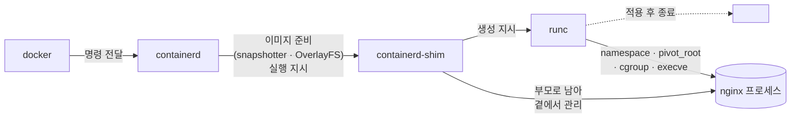

# 2. 이미지는 어떻게 프로세스가 되는가

디스크 위 이미지 한 묶음이 격리된 일반 프로세스로 바뀌기까지, 손으로 한 단계씩 만져보는 실습 공간입니다.

## 관련 글

* [이미지는 어떻게 프로세스가 되는가](https://rog.idwwt.com/@rosa/%EC%9D%B4%EB%AF%B8%EC%A7%80%EB%8A%94-%EC%96%B4%EB%96%BB%EA%B2%8C-%ED%94%84%EB%A1%9C%EC%84%B8%EC%8A%A4%EA%B0%80-%EB%90%98%EB%8A%94%EA%B0%80)

## 핵심 다이어그램




- **이미지**는 OCI Image Spec에 맞춘 **레이어(tar) + 메타데이터(config)** 묶음입니다.
- **containerd**가 레이어를 디렉토리로 풀고, **snapshotter**가 **OverlayFS**로 마운트해 `merged` 파일 트리를 준비합니다.
- **containerd-shim**은 컨테이너 프로세스의 부모로 남아 출력·종료 상태를 지켜봅니다.
- **runc**는 설계도(`config.json`)대로 `clone`·`unshare` 같은 시스템콜로 커널에 namespace·cgroup·pivot_root를 적용시키고, 마지막으로 `execve`로 진짜 프로그램을 실행한 뒤 종료합니다.
- 그렇게 만들어진 컨테이너는 결국 **격리된 일반 리눅스 프로세스 하나**입니다.

아래 시연들이 이 그림의 각 지점을 한 줄씩 손으로 확인합니다.

## 사전 준비

- **Docker** — Docker Desktop, OrbStack 등. namespace·cgroup·OverlayFS를 만지므로 privileged 컨테이너 실행이 가능해야 합니다.
- **make** — macOS는 Xcode Command Line Tools(`xcode-select --install`)에 포함. Linux는 `build-essential` 등으로 설치.

## 먼저 — 이미지의 메타데이터 한 번 보기 (호스트에서)

본격적인 시연 전에, 이미지 메타데이터에 "어떻게 실행할지"가 적혀 있는 모습을 호스트(Docker가 깔린 환경)에서 한 번 봅니다.

```bash
docker pull nginx
docker inspect nginx | jq '.[0].Config | {Cmd, Entrypoint, ExposedPorts, Env, WorkingDir}'
```

```
{
  "Cmd": ["nginx", "-g", "daemon off;"],
  "Entrypoint": ["/docker-entrypoint.sh"],
  "ExposedPorts": { "80/tcp": {} },
  "Env": [ "PATH=/usr/local/sbin:...", "NGINX_VERSION=..." ],
  "WorkingDir": ""
}
```

`Cmd`·`Entrypoint`가 진짜 실행될 프로그램, `ExposedPorts`·`Env`가 그 프로그램이 살 환경입니다. 글 6장의 `config.json` 안 `process` 항목은 결국 이 정보에서 만들어집니다.

레이어가 몇 겹인지도 한 줄로 확인할 수 있습니다.

```bash
docker inspect nginx | jq '.[0].RootFS.Layers | length'
# 7  (이미지 버전마다 다름)
```

## 빠른 시작

이제 컨테이너 안으로 들어가 나머지 시연(OverlayFS · runc · namespace)을 진행합니다.

```bash
make shell
```

privileged Ubuntu 컨테이너가 열립니다. 시연 2·3·4의 명령은 모두 이 안에서 실행합니다.

> `make` 없이 직접 실행: `docker run --privileged --cgroupns=host --rm -it ubuntu:24.04 bash`

### 왜 `--privileged` 와 `--cgroupns=host` 를 쓰는가

OverlayFS 마운트, 새 namespace 생성, cgroup 파일 쓰기, runc 실행이 모두 커널 권한을 요구합니다. 일반 컨테이너에서는 막혀 있는 동작들입니다.

- **`--privileged`** — `mount`·`unshare`·`runc`에 필요한 권한(예: `CAP_SYS_ADMIN`)을 컨테이너에 부여합니다.
- **`--cgroupns=host`** — 호스트의 cgroup 트리(`/sys/fs/cgroup/...`)를 그대로 보고 쓸 수 있게 합니다.

**중요** — 두 옵션은 호스트를 거의 그대로 컨테이너에 노출시키는 강한 설정입니다. 학습·실험용 로컬 컨테이너에서만 쓰고, 운영 환경에서는 절대 사용하지 마세요.

시연용 도구를 한 줄로 설치합니다.

```bash
apt-get update && apt-get install -y runc busybox-static jq tree
```

- `runc` — OCI Runtime. 시연 4에서 직접 호출
- `busybox-static` — 미니 rootfs용 정적 바이너리
- `jq` — `config.json` 다듬기
- `tree` — 디렉토리 구조 한눈에 보기 (선택)

## 여기서 직접 확인할 수 있는 것

### 1. OverlayFS는 여러 디렉토리를 한 장의 파일 트리로 합쳐 보여줍니다

lowerdir 두 개를 직접 만들어 마운트해 봅니다.

```bash
# 작업 공간을 tmpfs 위에 만든다
# (Docker Desktop처럼 컨테이너 rootfs 자체가 overlay인 환경에서는
#  nested overlay 마운트가 막히므로, tmpfs를 깔아 우회한다.)
mkdir -p /mnt/overlay-demo
mount -t tmpfs tmpfs /mnt/overlay-demo
cd /mnt/overlay-demo

# 레이어 두 개를 디렉토리로 만든다
mkdir -p lower1 lower2 upper work merged
echo "from lower1" > lower1/a.txt
echo "from lower1" > lower1/shared.txt
echo "from lower2" > lower2/b.txt
echo "from lower2 (overrides)" > lower2/shared.txt   # lower1과 같은 경로
```

이 상태에서 lower1을 아래, lower2를 위로 포개 마운트합니다.

```bash
mount -t overlay overlay \
  -o lowerdir=lower2:lower1,upperdir=upper,workdir=work \
  merged
```

`lowerdir`는 **위에서 아래 순**으로 적습니다(`lower2:lower1` → 위가 lower2). merged 안을 들여다보면 두 레이어가 한 장으로 합쳐져 있습니다.

```bash
ls merged
# a.txt  b.txt  shared.txt

cat merged/shared.txt
# from lower2 (overrides)   ← 위 레이어가 우선
```

같은 경로 파일이 두 레이어에 함께 있을 때 **위에 있는 레이어가 이긴다**는 글 2장의 규칙이 그대로 드러납니다.

쓰기 가능한 빈 레이어(`upperdir`)에 변경이 어떻게 쌓이는지도 한 줄로 봅니다.

```bash
echo "from container" >> merged/a.txt
ls upper
# a.txt   ← lower1의 a.txt가 upper로 복사되어 거기서 수정됨

cat lower1/a.txt
# from lower1   ← 원본은 그대로
```

정리.

```bash
umount merged
cd / && umount /mnt/overlay-demo && rmdir /mnt/overlay-demo
```

### 2. runc로 컨테이너 한 개를 처음부터 만들어 봅니다

`runc`는 명세(`config.json`)대로 컨테이너를 만드는 OCI Runtime입니다. docker나 containerd 없이도 직접 호출할 수 있습니다.

먼저 미니 rootfs를 만듭니다. busybox 한 개로 셸·`ls`·`ps` 같은 명령을 다 떼울 수 있습니다.

```bash
# 작업 공간
mkdir -p /tmp/runc-demo/mycontainer/rootfs/bin && cd /tmp/runc-demo/mycontainer

# busybox 바이너리 복사
cp /bin/busybox rootfs/bin/

# 자주 쓸 명령을 busybox 심볼릭 링크로 만든다
for cmd in sh ls ps cat echo mount mkdir hostname id; do
  ln -s busybox rootfs/bin/$cmd
done
```

이제 `runc spec`으로 기본 `config.json`을 생성합니다.

```bash
runc spec
ls
# config.json  rootfs
```

`config.json`을 열어 보면 글 6장의 그림이 그대로 있습니다.

```bash
jq '{process: .process.args, root: .root.path, namespaces: [.linux.namespaces[].type]}' config.json
# {
#   "process": ["sh"],
#   "root": "rootfs",
#   "namespaces": ["pid", "network", "ipc", "uts", "mount", "cgroup"]
# }
```

`process` (실행할 프로그램), `root` (`/`로 쓸 파일 트리), `namespaces` (격리 종류)가 모두 한 파일에 적혀 있습니다. 이대로 컨테이너를 만들어 봅니다.

```bash
runc run mycontainer
```

새 셸이 뜹니다. 이게 격리된 새 컨테이너 안입니다.

```bash
# 컨테이너 안에서
hostname
# runc                 ← config.json의 hostname

ls /
# bin  dev  proc  sys   ← busybox로 만든 미니 rootfs/ 안의 모습

ps
#   PID USER   TIME  COMMAND
#     1 root   0:00  sh                   ← 자기 자신이 PID 1
#     N root   0:00  ps

exit
```

호스트와 같은 커널을 공유하지만, namespace·pivot_root·cgroup이 적용되어 자기만의 작은 세상으로 보입니다. 이게 글 본문의 결론 — **컨테이너는 격리된 일반 프로세스 하나** — 가 손에 잡히는 순간입니다.

정리.

```bash
runc delete mycontainer 2>/dev/null || true
cd ~ && rm -rf /tmp/runc-demo
```

---

호스트에서 한 번 + 컨테이너 안에서 둘, 이 시연들로 글의 1장(이미지·메타데이터) · 2장(OverlayFS) · 6장(runc · config.json · namespace · pivot_root)이 모두 손에 닿습니다.
