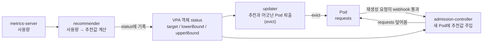
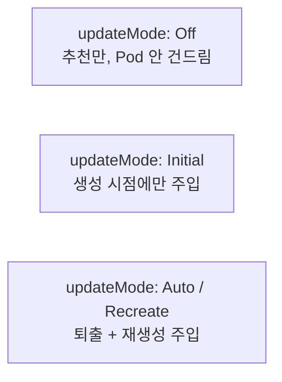

# 20. VPA — Pod 크기 자동 조절

19편 HPA가 Pod **수**를 바꿨다면, VerticalPodAutoscaler는 Pod 한 대의 **크기**(`requests`)를 바꿉니다. "누가"는 세 컴포넌트가 나눠 맡습니다 — recommender가 사용량을 보고 추천값을 계산하고, updater가 추천과 어긋난 Pod을 퇴출(evict)하고, admission-controller가 다시 뜨는 Pod에 추천값을 주입합니다. "어떻게"는 추천 → 퇴출 → 주입의 연쇄입니다. `requests` 100m로 뜬 Pod이 VPA에 의해 1168m로 바뀌는 과정을, 세 컴포넌트의 로그와 이벤트로 한 줄씩 확인하는 실습 공간입니다.

## 핵심 다이어그램





- **recommender가 추천을 만든다.** metrics-server의 사용량을 백분위로 집계해 `target`(권장), `lowerBound`·`upperBound`(신뢰 구간)를 VPA 객체의 status에 씁니다. 데이터가 적을수록 구간이 넓습니다.
- **updater가 어긋난 Pod을 퇴출한다.** 현재 `requests`가 추천과 차이 나면 Pod을 evict합니다. Pod을 직접 수정하지 못하므로(불변 필드) "지우고 다시 만들게" 합니다.
- **admission-controller가 재생성 시점에 주입한다.** Deployment가 Pod을 다시 만들 때 그 생성 요청이 mutating webhook을 거치고, 거기서 `requests`가 추천값으로 덮어쓰입니다.
- **updateMode가 어디까지 적용할지 정한다.** `Off`는 추천만(Pod 불변), `Initial`은 생성 시점에만, `Auto`/`Recreate`는 살아있는 Pod까지 퇴출해 바꿉니다.

아래 시연이 이 그림의 각 지점을 한 줄씩 손으로 확인합니다.

## 사전 준비물

이 실습은 **macOS** 환경을 기준으로 합니다.

- **Docker** — Docker Desktop, OrbStack 등. `docker ps`가 에러 없이 돌아가면 OK.
- **Homebrew** — macOS 패키지 관리자.

### kind · kubectl 설치

```bash
brew install kind kubectl
```

### rosa-lab 클러스터 · namespace 준비

```bash
kind create cluster --name rosa-lab
kubectl create namespace rosa-lab
kubectl config set-context --current --namespace=rosa-lab
```

이미 있으면 건너뜁니다 (`kind get clusters`, `kubectl config get-contexts`로 확인).

### metrics-server 준비

VPA recommender는 사용량을 metrics-server에서 읽습니다.

```bash
kubectl apply -f https://github.com/kubernetes-sigs/metrics-server/releases/latest/download/components.yaml
kubectl patch deployment metrics-server -n kube-system --type=json \
  -p='[{"op":"add","path":"/spec/template/spec/containers/0/args/-","value":"--kubelet-insecure-tls"}]'
kubectl rollout status deployment metrics-server -n kube-system
```

`kubectl top nodes`가 숫자를 출력하면 준비된 것입니다.

### VPA 설치

VPA는 쿠버네티스 내장이 아니라 별도 add-on입니다. 공식 저장소에서 CRD·RBAC·세 컴포넌트를 올립니다.

```bash
git clone --depth 1 https://github.com/kubernetes/autoscaler.git
cd autoscaler/vertical-pod-autoscaler/deploy
kubectl apply -f vpa-v1-crd-gen.yaml
kubectl apply -f vpa-rbac.yaml
kubectl apply -f recommender-deployment.yaml -f updater-deployment.yaml
```

admission-controller는 mutating webhook이라 TLS 인증서가 필요합니다. **macOS의 기본 openssl(LibreSSL)은 저장소의 `gencerts.sh`가 만드는 CA에 `CA:TRUE`를 넣지 못해**, webhook이 조용히 실패하고 주입이 안 됩니다(`failurePolicy: Ignore`). `CA:TRUE`와 SAN을 명시한 인증서를 직접 만듭니다.

```bash
mkdir -p /tmp/vpa-certs && cd /tmp/vpa-certs
cat > ca.conf <<'EOF'
[req]
distinguished_name = dn
x509_extensions = v3_ca
prompt = no
[dn]
CN = vpa_webhook_ca
[v3_ca]
basicConstraints = critical, CA:TRUE
keyUsage = critical, keyCertSign, cRLSign
EOF
cat > server.conf <<'EOF'
[req]
distinguished_name = dn
req_extensions = v3_req
prompt = no
[dn]
CN = vpa-webhook.kube-system.svc
[v3_req]
basicConstraints = CA:FALSE
keyUsage = nonRepudiation, digitalSignature, keyEncipherment
extendedKeyUsage = clientAuth, serverAuth
subjectAltName = DNS:vpa-webhook.kube-system.svc
EOF
openssl genrsa -out caKey.pem 2048
openssl req -x509 -new -nodes -key caKey.pem -days 100000 -out caCert.pem -config ca.conf -extensions v3_ca
openssl genrsa -out serverKey.pem 2048
openssl req -new -key serverKey.pem -out server.csr -config server.conf
openssl x509 -req -in server.csr -CA caCert.pem -CAkey caKey.pem -CAcreateserial \
  -out serverCert.pem -days 100000 -extensions v3_req -extfile server.conf

kubectl create secret generic vpa-tls-certs -n kube-system \
  --from-file=caKey.pem --from-file=caCert.pem --from-file=serverKey.pem --from-file=serverCert.pem
```

이제 admission-controller를 올립니다 (저장소 `deploy/`에서).

```bash
cd -   # autoscaler/vertical-pod-autoscaler/deploy 로 복귀
kubectl apply -f admission-controller-service.yaml -f admission-controller-deployment.yaml
```

세 컴포넌트가 다 떴는지 확인합니다.

```bash
kubectl get pods -n kube-system | grep vpa
```

```
vpa-admission-controller-...   1/1   Running
vpa-recommender-...            1/1   Running
vpa-updater-...                1/1   Running
```

admission-controller 로그에 `tls: bad certificate`가 보이면 위 인증서 단계가 잘못된 것입니다 — `Self registration as MutatingWebhook succeeded`만 보이고 TLS 에러가 없어야 합니다.

## 실습 환경

| 파일 | 내용 |
|---|---|
| `manifests/deploy.yaml` | `requests.cpu: 100m` / `memory: 50Mi`로 일부러 낮게 잡고 CPU를 계속 쓰는 `hamster` Deployment (2 replica) |
| `manifests/vpa-off.yaml` | `updateMode: "Off"` — 추천만 계산하고 Pod은 안 건드림 |
| `manifests/vpa-auto.yaml` | `updateMode: "Auto"` — 추천에 맞춰 Pod을 퇴출·재생성 |

> `deploy.yaml`은 `while true; do :; done`으로 CPU를 한 코어 가까이 씁니다. requests는 100m뿐이라, recommender가 "이 컨테이너는 100m로는 부족하다"고 판단하는 상황을 만듭니다.

## 여기서 직접 확인할 수 있는 것

### recommender — 추천값을 만든다 (Off 모드)

앱과 VPA(Off)를 올립니다.

```bash
kubectl apply -f manifests/deploy.yaml -f manifests/vpa-off.yaml
kubectl rollout status deployment hamster -n rosa-lab
```

30초쯤 뒤 recommender가 추천을 status에 씁니다.

```bash
kubectl describe vpa hamster -n rosa-lab | sed -n '/Recommendation:/,/Events:/p'
```

```
  Recommendation:
    Container Recommendations:
      Container Name:  hamster
      Lower Bound:
        Cpu:     25m
        Memory:  250Mi
      Target:
        Cpu:     1168m
        Memory:  250Mi
      Uncapped Target:
        Cpu:     1168m
        Memory:  250Mi
      Upper Bound:
        Cpu:     8410768m
        Memory:  82811500000
```

읽는 법:

- `Target` — recommender가 권하는 값. CPU를 100m → `1168m`로 올리라고 합니다. 실제 사용량(한 코어 가까이)을 반영한 숫자입니다.
- `Lower Bound` / `Upper Bound` — 신뢰 구간입니다. 데이터가 아직 적어 `Upper Bound`가 비현실적으로 큽니다(`8410768m`). 사용 시간이 쌓이면 구간이 좁혀집니다.
- 메모리는 실제로는 몇 Mi만 쓰지만 `250Mi`로 추천됩니다 — recommender의 기본 최소 메모리 권장치입니다.

Off 모드이므로 추천은 status에만 있고 Pod은 그대로입니다.

```bash
kubectl get pods -n rosa-lab -l app=hamster \
  -o custom-columns='NAME:.metadata.name,CPU_REQ:.spec.containers[0].resources.requests.cpu,MEM_REQ:.spec.containers[0].resources.requests.memory'
```

```
NAME                      CPU_REQ   MEM_REQ
hamster-5cbcc8978-h4w97   100m      50Mi
hamster-5cbcc8978-hzq4z   100m      50Mi
```

`requests`는 여전히 100m/50Mi입니다. recommender는 권하기만 할 뿐, 바꾸는 건 다른 컴포넌트의 일입니다.

### updater — 어긋난 Pod을 퇴출한다 (Auto 모드)

VPA를 Auto로 바꿉니다.

```bash
kubectl apply -f manifests/vpa-auto.yaml
```

updater는 약 1분 주기로 Pod의 현재 `requests`와 추천을 비교합니다. 어긋나면 evict합니다.

```bash
kubectl logs -n kube-system -l app=vpa-updater --tail=40 | grep -E "accepted for update|Evicting pod"
```

```
update_priority_calculator.go:154] "Pod accepted for update" pod="rosa-lab/hamster-5cbcc8978-ftpfl" updatePriority=14.68 processedRecommendations="hamster: target: 262144k 1168m; ..."
updater.go:441] "Evicting pod" pod="rosa-lab/hamster-5cbcc8978-ftpfl"
```

evict는 Pod 이벤트로도 남습니다.

```bash
kubectl get events -n rosa-lab --field-selector reason=EvictedByVPA | tail -3
```

```
Normal   EvictedByVPA   pod/hamster-5cbcc8978-ftpfl   Pod was evicted by VPA Updater to apply resource recommendation.
Normal   EvictedByVPA   pod/hamster-5cbcc8978-h4w97   Pod was evicted by VPA Updater to apply resource recommendation.
```

updater는 Pod의 `requests`를 직접 못 고칩니다 — `requests`는 살아있는 Pod에서 불변에 가깝기 때문에, "퇴출하고 다시 만들게" 하는 방식으로 바꿉니다. (그래서 Auto 모드는 Pod 재시작을 동반합니다.)

### admission-controller — 재생성 시점에 주입한다

Deployment가 퇴출된 Pod을 다시 만들 때, 그 생성 요청이 admission webhook을 거칩니다. 새로 뜬 Pod의 `requests`를 봅니다.

```bash
kubectl get pods -n rosa-lab -l app=hamster \
  -o custom-columns='NAME:.metadata.name,CPU_REQ:.spec.containers[0].resources.requests.cpu,MEM_REQ:.spec.containers[0].resources.requests.memory,QOS:.status.qosClass'
```

```
NAME                      CPU_REQ   MEM_REQ   QOS
hamster-5cbcc8978-mqsv4   1168m     250Mi     Burstable
hamster-5cbcc8978-qqtww   1168m     250Mi     Burstable
```

`requests`가 100m → `1168m`, 50Mi → `250Mi`로 바뀌었습니다. Deployment 매니페스트는 손대지 않았는데도 그렇습니다. 누가 바꿨는지는 Pod의 annotation에 적혀 있습니다.

```bash
kubectl get pod -n rosa-lab -l app=hamster \
  -o jsonpath='{range .items[*]}{.metadata.name}{"  "}{.metadata.annotations.vpaUpdates}{"\n"}{end}'
```

```
hamster-5cbcc8978-mqsv4  Pod resources updated by hamster: container 0: cpu request, memory request
hamster-5cbcc8978-qqtww  Pod resources updated by hamster: container 0: cpu request, memory request
```

admission-controller가 생성 요청을 가로채 `requests`를 추천값으로 덮어쓴 자국입니다.

### 루프가 수렴한다

이제 Pod의 `requests`가 추천과 일치하므로, updater는 더 이상 퇴출하지 않습니다.

```bash
kubectl logs -n kube-system -l app=vpa-updater --tail=10 | grep "within recommended range"
```

```
update_priority_calculator.go:140] "Not updating a short-lived pod, request within recommended range" pod="rosa-lab/hamster-5cbcc8978-mqsv4"
```

요약 한 줄로도 상태를 봅니다.

```bash
kubectl get vpa hamster -n rosa-lab
```

```
NAME      MODE   CPU     MEM     PROVIDED   AGE
hamster   Auto   1168m   250Mi   True       9m59s
```

`PROVIDED: True` — 추천이 제공됐고, Pod이 그 값으로 수렴한 상태입니다.

> updater 로그에 `UpdateMode 'Auto' ... is deprecated. Please use ... 'Recreate', 'Initial', or 'InPlaceOrRecreate'` 경고가 보입니다. 최신 VPA에서 `Auto`는 `Recreate`의 별칭이고, 퇴출 없이 자원을 바꾸는 `InPlaceOrRecreate`(in-place resize) 모드가 추가됐습니다. 동작 모델은 같습니다 — 추천을 어디까지, 어떤 방식으로 적용할지의 차이입니다.

### HPA와 같이 쓰지 않는다

VPA와 HPA를 **같은 자원(CPU)** 에 동시에 걸면 충돌합니다 — VPA가 requests를 올리면 HPA가 보는 사용률(%)이 떨어지고, 서로의 결정이 엇갈립니다. 보통 VPA는 CPU·memory `requests` 크기에, HPA는 CPU 외 커스텀 지표나 다른 자원에 쓰거나, 둘 중 하나만 씁니다.

### 정리

```bash
kubectl delete -f manifests/vpa-auto.yaml -f manifests/deploy.yaml --ignore-not-found
```

VPA 컴포넌트와 클러스터까지 정리하려면:

```bash
kubectl delete -f autoscaler/vertical-pod-autoscaler/deploy/   # VPA 컴포넌트
kind delete cluster --name rosa-lab
```

## 이 편의 산출물

- Pod 크기 조절이 **세 컴포넌트의 분업**(recommender 추천 · updater 퇴출 · admission-controller 주입)이라는 모델을, 각자의 로그·이벤트·annotation으로 분리해 본 상태.
- `kubectl describe vpa`의 `Target` / `Lower Bound` / `Upper Bound`를 읽고, 데이터가 적을 때 `Upper Bound`가 넓다가 좁혀진다는 신뢰 구간 개념을 확인한 경험.
- `updateMode: Off`는 추천만 하고 Pod을 안 바꾼다는 것 — 추천(recommender)과 적용(updater·admission)이 분리돼 있음을 직접 본 상태.
- Auto 모드에서 `requests`가 100m → 1168m로 바뀌는 과정을, `EvictedByVPA` 이벤트와 `vpaUpdates` annotation으로 "누가 바꿨는가"까지 추적한 경험.
- VPA가 Pod을 직접 수정하지 못해 **퇴출+재생성**으로 바꾼다는 점, 그리고 requests가 추천과 일치하면 루프가 멈추는(수렴) 모습을 본 상태.
- macOS(LibreSSL)에서 admission webhook 인증서의 `CA:TRUE` 누락으로 주입이 조용히 실패하는 함정과, `failurePolicy: Ignore` 때문에 에러 없이 안 되는 현상을 진단하는 법.
- VPA와 HPA를 같은 자원에 동시에 걸면 안 되는 이유를 한 줄로 설명할 수 있는 상태.
