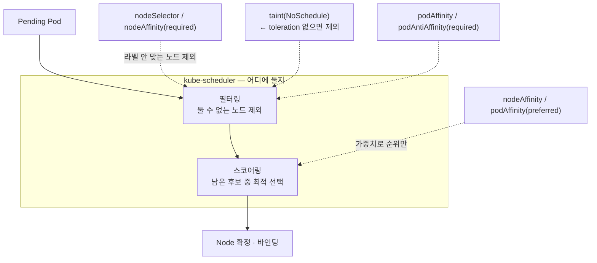
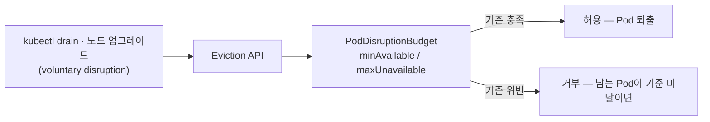

# 21. 스케줄링 — affinity · taints·tolerations · PDB

Pod을 만들면 kube-scheduler가 어느 노드에 둘지 정합니다. 이 결정은 둘 수 없는 노드를 걸러내는 **필터링**과, 남은 노드에 점수를 매기는 **스코어링** 두 단계를 거칩니다. 이 편에서 다루는 네 도구가 바로 이 결정에 끼어듭니다. `nodeAffinity`는 어떤 노드에 둘지 고르고, `podAntiAffinity`는 같은 Pod끼리 한 노드에 모이지 않게 떼어 놓고, `taints`/`tolerations`는 노드가 Pod을 밀어내되 견디는 Pod만 받게 합니다. `PodDisruptionBudget`은 결이 다릅니다 — 배치가 아니라, 노드를 비울 때(drain) Pod을 한꺼번에 내쫓지 못하게 막아 최소 몇 대는 남겨 둡니다. 앞 셋은 스케줄러가 Pod을 둘 때 작동하고, PDB는 Eviction API가 Pod을 뺄 때 작동합니다. 4노드 kind 클러스터에 라벨과 테인트를 직접 붙였다 떼면서, Pending 이벤트와 drain 거부 메시지로 네 도구가 각각 어디서 작동하는지 한 줄씩 손으로 확인하는 실습 공간입니다.

## 핵심 다이어그램





- **`required`는 필터, `preferred`는 점수다.** `requiredDuringScheduling...`는 조건을 못 채우면 그 노드를 후보에서 아예 뺍니다(못 맞추면 Pending). `preferredDuringScheduling...`는 가중치를 더해 순위만 바꾸고, 못 맞춰도 배치는 됩니다.
- **테인트는 노드가 거는 거부, toleration은 Pod이 그걸 견디는 표식이다.** 노드에 `NoSchedule` 테인트가 있으면 스케줄러는 그 테인트를 견디는(tolerate) Pod만 그 노드에 둡니다. kind의 control-plane 노드에도 기본 테인트가 있어 일반 워크로드가 안 올라갑니다.
- **affinity·테인트는 "둘 때" 작동하고, PDB는 "뺄 때" 작동한다.** PDB는 스케줄러가 아니라 Eviction API가 봅니다. `kubectl drain`이 노드를 비울 때 Pod을 퇴출하려 하면, PDB 기준(`minAvailable`)을 깨는 퇴출은 거부됩니다.
- **PDB는 자발적 퇴출만 막는다.** drain·노드 업그레이드 같은 voluntary disruption에는 작동하지만, 노드가 죽는 사고(involuntary)는 막지 못합니다. 그리고 `kubectl delete pod`는 Eviction API를 안 거치므로 PDB를 우회합니다.

아래 시연이 이 그림의 각 지점을 한 줄씩 손으로 확인합니다.

## 사전 준비물

이 실습은 **macOS** 환경을 기준으로 합니다.

- **Docker** — Docker Desktop, OrbStack 등. `docker ps`가 에러 없이 돌아가면 OK.
- **Homebrew** — macOS 패키지 관리자.

### kind · kubectl 설치

```bash
brew install kind kubectl
```

### 멀티 노드 rosa-lab 클러스터 준비

스케줄링은 "여러 노드 중 어디"를 정하는 문제라, 워커가 둘 이상 있어야 합니다. 단일 노드 클러스터로는 affinity·anti-affinity·drain을 확인할 수 없습니다. 이 편의 `manifests/kind-cluster.yaml`은 control-plane 1대 + worker 3대를 만듭니다.

기존에 단일 노드 `rosa-lab`이 있으면 지우고 멀티 노드로 다시 만듭니다.

```bash
kind delete cluster --name rosa-lab   # 없으면 건너뜀
kind create cluster --config manifests/kind-cluster.yaml
kubectl create namespace rosa-lab
kubectl config set-context --current --namespace=rosa-lab
```

노드 4대가 다 `Ready`인지 확인합니다.

```bash
kubectl get nodes
```

```
NAME                     STATUS   ROLES           AGE   VERSION
rosa-lab-control-plane   Ready    control-plane   24s   v1.36.1
rosa-lab-worker          Ready    <none>          13s   v1.36.1
rosa-lab-worker2         Ready    <none>          14s   v1.36.1
rosa-lab-worker3         Ready    <none>          13s   v1.36.1
```

control-plane에는 기본 테인트가 있어, 앞으로의 워크로드는 worker 3대에만 배치됩니다.

```bash
kubectl describe node rosa-lab-control-plane | grep -i taint
```

```
Taints:             node-role.kubernetes.io/control-plane:NoSchedule
```

## 실습 환경

| 파일 | 내용 |
|---|---|
| `manifests/kind-cluster.yaml` | control-plane 1 + worker 3 노드의 kind 클러스터 정의 |
| `manifests/node-affinity.yaml` | `disktype=ssd` 노드에만 두는 `nodeAffinity(required)` Deployment (3 replica) |
| `manifests/pod-anti-affinity.yaml` | 같은 라벨 Pod을 노드마다 한 대씩 흩는 `podAntiAffinity(required)` Deployment |
| `manifests/toleration.yaml` | 같은 테인트 노드를 노리는 두 Pod — toleration 유무만 다름 |
| `manifests/pdb.yaml` | `api` Deployment(3 replica) + `minAvailable: 2` PodDisruptionBudget |

> 워크로드는 모두 `registry.k8s.io/pause:3.9`입니다. 스케줄링은 컨테이너가 무엇을 하든 무관하므로, 자원을 거의 안 쓰는 최소 이미지로 "어디에 놓이는가"에만 집중합니다.

## 여기서 직접 확인할 수 있는 것

### nodeAffinity — 라벨로 노드를 고른다

먼저 라벨을 안 붙인 채 올립니다. 세 Pod 모두 갈 곳이 없습니다.

```bash
kubectl apply -f manifests/node-affinity.yaml
kubectl get pods -n rosa-lab -l app=web-ssd -o wide
```

```
NAME                       READY   STATUS    RESTARTS   AGE   IP       NODE     NOMINATED NODE
web-ssd-64f794d7fb-jmgsj   0/1     Pending   0          5s    <none>   <none>   <none>
web-ssd-64f794d7fb-tkjjw   0/1     Pending   0          5s    <none>   <none>   <none>
web-ssd-64f794d7fb-vh29h   0/1     Pending   0          5s    <none>   <none>   <none>
```

왜 Pending인지는 이벤트에 적혀 있습니다.

```bash
kubectl describe pod -n rosa-lab -l app=web-ssd | grep FailedScheduling | head -1
```

```
Warning  FailedScheduling  default-scheduler  0/4 nodes are available: 1 node(s) had untolerated taint(s), 3 node(s) didn't match Pod's node affinity/selector.
```

4노드 중 control-plane 1대는 테인트로, 나머지 worker 3대는 `disktype=ssd` 라벨이 없어 affinity로 걸러졌습니다. `required`라 못 맞추면 배치 자체가 안 됩니다. 이제 worker 한 대에 라벨을 붙입니다.

```bash
kubectl label node rosa-lab-worker disktype=ssd
kubectl get pods -n rosa-lab -l app=web-ssd -o wide
```

```
NAME                       READY   STATUS    RESTARTS   AGE   IP           NODE              NOMINATED NODE
web-ssd-64f794d7fb-jmgsj   1/1     Running   0          16s   10.244.3.4   rosa-lab-worker   <none>
web-ssd-64f794d7fb-tkjjw   1/1     Running   0          16s   10.244.3.3   rosa-lab-worker   <none>
web-ssd-64f794d7fb-vh29h   1/1     Running   0          16s   10.244.3.2   rosa-lab-worker   <none>
```

세 Pod 모두 라벨이 붙은 `rosa-lab-worker`로 몰렸습니다. `required` nodeAffinity는 노드를 "고르기"만 할 뿐, 고른 노드들 사이에 흩는 일은 하지 않습니다(그건 다음 절의 anti-affinity 몫). 정리합니다.

```bash
kubectl delete -f manifests/node-affinity.yaml
kubectl label node rosa-lab-worker disktype-
```

### podAntiAffinity — Pod끼리 떨어뜨린다

`topologyKey: kubernetes.io/hostname`로 "같은 `app=spread` Pod이 이미 있는 노드는 제외"하게 했습니다. 3 replica를 올리면 노드마다 한 대씩 흩어집니다.

```bash
kubectl apply -f manifests/pod-anti-affinity.yaml
kubectl get pods -n rosa-lab -l app=spread -o wide
```

```
NAME                      READY   STATUS    NODE
spread-7b9df59c49-85t2g   1/1     Running   rosa-lab-worker3
spread-7b9df59c49-8wr5s   1/1     Running   rosa-lab-worker
spread-7b9df59c49-dgdqj   1/1     Running   rosa-lab-worker2
```

worker 3대에 정확히 하나씩입니다. 여기서 4번째를 요청하면, 빈 노드가 없습니다.

```bash
kubectl scale deployment spread -n rosa-lab --replicas=4
kubectl get pods -n rosa-lab -l app=spread -o wide
```

```
NAME                      READY   STATUS    NODE
spread-7b9df59c49-85t2g   1/1     Running   rosa-lab-worker3
spread-7b9df59c49-8wr5s   1/1     Running   rosa-lab-worker
spread-7b9df59c49-dgdqj   1/1     Running   rosa-lab-worker2
spread-7b9df59c49-n5gdq   0/1     Pending   <none>
```

```bash
kubectl describe pod -n rosa-lab -l app=spread | grep FailedScheduling | tail -1
```

```
Warning  FailedScheduling  default-scheduler  0/4 nodes are available: 1 node(s) had untolerated taint(s), 3 node(s) didn't match pod anti-affinity rules.
```

worker 3대는 모두 이미 `spread` Pod이 있어 anti-affinity로 걸러지고, control-plane은 테인트로 걸러져 4번째는 Pending입니다. "한 노드에 하나만"을 `required`로 강제하면, 노드 수가 replica 수의 상한이 됩니다. 흩되 막히지는 않게 하려면 `preferred`를 씁니다(점수만 깎고 배치는 허용). 정리합니다.

```bash
kubectl delete -f manifests/pod-anti-affinity.yaml
```

### taints · tolerations — 노드가 밀어내고, 견디는 Pod만 받는다

worker2를 "batch 전용"으로 만듭니다 — 테인트로 일반 Pod을 밀어내고, 라벨로 batch Pod이 찾아오게 합니다.

```bash
kubectl taint node rosa-lab-worker2 dedicated=batch:NoSchedule
kubectl label node rosa-lab-worker2 dedicated=batch
```

`toleration.yaml`에는 두 Pod이 있습니다. 둘 다 `nodeSelector: dedicated=batch`로 worker2를 노리지만, toleration은 `batch-job`에만 있습니다.

```bash
kubectl apply -f manifests/toleration.yaml
kubectl get pods -n rosa-lab -l app=batch -o wide
```

```
NAME                  READY   STATUS    NODE
batch-job             1/1     Running   rosa-lab-worker2
batch-no-toleration   0/1     Pending   <none>
```

테인트를 견디는 `batch-job`만 worker2에 들어갔습니다. toleration이 없는 쪽은 거부됩니다.

```bash
kubectl describe pod batch-no-toleration -n rosa-lab | grep FailedScheduling | tail -1
```

```
Warning  FailedScheduling  default-scheduler  0/4 nodes are available: 2 node(s) didn't match Pod's node affinity/selector, 2 node(s) had untolerated taint(s).
```

테인트를 가진 노드는 둘(worker2 + control-plane)이고, `batch-no-toleration`은 어느 쪽 테인트도 못 견딥니다. nodeSelector 때문에 worker·worker3도 후보에서 빠져, 갈 곳이 없습니다.

여기서 한 가지 구분이 중요합니다 — **toleration은 "갈 수 있다"는 허가일 뿐, "거기 가라"는 지시가 아닙니다.** `batch-job`이 worker2로 간 건 `nodeSelector`가 그 노드를 지정했기 때문입니다. toleration만 있고 nodeSelector가 없으면, 그 Pod은 테인트 없는 다른 노드로도 갈 수 있습니다. "전용 노드"는 보통 테인트(남을 밀어냄) + 라벨/affinity(나를 끌어옴)를 함께 씁니다. 정리합니다.

```bash
kubectl delete -f manifests/toleration.yaml
kubectl taint node rosa-lab-worker2 dedicated-
kubectl label node rosa-lab-worker2 dedicated-
```

### PodDisruptionBudget — 드레인에서 최소 가용을 지킨다

`api` Deployment(3 replica)와 PDB(`minAvailable: 2`)를 올립니다.

```bash
kubectl apply -f manifests/pdb.yaml
kubectl get pdb api -n rosa-lab
```

```
NAME   MIN AVAILABLE   MAX UNAVAILABLE   ALLOWED DISRUPTIONS   AGE
api    2               N/A               1                     7s
```

`ALLOWED DISRUPTIONS: 1` — 지금 3대가 떠 있고 최소 2대를 지켜야 하므로, 한 번에 1대까지만 자발적으로 뺄 수 있다는 뜻입니다. 이 보호가 실제로 drain을 막는지 보기 위해, 기준을 잠시 `minAvailable: 3`으로 조입니다.

```bash
kubectl patch pdb api -n rosa-lab --type merge -p '{"spec":{"minAvailable":3}}'
kubectl get pdb api -n rosa-lab
```

```
NAME   MIN AVAILABLE   MAX UNAVAILABLE   ALLOWED DISRUPTIONS   AGE
api    3               N/A               0                     27s
```

`ALLOWED DISRUPTIONS: 0` — 3대를 다 지켜야 하니 한 대도 뺄 수 없습니다. 이 상태에서 `api` Pod이 있는 노드를 비워(drain) 봅니다.

```bash
TARGET=$(kubectl get pods -n rosa-lab -l app=api -o jsonpath='{.items[0].spec.nodeName}')
kubectl drain $TARGET --ignore-daemonsets --delete-emptydir-data --timeout=20s
```

```
error when evicting pods/"api-7c986bdc77-ctn2s" -n "rosa-lab" (will retry after 5s): Cannot evict pod as it would violate the pod's disruption budget.
...
error: unable to drain node "rosa-lab-worker" due to error: ... global timeout reached: 20s
```

drain은 노드를 cordon(새 배치 차단)한 뒤 Pod을 Eviction API로 빼려 하는데, PDB가 그 퇴출을 거부했습니다. drain은 5초마다 재시도하다 timeout에 멈춥니다. `kubectl delete pod`였다면 PDB를 우회해 바로 지워졌겠지만, drain은 Eviction API를 거치므로 보호가 작동합니다.

이제 기준을 원래대로 `minAvailable: 2`로 풀면(`ALLOWED DISRUPTIONS: 1`), 같은 drain이 통과합니다.

```bash
kubectl patch pdb api -n rosa-lab --type merge -p '{"spec":{"minAvailable":2}}'
kubectl drain $TARGET --ignore-daemonsets --delete-emptydir-data --timeout=40s
```

```
evicting pod rosa-lab/api-7c986bdc77-ctn2s
pod/api-7c986bdc77-ctn2s evicted
node/rosa-lab-worker drained
```

```bash
kubectl get pods -n rosa-lab -l app=api -o wide
```

```
NAME                  READY   STATUS    NODE
api-7c986bdc77-gn9lr  1/1     Running   rosa-lab-worker2
api-7c986bdc77-hdngd  1/1     Running   rosa-lab-worker2
api-7c986bdc77-pwfgk  1/1     Running   rosa-lab-worker3
```

퇴출된 Pod은 cordon 안 된 다른 노드에서 다시 떴고, 그 과정에서 가용 수는 한 번도 2 밑으로 떨어지지 않았습니다 — PDB가 "한 번에 1대씩"만 허용한 결과입니다. drain이 끝난 노드는 다시 배치를 받게 풀어 줍니다.

```bash
kubectl uncordon $TARGET
```

### 정리

```bash
kubectl delete -f manifests/pdb.yaml --ignore-not-found
```

클러스터까지 정리하려면:

```bash
kind delete cluster --name rosa-lab
```

## 이 편의 산출물

- 스케줄링이 **필터링(둘 수 없는 노드 제외) → 스코어링(남은 후보 순위)** 두 단계라는 모델을, `FailedScheduling` 이벤트의 `N nodes are available: ...` 문구로 직접 읽은 상태.
- `required`(필터, 못 맞추면 Pending)와 `preferred`(점수만, 배치는 허용)의 차이를 한 줄로 설명할 수 있는 상태.
- `nodeAffinity`로 라벨 붙은 노드에 Pod을 몰고, `podAntiAffinity`로 노드마다 한 대씩 흩는 것을 노드 배치로 확인하고, anti-affinity가 `required`면 노드 수가 replica 상한이 된다는 점을 본 경험.
- 테인트가 노드의 거부, toleration이 그 거부를 견디는 표식이며 — toleration은 "갈 수 있다"는 허가일 뿐 "거기 가라"는 지시가 아니라는 구분(전용 노드는 테인트+라벨을 함께 쓴다)을 확인한 상태.
- PDB가 스케줄러가 아니라 Eviction API에서 작동하고, `kubectl drain`의 퇴출을 `Cannot evict pod as it would violate the pod's disruption budget`로 막는 것을 `minAvailable`을 조였다 풀며 직접 재현한 경험.
- PDB는 자발적 퇴출(drain·업그레이드)만 막고 `kubectl delete pod`는 우회한다는 점, `ALLOWED DISRUPTIONS` 숫자가 무엇을 의미하는지 읽는 법.
