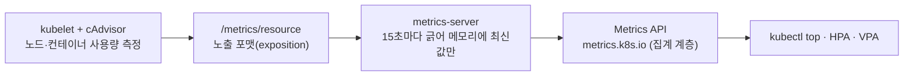
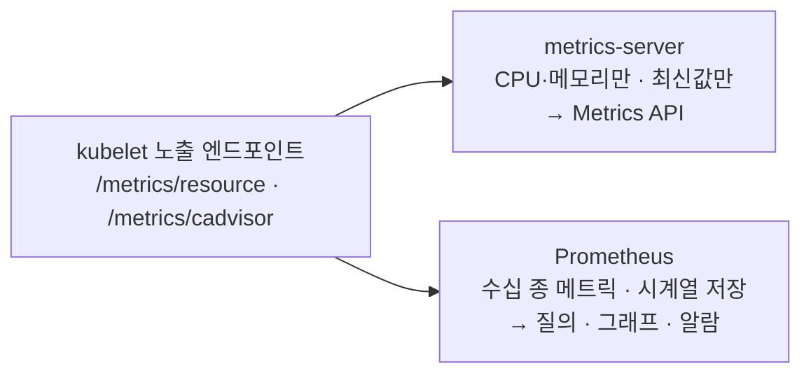

# 22. Metrics — metrics-server · Prometheus 발판

`kubectl top`은 노드와 Pod의 CPU·메모리를 숫자로 보여 줍니다. 이 편은 그 숫자가 어느 계층에서 와서 어떻게 `kubectl top`까지 닿는지를 한 겹씩 벗깁니다. 위에서부터 `kubectl top` → Metrics API(`metrics.k8s.io`, 집계 계층) → metrics-server → kubelet의 `/metrics/resource`까지 내려가 보면, 맨 아래 엔드포인트가 Prometheus가 긁는 것과 똑같은 **노출 포맷**(exposition format)이라는 걸 보게 됩니다. metrics-server는 그 포맷을 긁어 CPU·메모리만, 최신값만 메모리에 들고 있는 좁은 수집기입니다 — 같은 엔드포인트를 시계열로 저장하는 일반 수집기가 Prometheus입니다. 이 편의 산출물은 "kubectl top 숫자의 출처를 엔드포인트 단위로 추적한 경로"와 "metrics-server가 어디까지 하고 어디서부터 Prometheus가 필요한지에 대한 경계선"입니다.

## 핵심 다이어그램





- **숫자는 kubelet에서 시작한다.** 각 노드의 kubelet은 cAdvisor로 컨테이너·노드의 사용량을 재고, 그 값을 `/metrics/resource` 엔드포인트에 노출 포맷으로 내겁니다. 측정의 출발점은 컨트롤 플레인이 아니라 노드입니다.
- **metrics-server는 긁어서 잠깐 들고 있는다.** 15초(`--metric-resolution`)마다 모든 kubelet의 엔드포인트를 긁어, **최신 한 장만** 메모리에 둡니다. 디스크에 쌓지 않으므로 과거 값을 물어볼 수 없습니다.
- **Metrics API는 집계 계층으로 붙는다.** metrics-server는 `metrics.k8s.io`라는 API를 APIService로 등록합니다. kube-apiserver는 그 그룹의 요청을 metrics-server 서비스로 넘깁니다(aggregation layer). 그래서 `kubectl top`이 일반 리소스처럼 메트릭을 조회할 수 있습니다.
- **노출 포맷이 Prometheus와의 접점이다.** kubelet이 내는 포맷은 Prometheus가 긁는 포맷과 같습니다. metrics-server는 CPU·메모리만 보는 좁은 수집기이고, 같은 엔드포인트들을 폭넓게 긁어 시계열로 저장하는 게 Prometheus입니다.

아래 시연이 이 그림의 각 지점을 한 줄씩 손으로 확인합니다.

## 사전 준비물

이 실습은 **macOS** 환경을 기준으로 합니다.

- **Docker** — Docker Desktop, OrbStack 등. `docker ps`가 에러 없이 돌아가면 OK.
- **Homebrew** — macOS 패키지 관리자.
- **jq** — JSON 출력을 보기 위해 씁니다. `brew install jq`.

### kind · kubectl 설치

```bash
brew install kind kubectl jq
```

### rosa-lab 클러스터 · namespace 준비

```bash
kind create cluster --name rosa-lab
kubectl create namespace rosa-lab
kubectl config set-context --current --namespace=rosa-lab
```

이미 있으면 건너뜁니다 (`kind get clusters`, `kubectl config get-contexts`로 확인).

### metrics-server 설치

`kubectl top`과 Metrics API의 주체가 metrics-server입니다. kind 노드의 kubelet 인증서는 자체 서명이라 `--kubelet-insecure-tls`를 붙입니다.

```bash
kubectl apply -f https://github.com/kubernetes-sigs/metrics-server/releases/latest/download/components.yaml
kubectl patch deployment metrics-server -n kube-system --type=json \
  -p='[{"op":"add","path":"/spec/template/spec/containers/0/args/-","value":"--kubelet-insecure-tls"}]'
kubectl rollout status deployment metrics-server -n kube-system
```

## 실습 환경

| 파일 | 내용 |
|---|---|
| `manifests/workload.yaml` | CPU 1코어 회전 + 64Mi 메모리 점유를 유지하는 `stress` Deployment (2 replica) |

> metrics-server는 클러스터 전체를 보므로, 이 워크로드는 `kubectl top`·Metrics API에 0이 아닌 숫자를 띄우기 위한 표본일 뿐입니다.

## 여기서 직접 확인할 수 있는 것

### kubectl top — 표면의 숫자

워크로드를 올리고 metrics-server가 한 번 긁을 때까지(약 30초) 기다립니다.

```bash
kubectl apply -f manifests/workload.yaml
kubectl rollout status deployment load -n rosa-lab
sleep 30
kubectl top nodes
kubectl top pods -n rosa-lab
```

```
NAME                     CPU(cores)   CPU(%)   MEMORY(bytes)   MEMORY(%)
rosa-lab-control-plane   2160m        27%      913Mi           23%

NAME                    CPU(cores)   MEMORY(bytes)
load-6f895b7f8f-px6zk   999m         66Mi
load-6f895b7f8f-qqfhw   999m         65Mi
```

`stress` Pod 두 대가 각각 약 1코어를 쓰니 노드 CPU가 그만큼 올라갑니다. 이 숫자가 어디서 오는지 아래로 내려갑니다.

### Metrics API — kubectl top이 실제로 읽는 곳

`kubectl top`은 `metrics.k8s.io` API를 조회합니다. 이 API는 코어가 아니라 metrics-server가 **집계 계층(aggregation layer)** 으로 붙인 것입니다.

```bash
kubectl get apiservices v1beta1.metrics.k8s.io
```

```
NAME                     SERVICE                      AVAILABLE   AGE
v1beta1.metrics.k8s.io   kube-system/metrics-server   True        109s
```

`SERVICE` 칸이 핵심입니다 — `metrics.k8s.io/v1beta1`로 들어온 요청을 kube-apiserver가 `kube-system/metrics-server` 서비스로 넘깁니다. `AVAILABLE: True`는 그 뒤편 metrics-server가 응답한다는 뜻입니다. API를 직접 호출해 봅니다.

```bash
kubectl get --raw /apis/metrics.k8s.io/v1beta1/nodes | jq '.items[0]'
```

```json
{
  "metadata": { "name": "rosa-lab-control-plane" },
  "timestamp": "2026-06-25T09:25:24Z",
  "window": "20.036s",
  "usage": {
    "cpu": "2129682421n",
    "memory": "936740Ki"
  }
}
```

`kubectl top`이 보여 준 숫자의 원본입니다. `usage`가 사용량, `window`는 "이 값이 몇 초 구간을 평균한 것인지"입니다 — 순간값이 아니라 짧은 구간의 평균입니다. Pod도 같은 API에 있습니다.

```bash
kubectl get --raw "/apis/metrics.k8s.io/v1beta1/namespaces/rosa-lab/pods" | jq '.items[0]'
```

```json
{
  "metadata": { "name": "load-6f895b7f8f-px6zk", "namespace": "rosa-lab" },
  "timestamp": "2026-06-25T09:25:16Z",
  "window": "15.709s",
  "containers": [
    { "name": "stress", "usage": { "cpu": "998580304n", "memory": "67844Ki" } }
  ]
}
```

여기까지가 "kubectl top → Metrics API → metrics-server" 경로입니다. 그럼 metrics-server는 이 숫자를 어디서 가져올까요.

### kubelet /metrics/resource — metrics-server가 긁는 곳 (노출 포맷)

metrics-server는 각 노드 kubelet의 `/metrics/resource` 엔드포인트를 긁습니다. kube-apiserver의 노드 프록시로 그 엔드포인트를 직접 봅니다.

```bash
NODE=rosa-lab-control-plane
kubectl get --raw "/api/v1/nodes/$NODE/proxy/metrics/resource" \
  | grep -E '^(# (HELP|TYPE) node_(cpu_usage_seconds_total|memory_working_set_bytes)|node_(cpu|memory))'
```

```
# HELP node_cpu_usage_seconds_total [STABLE] Cumulative cpu time consumed by the node in core-seconds
# TYPE node_cpu_usage_seconds_total counter
node_cpu_usage_seconds_total 147.507315 1782379534553
# HELP node_memory_working_set_bytes [STABLE] Current working set of the node in bytes
# TYPE node_memory_working_set_bytes gauge
node_memory_working_set_bytes 9.60868352e+08 1782379534553
```

이 모양이 **노출 포맷**입니다 — `# HELP`(설명), `# TYPE`(메트릭 종류: counter/gauge), 그리고 `메트릭이름 값 타임스탬프`. 이건 Prometheus가 모든 `/metrics` 엔드포인트에서 긁는 바로 그 포맷입니다. 즉 metrics-server는 "Prometheus가 긁을 법한 엔드포인트를 긁는" 특수 수집기입니다. 같은 응답 안에 우리 워크로드의 컨테이너 값도 라벨 달린 줄로 들어 있습니다.

```bash
kubectl get --raw "/api/v1/nodes/$NODE/proxy/metrics/resource" | grep 'container="stress"'
```

```
container_cpu_usage_seconds_total{container="stress",namespace="rosa-lab",pod="load-6f895b7f8f-px6zk"} 61.001399 1782379545043
container_cpu_usage_seconds_total{container="stress",namespace="rosa-lab",pod="load-6f895b7f8f-qqfhw"} 53.188572 1782379538718
container_memory_working_set_bytes{container="stress",namespace="rosa-lab",pod="load-6f895b7f8f-px6zk"} 6.946816e+07 1782379545043
container_memory_working_set_bytes{container="stress",namespace="rosa-lab",pod="load-6f895b7f8f-qqfhw"} 6.8673536e+07 1782379538718
```

`{container=...,namespace=...,pod=...}`가 라벨입니다. Metrics API의 JSON은 metrics-server가 이 줄들을 모아 가공한 결과입니다.

### /metrics/cadvisor — 같은 노드, 훨씬 넓은 메트릭

kubelet은 `/metrics/resource` 말고 `/metrics/cadvisor`도 냅니다. CPU·메모리만이 아니라 네트워크·파일시스템·throttling까지 들어 있습니다. 메트릭 종류 수를 세어 비교합니다.

```bash
echo "resource : $(kubectl get --raw "/api/v1/nodes/$NODE/proxy/metrics/resource"  | grep -c '^# TYPE')"
echo "cadvisor : $(kubectl get --raw "/api/v1/nodes/$NODE/proxy/metrics/cadvisor" | grep -c '^# TYPE')"
```

```
resource : 12
cadvisor : 83
```

`/metrics/cadvisor`에만 있는 종류를 보면, metrics-server가 일부러 안 보는 영역이 드러납니다.

```bash
kubectl get --raw "/api/v1/nodes/$NODE/proxy/metrics/cadvisor" \
  | grep '^# TYPE' | grep -E 'container_network|container_fs' | head -6
```

```
# TYPE container_fs_inodes_free gauge
# TYPE container_fs_inodes_total gauge
# TYPE container_fs_io_current gauge
# TYPE container_fs_io_time_seconds_total counter
# TYPE container_fs_io_time_weighted_seconds_total counter
# TYPE container_fs_limit_bytes gauge
```

metrics-server는 이 넓은 데이터를 **일부러** 보지 않습니다. 목적이 HPA·VPA·`kubectl top`에 줄 CPU·메모리뿐이라, 좁은 `/metrics/resource`만 긁습니다. 네트워크·디스크 같은 나머지는 그걸 긁어 저장하는 도구의 몫입니다.

### metrics-server가 멈추는 지점 — 그래서 Prometheus

metrics-server의 한계는 인자에 그대로 드러납니다.

```bash
kubectl get deploy metrics-server -n kube-system \
  -o jsonpath='{.spec.template.spec.containers[0].args}' | tr ',' '\n'
```

```
["--cert-dir=/tmp"
"--secure-port=10250"
...
"--metric-resolution=15s"
"--kubelet-insecure-tls"]
```

`--metric-resolution=15s`는 15초마다 한 번 긁는다는 뜻이고, 저장에 관한 인자는 없습니다 — **최신 한 장만 메모리에 둡니다.** 그래서 "10분 전 CPU는?", "어제 같은 시각은?"을 물을 수 없습니다. Metrics API에도 그런 질의가 없습니다(현재값만). 정리하면 metrics-server가 하는 일은 좁습니다.

- **CPU·메모리만** 본다 (네트워크·디스크·앱 지표 없음).
- **현재값만** 본다 (과거를 디스크에 쌓지 않음).
- 목적은 HPA·VPA·`kubectl top`에 줄 한 장의 숫자다.

이 세 경계를 넘는 순간 — 시계열 저장, 폭넓은 메트릭, 앱이 직접 내는 커스텀 지표, 질의·그래프·알람 — 부터가 Prometheus의 영역입니다. Prometheus도 이 편에서 본 것과 똑같은 노출 포맷을 긁습니다. 달라지는 건 "무엇을, 얼마나 오래 들고 있느냐"입니다. 그 스택은 Observability 편에서 세웁니다.

### 정리

```bash
kubectl delete -f manifests/workload.yaml --ignore-not-found
```

metrics-server와 클러스터까지 정리하려면:

```bash
kubectl delete -f https://github.com/kubernetes-sigs/metrics-server/releases/latest/download/components.yaml
kind delete cluster --name rosa-lab
```

## 이 편의 산출물

- `kubectl top` 숫자의 출처를 **kubectl top → Metrics API → metrics-server → kubelet `/metrics/resource`** 순서로 엔드포인트 단위까지 추적한 경로.
- `metrics.k8s.io`가 코어 API가 아니라 metrics-server가 **집계 계층(APIService)** 으로 붙인 것이며, kube-apiserver가 그 요청을 metrics-server 서비스로 넘긴다는 것을 `kubectl get apiservices`로 확인한 상태.
- Metrics API JSON의 `usage`·`window`를 읽고, 메트릭이 순간값이 아니라 짧은 구간 평균이라는 점을 본 경험.
- kubelet이 내는 **노출 포맷**(`# HELP`·`# TYPE`·`이름 값 타임스탬프`)이 Prometheus가 긁는 포맷과 같다는 것을 직접 보고, metrics-server를 "좁은 목적의 Prometheus 같은 수집기"로 자리매긴 상태.
- `/metrics/resource`(12종)와 `/metrics/cadvisor`(83종)를 세어 비교하고, metrics-server가 넓은 데이터를 일부러 안 본다는 설계 의도를 확인한 경험.
- metrics-server의 세 경계(CPU·메모리만 · 현재값만 · HPA/VPA/top 목적)를 인자(`--metric-resolution`, 저장 인자 없음)로 확인하고, 어디서부터 Prometheus가 필요한지 경계선을 한 줄로 그을 수 있는 상태.
