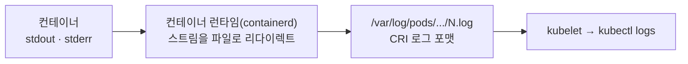
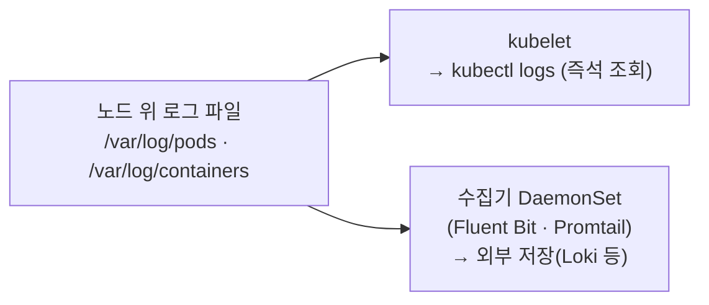

# 23. Logs — kubectl logs · stdout 수집

`kubectl logs`는 컨테이너가 낸 줄들을 보여 줍니다. 이 편은 그 줄이 어디에 실제로 쌓여 있고, `kubectl logs`가 그걸 어떻게 읽어 오는지를 한 겹씩 벗깁니다. 컨테이너 안 프로세스가 stdout·stderr에 쓰면, 컨테이너 런타임이 그 스트림을 노드의 파일(`/var/log/pods/.../N.log`)로 리다이렉트합니다 — `kubectl logs`는 그 파일을 kubelet을 통해 읽어 돌려주는 조회 명령일 뿐, 로그를 들고 있는 저장소가 아닙니다. 로그가 노드 위 파일이라는 사실에서 나머지가 따라옵니다: 파일은 Pod이 지워지면 함께 사라지고, 그래서 지난 로그를 남기려면 같은 파일을 읽어 밖으로 실어 내는 수집기가 노드마다 필요합니다. 이 편의 산출물은 "stdout 한 줄이 노드 파일이 되어 `kubectl logs`까지 닿는 경로"와 "그 파일을 읽는 두 주체(kubelet과 노드 수집기)의 경계선"입니다.

## 핵심 다이어그램





- **앱은 파일을 여는 게 아니라 stdout으로 내보낸다.** 컨테이너 안 프로세스가 stdout·stderr에 쓰면, 컨테이너 런타임이 그 스트림을 노드의 파일로 리다이렉트합니다. 앱은 로그 파일 경로도, 회전도 정하지 않습니다 — 표준 출력에 한 줄 쓰는 게 전부입니다.
- **로그의 실물은 노드 위 파일이다.** `/var/log/pods/<ns>_<pod>_<uid>/<container>/N.log`에 CRI 로그 포맷으로 쌓입니다. `/var/log/containers/*.log`는 그 파일을 가리키는 심링크입니다.
- **kubectl logs는 저장소가 아니다.** `kubectl logs`는 kube-apiserver를 거쳐 그 노드의 kubelet에 묻고, kubelet이 노드의 로그 파일을 읽어 돌려줍니다. 로그를 들고 있는 주체는 노드의 파일이지 `kubectl`도 apiserver도 아닙니다.
- **파일이라서 Pod과 운명을 같이 한다.** Pod이 지워지면 kubelet이 그 디렉터리를 지웁니다. 지난 Pod의 로그를 남기려면 같은 노드 파일을 읽어 밖으로 실어 내는 수집기가 노드마다 하나 필요합니다 — 그게 DaemonSet 수집기입니다.

아래 시연이 이 그림의 각 지점을 한 줄씩 손으로 확인합니다.

## 사전 준비물

이 실습은 **macOS** 환경을 기준으로 합니다.

- **Docker** — Docker Desktop, OrbStack 등. `docker ps`가 에러 없이 돌아가면 OK.
- **Homebrew** — macOS 패키지 관리자.

### kind · kubectl 설치

```bash
brew install kind kubectl
```

### rosa-lab 클러스터 · namespace 준비

```bash
kind create cluster --name rosa-lab
kubectl create namespace rosa-lab
kubectl config set-context --current --namespace=rosa-lab
```

이미 있으면 건너뜁니다 (`kind get clusters`, `kubectl config get-contexts`로 확인).

이 편은 노드 위 파일을 직접 볼 때 `docker exec`로 kind 노드(도커 컨테이너)에 들어갑니다. 노드 이름은 `rosa-lab-control-plane`입니다.

## 실습 환경

| 파일 | 내용 |
|---|---|
| `manifests/logger.yaml` | 2초마다 stdout에 `INFO`, 5번째마다 stderr에 `ERROR`를 내는 `logger` Deployment |
| `manifests/crasher.yaml` | 몇 줄 찍고 오류로 죽어 재시작(CrashLoopBackOff)되는 `crasher` Pod — `--previous` 실습용 |
| `manifests/collector.yaml` | 노드의 `/var/log/containers/*.log`를 그대로 tail하는 `log-tail` DaemonSet — 노드 레벨 수집기의 핵심만 남긴 형태 |

## 여기서 직접 확인할 수 있는 것

### kubectl logs — 표면의 줄들

로그를 내는 워크로드를 올리고 잠시 기다린 뒤 로그를 봅니다.

```bash
kubectl apply -f manifests/logger.yaml
kubectl rollout status deployment logger -n rosa-lab
sleep 14
kubectl logs deploy/logger -n rosa-lab | tail -8
```

```
2026-07-01T06:48:14Z INFO  request handled seq=2
2026-07-01T06:48:16Z INFO  request handled seq=3
2026-07-01T06:48:18Z INFO  request handled seq=4
2026-07-01T06:48:20Z INFO  request handled seq=5
2026-07-01T06:48:20Z ERROR upstream timeout seq=5
2026-07-01T06:48:22Z INFO  request handled seq=6
2026-07-01T06:48:24Z INFO  request handled seq=7
2026-07-01T06:48:26Z INFO  request handled seq=8
```

앱이 stdout·stderr에 찍은 줄이 그대로 나옵니다. 이 줄들이 실제로 어디에 있는지 아래로 내려갑니다.

### 로그의 실제 위치 — 노드 위 파일

컨테이너 런타임은 stdout·stderr를 노드의 파일로 리다이렉트합니다. 먼저 `/var/log/containers`를 보면, 사람이 읽기 쉬운 이름의 심링크가 실물 파일을 가리킵니다.

```bash
docker exec rosa-lab-control-plane sh -c 'ls -l /var/log/containers/ | grep logger'
```

```
... logger-748bbd74b6-cd7hw_rosa-lab_app-da4e4e54...0f5944d.log -> /var/log/pods/rosa-lab_logger-748bbd74b6-cd7hw_02ac8383-3a51-4549-82b4-348a184f7c3d/app/0.log
```

화살표 오른쪽이 실물입니다 — `/var/log/pods/<namespace>_<pod>_<uid>/<container>/N.log`. 이 파일을 직접 열어 봅니다.

```bash
POD=$(kubectl get pod -n rosa-lab -l app=logger -o jsonpath='{.items[0].metadata.name}')
PUID=$(kubectl get pod $POD -n rosa-lab -o jsonpath='{.metadata.uid}')
docker exec rosa-lab-control-plane sh -c "tail -6 /var/log/pods/rosa-lab_${POD}_${PUID}/app/0.log"
```

```
2026-07-01T06:48:50.165216014Z stdout F 2026-07-01T06:48:50Z INFO  request handled seq=20
2026-07-01T06:48:50.166847305Z stderr F 2026-07-01T06:48:50Z ERROR upstream timeout seq=20
2026-07-01T06:48:52.172598875Z stdout F 2026-07-01T06:48:52Z INFO  request handled seq=21
2026-07-01T06:48:54.177324126Z stdout F 2026-07-01T06:48:54Z INFO  request handled seq=22
2026-07-01T06:48:56.181890169Z stdout F 2026-07-01T06:48:56Z INFO  request handled seq=23
2026-07-01T06:48:58.187799503Z stdout F 2026-07-01T06:48:58Z INFO  request handled seq=24
```

`kubectl logs`가 보여 준 줄이 여기 파일에 있습니다. 다만 모양이 조금 다릅니다 — 앞에 붙은 항목들이 CRI 로그 포맷입니다.

### CRI 로그 포맷 — 타임스탬프 · 스트림 · 메시지

노드 파일의 한 줄은 세 부분이 앞에 붙고 그 뒤에 앱이 찍은 원문이 옵니다.

```
2026-07-01T06:48:50.165216014Z   stdout   F   2026-07-01T06:48:50Z INFO  request handled seq=20
└─ 런타임이 받은 시각 ────────┘   └스트림┘  └┘  └─ 앱이 stdout에 쓴 원문 ───────────────────┘
                                          부분/전체(F=full line)
```

- **타임스탬프**: 런타임이 그 줄을 받은 시각(나노초). 앱이 찍은 시각과 별개로 런타임이 붙입니다.
- **스트림**: `stdout` 또는 `stderr`. 두 스트림이 한 파일에 섞여 들어가되, 줄마다 어느 쪽인지 표시됩니다.
- **F / P**: 한 줄이 통째로(`F`ull)인지, 너무 길어 잘린 조각(`P`artial)인지.

`kubectl logs`는 이 앞부분을 떼고 원문만 보여 준 것입니다. `--timestamps`를 주면 런타임 타임스탬프를 붙여 보여 줍니다.

```bash
kubectl logs deploy/logger -n rosa-lab --since=6s --timestamps | tail -4
```

```
2026-07-01T06:49:10.227331759Z 2026-07-01T06:49:10Z INFO  request handled seq=30
2026-07-01T06:49:10.228632634Z 2026-07-01T06:49:10Z ERROR upstream timeout seq=30
2026-07-01T06:49:12.236048093Z 2026-07-01T06:49:12Z INFO  request handled seq=31
2026-07-01T06:49:14.243028594Z 2026-07-01T06:49:14Z INFO  request handled seq=32
```

앞의 타임스탬프가 CRI 포맷의 그 시각이고, `--since`도 이 시각을 기준으로 자릅니다.

### stdout · stderr — kubectl logs는 합쳐서 준다

`kubectl logs`는 stdout과 stderr를 구분 없이 시간순으로 섞어 보여 줍니다. 나눠 보려면 노드 파일에서 `stream` 칸으로 골라야 합니다.

```bash
POD=$(kubectl get pod -n rosa-lab -l app=logger -o jsonpath='{.items[0].metadata.name}')
PUID=$(kubectl get pod $POD -n rosa-lab -o jsonpath='{.metadata.uid}')
docker exec rosa-lab-control-plane sh -c "grep ' stderr ' /var/log/pods/rosa-lab_${POD}_${PUID}/app/0.log | tail -3"
```

```
2026-07-01T06:48:50.166847305Z stderr F 2026-07-01T06:48:50Z ERROR upstream timeout seq=20
2026-07-01T06:49:00.194373879Z stderr F 2026-07-01T06:49:00Z ERROR upstream timeout seq=25
2026-07-01T06:49:10.228632634Z stderr F 2026-07-01T06:49:10Z ERROR upstream timeout seq=30
```

앱이 `>&2`로 stderr에 쓴 `ERROR` 줄만 걸러졌습니다. 쿠버네티스 층에서 stdout/stderr를 나누는 표준 옵션은 없고, 이 구분은 노드 파일 또는 수집기 단계에서 다룹니다.

### --previous — 죽은 컨테이너의 로그

컨테이너가 죽고 재시작되면, `kubectl logs`는 **지금 도는** 컨테이너의 로그를 보여 줍니다. 죽기 직전 남긴 로그는 `--previous`로 봅니다.

```bash
kubectl apply -f manifests/crasher.yaml
# 첫 컨테이너가 죽고 재시작될 때까지(RESTARTS=1) 잠시 대기
kubectl get pod crasher -n rosa-lab -w   # RESTARTS 1 확인 후 Ctrl-C
```

```
NAME      READY   STATUS    RESTARTS     AGE
crasher   1/1     Running   1 (2s ago)   18s
```

지금 도는 컨테이너 말고, 방금 죽은 컨테이너가 무슨 말을 남겼는지 봅니다.

```bash
kubectl logs crasher -n rosa-lab --previous
```

```
2026-07-01T06:50:29Z starting up
2026-07-01T06:50:29Z loading config
2026-07-01T06:50:44Z FATAL cannot reach database, exiting
```

`FATAL cannot reach database`가 죽은 원인입니다 — 재시작된 새 컨테이너의 로그만 봤다면 놓쳤을 줄입니다. `--previous`는 **직전 한 세대**만 됩니다. 노드에서 이 Pod의 로그 디렉터리를 보면 파일 하나뿐입니다.

```bash
CUID=$(kubectl get pod crasher -n rosa-lab -o jsonpath='{.metadata.uid}')
docker exec rosa-lab-control-plane sh -c "ls /var/log/pods/rosa-lab_crasher_${CUID}/app/"
kubectl get pod crasher -n rosa-lab -o jsonpath='restartCount={.status.containerStatuses[0].restartCount}{"\n"}'
```

```
3.log
restartCount=3
```

파일 이름 `N.log`의 `N`이 재시작 횟수를 따라갑니다. kubelet은 오래된 세대를 지우므로, 크래시가 빠르게 반복되면 이전 로그는 곧 사라집니다 — `--previous`가 "직전 한 세대"인 이유입니다.

### 로그 회전 — kubelet이 관리한다

로그 파일이 무한히 커지지 않도록 회전하는 주체는 앱도 런타임도 아닌 **kubelet**입니다. 두 가지 인자가 정합니다.

```bash
docker exec rosa-lab-control-plane sh -c \
  "grep -iE 'containerLog' /var/lib/kubelet/config.yaml || echo '(명시 없음 → 기본값)'"
```

```
(명시 없음 → 기본값)
```

명시하지 않으면 기본값이 적용됩니다.

- **`containerLogMaxSize`** (기본 `10Mi`): 한 로그 파일이 이 크기를 넘으면 회전합니다.
- **`containerLogMaxFiles`** (기본 `5`): 회전본을 최대 몇 개까지 남길지. 넘으면 가장 오래된 것부터 지웁니다.

그래서 `kubectl logs`로 볼 수 있는 과거는 이 창(회전본 개수 × 크기)만큼입니다. 그보다 오래된 로그는 노드에서 이미 지워졌으므로, 길게 보존하려면 회전 전에 밖으로 실어 내야 합니다.

### Pod을 지우면 로그도 사라진다

로그가 노드 위 파일이라는 사실의 가장 큰 결과입니다. Pod을 지우면 kubelet이 그 로그 디렉터리를 지웁니다.

```bash
POD=$(kubectl get pod -n rosa-lab -l app=logger -o jsonpath='{.items[0].metadata.name}')
PUID=$(kubectl get pod $POD -n rosa-lab -o jsonpath='{.metadata.uid}')

echo "삭제 전:"; docker exec rosa-lab-control-plane sh -c "ls /var/log/pods/ | grep $PUID"
kubectl delete pod $POD -n rosa-lab
sleep 8
echo "삭제 후:"; docker exec rosa-lab-control-plane sh -c "ls /var/log/pods/ | grep $PUID || echo '(없음)'"
kubectl logs $POD -n rosa-lab
```

```
삭제 전:
rosa-lab_logger-748bbd74b6-cd7hw_02ac8383-3a51-4549-82b4-348a184f7c3d
삭제 후:
(없음)
error: error from server (NotFound): pods "logger-748bbd74b6-cd7hw" not found in namespace "rosa-lab"
```

노드 파일이 사라지니 `kubectl logs`가 읽을 게 없습니다. Deployment가 새 Pod을 다시 만들어도 그건 **새 컨테이너의 새 파일**일 뿐, 지워진 Pod의 로그는 어디에도 없습니다. 지난 로그를 남기려면 파일이 지워지기 전에 다른 곳으로 실어 내야 합니다.

### stdout 수집 — 노드 파일을 tail하는 DaemonSet

수집의 핵심은 단순합니다: 앱을 건드리지 않고, 노드의 `/var/log/containers/*.log`를 읽어 밖으로 보내는 것. 그 파일들은 모든 Pod의 stdout이 이미 모여 있는 곳이기 때문입니다. 노드마다 한 대 떠야 하니 DaemonSet이고, 노드 파일을 봐야 하니 `hostPath`로 `/var/log`를 마운트합니다.

`manifests/collector.yaml`의 핵심만 보면:

```yaml
volumeMounts:
  - name: varlog
    mountPath: /var/log
    readOnly: true
volumes:
  - name: varlog
    hostPath:
      path: /var/log
```

올리고, 이 수집기가 무엇을 보는지 확인합니다.

```bash
kubectl apply -f manifests/collector.yaml
kubectl rollout status daemonset log-tail -n rosa-lab
sleep 5
kubectl logs daemonset/log-tail -n rosa-lab | grep -A2 'containers/logger' | head -3
```

```
==> /var/log/containers/logger-748bbd74b6-cd7hw_rosa-lab_app-da4e4e54...0f5944d.log <==
2026-07-01T06:48:12.051160426Z stdout F 2026-07-01T06:48:12Z INFO  request handled seq=1
2026-07-01T06:48:14.056011219Z stdout F 2026-07-01T06:48:14Z INFO  request handled seq=2
```

수집기는 자기가 아니라 **다른 Pod들**의 로그를, 그것도 CRI 포맷 그대로 노드 파일에서 읽고 있습니다. `logger`뿐 아니라 `crasher`의 파일도 같은 목록에 잡힙니다 — 노드 위 모든 컨테이너의 stdout이 이 한 디렉터리에 모여 있기 때문입니다.

```bash
kubectl logs daemonset/log-tail -n rosa-lab | grep -oE '/var/log/containers/(logger|crasher)[^ ]+' | sort -u
```

```
/var/log/containers/crasher_rosa-lab_app-25aeb506...b117d.log
/var/log/containers/logger-748bbd74b6-...0f5944d.log
```

실전의 Fluent Bit·Promtail이 하는 일도 뼈대는 이것입니다 — 여기에 파일명에서 namespace·pod·container 라벨을 뽑고, CRI 포맷을 파싱해 stdout/stderr를 나누고, 회전을 따라가며, 외부 저장소(Loki 등)로 보내는 층이 얹힙니다. 그 저장소가 있어야 "지워진 Pod의 어제 로그"를 물을 수 있습니다. `kubectl logs`가 멈추는 경계 — 현재 살아 있는 Pod, 회전 창 안의 과거 — 를 넘는 순간부터가 수집 스택의 몫입니다.

### 정리

```bash
kubectl delete -f manifests/collector.yaml --ignore-not-found
kubectl delete -f manifests/crasher.yaml --ignore-not-found
kubectl delete -f manifests/logger.yaml --ignore-not-found
```

클러스터까지 정리하려면:

```bash
kind delete cluster --name rosa-lab
```

## 이 편의 산출물

- stdout 한 줄이 **컨테이너 → 런타임 → 노드 파일(`/var/log/pods/.../N.log`) → kubelet → kubectl logs**로 닿는 경로를, `/var/log/containers` 심링크와 실물 파일까지 열어 확인한 상태.
- 노드 파일 한 줄의 **CRI 로그 포맷**(런타임 타임스탬프 · `stdout`/`stderr` 스트림 · `F`/`P` · 원문)을 읽고, `kubectl logs`가 원문만 떼어 보여 준다는 것과 `--timestamps`·`--since`가 이 시각을 기준으로 동작함을 확인한 경험.
- stdout·stderr가 한 파일에 스트림 표시와 함께 섞여 들어가며, 나눠 보려면 노드 파일의 `stream` 칸으로 걸러야 함을 본 상태.
- `--previous`가 **직전 한 세대**의 죽은 컨테이너 로그이며, `N.log`의 `N`이 재시작 횟수를 따라가고 kubelet이 오래된 세대를 지운다는 것을 CrashLoopBackOff Pod로 확인한 경험.
- 로그 회전의 주체가 kubelet(`containerLogMaxSize=10Mi`·`containerLogMaxFiles=5`)이며, `kubectl logs`로 볼 수 있는 과거가 이 창만큼이라는 경계.
- Pod을 지우면 노드 로그 파일이 함께 사라져 `kubectl logs`가 읽을 게 없어짐을 재현하고, 그래서 **노드 파일을 tail하는 DaemonSet 수집기**가 필요함을 최소 형태로 세워 본 상태 — Fluent Bit·Promtail이 그 위에 무엇을 얹는지까지 경계를 그은 상태.
