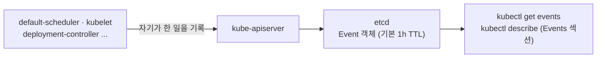
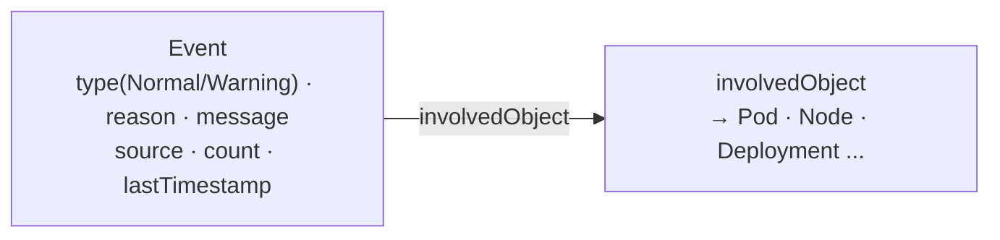

# 24. Events — kubectl describe · events

`kubectl describe` 하단의 `Events` 섹션과 `kubectl get events`는 같은 것을 보여 줍니다 — 컨트롤 플레인이 이 객체를 두고 무슨 일을 했는지, 혹은 왜 못 했는지의 짧은 기록입니다. 이 편은 그 Event가 앱이 낸 로그가 아니라 kube-apiserver에 저장되는 하나의 API 객체(`kind: Event`)이며, scheduler·kubelet·각종 컨트롤러가 자기가 한 일을 이 객체로 남긴다는 사실에서 나머지를 풀어 갑니다. Event는 `involvedObject`로 대상(Pod·Node 등)에 매달리고, `describe`는 그 객체를 가리키는 이벤트만 모아 보여 줍니다. 같은 일이 반복되면 새 줄이 아니라 `count`가 오르고, `type`은 `Normal` 아니면 `Warning`이며, etcd에 저장되지만 기본 1시간 뒤 사라집니다. 이 편의 산출물은 "정상 Pod의 Normal 이벤트 흐름(Scheduled → Pulling → Pulled → Created → Started)"과 "안 되는 두 경우(없는 이미지의 ImagePullBackOff, 스케줄 불가의 FailedScheduling)의 Warning 이벤트"를 각각 재현해, Event 객체의 구조(`involvedObject`·`source`·`reason`·`type`·`count`·타임스탬프)와 1시간 TTL 경계까지 손으로 확인한 상태입니다.

## 핵심 다이어그램





- **Event는 로그가 아니라 컨트롤 플레인의 기록이다.** 앱이 stdout에 찍은 줄이 아니라, scheduler·kubelet·컨트롤러가 "무슨 일을 했는지 / 왜 못 했는지"를 남긴 짧은 API 객체입니다.
- **Event는 대상 객체에 매달린다.** `involvedObject`가 Pod·Node를 가리키고, `describe`의 `Events` 섹션은 그 객체를 `involvedObject`로 하는 이벤트만 모아 보여 줍니다.
- **같은 이벤트는 집계된다.** 같은 `reason`이 반복되면 새 객체를 만들지 않고 `count`를 올리고 `lastTimestamp`를 갱신합니다.
- **Event는 오래 남지 않는다.** etcd에 저장되지만 기본 1시간(`--event-ttl`) 뒤 사라집니다 — 로그처럼, 사후에 남기려면 밖으로 실어 내야 합니다.

아래 시연이 이 그림의 각 지점을 한 줄씩 손으로 확인합니다.

## 사전 준비물

이 실습은 **macOS** 환경을 기준으로 합니다.

- **Docker** — Docker Desktop, OrbStack 등. `docker ps`가 에러 없이 돌아가면 OK.
- **Homebrew** — macOS 패키지 관리자.

### kind · kubectl 설치

```bash
brew install kind kubectl
```

### rosa-lab 클러스터 · namespace 준비

```bash
kind create cluster --name rosa-lab
kubectl create namespace rosa-lab
kubectl config set-context --current --namespace=rosa-lab
```

이미 있으면 건너뜁니다 (`kind get clusters`, `kubectl config get-contexts`로 확인).

이 편은 apiserver의 실행 인자를 직접 볼 때 `docker exec`로 kind 노드(도커 컨테이너)에 들어갑니다. 노드 이름은 `rosa-lab-control-plane`입니다.

## 실습 환경

| 파일 | 내용 |
|---|---|
| `manifests/web.yaml` | `nginx:1.27-alpine`로 정상 기동하는 `web` Deployment — Normal 이벤트(Scheduled·Pulling·Pulled·Created·Started)용 |
| `manifests/badimage.yaml` | 존재하지 않는 이미지(`nginx:does-not-exist-9999`)를 가리켜 `ImagePullBackOff`에 빠지는 `badimage` Pod — Warning·`count` 집계용 |
| `manifests/pending.yaml` | 노드 CPU를 넘는 `requests.cpu: 1000`으로 스케줄되지 못하는 `pending` Pod — `FailedScheduling`용 |

## 여기서 직접 확인할 수 있는 것

### describe 하단 — 한 객체에 붙은 이벤트

정상 워크로드를 올리고, `describe`의 마지막 `Events` 섹션을 봅니다.

```bash
kubectl apply -f manifests/web.yaml
kubectl rollout status deployment web -n rosa-lab
kubectl describe pod -n rosa-lab -l app=web | sed -n '/Events:/,$p'
```

```
Events:
  Type    Reason     Age   From               Message
  ----    ------     ----  ----               -------
  Normal  Scheduled  24s   default-scheduler  Successfully assigned rosa-lab/web-6c9f8d7b8-n2pkq to rosa-lab-control-plane
  Normal  Pulling    23s   kubelet            Pulling image "nginx:1.27-alpine"
  Normal  Pulled     20s   kubelet            Successfully pulled image "nginx:1.27-alpine" in 3.1s
  Normal  Created    20s   kubelet            Created container nginx
  Normal  Started    20s   kubelet            Started container nginx
```

이 다섯 줄이 "Pod 하나가 뜨기까지 컨트롤 플레인이 한 일"의 전체 기록입니다. `From` 칸을 보면 첫 줄은 **default-scheduler**(노드에 배치), 나머지는 **kubelet**(이미지 받고 컨테이너 만들고 시작)이 남긴 것입니다. `describe`는 이 Pod을 `involvedObject`로 하는 이벤트만 골라 하단에 붙여 준 것입니다.

### kubectl get events — 객체 밖에서 본 같은 기록

`describe`가 한 객체에 붙여 준 이벤트를, `get events`는 namespace 전체의 흐름으로 보여 줍니다.

```bash
kubectl get events -n rosa-lab --sort-by=.lastTimestamp | tail -6
```

```
LAST SEEN   TYPE     REASON      OBJECT                       MESSAGE
24s         Normal   Scheduled   pod/web-6c9f8d7b8-n2pkq      Successfully assigned rosa-lab/web-6c9f8d7b8-n2pkq to rosa-lab-control-plane
23s         Normal   Pulling     pod/web-6c9f8d7b8-n2pkq      Pulling image "nginx:1.27-alpine"
20s         Normal   Pulled      pod/web-6c9f8d7b8-n2pkq      Successfully pulled image "nginx:1.27-alpine" in 3.1s
20s         Normal   Created     pod/web-6c9f8d7b8-n2pkq      Created container nginx
20s         Normal   Started     pod/web-6c9f8d7b8-n2pkq      Started container nginx
```

같은 기록이되, 특정 객체에 묶이지 않은 목록입니다. `OBJECT` 칸이 각 이벤트의 `involvedObject`입니다. `--sort-by=.lastTimestamp`를 주는 이유는 `get events`의 기본 정렬이 시간순이 아니기 때문입니다 — 시간 흐름으로 읽으려면 매번 붙여야 합니다.

### Event는 API 객체다 — involvedObject · source · reason · count

`describe`와 `get events`가 표로 요약해 준 한 줄은, 실제로는 필드가 있는 API 객체입니다. 한 개를 YAML로 펼쳐 봅니다.

```bash
EV=$(kubectl get events -n rosa-lab --field-selector reason=Scheduled -o jsonpath='{.items[0].metadata.name}')
kubectl get event $EV -n rosa-lab -o yaml
```

```yaml
apiVersion: v1
kind: Event
type: Normal
reason: Scheduled
message: Successfully assigned rosa-lab/web-6c9f8d7b8-n2pkq to rosa-lab-control-plane
involvedObject:
  kind: Pod
  name: web-6c9f8d7b8-n2pkq
  namespace: rosa-lab
  uid: 3f2a7c11-8b4e-4d2a-9f01-6c5b2e7a1d94
source:
  component: default-scheduler
count: 1
firstTimestamp: "2026-07-01T07:10:22Z"
lastTimestamp: "2026-07-01T07:10:22Z"
```

- **`involvedObject`**: 이 이벤트가 매달린 대상. `describe`의 `Events` 섹션은 이 필드로 골라 낸 것입니다.
- **`source.component`**: 누가 남겼는지. 여기서는 `default-scheduler`.
- **`type` / `reason` / `message`**: 표의 세 칸이 그대로 필드입니다.
- **`count` / `firstTimestamp` / `lastTimestamp`**: 몇 번 일어났고, 처음·마지막이 언제인지. 지금은 한 번뿐이라 `count: 1`이고 두 시각이 같습니다.

Event가 객체라는 사실이 그다음을 정합니다 — 그래서 `-o yaml`로 펼칠 수 있고, `--field-selector`로 필드를 걸 수 있으며, 아래에서 볼 `count` 집계와 TTL도 이 객체의 성질입니다.

### Warning — 안 되는 일: 없는 이미지

이벤트가 진가를 내는 건 일이 안 될 때입니다. 존재하지 않는 이미지를 가리키는 Pod을 올립니다.

```bash
kubectl apply -f manifests/badimage.yaml
sleep 20
kubectl get pod badimage -n rosa-lab
```

```
NAME       READY   STATUS             RESTARTS   AGE
badimage   0/1     ImagePullBackOff   0          20s
```

`STATUS`는 상태만 알려 줍니다. **왜** 그 상태인지는 이벤트에 있습니다.

```bash
kubectl get events -n rosa-lab \
  --field-selector involvedObject.name=badimage \
  --sort-by=.lastTimestamp
```

```
LAST SEEN   TYPE      REASON      OBJECT          MESSAGE
21s         Normal    Scheduled   pod/badimage    Successfully assigned rosa-lab/badimage to rosa-lab-control-plane
19s         Warning   Failed      pod/badimage    Failed to pull image "nginx:does-not-exist-9999": not found
19s         Warning   Failed      pod/badimage    Error: ErrImagePull
4s          Normal    BackOff     pod/badimage    Back-off pulling image "nginx:does-not-exist-9999"
4s          Warning   Failed      pod/badimage    Error: ImagePullBackOff
```

배치(Scheduled)까지는 됐지만 kubelet이 이미지를 받지 못했고(`Failed to pull ... not found`), 재시도 간격을 늘려 가며(`BackOff`) 물러선 상태입니다. `type=Warning`만 따로 걸러 보면 "문제만" 남습니다.

```bash
kubectl get events -n rosa-lab --field-selector type=Warning --sort-by=.lastTimestamp | tail -3
```

```
LAST SEEN   TYPE      REASON   OBJECT          MESSAGE
5s          Warning   Failed   pod/badimage    Error: ImagePullBackOff
```

### count 집계 — 반복은 새 줄이 아니라 count

`BackOff`는 kubelet이 재시도할 때마다 다시 일어납니다. 그때마다 새 이벤트가 쌓이면 목록이 금세 넘칠 것입니다 — 대신 같은 `reason`은 하나의 객체로 합쳐지고 `count`만 오릅니다.

```bash
kubectl get events -n rosa-lab \
  --field-selector involvedObject.name=badimage,reason=BackOff \
  -o custom-columns='REASON:.reason,COUNT:.count,FIRST:.firstTimestamp,LAST:.lastTimestamp'
```

```
REASON    COUNT   FIRST                  LAST
BackOff   7       2026-07-01T07:12:03Z   2026-07-01T07:14:31Z
```

한 줄인데 `COUNT`가 7입니다. `FIRST`와 `LAST`가 벌어져 있는 것이 "처음 일어난 뒤 같은 일이 계속 반복 중"이라는 신호입니다. 잠시 뒤 다시 물으면 `count`가 더 올라 있습니다.

```bash
sleep 40
kubectl get events -n rosa-lab \
  --field-selector involvedObject.name=badimage,reason=BackOff \
  -o custom-columns='REASON:.reason,COUNT:.count,LAST:.lastTimestamp'
```

```
REASON    COUNT   LAST
BackOff   9       2026-07-01T07:15:11Z
```

그래서 이벤트를 읽을 때는 `count`와 `LAST SEEN`을 같이 봐야 합니다 — 한 번 스쳐 간 일인지, 지금도 반복 중인 일인지가 여기서 갈립니다.

### FailedScheduling — scheduler가 못 둔 이유

이미지 문제는 배치 이후 kubelet 단계였습니다. 이번에는 배치 자체가 안 되는 경우입니다. 노드 CPU를 크게 넘는 `requests`를 단 Pod을 올립니다.

```bash
kubectl apply -f manifests/pending.yaml
sleep 5
kubectl get pod pending -n rosa-lab
```

```
NAME      READY   STATUS    RESTARTS   AGE
pending   0/1     Pending   0          5s
```

`Pending`에서 움직이지 않습니다. 왜 배치가 안 되는지는 scheduler가 남긴 이벤트에 있습니다.

```bash
kubectl get events -n rosa-lab --field-selector involvedObject.name=pending
```

```
LAST SEEN   TYPE      REASON             OBJECT         MESSAGE
6s          Warning   FailedScheduling   pod/pending    0/1 nodes are available: 1 Insufficient cpu. preemption: 0/1 nodes are available: 1 No preemption victims found.
```

여기서 두 가지가 읽힙니다. 하나는 `Scheduled` 이벤트가 아예 없다는 것 — Pod이 노드에 배치된 적이 없습니다. 다른 하나는 그 이유(`Insufficient cpu`)를 **default-scheduler**가 직접 적어 놨다는 것입니다. `source`를 확인하면 앞의 kubelet 이벤트와 낸 주체가 다릅니다.

```bash
kubectl get events -n rosa-lab --field-selector involvedObject.name=pending \
  -o jsonpath='{.items[0].source.component}{"\n"}'
```

```
default-scheduler
```

"어느 단계에서 멈췄는가"는 곧 "어느 컴포넌트가 Warning을 냈는가"입니다 — scheduler면 배치 전, kubelet이면 배치 후입니다.

### 정렬 · 필터 · 실시간 — 이벤트를 좁혀 보는 법

이벤트는 금세 많아지므로, 보는 쪽을 좁히는 도구가 곧 실전 사용법입니다. 지금까지 쓴 것과 몇 가지를 함께 정리합니다.

```bash
# 클러스터 전체에서 Warning만, 시간순으로
kubectl get events -A --field-selector type=Warning --sort-by=.lastTimestamp | tail -5

# 특정 객체에 붙은 이벤트만
kubectl get events -n rosa-lab --field-selector involvedObject.name=badimage

# 새로 생기는 이벤트를 실시간으로
kubectl get events -n rosa-lab --watch
```

`kubectl` 1.23부터는 이벤트 전용 명령 `kubectl events`도 있습니다 — 기본 정렬이 시간순이고 `--for`로 대상 객체를 바로 지정할 수 있어, `--sort-by`·`--field-selector`를 손으로 붙이지 않아도 됩니다.

```bash
kubectl events -n rosa-lab --for pod/badimage --watch
```

`--field-selector`로 걸 수 있는 필드는 `involvedObject.kind`·`involvedObject.name`·`involvedObject.namespace`·`reason`·`source`·`type` 등, Event 객체가 실제로 들고 있는 필드입니다 — 앞에서 YAML로 펼쳐 본 그 필드들입니다.

### Event는 사라진다 — 기본 1시간 TTL

이벤트가 로그와 갈라지는 마지막 지점입니다. Event 객체는 etcd에 저장되지만, kube-apiserver가 기본 1시간 뒤 지웁니다. 그 값은 apiserver의 `--event-ttl` 인자가 정합니다.

```bash
docker exec rosa-lab-control-plane sh -c \
  "grep -o 'event-ttl=[^ ]*' /etc/kubernetes/manifests/kube-apiserver.yaml || echo '(명시 없음 → 기본 1h)'"
```

```
(명시 없음 → 기본 1h)
```

명시하지 않으면 1시간이 적용됩니다. 그래서 `kubectl get events`로 볼 수 있는 과거는 대략 지난 한 시간뿐입니다 — 어젯밤 재시작의 원인을 오늘 아침에 이벤트로 찾으려 하면 이미 지워지고 없습니다. 로그와 같은 결론입니다: 사후 분석을 위해 오래 남기려면, 사라지기 전에 밖으로 실어 내야 합니다. 실전에서는 event exporter나 로깅 파이프라인이 이벤트를 읽어 외부 저장소로 보냅니다.

`STATUS`가 왜 그런지(이미지 문제인지 스케줄 문제인지)를 이벤트가 알려 주고, 그 이벤트가 한 시간짜리 창이라는 두 사실이 다음으로 이어집니다 — 장애가 났을 때 이벤트를 **가장 먼저, 그리고 늦기 전에** 봐야 하는 이유입니다.

### 정리

```bash
kubectl delete -f manifests/pending.yaml --ignore-not-found
kubectl delete -f manifests/badimage.yaml --ignore-not-found
kubectl delete -f manifests/web.yaml --ignore-not-found
```

클러스터까지 정리하려면:

```bash
kind delete cluster --name rosa-lab
```

## 이 편의 산출물

- 정상 Pod이 뜨기까지의 **Normal 이벤트 흐름**(Scheduled → Pulling → Pulled → Created → Started)을 `describe` 하단과 `get events`에서 각각 확인하고, `From` 칸으로 default-scheduler와 kubelet이 서로 다른 단계를 남긴다는 것을 본 상태.
- Event가 표의 한 줄이 아니라 `involvedObject`·`source`·`reason`·`type`·`count`·타임스탬프를 가진 **API 객체(`kind: Event`)**임을 `-o yaml`로 펼쳐 확인한 경험.
- 없는 이미지의 `ImagePullBackOff`를 재현해, `STATUS`가 아니라 **Warning 이벤트**가 원인(`Failed to pull ... not found`)을 담고 있음을 확인하고, `type=Warning`으로 문제만 걸러 본 상태.
- 반복되는 이벤트가 새 줄이 아니라 하나의 객체에서 **`count` 증가·`lastTimestamp` 갱신**으로 집계됨을 `BackOff`로 확인하고, `count`와 `LAST SEEN`으로 "지금도 반복 중"을 읽는 법을 익힌 경험.
- 스케줄 불가 Pod로 **`FailedScheduling`**(source=default-scheduler)을 재현해, "Scheduled 이벤트의 부재 + Warning을 낸 컴포넌트"로 배치 전/후 어느 단계에서 멈췄는지 가르는 법을 확인한 상태.
- `--field-selector`·`--sort-by`·`--watch`와 `kubectl events --for`로 이벤트를 좁혀 보는 법, 그리고 Event가 etcd에서 **기본 1시간(`--event-ttl`)** 뒤 사라지므로 오래 남기려면 밖으로 실어 내야 한다는 경계를 그은 상태.
