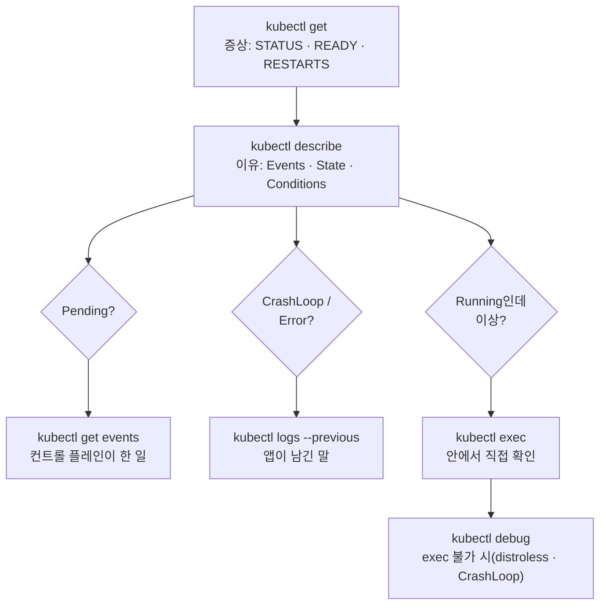

# 25. Troubleshooting — 장애 대응 루틴

장애가 났을 때 무엇부터 볼지는 매번 같습니다 — `get`으로 증상을 보고, `describe`로 이유를 좁힌 뒤, 거기서 갈라져 `logs`(앱이 남긴 말)·`events`(컨트롤 플레인이 한 일)·`exec`(안에서 직접 확인)·`debug`(exec가 막힐 때)로 내려갑니다. 이 편은 그 고정된 순서가 왜 그 순서인지를, 서로 다른 세 고장(스케줄이 안 됨 · 앱이 죽음 · 컨테이너 안을 조사)을 실제로 재현하며 확인합니다. 핵심은 각 단계가 문제의 **위치**를 좁힌다는 것입니다 — `get`은 "무엇이 이상한가", `describe`는 "배치 전인가 후인가", `logs`는 "앱이 스스로 뭐라 했나", `exec`는 "지금 안에서 무엇이 보이나", `debug`는 "조사 도구조차 없을 때". 이 편의 산출물은 증상에서 원인까지 내려가는 재현 가능한 점검 루틴과, `exec`가 막히는 이미지에서 `kubectl debug`로 컨테이너 안을 여는 법입니다.

## 핵심 다이어그램



- **`get`은 증상을 준다.** `STATUS`·`READY`·`RESTARTS` 세 칸이 "무엇이 이상한가"를 한 줄로 알려 줍니다. 여기서 아직 원인은 모릅니다.
- **`describe`가 갈림길이다.** 하단 `Events`와 컨테이너 `State`/`Last State`/`Conditions`가 "배치 전에 막혔는지(Pending), 떠 있다 죽는지(CrashLoop), 떠 있는데 이상한지(Running)"를 가릅니다. 이후 단계는 이 갈림에서 정해집니다.
- **`logs`는 앱의 말, `events`는 컨트롤 플레인의 말.** 앱이 스스로 남긴 원인은 `logs`(죽었으면 `--previous`)에, scheduler·kubelet이 한 일은 `events`에 있습니다. 둘은 다른 주체의 기록입니다.
- **`exec`가 막히면 `debug`.** 안에서 직접 봐야 하는데 컨테이너에 shell·도구가 없거나(distroless) 계속 죽어(CrashLoop) 붙을 수 없을 때, `kubectl debug`가 같은 Pod에 조사용 컨테이너를 임시로 붙입니다.

아래 시연이 이 루틴을 세 고장에 대해 한 단계씩 손으로 밟습니다.

## 사전 준비물

이 실습은 **macOS** 환경을 기준으로 합니다.

- **Docker** — Docker Desktop, OrbStack 등. `docker ps`가 에러 없이 돌아가면 OK.
- **Homebrew** — macOS 패키지 관리자.

### kind · kubectl 설치

```bash
brew install kind kubectl
```

### rosa-lab 클러스터 · namespace 준비

```bash
kind create cluster --name rosa-lab
kubectl create namespace rosa-lab
kubectl config set-context --current --namespace=rosa-lab
```

이미 있으면 건너뜁니다 (`kind get clusters`, `kubectl config get-contexts`로 확인).

## 실습 환경

| 파일 | 내용 |
|---|---|
| `manifests/pending.yaml` | 노드 CPU를 넘는 `requests.cpu: 1000`으로 스케줄되지 못하는 `pending` Pod — 배치 전 고장 |
| `manifests/crash.yaml` | 몇 줄 찍고 오류로 죽어 `CrashLoopBackOff`에 빠지는 `crash` Pod — 앱이 죽는 고장 |
| `manifests/web.yaml` | `nginx:1.27-alpine`로 정상 기동하는 `web` Deployment — `exec`로 안을 보는 대상 |
| `manifests/noshell.yaml` | shell·도구가 없는 `registry.k8s.io/pause` 이미지의 `noshell` Pod — `exec`가 막혀 `debug`가 필요한 경우 |

## 여기서 직접 확인할 수 있는 것

### 1단계 — get: 증상을 먼저 본다

무슨 일이 있든 시작은 목록입니다. 세 워크로드를 올리고 한눈에 봅니다.

```bash
kubectl apply -f manifests/pending.yaml
kubectl apply -f manifests/crash.yaml
kubectl apply -f manifests/web.yaml
sleep 25
kubectl get pods -n rosa-lab
```

```
NAME                   READY   STATUS             RESTARTS      AGE
crash                  0/1     CrashLoopBackOff   2 (12s ago)   25s
pending                0/1     Pending            0             25s
web-6c9f8d7b8-n2pkq    1/1     Running            0             25s
```

세 줄이 세 증상입니다 — `crash`는 `RESTARTS`가 오르며 `CrashLoopBackOff`, `pending`은 `Pending`에서 멈춤, `web`은 `1/1 Running`. 아직 **왜**는 모릅니다. `STATUS`·`READY`·`RESTARTS`가 다음에 어디를 볼지만 정해 줍니다: `Pending`은 배치 문제, `CrashLoopBackOff`는 앱이 죽는 문제.

### 2단계 — describe: Pending의 이유는 Events에 있다

`pending`부터 봅니다. `describe`의 하단 `Events`가 배치가 안 되는 이유를 담습니다.

```bash
kubectl describe pod pending -n rosa-lab | sed -n '/Events:/,$p'
```

```
Events:
  Type     Reason            Age   From               Message
  ----     ------            ----  ----               -------
  Warning  FailedScheduling  30s   default-scheduler  0/1 nodes are available: 1 Insufficient cpu. preemption: 0/1 nodes are available: 1 No preemption victims found.
```

`Scheduled` 이벤트가 없고 `FailedScheduling`만 있습니다 — 노드에 배치된 적이 없습니다. 이유(`Insufficient cpu`)를 낸 주체가 **default-scheduler**라는 점이 위치를 확정합니다: 문제는 배치 **전**이고, `logs`나 `exec`는 볼 게 없습니다(컨테이너가 뜬 적이 없으니까). 같은 정보를 namespace 흐름으로 보려면:

```bash
kubectl get events -n rosa-lab --field-selector involvedObject.name=pending
```

```
LAST SEEN   TYPE      REASON             OBJECT         MESSAGE
32s         Warning   FailedScheduling   pod/pending    0/1 nodes are available: 1 Insufficient cpu. ...
```

배치 전 고장은 여기서 끝납니다 — 원인이 자원 요청이므로, 고칠 곳은 매니페스트의 `requests`이지 컨테이너 안이 아닙니다.

### 3단계 — describe → logs: CrashLoop의 원인은 죽은 컨테이너에 있다

`crash`는 떠 있다 죽습니다. `describe`의 컨테이너 상태 블록을 먼저 봅니다.

```bash
kubectl describe pod crash -n rosa-lab | sed -n '/    State:/,/Restart Count:/p'
```

```
    State:          Waiting
      Reason:       CrashLoopBackOff
    Last State:     Terminated
      Reason:       Error
      Exit Code:    1
      Started:      Wed, 01 Jul 2026 07:30:14 +0000
      Finished:     Wed, 01 Jul 2026 07:30:14 +0000
    Ready:          False
    Restart Count:  2
```

`State`는 지금 `Waiting`(재시작 대기), `Last State`는 직전이 `Terminated`, `Exit Code: 1`. 여기까지는 "0이 아닌 코드로 죽었다"만 알 뿐, **왜**는 앱이 남긴 말에 있습니다. 지금 도는 컨테이너가 아니라 **죽은** 컨테이너의 로그를 봐야 하므로 `--previous`입니다.

```bash
kubectl logs crash -n rosa-lab --previous
```

```
2026-07-01T07:30:11Z starting up
2026-07-01T07:30:11Z loading config from /etc/app/config.yaml
2026-07-01T07:30:14Z FATAL config file not found, exiting
```

`FATAL config file not found`가 원인입니다 — 재시작된 새 컨테이너의 로그만 봤다면 이 줄을 놓쳤을 것입니다. `describe`가 "언제·어떤 코드로 죽었나"를, `logs --previous`가 "죽기 직전 뭐라 했나"를 맡습니다.

### 4단계 — exec: 떠 있는데 이상할 때 안에서 본다

`web`은 `1/1 Running`이지만, "떠 있는데 응답이 이상하다" 같은 문제는 목록·이벤트에 안 나옵니다. 이럴 때 컨테이너 안으로 들어가 직접 확인합니다.

```bash
POD=$(kubectl get pod -n rosa-lab -l app=web -o jsonpath='{.items[0].metadata.name}')

# 안에서 도는 프로세스
kubectl exec -n rosa-lab $POD -- ps -o pid,args

# 자기 자신에게 HTTP가 도는지
kubectl exec -n rosa-lab $POD -- wget -qO- -T2 http://localhost/ | head -4

# 이름 해석에 쓰는 DNS 설정
kubectl exec -n rosa-lab $POD -- cat /etc/resolv.conf
```

```
PID   USER     COMMAND
    1 root     nginx: master process nginx -g daemon off;
   30 nginx    nginx: worker process
...
<!DOCTYPE html>
<html>
<head>
<title>Welcome to nginx!</title>
...
nameserver 10.96.0.10
search rosa-lab.svc.cluster.local svc.cluster.local cluster.local
options ndots:5
```

프로세스가 맞게 떴는지, 자기 포트가 실제로 응답하는지, DNS가 클러스터 것을 가리키는지를 컨테이너 **안에서** 확인했습니다. `exec`는 지금 살아 있는 컨테이너에 명령을 넣는 것이라, 파일·네트워크·환경변수처럼 밖에서 안 보이는 상태를 볼 때 씁니다. 붙어서 둘러보려면 대화형으로:

```bash
kubectl exec -it -n rosa-lab $POD -- sh
```

### 5단계 — debug: exec가 막히면 조사용 컨테이너를 붙인다

`exec`는 그 컨테이너에 shell·도구가 있어야 됩니다. 최소 이미지(distroless·pause 등)에는 그게 없습니다. `noshell`로 재현합니다.

```bash
kubectl apply -f manifests/noshell.yaml
sleep 5
kubectl get pod noshell -n rosa-lab
```

```
NAME      READY   STATUS    RESTARTS   AGE
noshell   1/1     Running   0          5s
```

`Running`인데 안으로 들어가려 하면 막힙니다.

```bash
kubectl exec -it -n rosa-lab noshell -- sh
```

```
error: Internal error occurred: error executing command in container: failed to exec in container: failed to start exec ... exec: "sh": executable file not found in $PATH
```

컨테이너 안에 `sh`가 없기 때문입니다. `kubectl debug`는 같은 Pod에 **임시(ephemeral) 컨테이너**를 하나 더 붙입니다 — 도구가 든 이미지로, 대상 컨테이너와 프로세스 네임스페이스를 공유해서.

```bash
kubectl debug -it -n rosa-lab noshell --image=busybox:1.36 --target=app -- sh
```

```
Targeting container "app". If you don't see processes from this container it may be because the container runtime doesn't support this feature.
Defaulting debug container name to debugger-x7k2p.
/ # ps -o pid,args
PID   USER     COMMAND
    1 root     /pause
   14 root     sh
/ # ls /proc/1/root
...
/ # exit
```

`busybox`에는 `sh`가 있으니 붙습니다. `--target=app` 덕분에 프로세스 목록에 대상 컨테이너의 PID 1(`/pause`)이 보입니다 — 같은 네임스페이스를 공유해 그 컨테이너의 프로세스·파일시스템을 조사할 수 있습니다. 임시 컨테이너는 Pod에 추가만 되고 제거는 안 되지만(재시작하면 사라짐), 원래 컨테이너는 건드리지 않습니다.

노드 자체를 봐야 할 때(디스크·kubelet·시스템 로그)는 노드에 붙는 형태를 씁니다.

```bash
kubectl debug node/rosa-lab-control-plane -it --image=busybox:1.36 -- sh
# 그 안에서 /host 아래에 노드 파일시스템이 마운트됩니다
```

### 루틴 요약 — 증상에서 다음 한 수

| get의 증상 | 다음 단계 | 무엇을 확인하나 |
|---|---|---|
| `Pending` | `describe` → `events` | `FailedScheduling` 등 배치가 막힌 이유(자원·affinity·taint) |
| `CrashLoopBackOff` / `Error` | `describe`(State·Exit Code) → `logs --previous` | 죽은 컨테이너가 남긴 원인 |
| `ImagePullBackOff` | `describe` → `events` | 이미지 이름·레지스트리 인증 |
| `Running`인데 이상 | `exec` | 안의 프로세스·포트·DNS·파일 |
| shell 없음 / CrashLoop라 붙을 수 없음 | `debug`(ephemeral / node) | 조사용 컨테이너를 붙여 안을 확인 |

순서는 항상 `get` → `describe`이고, 그다음이 `describe`의 갈림에서 정해집니다. 아무 데나 `logs`부터 보지 않는 이유는, 배치 전 고장(Pending)이나 이미지 고장(ImagePullBackOff)에서는 `logs`가 볼 게 없기 때문입니다.

### 정리

```bash
kubectl delete -f manifests/noshell.yaml --ignore-not-found
kubectl delete -f manifests/web.yaml --ignore-not-found
kubectl delete -f manifests/crash.yaml --ignore-not-found
kubectl delete -f manifests/pending.yaml --ignore-not-found
```

클러스터까지 정리하려면:

```bash
kind delete cluster --name rosa-lab
```

## 이 편의 산출물

- `get` → `describe`에서 시작해, `describe`의 갈림(Pending · CrashLoop · Running)에 따라 `events` · `logs --previous` · `exec` · `debug`로 내려가는 **고정된 점검 순서**를 세 고장에 대해 한 단계씩 밟아 본 상태.
- `Pending`의 원인이 `logs`가 아니라 **`describe`/`events`의 `FailedScheduling`**(source=default-scheduler)에 있으며, 배치 **전** 고장이라 컨테이너 안을 볼 게 없음을 확인한 경험.
- `CrashLoopBackOff`에서 `describe`의 `State`/`Last State`/`Exit Code`로 "언제·어떤 코드로 죽었나"를, **`logs --previous`**로 "죽기 직전 뭐라 했나"(`FATAL config file not found`)를 나눠 확인한 상태.
- `1/1 Running`인데 이상한 컨테이너를 **`kubectl exec`**로 열어 프로세스·`localhost` HTTP·`/etc/resolv.conf`를 안에서 직접 확인한 경험.
- shell 없는 이미지에서 `exec`가 막히는 것을 재현하고, **`kubectl debug --target`**으로 프로세스 네임스페이스를 공유하는 임시 컨테이너를 붙여 대상 컨테이너를 조사하는 법, 그리고 `kubectl debug node/...`로 노드에 붙는 법까지 확인한 상태.
- 증상(get) → 다음 한 수를 잇는 **점검 표**로, "왜 `logs`부터 보지 않는가"(배치·이미지 고장에는 로그가 없다)의 경계를 그은 상태.
