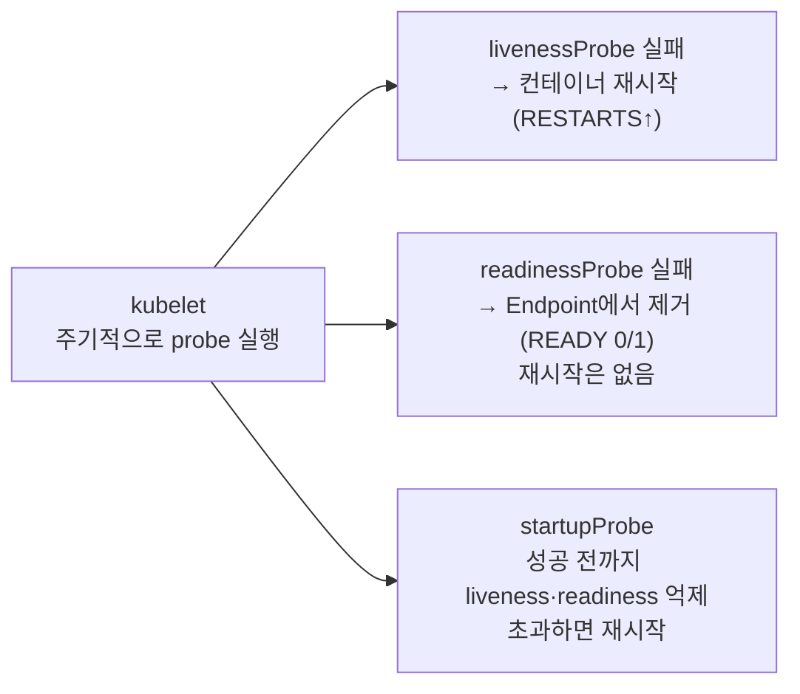
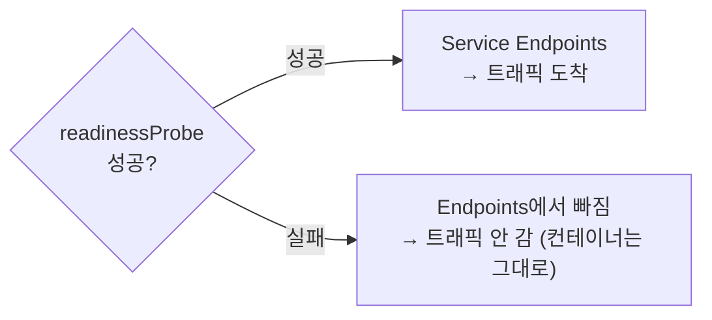

# 26. Probe — liveness · readiness · startup

Pod이 "살아 있다"·"준비됐다"고 알리는 방법은 kubelet이 주기적으로 던지는 세 가지 probe입니다. 이름은 비슷하지만 **실패했을 때 벌어지는 일이 서로 다르고**, 그 차이가 각 probe의 정체입니다 — livenessProbe가 실패하면 kubelet이 컨테이너를 **재시작**하고, readinessProbe가 실패하면 Service의 **Endpoint에서 빼서** 트래픽만 끊되 컨테이너는 그대로 두며, startupProbe는 느린 시작 동안 앞의 둘을 **억제**하다 성공하면 물러납니다. 이 편은 세 probe를 각각 실패하도록 만들어, liveness는 `RESTARTS` 증가로, readiness는 `READY 0/1`과 Endpoints에서 빠지는 것으로, startup은 부팅 중 재시작을 막아 주는 것으로 그 차이를 눈으로 확인합니다. 이 편의 산출물은 "세 probe의 실패 결과(재시작 · 트래픽 차단 · 부팅 보호)를 구분해 재현한 매니페스트 묶음"과 "언제 어느 probe를 쓰는지의 경계"입니다.

## 핵심 다이어그램





- **liveness는 "다시 시작해라"다.** 실패하면 kubelet이 그 컨테이너를 죽이고 재시작합니다. 행·데드락처럼 프로세스는 살아 있지만 응답이 없는 상태를 회복하는 용도이며, `RESTARTS`로 드러납니다.
- **readiness는 "아직 트래픽 주지 마라"다.** 실패하면 Service의 Endpoints에서 빠져 트래픽이 안 가지만, 컨테이너는 재시작되지 않습니다. `READY` 칸이 `0/1`이 됩니다.
- **startup은 "부팅 중엔 봐주라"다.** 느린 시작 동안 liveness·readiness를 억제하고, 한 번 성공하면 물러나 뒤를 넘깁니다. 시작이 정해진 예산을 넘기면 그때 재시작합니다.
- **셋 다 kubelet이 실행한다.** 방식은 `httpGet`·`tcpSocket`·`exec`·`grpc` 중 하나이고, `initialDelaySeconds`·`periodSeconds`·`timeoutSeconds`·`successThreshold`·`failureThreshold`가 언제·몇 번 만에 성패를 정할지 조율합니다.

아래 시연이 세 probe의 실패 결과를 하나씩 손으로 확인합니다.

## 사전 준비물

이 실습은 **macOS** 환경을 기준으로 합니다.

- **Docker** — Docker Desktop, OrbStack 등. `docker ps`가 에러 없이 돌아가면 OK.
- **Homebrew** — macOS 패키지 관리자.

### kind · kubectl 설치

```bash
brew install kind kubectl
```

### rosa-lab 클러스터 · namespace 준비

```bash
kind create cluster --name rosa-lab
kubectl create namespace rosa-lab
kubectl config set-context --current --namespace=rosa-lab
```

이미 있으면 건너뜁니다 (`kind get clusters`, `kubectl config get-contexts`로 확인).

## 실습 환경

| 파일 | 내용 |
|---|---|
| `manifests/readiness.yaml` | `/tmp/ready`가 있어야 준비 완료로 치는 `readiness` Pod + 같은 이름의 Service — readiness 실패 시 Endpoints에서 빠지는 것 확인용 |
| `manifests/liveness.yaml` | 20초 뒤 `/tmp/healthy`를 지워 liveness를 실패시키는 `liveness` Pod — 재시작(`RESTARTS↑`) 확인용 |
| `manifests/startup.yaml` | 시작에 15초 걸리는 앱을 startupProbe로 감싸, 엄격한 liveness가 부팅 중 죽이지 못하게 하는 `startup` Pod |

## 여기서 직접 확인할 수 있는 것

### readiness — 준비될 때까지 트래픽에서 뺀다

readiness Pod과 Service를 올립니다. `/tmp/ready`가 아직 없으니 probe가 실패하고, Pod은 떠 있지만 준비 안 됨으로 표시됩니다.

```bash
kubectl apply -f manifests/readiness.yaml
sleep 6
kubectl get pod readiness -n rosa-lab
```

```
NAME        READY   STATUS    RESTARTS   AGE
readiness   0/1     Running   0          6s
```

`STATUS`는 `Running`인데 `READY`는 `0/1`입니다 — 프로세스는 떴지만 readiness가 아직 실패라는 뜻입니다. 그 결과 이 Pod은 Service의 Endpoints에 오르지 못합니다.

```bash
kubectl get endpoints readiness -n rosa-lab
```

```
NAME        ENDPOINTS   AGE
readiness   <none>      7s
```

`ENDPOINTS`가 비어 있습니다 — Service로 온 트래픽이 이 Pod으로 가지 않습니다. 이제 준비 신호를 만듭니다.

```bash
kubectl exec readiness -n rosa-lab -- touch /tmp/ready
sleep 3
kubectl get pod readiness -n rosa-lab
kubectl get endpoints readiness -n rosa-lab
```

```
NAME        READY   STATUS    RESTARTS   AGE
readiness   1/1     Running   0          16s

NAME        ENDPOINTS         AGE
readiness   10.244.0.12:80    16s
```

`READY`가 `1/1`이 되자 Pod IP가 Endpoints에 올랐습니다 — 이제부터 트래픽이 갑니다. 여기서 `RESTARTS`는 내내 `0`입니다. readiness 실패는 **트래픽만** 끊을 뿐 컨테이너를 재시작하지 않습니다. 반대로 준비를 다시 거두면(파일 삭제) 곧 Endpoints에서 빠집니다.

```bash
kubectl exec readiness -n rosa-lab -- rm -f /tmp/ready
sleep 4
kubectl get endpoints readiness -n rosa-lab
```

```
NAME        ENDPOINTS   AGE
readiness   <none>      24s
```

### liveness — 응답이 없으면 재시작한다

liveness Pod을 올립니다. 이 앱은 20초 동안만 `/tmp/healthy`를 두고, 그 뒤 지웁니다 — 그 순간부터 liveness가 실패합니다.

```bash
kubectl apply -f manifests/liveness.yaml
```

`RESTARTS`가 어떻게 변하는지 지켜봅니다.

```bash
kubectl get pod liveness -n rosa-lab -w   # RESTARTS가 오르면 Ctrl-C
```

```
NAME       READY   STATUS    RESTARTS     AGE
liveness   1/1     Running   0            10s
liveness   1/1     Running   1 (1s ago)   32s
liveness   1/1     Running   2 (1s ago)   64s
```

20초쯤마다 `RESTARTS`가 오릅니다. 재시작된 컨테이너가 다시 `/tmp/healthy`를 만들었다가 20초 뒤 또 지우므로 같은 일이 반복됩니다. 왜 재시작됐는지는 이벤트에 있습니다.

```bash
kubectl describe pod liveness -n rosa-lab | sed -n '/Events:/,$p' | head -12
```

```
Events:
  Type     Reason     Age                From     Message
  ----     ------     ----               ----     -------
  Normal   Pulled     70s                kubelet  Successfully pulled image "busybox:1.36"
  Normal   Created    70s (x2 over ...)  kubelet  Created container app
  Normal   Started    70s                kubelet  Started container app
  Warning  Unhealthy  25s (x3 over 65s)  kubelet  Liveness probe failed: cat: can't open '/tmp/healthy': No such file or directory
  Normal   Killing    25s (x2 over 45s)  kubelet  Container app failed liveness probe, will be restarted
```

`Liveness probe failed`에 이어 `Container app failed liveness probe, will be restarted` — kubelet이 probe 실패를 보고 컨테이너를 죽여 재시작한 것입니다. liveness는 이렇게 "떠 있지만 정상이 아닌" 컨테이너를 재시작으로 회복시키는 신호입니다. `Killing` 옆의 `(x2 over 45s)`가 앞에서 본 반복을 그대로 집계한 것입니다.

### startup — 느린 시작을 재시작으로부터 보호한다

앞의 liveness 설정(`failureThreshold: 1`, 짧은 주기)은 엄격합니다. 시작에 오래 걸리는 앱에 그대로 걸면, 앱이 아직 부팅 중인데 liveness가 실패로 보고 죽여 버립니다 — 영원히 못 뜨는 상태에 빠집니다. startupProbe가 그 사이를 막습니다. startup Pod은 시작에 15초가 걸리고, 그동안 startupProbe가 liveness를 억제합니다.

```bash
kubectl apply -f manifests/startup.yaml
kubectl get pod startup -n rosa-lab -w   # READY 1/1이 되면 Ctrl-C
```

```
NAME      READY   STATUS    RESTARTS   AGE
startup   0/1     Running   0          5s
startup   0/1     Running   0          14s
startup   1/1     Running   0          18s
```

부팅에 15초가 걸리는데도 `RESTARTS`가 `0`으로 유지되다가 `1/1`이 됩니다 — startupProbe가 성공(`/tmp/started` 생김)할 때까지 엄격한 liveness가 켜지지 않았기 때문입니다. 이벤트를 보면 이 억제가 드러납니다.

```bash
kubectl describe pod startup -n rosa-lab | sed -n '/Events:/,$p' | head -10
```

```
Events:
  Type     Reason     Age   From     Message
  ----     ------     ----  ----     -------
  Normal   Scheduled  20s   default-scheduler  Successfully assigned rosa-lab/startup to rosa-lab-control-plane
  Normal   Pulled     19s   kubelet  Successfully pulled image "busybox:1.36"
  Normal   Started    19s   kubelet  Started container app
  Warning  Unhealthy  16s (x4 over 19s)  kubelet  Startup probe failed: cat: can't open '/tmp/started': No such file or directory
```

부팅 동안 `Startup probe failed`가 몇 번 찍히지만 `Killing`은 없습니다 — startup이 실패하는 동안 kubelet은 재시작하지 않고 예산(여기서는 `periodSeconds: 3 × failureThreshold: 10 = 최대 30초`)만큼 기다립니다. startup이 그 안에 성공하면 물러나고, 그때부터 liveness·readiness가 맡습니다. 만약 15초가 아니라 30초를 넘겼다면 startup이 초과 실패로 재시작을 부릅니다 — 예산은 "정상 시작에 걸리는 최대 시간"에 맞춰 잡습니다.

### probe 방식과 조율 파라미터

세 probe 모두 "어떻게 확인하나"와 "언제·몇 번 만에 성패로 치나"를 따로 정합니다. 확인 방식은 넷 중 하나입니다.

```yaml
# HTTP 200~399면 성공
livenessProbe:
  httpGet:
    path: /healthz
    port: 8080
# TCP 연결이 열리면 성공
readinessProbe:
  tcpSocket:
    port: 5432
# 종료 코드 0이면 성공 (이 편의 예제)
livenessProbe:
  exec:
    command: ["cat", "/tmp/healthy"]
# gRPC health 프로토콜로 확인
startupProbe:
  grpc:
    port: 9000
```

조율 파라미터는 방식과 무관하게 같습니다.

- **`initialDelaySeconds`**: 컨테이너 시작 후 첫 probe까지 기다릴 시간.
- **`periodSeconds`**: probe 간격(기본 10).
- **`timeoutSeconds`**: 한 번의 probe가 이 시간 안에 답 없으면 실패(기본 1).
- **`failureThreshold`**: 연속 몇 번 실패해야 "실패로 확정"할지(기본 3).
- **`successThreshold`**: 연속 몇 번 성공해야 "성공으로 확정"할지(readiness 외에는 1 고정).

`initialDelaySeconds`로 느린 시작을 감싸는 대신 **startupProbe**를 쓰는 편이 낫습니다 — `initialDelaySeconds`는 정한 만큼 무조건 기다리지만, startupProbe는 준비되는 즉시 다음으로 넘기고 예산을 넘길 때만 개입하기 때문입니다.

### 세 probe 비교

| | 무엇을 묻나 | 실패하면 | 재시작 | 겉으로 드러나는 곳 |
|---|---|---|---|---|
| **liveness** | 지금 정상인가 | 컨테이너 죽이고 재시작 | O | `RESTARTS` 증가 |
| **readiness** | 트래픽 받을 준비됐나 | Service Endpoints에서 제거 | X | `READY 0/1`, Endpoints `<none>` |
| **startup** | 시작이 끝났나 | (예산 초과 시) 재시작 | 초과 시 O | 부팅 동안 liveness·readiness 억제 |

같은 확인 방식(예: `httpGet /healthz`)을 세 자리에 다 넣을 수 있지만, 넣는 자리에 따라 실패의 결과가 위 표처럼 달라집니다. "죽었으니 재시작"이 필요하면 liveness, "아직 트래픽은 이르다"면 readiness, "시작이 느리다"면 startup입니다.

### 정리

```bash
kubectl delete -f manifests/startup.yaml --ignore-not-found
kubectl delete -f manifests/liveness.yaml --ignore-not-found
kubectl delete -f manifests/readiness.yaml --ignore-not-found
```

클러스터까지 정리하려면:

```bash
kind delete cluster --name rosa-lab
```

## 이 편의 산출물

- **readinessProbe** 실패가 `READY 0/1`과 Service Endpoints `<none>`으로 이어져 트래픽만 끊고 컨테이너는 재시작하지 않음을, `/tmp/ready` 파일을 만들고 지우며 Endpoints가 붙고 빠지는 것으로 확인한 상태.
- **livenessProbe** 실패가 kubelet의 컨테이너 재시작(`RESTARTS↑`)으로 이어짐을, 20초 뒤 unhealthy가 되는 Pod의 `RESTARTS` 증가와 `Liveness probe failed` → `will be restarted` 이벤트로 확인한 경험.
- **startupProbe**가 느린 시작(15초) 동안 엄격한 liveness를 억제해 부팅 중 재시작을 막고, 성공 후에야 liveness로 넘긴다는 것을 `RESTARTS 0` 유지와 `Startup probe failed`(단 `Killing` 없음) 이벤트로 확인한 상태.
- probe 확인 방식 네 가지(`httpGet`·`tcpSocket`·`exec`·`grpc`)와 조율 파라미터(`initialDelaySeconds`·`periodSeconds`·`timeoutSeconds`·`failure/successThreshold`)의 역할, 그리고 느린 시작에는 `initialDelaySeconds`보다 startupProbe가 나은 이유를 정리한 상태.
- 세 probe의 "실패 결과 · 재시작 여부 · 드러나는 곳"을 한 표로 갈라, 같은 확인 방식이라도 넣는 자리에 따라 결과가 달라진다는 경계를 그은 상태.
