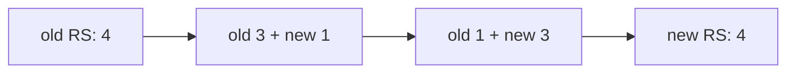
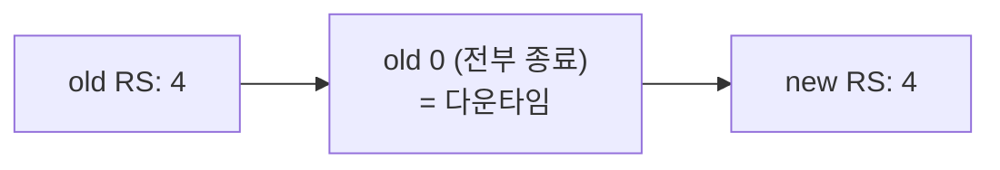

# 27. Rollout — Deployment Strategy

이미지를 바꾸면 Deployment는 옛 Pod을 새 Pod으로 교체합니다. 이 교체가 어떻게 일어나고 어떻게 되돌아가는지의 핵심은 **Deployment가 버전마다 ReplicaSet을 하나씩 남긴다**는 데 있습니다 — 새 배포는 새 ReplicaSet을 만들어 확대하고 옛 ReplicaSet을 축소하며, 축소된 옛 ReplicaSet은 `0`으로 남아 되돌릴 판이 됩니다. 교체 방식은 둘입니다: `RollingUpdate`는 새것과 옛것을 **겹치며** 점진 교체해 무중단을 노리고, `Recreate`는 옛것을 **전부 종료한 뒤** 새것을 만들어 그사이 다운타임을 감수합니다. 이 편은 `set image`로 실제 교체를 일으켜 두 ReplicaSet이 확대·축소하는 것을 보고, `rollout history`로 revision을, `rollout undo`로 나쁜 배포에서의 회복을 확인하며, `Recreate`에서 순간 Pod이 0개가 되는 창을 재현합니다. 이 편의 산출물은 "롤링 교체·되돌리기·Recreate를 각각 재현한 절차"와 "maxSurge·maxUnavailable이 교체 폭을, revision이 되돌릴 지점을 정한다는 경계"입니다.

## 핵심 다이어그램





- **Deployment는 버전마다 ReplicaSet을 남긴다.** 이미지를 바꾸면 새 ReplicaSet을 만들어 확대하고 옛 ReplicaSet을 축소합니다. 옛 ReplicaSet은 지워지지 않고 `0`으로 남아, `undo`가 다시 확대할 대상이 됩니다.
- **RollingUpdate는 겹치며 교체한다.** `maxSurge`(원하는 수보다 얼마나 더 띄워도 되나)와 `maxUnavailable`(얼마나 모자라도 되나)이 교체 폭을 정합니다. `maxUnavailable: 0`이면 준비된 Pod 수가 원하는 수 밑으로 안 내려가 무중단에 가깝습니다.
- **Recreate는 끊고 교체한다.** 옛 Pod을 전부 종료한 뒤 새 Pod을 만듭니다 — 그 사이 준비된 Pod이 0개가 되는 창(다운타임)이 생깁니다. 동시에 두 버전이 떠 있으면 안 되는 앱에 씁니다.
- **undo는 옛 ReplicaSet으로 되돌린다.** `rollout history`로 revision을 확인하고, `rollout undo`로 직전(또는 `--to-revision`으로 지정한) ReplicaSet을 다시 확대합니다.

아래 시연이 이 그림의 각 단계를 한 줄씩 손으로 확인합니다.

## 사전 준비물

이 실습은 **macOS** 환경을 기준으로 합니다.

- **Docker** — Docker Desktop, OrbStack 등. `docker ps`가 에러 없이 돌아가면 OK.
- **Homebrew** — macOS 패키지 관리자.

### kind · kubectl 설치

```bash
brew install kind kubectl
```

### rosa-lab 클러스터 · namespace 준비

```bash
kind create cluster --name rosa-lab
kubectl create namespace rosa-lab
kubectl config set-context --current --namespace=rosa-lab
```

이미 있으면 건너뜁니다 (`kind get clusters`, `kubectl config get-contexts`로 확인).

## 실습 환경

| 파일 | 내용 |
|---|---|
| `manifests/rollout.yaml` | replicas 4, `RollingUpdate`(maxSurge 1 · maxUnavailable 0), readiness 있는 `site` Deployment — 점진 교체·history·undo용 |
| `manifests/recreate.yaml` | replicas 4, `Recreate`인 `recreate` Deployment — 전부 교체 시 다운타임 창 확인용 |

## 여기서 직접 확인할 수 있는 것

### RollingUpdate — 두 ReplicaSet이 확대·축소한다

`site`를 올리고 첫 배포가 끝나길 기다립니다.

```bash
kubectl apply -f manifests/rollout.yaml
kubectl rollout status deployment site -n rosa-lab
```

```
deployment "site" successfully rolled out
```

이미지를 새 버전으로 바꿔 교체를 일으키고, 진행을 지켜봅니다.

```bash
kubectl set image deployment/site nginx=nginx:1.27-alpine -n rosa-lab
kubectl rollout status deployment site -n rosa-lab
```

```
Waiting for deployment "site" rollout to finish: 1 out of 4 new replicas have been updated...
Waiting for deployment "site" rollout to finish: 2 out of 4 new replicas have been updated...
Waiting for deployment "site" rollout to finish: 3 out of 4 new replicas have been updated...
deployment "site" successfully rolled out
```

한 번에 넷을 바꾸지 않고 하나씩 올라갑니다. 그 교체의 실체는 두 ReplicaSet입니다.

```bash
kubectl get rs -n rosa-lab -l app=site
```

```
NAME              DESIRED   CURRENT   READY   AGE
site-6f8c9d7b8    4         4         4       50s
site-7d4b5c8f9    0         0         0       3m
```

새 ReplicaSet이 `4`로 차 있고, 옛 ReplicaSet은 `0`으로 **남아 있습니다**(지워진 게 아닙니다). 교체 중에는 둘이 함께 도는 순간이 있고, `maxSurge: 1`·`maxUnavailable: 0` 때문에 준비된 Pod 수는 내내 4개 이상으로 유지됩니다 — 그래서 교체 중에도 트래픽을 받을 Pod이 끊기지 않습니다. 옛 ReplicaSet이 `0`으로 남는 이유는 아래 `undo`에서 드러납니다.

### maxSurge · maxUnavailable — 교체 폭

방금 교체가 "하나씩"이었던 건 두 값 때문입니다.

- **`maxSurge`**: 롤아웃 중 원하는 수(4)보다 몇 개까지 **더** 띄워도 되나. `1`이면 순간 최대 5개.
- **`maxUnavailable`**: 준비된 Pod이 원하는 수보다 몇 개까지 **모자라도** 되나. `0`이면 4개 밑으로 안 내려감.

`maxUnavailable: 0`은 "먼저 새것을 준비시키고 나서 옛것을 내린다"는 뜻이라 무중단에 가깝지만, 순간 자원을 더 씁니다(surge 몫). 반대로 `maxUnavailable`을 늘리면 옛것을 먼저 내려 자원은 아끼되 그동안 용량이 줍니다. 이 둘이 "빠르게 vs 안전하게"의 손잡이입니다.

### history — 버전 기록

각 교체는 revision으로 남습니다.

```bash
kubectl rollout history deployment site -n rosa-lab
```

```
deployment.apps/site
REVISION  CHANGE-CAUSE
1         <none>
2         <none>
```

`CHANGE-CAUSE`가 `<none>`인 이유는 변경 사유를 기록해 두지 않았기 때문입니다. `kubernetes.io/change-cause` 애노테이션으로 남길 수 있습니다.

```bash
kubectl annotate deployment/site kubernetes.io/change-cause="nginx 1.27" -n rosa-lab --overwrite
kubectl set image deployment/site nginx=nginx:1.27-alpine -n rosa-lab   # 이미 1.27이면 no-op
kubectl rollout history deployment site -n rosa-lab
```

```
deployment.apps/site
REVISION  CHANGE-CAUSE
1         <none>
2         nginx 1.27
```

특정 revision의 내용(어떤 이미지였는지 등)은 번호로 볼 수 있습니다.

```bash
kubectl rollout history deployment site -n rosa-lab --revision=1
```

```
deployment.apps/site with revision #1
Pod Template:
  Labels:  app=site
  Containers:
   nginx:
    Image:  nginx:1.25-alpine
    ...
```

### undo — 나쁜 배포에서 되돌린다

존재하지 않는 이미지로 교체를 걸어 롤아웃이 막히는 상황을 만듭니다.

```bash
kubectl set image deployment/site nginx=nginx:does-not-exist-9999 -n rosa-lab
kubectl rollout status deployment site -n rosa-lab --timeout=30s
```

```
Waiting for deployment "site" rollout to finish: 1 out of 4 new replicas have been updated...
error: timed out waiting for the condition
```

막혔지만, `maxUnavailable: 0` 덕분에 옛 Pod들은 그대로 떠 있습니다 — 새 Pod만 이미지를 못 받고 멈춰 있습니다.

```bash
kubectl get pods -n rosa-lab -l app=site
```

```
NAME              READY   STATUS             RESTARTS   AGE
site-6f8c9d7b8-2xk9p   1/1   Running            0        5m
site-6f8c9d7b8-7nb4c   1/1   Running            0        5m
site-6f8c9d7b8-9wzt2   1/1   Running            0        5m
site-6f8c9d7b8-q6r8d   1/1   Running            0        5m
site-59c7f6b44-h2mkt   0/1   ImagePullBackOff   0        40s
```

옛 ReplicaSet의 Pod 4개가 살아 서비스를 이어 가는 동안, 새 Pod 하나만 `ImagePullBackOff`로 걸려 있습니다 — 이게 `maxUnavailable: 0`이 사고를 막는 방식입니다. 되돌립니다.

```bash
kubectl rollout undo deployment site -n rosa-lab
kubectl rollout status deployment site -n rosa-lab
```

```
deployment.apps/site rolled back
deployment "site" successfully rolled out
```

`undo`는 새 revision을 하나 더 만들되 그 내용이 직전 정상 ReplicaSet과 같습니다 — 앞에서 `0`으로 남겨 둔 옛 ReplicaSet을 다시 확대한 것입니다. 특정 지점으로 가려면 번호를 지정합니다.

```bash
kubectl rollout undo deployment site -n rosa-lab --to-revision=1
```

되돌릴 수 있는 과거의 깊이는 `revisionHistoryLimit`(기본 10)이 정합니다 — 그보다 오래된 ReplicaSet은 정리되어 `undo` 대상에서 사라집니다.

### Recreate — 전부 종료 후 교체(다운타임)

`Recreate`는 겹치지 않습니다. `recreate`를 올리고 교체하며 Pod 수를 지켜봅니다.

```bash
kubectl apply -f manifests/recreate.yaml
kubectl rollout status deployment recreate -n rosa-lab
kubectl set image deployment/recreate nginx=nginx:1.27-alpine -n rosa-lab
kubectl get pods -n rosa-lab -l app=recreate -w   # 잠시 관찰 후 Ctrl-C
```

```
NAME                        READY   STATUS        RESTARTS   AGE
recreate-5d8c...-abc        1/1     Terminating   0          40s
recreate-5d8c...-def        1/1     Terminating   0          40s
recreate-5d8c...-ghi        1/1     Terminating   0          40s
recreate-5d8c...-jkl        1/1     Terminating   0          40s
recreate-7f4b...-mno        0/1     Pending       0          0s
recreate-7f4b...-mno        0/1     ContainerCreating   0    1s
recreate-7f4b...-mno        1/1     Running       0          3s
...
```

옛 Pod 넷이 **모두** `Terminating`이 된 뒤에야 새 Pod이 만들어집니다. 그 사이 준비된 Pod이 0개가 되는 창 — 다운타임 — 이 있습니다. `RollingUpdate`와 대비되는 지점이고, `Recreate`를 쓰는 이유는 무중단을 포기해서가 아니라 **두 버전이 동시에 떠 있으면 안 되는** 경우(같은 볼륨을 배타적으로 쓰거나, 스키마가 호환되지 않는 등) 때문입니다.

### pause · resume · restart

롤아웃을 다루는 나머지 명령입니다.

```bash
# 여러 변경을 한 번에 내보내기 위해 롤아웃을 멈춰 두고, 다 바꾼 뒤 재개
kubectl rollout pause deployment site -n rosa-lab
kubectl set image deployment/site nginx=nginx:1.27-alpine -n rosa-lab
kubectl set resources deployment/site -c nginx --limits=cpu=200m -n rosa-lab
kubectl rollout resume deployment site -n rosa-lab   # 여기서 한 번에 교체

# 이미지 변경 없이 Pod만 새로 교체(같은 롤링 규칙으로)
kubectl rollout restart deployment site -n rosa-lab
```

`pause`는 교체를 멈춰 여러 수정이 각각 롤아웃을 일으키지 않게 모으고, `resume`이 한 번에 내보냅니다. `restart`는 이미지가 그대로여도 Pod을 롤링 규칙에 맞춰 새로 교체합니다 — 설정을 다시 읽히거나 상태를 리셋할 때 씁니다.

### 정리

```bash
kubectl delete -f manifests/recreate.yaml --ignore-not-found
kubectl delete -f manifests/rollout.yaml --ignore-not-found
```

클러스터까지 정리하려면:

```bash
kind delete cluster --name rosa-lab
```

## 이 편의 산출물

- 이미지 교체가 **두 ReplicaSet의 확대·축소**로 일어나며, 옛 ReplicaSet이 `0`으로 남아 되돌릴 판이 된다는 것을 `kubectl get rs`로 확인한 상태.
- `RollingUpdate`의 `maxSurge`·`maxUnavailable`이 교체 폭("빠르게 vs 안전하게")을 정하고, `maxUnavailable: 0`이 롤아웃 중에도 준비된 Pod 수를 유지해 무중단에 가깝게 만든다는 것을 확인한 경험.
- `rollout history`로 revision과 `CHANGE-CAUSE`(애노테이션으로 기록), `--revision=N`으로 과거 내용까지 본 상태.
- 없는 이미지로 막힌 롤아웃에서 옛 Pod이 살아 서비스를 잇는 동안 새 Pod만 `ImagePullBackOff`로 걸리는 것을 보고, **`rollout undo`**(및 `--to-revision`)로 옛 ReplicaSet을 다시 확대해 회복한 경험 — 되돌림 깊이가 `revisionHistoryLimit`에 묶인다는 경계 포함.
- **`Recreate`**가 옛 Pod을 전부 종료한 뒤 새것을 만들어 준비된 Pod이 0개가 되는 다운타임 창을 만든다는 것을 `-w`로 확인하고, 두 버전 공존 불가한 앱에 쓰는 이유를 정리한 상태.
- `rollout pause`/`resume`(여러 변경을 한 번에)과 `rollout restart`(이미지 변경 없이 Pod 교체)의 쓰임을 확인한 상태.
