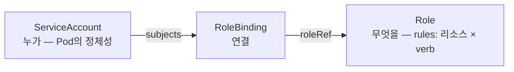
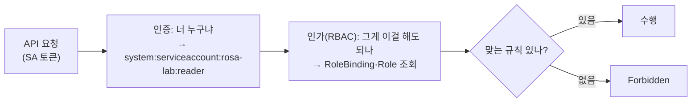

# 28. RBAC — ServiceAccount · Role · 최소 권한

클러스터에 오는 API 요청은 저장되기 전 "이 요청자가 이 동작을 해도 되나"를 통과해야 합니다. 그걸 정하는 게 RBAC(Role-Based Access Control)이고, 세 조각으로 나뉩니다 — **누가**(Subject: 사용자·그룹·ServiceAccount), **무엇을**(Role/ClusterRole: `리소스 × 동작(verb)`의 목록), 그리고 그 둘을 잇는 **연결**(RoleBinding/ClusterRoleBinding)입니다. Pod이 API에 말할 때 쓰는 정체성은 ServiceAccount이고, 여기에 어떤 Role을 어떤 RoleBinding으로 붙였느냐가 그 Pod이 할 수 있는 일의 전부입니다. RBAC는 규칙을 **더하기만** 하고 아무 규칙도 안 맞으면 거부하므로, 최소 권한은 곧 "필요한 리소스·동작만 골라 더한다"입니다. 이 편은 ServiceAccount를 만들어 Pod에 붙이고, 권한이 없을 때의 `Forbidden`부터 시작해 Role·RoleBinding으로 딱 pods 읽기만 열고, delete·다른 namespace·다른 리소스는 여전히 막히는 것을 확인합니다. 이 편의 산출물은 "SA → Role → RoleBinding으로 권한을 한 칸씩 여는 절차"와 "verb·resource·namespace 세 축으로 권한이 좁혀진다는 경계", 그리고 "`kubectl auth can-i`로 그 경계를 검증하는 법"입니다.

## 핵심 다이어그램





- **RBAC는 세 조각이다.** 누가(Subject)·무엇을(Role/ClusterRole)·연결(Binding). 셋이 다 있어야 권한이 생깁니다 — Role만 만들고 안 이으면 아무 일도 안 일어납니다.
- **Pod의 정체성은 ServiceAccount다.** `serviceAccountName`을 지정하지 않으면 그 namespace의 `default` SA가 붙는데, 기본 상태의 `default`는 사실상 아무 권한이 없습니다.
- **Role은 namespace 안, ClusterRole은 클러스터 범위다.** Role/RoleBinding은 한 namespace에만 적용됩니다. 노드처럼 namespace가 없는 리소스나 여러 namespace에 걸친 권한은 ClusterRole/ClusterRoleBinding입니다.
- **RBAC는 더하기만 한다.** 거부 규칙이 없고, 맞는 허용 규칙이 하나도 없으면 기본 거부입니다. 그래서 최소 권한 = "필요한 리소스·동작만 골라 더한다".

아래 시연이 이 그림의 각 지점을 한 줄씩 손으로 확인합니다.

## 사전 준비물

이 실습은 **macOS** 환경을 기준으로 합니다.

- **Docker** — Docker Desktop, OrbStack 등. `docker ps`가 에러 없이 돌아가면 OK.
- **Homebrew** — macOS 패키지 관리자.

### kind · kubectl 설치

```bash
brew install kind kubectl
```

### rosa-lab 클러스터 · namespace 준비

```bash
kind create cluster --name rosa-lab
kubectl create namespace rosa-lab
kubectl config set-context --current --namespace=rosa-lab
```

이미 있으면 건너뜁니다 (`kind get clusters`, `kubectl config get-contexts`로 확인).

## 실습 환경

| 파일 | 내용 |
|---|---|
| `manifests/serviceaccount.yaml` | Pod에 붙일 정체성 `reader` ServiceAccount |
| `manifests/client.yaml` | `reader` SA로 API에 말하는 `client` Pod — 안에 `kubectl`이 든 이미지 |
| `manifests/role.yaml` | pods를 `get/list/watch`만 허용하는 `pod-reader` Role + 그걸 `reader` SA에 잇는 RoleBinding |

## 여기서 직접 확인할 수 있는 것

### ServiceAccount — 정체성은 있지만 권한은 없다

SA와, 그 SA로 말하는 클라이언트 Pod을 올립니다. 아직 어떤 Role도 붙이지 않았습니다.

```bash
kubectl apply -f manifests/serviceaccount.yaml
kubectl apply -f manifests/client.yaml
kubectl wait --for=condition=Ready pod/client -n rosa-lab --timeout=90s
```

이 Pod 안에서 `kubectl`은 마운트된 SA 토큰으로 API에 붙습니다 — 클러스터 안이라 별도 설정 없이 `reader`의 정체성을 씁니다. pods를 나열해 봅니다.

```bash
kubectl exec client -n rosa-lab -- kubectl get pods
```

```
Error from server (Forbidden): pods is forbidden: User "system:serviceaccount:rosa-lab:reader" cannot list resource "pods" in API group "" in the namespace "rosa-lab"
```

인증(너는 누구냐)은 통과했습니다 — 메시지가 `system:serviceaccount:rosa-lab:reader`로 요청자를 정확히 부릅니다. 막힌 건 인가입니다: `reader`에 `list pods`를 허용하는 규칙이 하나도 없으니 기본 거부입니다. 정체성이 있다고 권한이 따라오지 않습니다.

### Role + RoleBinding — 딱 한 칸을 연다

`pod-reader` Role(pods `get/list/watch`)과, 그걸 `reader`에 잇는 RoleBinding을 함께 올립니다.

```bash
kubectl apply -f manifests/role.yaml
kubectl exec client -n rosa-lab -- kubectl get pods
```

```
NAME     READY   STATUS    RESTARTS   AGE
client   1/1     Running   0          70s
```

방금 `Forbidden`이던 요청이 통과했습니다. 바뀐 건 Role 규칙 세 verb와, 그 Role을 `reader`에 이은 RoleBinding 하나뿐입니다. 이 두 개가 있어야 — Role만도, Binding만도 아니고 — 권한이 생깁니다.

### verb 경계 — 읽기는 되고 쓰기는 안 된다

Role에 넣은 verb는 `get/list/watch`뿐입니다. 같은 pods라도 `delete`는 그 목록에 없습니다.

```bash
kubectl exec client -n rosa-lab -- kubectl delete pod client
```

```
Error from server (Forbidden): pods "client" is forbidden: User "system:serviceaccount:rosa-lab:reader" cannot delete resource "pods" in API group "" in the namespace "rosa-lab"
```

읽을 수는 있어도 지울 수는 없습니다. 리소스가 달라도 마찬가지입니다 — Role은 `pods`만 허용하므로 `secrets`는 읽기조차 막힙니다.

```bash
kubectl exec client -n rosa-lab -- kubectl get secrets
```

```
Error from server (Forbidden): secrets is forbidden: User "system:serviceaccount:rosa-lab:reader" cannot list resource "secrets" in API group "" in the namespace "rosa-lab"
```

권한은 `리소스 × verb`의 격자에서 **켠 칸만** 열립니다. `pods × {get,list,watch}`만 켰으니 `pods × delete`도, `secrets × list`도 꺼진 채입니다.

### namespace 경계 — 이 namespace 안에서만

RoleBinding은 자기가 놓인 namespace(`rosa-lab`)에만 적용됩니다. 같은 pods라도 다른 namespace 것은 못 봅니다.

```bash
kubectl exec client -n rosa-lab -- kubectl get pods -n kube-system
```

```
Error from server (Forbidden): pods is forbidden: User "system:serviceaccount:rosa-lab:reader" cannot list resource "pods" in API group "" in the namespace "kube-system"
```

`kube-system`의 pods를 보려면 그 namespace에 또 다른 RoleBinding이 있거나, 클러스터 전체를 여는 ClusterRoleBinding이 필요합니다. 지금은 `rosa-lab` 한 칸만 열려 있습니다 — 권한의 세 번째 축이 namespace입니다.

### auth can-i — 경계를 밖에서 검증한다

Pod 안에서 실제로 실행해 보지 않아도, 관리자는 `kubectl auth can-i`로 특정 주체가 무엇을 할 수 있는지 물을 수 있습니다. `--as`로 그 SA를 흉내 냅니다.

```bash
kubectl auth can-i list pods   -n rosa-lab --as=system:serviceaccount:rosa-lab:reader
kubectl auth can-i delete pods -n rosa-lab --as=system:serviceaccount:rosa-lab:reader
kubectl auth can-i list secrets -n rosa-lab --as=system:serviceaccount:rosa-lab:reader
```

```
yes
no
no
```

앞에서 Pod으로 확인한 경계와 정확히 같습니다. 허용된 것을 한눈에 보려면 `--list`입니다.

```bash
kubectl auth can-i --list -n rosa-lab --as=system:serviceaccount:rosa-lab:reader
```

```
Resources   Non-Resource URLs   Resource Names   Verbs
pods        []                  []               [get list watch]
...
```

같은 명령을 Pod 안에서 `--as` 없이 실행하면(자기 자신에 대해) 같은 답이 나옵니다 — 권한 문제를 디버깅할 때 "실제로 지우지 않고 물어보는" 방법입니다.

```bash
kubectl exec client -n rosa-lab -- kubectl auth can-i list pods
```

```
yes
```

### Role vs ClusterRole — 범위의 차이

지금까지는 Role/RoleBinding(한 namespace)만 썼습니다. 클러스터 범위가 필요할 때 ClusterRole/ClusterRoleBinding으로 올라갑니다.

| | 범위 | 쓰는 곳 |
|---|---|---|
| **Role** | 한 namespace | 그 namespace 안의 리소스(pods·configmaps 등) |
| **ClusterRole** | 클러스터 전체 | namespace 없는 리소스(nodes·PV 등), 또는 여러 namespace에서 재사용할 규칙 |
| **RoleBinding** | 한 namespace | Role 또는 **ClusterRole**을 그 namespace에만 적용 |
| **ClusterRoleBinding** | 클러스터 전체 | ClusterRole을 모든 namespace에 적용 |

핵심 조합 하나: **ClusterRole을 RoleBinding으로 붙이면** 그 ClusterRole의 규칙이 그 namespace 안에서만 적용됩니다. 그래서 "pods 읽기" 같은 규칙은 ClusterRole로 한 번 정의해 두고, namespace마다 RoleBinding으로 붙여 재사용하는 식으로 씁니다 — 규칙은 공유하되 범위는 좁게 유지합니다.

### 정리

```bash
kubectl delete -f manifests/role.yaml --ignore-not-found
kubectl delete -f manifests/client.yaml --ignore-not-found
kubectl delete -f manifests/serviceaccount.yaml --ignore-not-found
```

클러스터까지 정리하려면:

```bash
kind delete cluster --name rosa-lab
```

## 이 편의 산출물

- **ServiceAccount**가 Pod의 정체성일 뿐 권한은 아니라는 것을, Role을 붙이기 전 `list pods`가 `Forbidden`(`system:serviceaccount:rosa-lab:reader`)으로 막히는 것으로 확인한 상태.
- **Role + RoleBinding**을 함께 올려야 권한이 생긴다는 것(둘 중 하나만으로는 안 됨)을, 같은 요청이 통과하는 것으로 확인한 경험.
- 권한이 `리소스 × verb × namespace` 세 축의 **켠 칸만** 열린다는 것을, `pods × delete`·`secrets × list`·`kube-system의 pods`가 각각 여전히 `Forbidden`인 것으로 확인한 상태.
- **`kubectl auth can-i`**(`--as`·`--list`)로 실제 실행 없이 주체의 권한 경계를 밖에서 검증하고, Pod 안에서 자기 권한을 묻는 법까지 확인한 경험.
- **Role vs ClusterRole**, **RoleBinding vs ClusterRoleBinding**의 범위 차이와, "ClusterRole을 RoleBinding으로 붙여 규칙은 공유하고 범위는 좁게"라는 재사용 방식을 정리한 상태.
