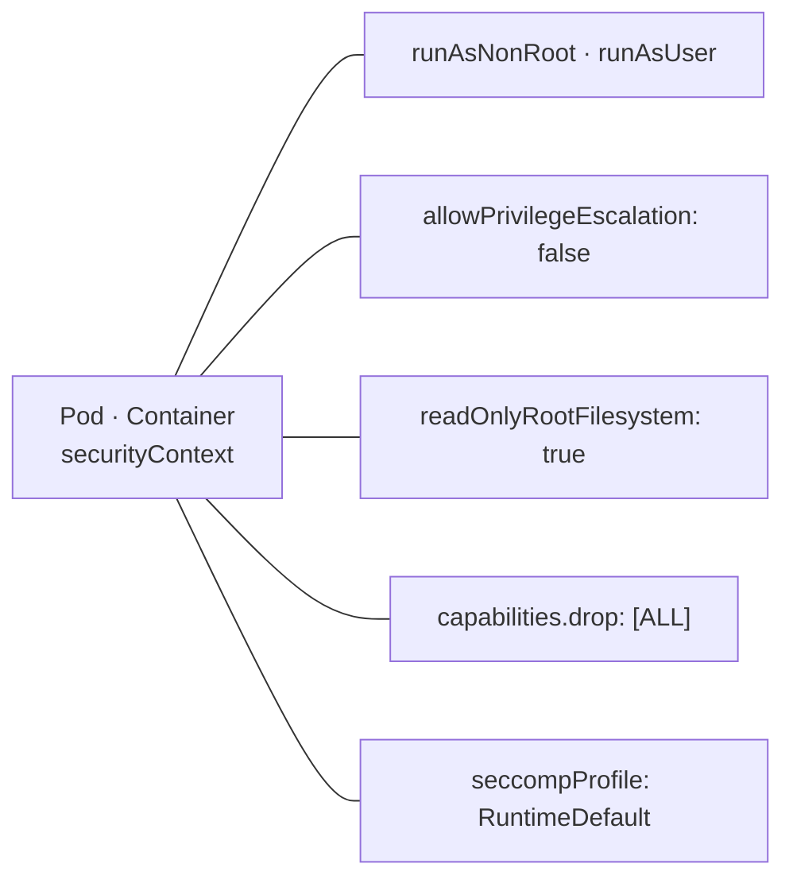
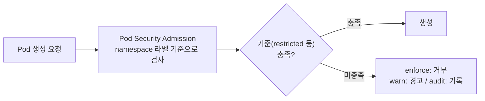

# 29. SecurityContext · Pod Security

컨테이너는 기본값으로 두면 root(uid 0)로 돌고, 루트 파일시스템에 쓰고, 여러 리눅스 capability를 들고 있습니다 — 필요보다 넓은 권한입니다. 이 편은 그 권한을 두 층에서 좁힙니다. 첫째, **securityContext**로 Pod·컨테이너가 스스로 권한을 내려놓습니다: root로 안 돌고(runAsNonRoot), 권한 상승을 막고(allowPrivilegeEscalation), 루트 FS를 읽기전용으로 하고(readOnlyRootFilesystem), capability를 전부 버리고(drop ALL), 위험한 syscall을 막습니다(seccomp). 둘째, 이건 Pod마다 직접 켜는 opt-in이라 빠뜨리면 그냥 root로 도는 문제를, **Pod Security Admission**이 namespace 라벨로 최소 기준을 강제해 막습니다 — 기준을 못 지키는 Pod은 생성 단계에서 거부됩니다. 이 편은 아무 설정 없는 Pod이 root로 도는 것부터 확인하고, 하드닝한 Pod에서 uid·capability·읽기전용이 실제로 걸리는 것을 `/proc`으로 보고, restricted namespace가 설정 빠진 Pod을 거부하는 것을 재현합니다. 이 편의 산출물은 "컨테이너 권한을 줄이는 securityContext 한 벌"과 "그 기준을 namespace에서 강제하는 Pod Security의 경계"입니다.

## 핵심 다이어그램





- **securityContext는 컨테이너가 가질 권한을 줄인다.** root 회피·권한 상승 차단·루트 FS 읽기전용·capability 제거·seccomp — 각각이 "필요 없는 능력"을 하나씩 떼어 냅니다.
- **그건 Pod마다 켜는 opt-in이다.** 아무것도 안 쓰면 컨테이너는 기본값(root·읽기쓰기·기본 capability)으로 돕니다. 빠뜨리기 쉽다는 것이 두 번째 층이 필요한 이유입니다.
- **Pod Security Admission은 namespace가 기준을 강제한다.** 라벨 하나로, 그 namespace의 모든 Pod이 표준을 만족하는지 생성 시점에 검사합니다. 표준은 셋(`privileged`·`baseline`·`restricted`), 모드도 셋(`enforce`·`audit`·`warn`)입니다.
- **둘은 역할이 다르다.** securityContext는 "각 Pod이 스스로 좁히는 것", Pod Security는 "namespace가 최소 기준 미달을 막는 것". 앞은 매니페스트에, 뒤는 namespace 라벨에 있습니다.

아래 시연이 이 두 층을 하나씩 손으로 확인합니다.

## 사전 준비물

이 실습은 **macOS** 환경을 기준으로 합니다.

- **Docker** — Docker Desktop, OrbStack 등. `docker ps`가 에러 없이 돌아가면 OK.
- **Homebrew** — macOS 패키지 관리자.

### kind · kubectl 설치

```bash
brew install kind kubectl
```

### rosa-lab 클러스터 · namespace 준비

```bash
kind create cluster --name rosa-lab
kubectl create namespace rosa-lab
kubectl config set-context --current --namespace=rosa-lab
```

이미 있으면 건너뜁니다 (`kind get clusters`, `kubectl config get-contexts`로 확인). Pod Security Admission은 kube-apiserver에 기본 내장되어 있어 별도 설치가 없습니다.

## 실습 환경

| 파일 | 내용 |
|---|---|
| `manifests/root.yaml` | securityContext가 없는 `root` Pod — 기본값(root·읽기쓰기)으로 도는 것 확인용 |
| `manifests/hardened.yaml` | runAsNonRoot·drop ALL·readOnlyRootFilesystem·seccomp를 건 `hardened` Pod |
| `manifests/restricted-ns.yaml` | `restricted` 표준을 `enforce`하는 `secure` namespace |

## 여기서 직접 확인할 수 있는 것

### 기본값 — 컨테이너는 root로 돈다

아무 설정 없는 Pod을 올려 안에서 자기 신원을 봅니다.

```bash
kubectl apply -f manifests/root.yaml -n rosa-lab
kubectl wait --for=condition=Ready pod/root -n rosa-lab --timeout=60s
kubectl exec root -n rosa-lab -- id
```

```
uid=0(root) gid=0(root) groups=0(root),10(wheel)
```

`uid=0(root)` — 컨테이너 안 프로세스가 root입니다. 루트 파일시스템에도 그대로 씁니다.

```bash
kubectl exec root -n rosa-lab -- sh -c 'echo hi > /root/marker && echo "wrote /root/marker"'
```

```
wrote /root/marker
```

특별히 위험한 설정을 한 게 아니라, **기본값이 이렇습니다**. 컨테이너가 뚫렸을 때 root·쓰기 가능한 FS·기본 capability가 그대로 공격 표면이 됩니다. 여기서부터 하나씩 떼어 냅니다.

### hardened — uid·capability·읽기전용을 실제로 건다

`hardened` Pod은 securityContext로 권한을 내려놓았습니다. 올리고 같은 것을 물어봅니다.

```bash
kubectl apply -f manifests/hardened.yaml -n rosa-lab
kubectl wait --for=condition=Ready pod/hardened -n rosa-lab --timeout=60s
kubectl exec hardened -n rosa-lab -- id
```

```
uid=1000 gid=0(root) groups=0(root)
```

`uid=1000` — 더 이상 root가 아닙니다(`runAsUser: 1000`). 루트 파일시스템에 쓰려 하면 막힙니다.

```bash
kubectl exec hardened -n rosa-lab -- sh -c 'echo hi > /tmp/marker'
```

```
sh: can't create /tmp/marker: Read-only file system
command terminated with exit code 1
```

`readOnlyRootFilesystem: true`가 걸려 있어 씁기가 거부됩니다(쓸 곳이 필요하면 `emptyDir` 볼륨을 그 경로에만 붙입니다). 나머지 설정은 커널이 프로세스에 매긴 값으로 확인됩니다.

```bash
kubectl exec hardened -n rosa-lab -- sh -c 'grep -E "NoNewPrivs|CapEff" /proc/1/status'
```

```
NoNewPrivs:	1
CapEff:	0000000000000000
```

- **`NoNewPrivs: 1`**: `allowPrivilegeEscalation: false`의 결과 — setuid 등으로 권한을 새로 얻는 길이 막혔습니다.
- **`CapEff: 0000000000000000`**: `capabilities.drop: ["ALL"]`의 결과 — 유효 capability가 하나도 없습니다. 기본 컨테이너라면 여기에 `NET_RAW` 등 여러 개가 켜져 있습니다.

`runAsNonRoot: true`는 한 겹 더입니다 — 만약 이미지가 root로 시작하도록 만들어졌다면 kubelet이 컨테이너를 **아예 시작하지 않고** `CreateContainerConfigError`로 막습니다. "root면 안 돌린다"를 설정이 강제합니다.

### Pod Security — namespace가 기준을 강제한다

`hardened`는 잘 짰지만, 누군가 securityContext를 빠뜨린 Pod을 올리면 그건 그냥 root로 돕니다(앞의 `root`처럼). Pod Security Admission은 그런 Pod이 특정 namespace에 아예 못 들어오게 합니다. `restricted`를 `enforce`하는 namespace를 만듭니다.

```bash
kubectl apply -f manifests/restricted-ns.yaml
```

이제 설정 없는 `root` Pod을 그 namespace에 넣어 봅니다.

```bash
kubectl apply -f manifests/root.yaml -n secure
```

```
Error from server (Forbidden): error when creating "manifests/root.yaml": pods "root" is forbidden: violates PodSecurity "restricted:latest": allowPrivilegeEscalation != false (container "app" must set securityContext.allowPrivilegeEscalation=false), unrestricted capabilities (container "app" must set securityContext.capabilities.drop=["ALL"]), runAsNonRoot != true (pod or container "app" must set securityContext.runAsNonRoot=true), seccompProfile (pod or container "app" must set securityContext.seccompProfile.type to "RuntimeDefault" or "Localhost")
```

생성 자체가 거부됐고, 메시지가 **무엇이 모자란지**를 항목별로 짚습니다 — restricted 표준이 요구하는 네 가지입니다. 같은 이름의 `hardened`는 그 네 가지를 이미 갖췄으니 통과합니다.

```bash
kubectl apply -f manifests/hardened.yaml -n secure
```

```
pod/hardened created
```

securityContext(각 Pod이 스스로 좁힘)와 Pod Security(namespace가 미달을 막음)가 여기서 맞물립니다 — restricted namespace에 들어가려면 앞 절의 하드닝을 어차피 해야 합니다. 강제 여부는 라벨 하나로 조절합니다.

- **표준**: `privileged`(제한 없음) · `baseline`(최소한의 위험만 차단) · `restricted`(방금 본 강한 기준).
- **모드**: `enforce`(위반 시 거부) · `warn`(생성은 되되 경고) · `audit`(감사 로그에만 기록). 한 namespace에 세 모드를 동시에 걸 수 있습니다.

`enforce` 없이 `warn`만 걸면, 막지는 않되 어떤 Pod이 기준을 어기는지 먼저 파악할 수 있습니다 — 기존 워크로드가 있는 namespace를 restricted로 옮기기 전에 영향 범위를 보는 방법입니다.

### 정리

```bash
kubectl delete -f manifests/hardened.yaml -n secure --ignore-not-found
kubectl delete -f manifests/restricted-ns.yaml --ignore-not-found
kubectl delete -f manifests/hardened.yaml -n rosa-lab --ignore-not-found
kubectl delete -f manifests/root.yaml -n rosa-lab --ignore-not-found
```

클러스터까지 정리하려면:

```bash
kind delete cluster --name rosa-lab
```

## 이 편의 산출물

- 아무 설정 없는 컨테이너가 **기본값으로 root(uid 0)·쓰기 가능한 루트 FS**로 돈다는 것을 `id`와 `/root`에 쓰기로 확인한 상태.
- **securityContext**의 각 설정이 실제로 걸린다는 것을, `hardened` Pod에서 `uid=1000`, `/tmp` 쓰기의 `Read-only file system`, `/proc/1/status`의 `NoNewPrivs: 1`·`CapEff: 0000...0`으로 확인한 경험 — `runAsNonRoot`가 root 이미지의 시작 자체를 막는다는 것 포함.
- securityContext가 **Pod마다 켜는 opt-in**이라 빠뜨리면 root로 돈다는 것과, 그걸 **Pod Security Admission**이 namespace 라벨로 막는다는 두 층의 역할 분담을 정리한 상태.
- `restricted`를 `enforce`하는 namespace가 설정 빠진 Pod을 **생성 단계에서 항목별 사유와 함께 거부**하고, 하드닝한 Pod은 통과시키는 것을 재현한 경험.
- Pod Security의 세 **표준**(`privileged`·`baseline`·`restricted`)과 세 **모드**(`enforce`·`warn`·`audit`), 그리고 `warn`으로 먼저 영향 범위를 보는 방식까지의 경계를 그은 상태.
