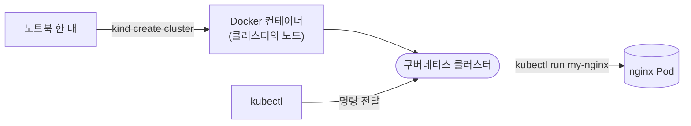

# 3. `kind`로 시작하는 쿠버네티스 클러스터

노트북 한 대 위에 kind로 클러스터를 띄우고, kubectl로 노드를 확인하고, 첫 nginx Pod 하나를 올려보는 실습 공간입니다.

## 관련 글

* [`kind`로 시작하는 쿠버네티스 클러스터](https://rog.idwwt.com/@rosa/kind%EB%A1%9C-%EC%8B%9C%EC%9E%91%ED%95%98%EB%8A%94-%EC%BF%A0%EB%B2%84%EB%84%A4%ED%8B%B0%EC%8A%A4-%ED%81%B4%EB%9F%AC%EC%8A%A4%ED%84%B0)

## 핵심 다이어그램



- **kind**는 Docker 컨테이너 하나를 클러스터의 **노드 하나**로 사용합니다. 물리 서버 대신 컨테이너 위에 클러스터가 올라갑니다.
- **kubectl**은 클러스터에 명령을 전달하는 창구입니다. 노드 목록을 보거나 Pod를 만드는 일이 모두 kubectl을 거칩니다.
- **Pod**는 쿠버네티스가 컨테이너를 실행하는 가장 작은 단위입니다. nginx 컨테이너 하나를 Pod로 감싸 띄웁니다.

아래 시연이 이 그림의 각 지점을 한 줄씩 손으로 확인합니다.

## 사전 준비물

이 실습은 **macOS** 환경을 기준으로 합니다. 다음 도구가 갖춰져 있어야 합니다.

- **Docker** — kind는 Docker 컨테이너를 클러스터의 노드로 띄우므로 Docker가 실행 중이어야 합니다. Docker Desktop, OrbStack 등 어느 것이든 됩니다. Docker가 실행 중이지 않으면 `kind create cluster`가 실패합니다.
  - 확인: `docker ps`가 에러 없이 돌아가면 OK.
- **Homebrew** — kind와 kubectl을 설치하는 macOS 패키지 관리자입니다. 설치되어 있지 않다면 [brew.sh](https://brew.sh)의 안내를 따라 먼저 설치합니다.
- **make** — Makefile 실행에 사용합니다. macOS는 Xcode Command Line Tools(`xcode-select --install`)에 포함되어 있습니다.

### kind와 kubectl 설치

Homebrew로 한 줄에 설치합니다.

```bash
brew install kind kubectl
```

설치 확인.

```bash
kind version
kubectl version --client
```

## 실습 환경

이 폴더의 실습이 만드는 환경은 다음과 같습니다.

- **클러스터** — kind로 띄우는 단일 노드 쿠버네티스 클러스터. 이름은 `rosa-lab`.
- **노드** — Docker 컨테이너 하나(`rosa-lab-control-plane`)가 클러스터의 control-plane 노드 역할.
- **Pod** — nginx 이미지로 띄운 Pod 하나. 이름은 `my-nginx`.

클러스터·노드·Pod가 모두 한 노트북 위 Docker 컨테이너 안에서 동작합니다. `make down`으로 정리하면 노트북에는 흔적이 남지 않습니다.

## 빠른 시작

```bash
make up      # 클러스터 생성
make demo    # 노드 확인 + nginx Pod 실행 + 상태 확인
make down    # 클러스터 정리
```

각 명령이 실제로 무엇을 실행하는지는 아래 [여기서 직접 확인할 수 있는 것](#여기서-직접-확인할-수-있는-것)에서 한 줄씩 따라갑니다.

## 여기서 직접 확인할 수 있는 것

각 단계의 명령을 한 줄씩 실행하면서, 무엇이 일어나는지 봅니다.

### kind가 띄운 노드는 사실 Docker 컨테이너 하나입니다

먼저 클러스터를 띄웁니다.

```bash
$ kind create cluster --name rosa-lab
Creating cluster "rosa-lab" ...
 ✓ Ensuring node image (kindest/node:v1.36.1) 🖼
 ✓ Preparing nodes 📦
 ✓ Writing configuration 📜
 ✓ Starting control-plane 🕹️
 ✓ Installing CNI 🔌
 ✓ Installing StorageClass 💾
Set kubectl context to "kind-rosa-lab"
You can now use your cluster with:

kubectl cluster-info --context kind-rosa-lab

Thanks for using kind! 😊
```

`--name rosa-lab`로 클러스터 이름을 명시합니다. 이름을 주지 않으면 kind는 기본 이름 `kind`로 클러스터를 만듭니다.

생성이 끝나면 Docker 컨테이너 하나가 새로 떠 있는 것을 확인할 수 있습니다.

```bash
$ docker ps --filter "name=rosa-lab" --format "table {{.Names}}\t{{.Status}}"
NAMES                    STATUS
rosa-lab-control-plane   Up 12 seconds
```

이 컨테이너가 곧 클러스터의 노드입니다. 물리 서버 대신 컨테이너 하나가 노드 역할을 합니다.

### kubectl로 노드 목록을 확인할 수 있습니다

쿠버네티스에 명령을 내리는 도구는 `kubectl`입니다. 클러스터의 노드 목록을 봅니다.

```bash
$ kubectl get nodes
NAME                     STATUS   ROLES           AGE   VERSION
rosa-lab-control-plane   Ready    control-plane   20s   v1.36.1
```

`NAME`은 위에서 본 Docker 컨테이너 이름과 같습니다. `STATUS`가 `Ready`로 표시되면 클러스터가 명령을 받을 준비가 됐다는 뜻입니다.

### 쿠버네티스는 컨테이너를 Pod라는 단위로 감쌉니다

쿠버네티스는 컨테이너를 직접 실행하지 않습니다. **Pod**라는 단위로 감싸서 실행합니다. Pod는 쿠버네티스가 컨테이너를 실행하는 가장 작은 단위입니다.

nginx 이미지로 Pod를 하나 띄워 봅니다.

```bash
$ kubectl run my-nginx --image=nginx
pod/my-nginx created
```

`my-nginx`는 Pod 이름, `--image=nginx`는 그 안에서 실행할 컨테이너 이미지입니다.

### Pod 상태가 `Running`이면 컨테이너가 동작 중입니다

```bash
$ kubectl get pods
NAME       READY   STATUS    RESTARTS   AGE
my-nginx   1/1     Running   0          18s
```

`STATUS`가 `Running`이면 Pod 안의 nginx 컨테이너가 클러스터 위에서 동작 중입니다.

처음 실행했을 때는 이미지를 받는 시간 때문에 `ContainerCreating`으로 나타날 수 있습니다. 잠시 후 다시 확인하면 `Running`으로 바뀝니다.

### 클러스터는 한 줄로 정리합니다

다 쓰고 난 클러스터는 다음 한 줄로 통째로 제거할 수 있습니다.

```bash
$ kind delete cluster --name rosa-lab
Deleting cluster "rosa-lab" ...
Deleted nodes: ["rosa-lab-control-plane"]
```

이 명령은 위에서 본 Docker 컨테이너를 내려 클러스터를 함께 제거합니다. 노트북에는 흔적이 남지 않습니다.
