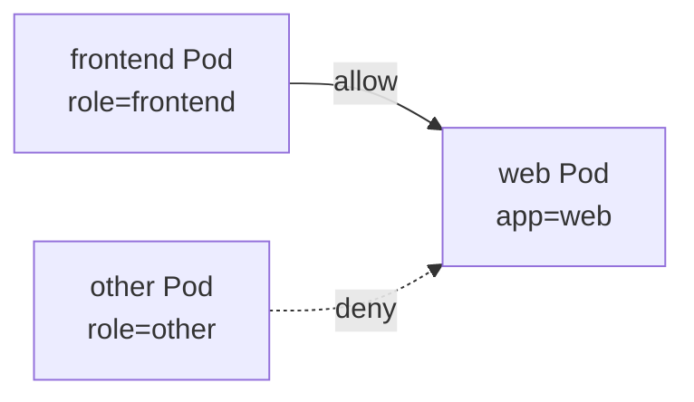
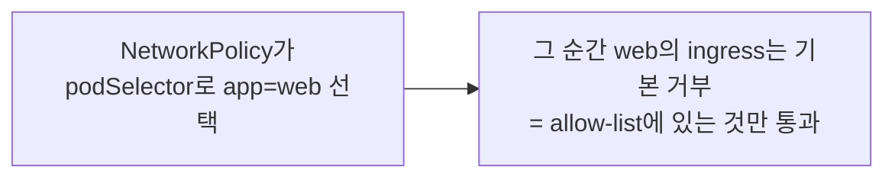

# 30. NetworkPolicy

같은 클러스터의 Pod들은 기본적으로 서로 다 통신할 수 있습니다 — namespace가 달라도, 아무 관계가 없어도 IP만 알면 닿습니다. NetworkPolicy는 그 평평한 네트워크를 **allow-list**로 가릅니다: 어떤 Pod을 정책으로 선택하는 순간 그 방향(들어오는 ingress / 나가는 egress)은 기본 거부로 바뀌고, 명시적으로 허용한 트래픽만 통과합니다. 이 편은 두 클라이언트가 모두 `web`에 닿는 평평한 상태에서 출발해, `web`에 default-deny를 걸어 둘 다 끊고, 다시 특정 라벨에서 오는 것만 허용해 한쪽만 통과시키는 것을 재현합니다. 한 가지 전제가 있습니다 — **NetworkPolicy는 CNI가 구현해야 동작하고, kind 기본 CNI(kindnet)는 이를 강제하지 않습니다.** 그래서 이 편은 정책을 지원하는 Calico로 클러스터를 세운 뒤 진행합니다. 이 편의 산출물은 "default-deny → 선택적 allow로 Pod 간 트래픽을 좁히는 절차"와 "정책이 podSelector로 고른 Pod의 방향만 기본 거부로 바꾼다는 경계", 그리고 "정책 집행은 CNI 몫"이라는 사실입니다.

## 핵심 다이어그램





- **기본은 다 열려 있다.** 클러스터 네트워크는 평평해서, 정책이 없으면 어떤 Pod이든 서로 IP로 닿습니다.
- **NetworkPolicy는 allow-list다.** 정책이 어떤 Pod을 선택하면 그 방향은 기본 거부가 되고, `ingress`/`egress`에 적은 것만 통과합니다. 규칙이 비어 있으면 그 방향은 전부 거부입니다.
- **정책은 고른 Pod에만 적용된다.** `podSelector`에 맞지 않는 Pod은 정책의 영향을 받지 않고 계속 다 열려 있습니다. 그래서 "web을 잠근다"는 web에만 걸립니다.
- **집행은 CNI가 한다.** NetworkPolicy는 규격일 뿐이고, 실제 차단은 CNI가 구현합니다. kindnet은 강제하지 않으므로 Calico·Cilium 같은 정책 지원 CNI가 필요합니다.

아래 시연이 이 그림의 각 단계를 한 줄씩 손으로 확인합니다.

## 사전 준비물

이 실습은 **macOS** 환경을 기준으로 합니다.

- **Docker** — Docker Desktop, OrbStack 등. `docker ps`가 에러 없이 돌아가면 OK.
- **Homebrew** — macOS 패키지 관리자.

### kind · kubectl 설치

```bash
brew install kind kubectl
```

### 정책 지원 CNI로 클러스터 세우기

기본 kindnet은 NetworkPolicy를 무시하므로, 기본 CNI를 끄고 Calico를 올린 클러스터가 필요합니다. 기존 `rosa-lab`이 있으면 지우고 다시 만듭니다.

```bash
kind delete cluster --name rosa-lab   # 기존 것이 있으면
kind create cluster --name rosa-lab --config manifests/kind-calico.yaml
kubectl apply -f https://raw.githubusercontent.com/projectcalico/calico/v3.28.0/manifests/calico.yaml
kubectl wait --for=condition=Ready pods -n kube-system -l k8s-app=calico-node --timeout=180s
```

Calico가 뜨기 전에는 노드가 `NotReady`이고 Pod이 스케줄되지 않습니다 — 위 `wait`가 끝난 뒤 진행합니다. namespace를 준비합니다.

```bash
kubectl create namespace rosa-lab
kubectl config set-context --current --namespace=rosa-lab
```

## 실습 환경

| 파일 | 내용 |
|---|---|
| `manifests/kind-calico.yaml` | 기본 CNI를 끄고 Calico 대역을 지정한 kind 클러스터 설정 |
| `manifests/web.yaml` | 대상이 되는 `web` Deployment(nginx) + 같은 이름 Service |
| `manifests/clients.yaml` | `role=frontend`인 `frontend` Pod과 `role=other`인 `other` Pod |
| `manifests/default-deny.yaml` | `app=web`으로 들어오는 트래픽을 전부 거부하는 정책 |
| `manifests/allow-frontend.yaml` | `role=frontend`에서 오는 것만 `app=web`으로 허용하는 정책 |

## 여기서 직접 확인할 수 있는 것

### 정책이 없을 때 — 둘 다 닿는다

대상과 두 클라이언트를 올리고, 각각 `web`에 접속해 봅니다.

```bash
kubectl apply -f manifests/web.yaml
kubectl apply -f manifests/clients.yaml
kubectl rollout status deployment web -n rosa-lab
kubectl wait --for=condition=Ready pod/frontend pod/other -n rosa-lab --timeout=60s

kubectl exec frontend -n rosa-lab -- wget -qO- -T3 http://web | grep -o '<title>.*</title>'
kubectl exec other    -n rosa-lab -- wget -qO- -T3 http://web | grep -o '<title>.*</title>'
```

```
<title>Welcome to nginx!</title>
<title>Welcome to nginx!</title>
```

둘 다 `web`의 응답을 받습니다. `frontend`든 `other`든 구분 없이 닿는 게 기본 상태입니다 — 네트워크가 평평합니다.

### default-deny — web으로 오는 것을 전부 끊는다

`app=web`을 선택하되 ingress 규칙을 하나도 두지 않은 정책을 올립니다. 선택된 순간 web의 ingress는 기본 거부가 됩니다.

```bash
kubectl apply -f manifests/default-deny.yaml
sleep 2
kubectl exec frontend -n rosa-lab -- wget -qO- -T3 http://web
```

```
wget: download timed out
command terminated with exit code 1
```

```bash
kubectl exec other -n rosa-lab -- wget -qO- -T3 http://web
```

```
wget: download timed out
command terminated with exit code 1
```

방금 닿던 둘이 모두 막혔습니다 — 허용 규칙이 없으니 어느 쪽에서 와도 web으로 못 들어갑니다. 연결이 거부되기보다 **응답이 없어 타임아웃**되는 형태입니다(패킷이 조용히 버려짐). 이 정책은 web에만 걸렸으므로, web이 **아닌** Pod들끼리는 여전히 자유롭게 통신합니다.

### allow-frontend — 한쪽만 다시 연다

이제 `role=frontend`에서 오는 80 포트만 허용하는 정책을 추가합니다. 정책은 더하기(allow)만 하므로, 이 규칙에 맞는 트래픽이 통과 목록에 오릅니다.

```bash
kubectl apply -f manifests/allow-frontend.yaml
sleep 2
kubectl exec frontend -n rosa-lab -- wget -qO- -T3 http://web | grep -o '<title>.*</title>'
```

```
<title>Welcome to nginx!</title>
```

```bash
kubectl exec other -n rosa-lab -- wget -qO- -T3 http://web
```

```
wget: download timed out
command terminated with exit code 1
```

`frontend`는 다시 닿고, `other`는 여전히 막힙니다. 둘의 차이는 라벨 하나(`role`)뿐입니다 — 정책이 `from.podSelector`로 `role=frontend`만 허용하기 때문입니다. `web`이 누구에게서 트래픽을 받을지가 IP나 위치가 아니라 **라벨**로 정해집니다. 어떤 정책들이 web에 걸려 있는지는 이렇게 봅니다.

```bash
kubectl get networkpolicy -n rosa-lab
kubectl describe networkpolicy web-allow-frontend -n rosa-lab | sed -n '/Spec:/,$p' | head -20
```

```
NAME                 POD-SELECTOR   AGE
web-allow-frontend   app=web        30s
web-default-deny     app=web        3m
```

### 규칙을 넓히는 축 — namespace · ipBlock · egress

`from`/`to`에는 `podSelector` 말고도 두 가지를 더 쓸 수 있고, 방향도 나가는 쪽까지 있습니다.

```yaml
ingress:
  - from:
      # 특정 namespace 전체에서 오는 것
      - namespaceSelector:
          matchLabels:
            kubernetes.io/metadata.name: monitoring
      # 클러스터 밖 특정 CIDR에서 오는 것
      - ipBlock:
          cidr: 10.0.0.0/8
          except:
            - 10.0.5.0/24
```

```yaml
# 나가는 트래픽 제한 — policyTypes에 Egress를 넣고 to를 적는다
policyTypes: [Egress]
egress:
  - to:
      - podSelector:
          matchLabels:
            app: db
    ports:
      - protocol: TCP
        port: 5432
```

- **`podSelector`**: 같은 namespace 안에서 라벨로 상대 Pod을 고름(이 편의 예).
- **`namespaceSelector`**: namespace 단위로 허용. `podSelector`와 함께 쓰면 "그 namespace의 그 라벨 Pod"으로 좁혀집니다.
- **`ipBlock`**: 클러스터 밖 CIDR. `except`로 일부를 뺍니다.
- **egress**: `policyTypes`에 `Egress`를 넣으면 나가는 방향도 기본 거부가 되어, `to`에 적은 곳으로만 나갈 수 있습니다 — 워크로드가 임의의 외부로 나가지 못하게 잠글 때 씁니다.

실무의 출발점은 대개 "namespace에 default-deny를 깔고(모든 Pod ingress·egress 거부), 필요한 경로만 allow로 여는" 방식입니다 — 열려 있는 것을 하나씩 막는 대신, 닫힌 데서 필요한 것만 뚫습니다.

### 정리

```bash
kubectl delete -f manifests/allow-frontend.yaml --ignore-not-found
kubectl delete -f manifests/default-deny.yaml --ignore-not-found
kubectl delete -f manifests/clients.yaml --ignore-not-found
kubectl delete -f manifests/web.yaml --ignore-not-found
```

클러스터까지 정리하려면:

```bash
kind delete cluster --name rosa-lab
```

## 이 편의 산출물

- 클러스터 네트워크가 평평해 정책이 없으면 `frontend`·`other`가 **모두 `web`에 닿는다**는 기본 상태를 확인한 상태.
- `app=web`을 선택하고 ingress 규칙을 비운 **default-deny**가 web으로 오는 트래픽을 전부(타임아웃 형태로) 끊고, 그 정책이 web에만 걸려 다른 Pod 통신은 그대로임을 확인한 경험.
- `role=frontend`만 허용하는 **allow 정책**을 더해 `frontend`는 통과하고 `other`는 막히는 것을, 라벨 하나 차이로 재현한 상태 — 트래픽 허용 대상이 IP가 아니라 라벨로 정해진다는 것.
- `from`/`to`의 세 축(`podSelector`·`namespaceSelector`·`ipBlock`)과 **egress**(나가는 방향 잠금), 그리고 "namespace default-deny 후 필요한 경로만 여는" 실무 출발점을 정리한 상태.
- **NetworkPolicy 집행이 CNI 몫**이며 kindnet은 강제하지 않아 Calico로 클러스터를 세워야 한다는 전제를 실제로 밟아 본 상태.
