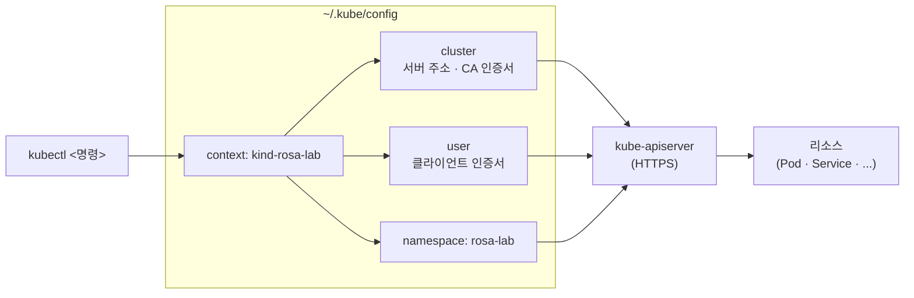

# 4. `kubectl` 한 권 — context · namespace · krew

`kubectl`이 클러스터를 찾는 경로(kubeconfig)와 실행 범위(context · namespace)를 손으로 확인하고, krew로 ctx · ns 플러그인을 설치해 전환 명령을 익히는 실습 공간입니다.

## 핵심 다이어그램



- **kubeconfig**(`~/.kube/config`)는 kubectl이 "어느 클러스터에, 누구로, 어느 namespace에" 명령을 보낼지 기록한 파일입니다.
- **context**는 cluster · user · namespace 세 항목의 조합에 이름을 붙인 것입니다. `kind create cluster --name rosa-lab`은 `kind-rosa-lab`이라는 context를 자동으로 만들고 current-context로 설정합니다.
- **namespace**는 클러스터 안에서 리소스를 논리적으로 구획하는 단위입니다. `-n`을 생략하면 context에 설정된 기본 namespace가 쓰입니다.

아래 시연이 이 그림의 각 지점을 한 줄씩 손으로 확인합니다.

## 사전 준비물

이 실습은 **macOS** 환경을 기준으로 합니다.

- **Docker** — kind는 Docker 컨테이너를 노드로 띄웁니다. Docker Desktop, OrbStack 등 어느 것이든 됩니다.
  - 확인: `docker ps`가 에러 없이 돌아가면 OK.
- **Homebrew** — macOS 패키지 관리자입니다.

### kind · kubectl 설치

```bash
brew install kind kubectl
```

### rosa-lab 클러스터 준비

```bash
kind create cluster --name rosa-lab
```

이미 클러스터가 있으면 건너뜁니다.

```bash
kind get clusters   # rosa-lab이 보이면 OK
```

## 여기서 직접 확인할 수 있는 것

### kubectl은 kubeconfig를 읽어 클러스터 주소를 찾습니다

kubectl이 읽는 설정 파일의 내용을 확인합니다.

```bash
$ kubectl config view
apiVersion: v1
clusters:
- cluster:
    certificate-authority-data: DATA+OMITTED
    server: https://127.0.0.1:PORT
  name: kind-rosa-lab
contexts:
- context:
    cluster: kind-rosa-lab
    user: kind-rosa-lab
  name: kind-rosa-lab
current-context: kind-rosa-lab
kind: Config
preferences: {}
users:
- name: kind-rosa-lab
  user:
    client-certificate-data: DATA+OMITTED
    client-key-data: DATA+OMITTED
```

kubeconfig는 세 섹션으로 이루어집니다.

| 섹션 | 내용 |
|---|---|
| `clusters` | 클러스터 이름, API 서버 주소, CA 인증서 |
| `users` | 인증 정보 (클라이언트 인증서 · 토큰 등) |
| `contexts` | cluster + user + namespace의 조합에 붙인 이름 |

`current-context`는 kubectl이 기본으로 쓰는 context를 가리킵니다.

### context가 "지금 어디에 명령하는가"를 결정합니다

등록된 context 목록과 현재 context를 확인합니다.

```bash
$ kubectl config get-contexts
CURRENT   NAME             CLUSTER          AUTHINFO         NAMESPACE
*         kind-rosa-lab    kind-rosa-lab    kind-rosa-lab    
```

`*`가 붙은 줄이 지금 쓰는 context입니다. `kind create cluster`는 클러스터를 만들면서 context를 자동으로 등록하고 `*`를 옮겨 줍니다.

현재 context만 빠르게 확인하려면:

```bash
$ kubectl config current-context
kind-rosa-lab
```

클러스터가 여러 개로 늘었을 때 `kubectl config use-context`로 전환합니다.

```bash
$ kubectl config use-context kind-rosa-lab
Switched to context "kind-rosa-lab".
```

### namespace는 클러스터 안 논리적 구획입니다

클러스터를 만들면 기본으로 다섯 개의 namespace가 생깁니다.

```bash
$ kubectl get namespaces
NAME                 STATUS   AGE
default              Active   5m
kube-node-lease      Active   5m
kube-public          Active   5m
kube-system          Active   5m
local-path-storage   Active   5m
```

| namespace | 역할 |
|---|---|
| `default` | namespace를 지정하지 않은 리소스의 기본 위치 |
| `kube-system` | 쿠버네티스 시스템 컴포넌트 (CoreDNS · kube-proxy 등) |
| `kube-public` | 인증 없이 읽을 수 있는 공용 데이터 |
| `kube-node-lease` | 노드 heartbeat용 Lease 오브젝트 |
| `local-path-storage` | kind가 기본 설치하는 로컬 스토리지 프로비저너 |

`kube-system` 안에 어떤 Pod가 떠 있는지 확인합니다.

```bash
$ kubectl get pods -n kube-system
NAME                                             READY   STATUS    RESTARTS   AGE
coredns-XXXXX-YYYYY                              1/1     Running   0          5m
coredns-XXXXX-ZZZZZ                              1/1     Running   0          5m
etcd-rosa-lab-control-plane                      1/1     Running   0          5m
kube-apiserver-rosa-lab-control-plane            1/1     Running   0          5m
kube-controller-manager-rosa-lab-control-plane   1/1     Running   0          5m
kube-proxy-AAAAA                                 1/1     Running   0          5m
kube-scheduler-rosa-lab-control-plane            1/1     Running   0          5m
kindnet-BBBBB                                    1/1     Running   0          5m
```

`-n kube-system`은 `--namespace=kube-system`의 줄임입니다. `-n` 없이 `kubectl get pods`를 실행하면 현재 context의 기본 namespace(지금은 `default`)만 보입니다.

모든 namespace를 한 번에 보려면 `-A`(`--all-namespaces`)를 씁니다.

```bash
$ kubectl get pods -A
NAMESPACE            NAME                                             READY   STATUS    ...
kube-system          coredns-XXXXX-YYYYY                              1/1     Running   ...
kube-system          etcd-rosa-lab-control-plane                      1/1     Running   ...
local-path-storage   local-path-provisioner-YYYYY                     1/1     Running   ...
...
```

### `rosa-lab` namespace를 만들고 기본값으로 설정합니다

namespace를 만들고, context의 기본 namespace로 설정합니다.

```bash
$ kubectl create namespace rosa-lab
namespace/rosa-lab created
```

```bash
$ kubectl get namespaces
NAME                 STATUS   AGE
default              Active   5m
kube-node-lease      Active   5m
kube-public          Active   5m
kube-system          Active   5m
local-path-storage   Active   5m
rosa-lab             Active   3s
```

context의 기본 namespace를 `rosa-lab`으로 바꿉니다.

```bash
$ kubectl config set-context --current --namespace=rosa-lab
Context "kind-rosa-lab" modified.
```

이제 `-n`을 생략해도 `rosa-lab` namespace가 기본으로 쓰입니다.

```bash
$ kubectl config get-contexts
CURRENT   NAME             CLUSTER          AUTHINFO         NAMESPACE
*         kind-rosa-lab    kind-rosa-lab    kind-rosa-lab    rosa-lab
```

### krew — kubectl plugin manager

krew는 kubectl plugin을 설치·관리하는 도구입니다. Homebrew로 설치합니다.

```bash
brew install krew
```

krew가 설치하는 plugin 바이너리는 `~/.krew/bin/`에 들어갑니다. 셸 설정 파일(`~/.zshrc` 또는 `~/.bashrc`)에 PATH를 추가합니다.

```bash
export PATH="${KREW_ROOT:-$HOME/.krew}/bin:$PATH"
```

추가 후 현재 셸에 반영합니다.

```bash
source ~/.zshrc   # 또는 source ~/.bashrc
```

설치를 확인합니다.

```bash
$ kubectl krew version
OPTION            VALUE
GitTag            v0.5.0
...
```

### ctx · ns — context와 namespace를 빠르게 전환합니다

krew로 두 플러그인을 설치합니다.

```bash
kubectl krew install ctx ns
```

`kubectl ctx`는 등록된 context 목록을 보여줍니다.

```bash
$ kubectl ctx
* kind-rosa-lab
```

인자를 주면 그 context로 전환합니다.

```bash
$ kubectl ctx kind-rosa-lab
Switched to context "kind-rosa-lab".
```

`kubectl ns`는 namespace 목록을 보여줍니다.

```bash
$ kubectl ns
default
kube-node-lease
kube-public
kube-system
local-path-storage
* rosa-lab
```

인자를 주면 context의 기본 namespace를 바꿉니다.

```bash
$ kubectl ns rosa-lab
Context "kind-rosa-lab" modified.
Active namespace is "rosa-lab".
```

`kubectl ctx` · `kubectl ns`는 각각 `kubectl config use-context` · `kubectl config set-context --current --namespace=`를 짧게 쓰는 별칭입니다. 클러스터나 namespace가 여러 개로 늘어날수록 쓸모가 커집니다.
