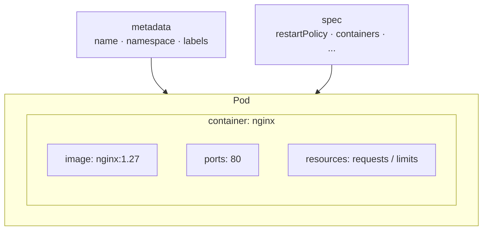
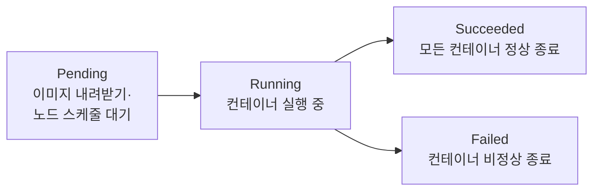

# 5. Pod 한 번 더 — 매니페스트와 lifecycle

매니페스트로 Pod를 정의하고, Pending → Running → Succeeded 흐름을 손으로 따라가는 실습 공간입니다.

## 핵심 다이어그램





- Pod는 `apiVersion` · `kind` · `metadata` · `spec` 네 항목으로 이루어집니다. `kubectl run`은 이 구조를 최소한으로 채운 Pod를 명령줄 인자로 만듭니다.
- `spec.containers`는 배열입니다. Pod 안에 컨테이너가 여러 개 있을 수 있고, 모두 같은 네트워크·볼륨을 공유합니다.
- Pod lifecycle phase는 쿠버네티스가 Pod 전체에 붙이는 상태 요약입니다. `kubectl describe` 의 `State` 항목은 각 컨테이너 단위 상태입니다.

아래 시연이 이 그림의 각 지점을 한 줄씩 손으로 확인합니다.

## 사전 준비물

이 실습은 **macOS** 환경을 기준으로 합니다.

- **Docker** — Docker Desktop, OrbStack 등. `docker ps`가 에러 없이 돌아가면 OK.
- **Homebrew** — macOS 패키지 관리자.

### kind · kubectl 설치

```bash
brew install kind kubectl
```

### rosa-lab 클러스터 준비

```bash
kind create cluster --name rosa-lab
```

이미 클러스터가 있으면 건너뜁니다.

```bash
kind get clusters   # rosa-lab이 보이면 OK
```

### rosa-lab namespace 준비

```bash
kubectl create namespace rosa-lab
kubectl config set-context --current --namespace=rosa-lab
```

이미 namespace가 있고 기본값으로 설정되어 있으면 건너뜁니다.

```bash
kubectl config get-contexts   # NAMESPACE 열에 rosa-lab이 보이면 OK
```

## 실습 환경

이 폴더의 실습에서 사용하는 매니페스트는 다음과 같습니다.

| 파일 | 내용 |
|---|---|
| `manifests/pod-nginx.yaml` | nginx Pod — lifecycle Pending → Running 확인용 |
| `manifests/pod-oneshot.yaml` | busybox Pod — restartPolicy: Never, Running → Succeeded 확인용 |

## 여기서 직접 확인할 수 있는 것

### `kubectl run`이 만드는 것을 먼저 봅니다

`--dry-run=client -o yaml`을 붙이면 실제로 만들지 않고 생성될 매니페스트만 출력합니다.

```bash
$ kubectl run nginx --image=nginx:1.27 --dry-run=client -o yaml
apiVersion: v1
kind: Pod
metadata:
  labels:
    run: nginx
  name: nginx
spec:
  containers:
  - image: nginx:1.27
    name: nginx
    resources: {}
  dnsPolicy: ClusterFirst
  restartPolicy: Always
status: {}
```

`resources: {}`는 비어 있고, `ports`·`command` 같은 항목도 없습니다. 명령줄 인자로 표현하지 못한 것은 모두 비어 있습니다.

### Pod 매니페스트의 네 항목

`manifests/pod-nginx.yaml`은 같은 Pod를 필드를 명시해 정의합니다.

```yaml
apiVersion: v1
kind: Pod
metadata:
  name: nginx
  namespace: rosa-lab
spec:
  containers:
    - name: nginx
      image: nginx:1.27
      ports:
        - containerPort: 80
      resources:
        requests:
          cpu: 100m
          memory: 64Mi
        limits:
          cpu: 200m
          memory: 128Mi
```

| 항목 | 역할 |
|---|---|
| `apiVersion` | 이 리소스를 처리할 API 그룹과 버전 |
| `kind` | 리소스 종류 |
| `metadata` | 이름 · namespace · label 등 식별 정보 |
| `spec` | 원하는 상태 — 무슨 컨테이너를, 어떻게 실행할지 |

`resources.requests`는 스케줄러가 노드를 고를 때 쓰는 예약값이고, `resources.limits`는 컨테이너가 넘을 수 없는 상한입니다.

### `kubectl apply`로 Pod를 만듭니다

```bash
$ kubectl apply -f manifests/pod-nginx.yaml
pod/nginx created
```

`kubectl apply`는 매니페스트와 클러스터 상태를 비교해 차이를 적용합니다. 같은 명령을 다시 실행해도 이미 일치하면 `unchanged`로 끝납니다.

```bash
$ kubectl apply -f manifests/pod-nginx.yaml
pod/nginx unchanged
```

### Pod lifecycle phases

Pod를 만든 직후 `-w`(watch)로 상태 변화를 봅니다.

```bash
$ kubectl get pod nginx -w
NAME    READY   STATUS              RESTARTS   AGE
nginx   0/1     Pending             0          0s
nginx   0/1     ContainerCreating   0          1s
nginx   1/1     Running             0          4s
```

이미지가 노드에 이미 캐시되어 있으면 `Pending` 단계가 눈에 띄지 않을 만큼 짧게 끝납니다. 처음 이미지를 내려받을 때는 `Pending` 상태가 수 초 이상 유지됩니다.

| Phase | 의미 |
|---|---|
| `Pending` | 노드에 스케줄됐거나, 이미지를 내려받는 중 |
| `ContainerCreating` | 이미지 준비 완료, 컨테이너 시작 중 (Running 직전 표시) |
| `Running` | 컨테이너가 실행 중이고, 최소 하나는 아직 살아 있음 |
| `Succeeded` | 모든 컨테이너가 종료 코드 0으로 끝남 |
| `Failed` | 하나 이상의 컨테이너가 비정상 종료됨 |

### 컨테이너 상태는 `kubectl describe`에서 봅니다

```bash
$ kubectl describe pod nginx
Name:             nginx
Namespace:        rosa-lab
...
Status:           Running
...
Containers:
  nginx:
    Image:         nginx:1.27
    State:          Running
      Started:      ...
    Ready:          True
    Restart Count:  0
    Limits:
      cpu:     200m
      memory:  128Mi
    Requests:
      cpu:     100m
      memory:  64Mi
...
Events:
  Type    Reason     Age   From               Message
  ----    ------     ----  ----               -------
  Normal  Scheduled  10s   default-scheduler  Successfully assigned rosa-lab/nginx to rosa-lab-control-plane
  Normal  Pulled     10s   kubelet            Container image "nginx:1.27" already present on machine and can be accessed by the pod
  Normal  Created    10s   kubelet            Container created
  Normal  Started    10s   kubelet            Container started
```

`Status`는 Pod 전체 phase, `State`는 컨테이너 단위 상태입니다. `Events`는 Pod가 만들어진 순서를 역순으로 보여줍니다.

### `kubectl logs`로 컨테이너 stdout을 봅니다

```bash
$ kubectl logs nginx
/docker-entrypoint.sh: /docker-entrypoint.d/ is not empty, will attempt to perform configuration
...
2024/xx/xx xx:xx:xx [notice] 1#1: start worker processes
```

컨테이너가 여러 개인 Pod에서는 `-c <컨테이너 이름>`으로 대상을 지정합니다.

```bash
kubectl logs nginx -c nginx
```

### `kubectl exec`로 컨테이너 안에 들어갑니다

```bash
$ kubectl exec -it nginx -- bash
root@nginx:/# nginx -v
nginx version: nginx/1.27.x
root@nginx:/# exit
```

`-it`는 터미널을 연결하는 옵션(`-i` stdin 연결, `-t` pseudo-TTY 할당)이고, `--` 뒤는 컨테이너 안에서 실행할 명령입니다.

### restartPolicy — Pod가 끝났을 때 어떻게 할지 정합니다

`restartPolicy: Never`로 설정한 `pod-oneshot.yaml`을 적용합니다.

```bash
$ kubectl apply -f manifests/pod-oneshot.yaml
pod/oneshot created
```

```bash
$ kubectl get pod oneshot -w
NAME      READY   STATUS              RESTARTS   AGE
oneshot   0/1     Pending             0          0s
oneshot   0/1     ContainerCreating   0          1s
oneshot   1/1     Running             0          2s
oneshot   0/1     Completed           0          5s
```

`sleep 2`가 끝나면 컨테이너가 종료되고 Pod는 `Completed`(= `Succeeded`) 상태로 바뀝니다. `restartPolicy: Never`이므로 재시작하지 않습니다.

| restartPolicy | 동작 |
|---|---|
| `Always` (기본값) | 컨테이너가 종료되면 항상 재시작 |
| `OnFailure` | 종료 코드가 0이 아닐 때만 재시작 |
| `Never` | 종료되어도 재시작하지 않음 |

### 정리

```bash
kubectl delete pod nginx oneshot
```
