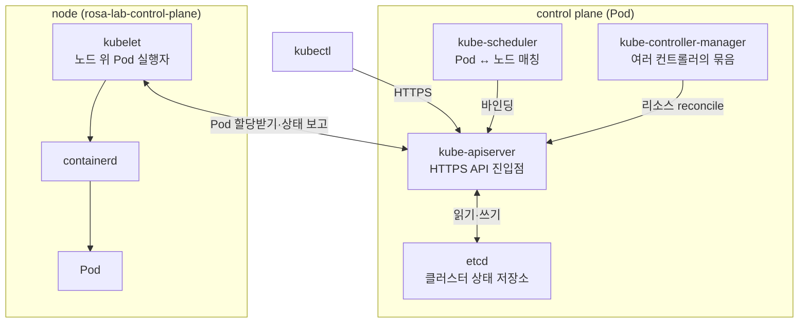

# 6. 컨트롤 플레인과 노드 컴포넌트

kube-apiserver · etcd · scheduler · controller-manager · kubelet 다섯 컴포넌트가 어디에 어떻게 떠 있고 각각 무엇을 하는지, 노드 안까지 들어가 손으로 확인하는 실습 공간입니다.

## 핵심 다이어그램



- **kube-apiserver**는 클러스터의 유일한 HTTPS 진입점입니다. `kubectl`, `kubelet`, 그리고 다른 컴포넌트 모두 이 API를 통해서만 클러스터 상태에 접근합니다.
- **etcd**는 클러스터의 모든 상태를 키-값으로 저장하는 분산 KV 스토어입니다. kube-apiserver만 etcd와 직접 통신합니다.
- **kube-scheduler**는 노드가 정해지지 않은 Pod를 보고 적절한 노드를 골라 붙입니다.
- **kube-controller-manager**는 ReplicaSet · Job · Namespace 등 수십 개 컨트롤러를 한 프로세스에 모은 묶음입니다. 각 컨트롤러는 "원하는 상태 ↔ 실제 상태"의 차이를 메웁니다.
- **kubelet**은 노드마다 하나씩 떠서 자기 노드에 할당된 Pod를 실제로 띄우고, 상태를 apiserver에 보고합니다.

아래 시연이 이 그림의 각 지점을 한 줄씩 손으로 확인합니다.

## 사전 준비물

이 실습은 **macOS** 환경을 기준으로 합니다.

- **Docker** — Docker Desktop, OrbStack 등. `docker ps`가 에러 없이 돌아가면 OK.
- **Homebrew** — macOS 패키지 관리자.

### kind · kubectl 설치

```bash
brew install kind kubectl
```

### rosa-lab 클러스터 준비

```bash
kind create cluster --name rosa-lab
```

이미 클러스터가 있으면 건너뜁니다.

```bash
kind get clusters   # rosa-lab이 보이면 OK
```

### rosa-lab namespace 준비

```bash
kubectl create namespace rosa-lab
kubectl config set-context --current --namespace=rosa-lab
```

이미 namespace가 있고 기본값으로 설정되어 있으면 건너뜁니다.

```bash
kubectl config get-contexts   # NAMESPACE 열에 rosa-lab이 보이면 OK
```

## 실습 환경

| 파일 | 내용 |
|---|---|
| `manifests/scheduled-demo.yaml` | nodeName 없이 둔 Pod — scheduler가 노드를 붙이는 흔적 확인용 |

## 여기서 직접 확인할 수 있는 것

### 컨트롤 플레인 컴포넌트는 kube-system Pod로 떠 있습니다

```bash
$ kubectl get pods -n kube-system
NAME                                             READY   STATUS    RESTARTS   AGE
coredns-XXXXX-YYYYY                              1/1     Running   0          10m
coredns-XXXXX-ZZZZZ                              1/1     Running   0          10m
etcd-rosa-lab-control-plane                      1/1     Running   0          10m
kindnet-AAAAA                                    1/1     Running   0          10m
kube-apiserver-rosa-lab-control-plane            1/1     Running   0          10m
kube-controller-manager-rosa-lab-control-plane   1/1     Running   0          10m
kube-proxy-BBBBB                                 1/1     Running   0          10m
kube-scheduler-rosa-lab-control-plane            1/1     Running   0          10m
local-path-provisioner-CCCCC                     1/1     Running   0          10m
```

네 개의 이름 뒤에 `-rosa-lab-control-plane`이 붙어 있습니다(`etcd-...`, `kube-apiserver-...`, `kube-controller-manager-...`, `kube-scheduler-...`). 이 네 컴포넌트는 같은 노드 위에 떠 있는 **static pod**입니다.

### static pod 정의는 노드의 `/etc/kubernetes/manifests/` 에 있습니다

kind 노드는 사실 Docker 컨테이너 하나입니다. 그 안에 들어가 매니페스트를 직접 봅니다.

```bash
$ docker exec rosa-lab-control-plane ls /etc/kubernetes/manifests/
etcd.yaml
kube-apiserver.yaml
kube-controller-manager.yaml
kube-scheduler.yaml
```

apiserver 매니페스트의 첫 부분을 봅니다.

```bash
$ docker exec rosa-lab-control-plane head -20 /etc/kubernetes/manifests/kube-apiserver.yaml
apiVersion: v1
kind: Pod
metadata:
  annotations:
    kubeadm.kubernetes.io/kube-apiserver.advertise-address.endpoint: 172.19.0.2:6443
  creationTimestamp: null
  labels:
    component: kube-apiserver
    tier: control-plane
  name: kube-apiserver
  namespace: kube-system
spec:
  containers:
  - command:
    - kube-apiserver
    - --advertise-address=172.19.0.2
    - --allow-privileged=true
    ...
```

일반 Pod 매니페스트와 같은 형태(`apiVersion: v1` · `kind: Pod` · `spec.containers`)지만, 이 파일이 etcd가 아니라 **노드의 디렉토리**에 저장되어 있다는 점이 다릅니다 — 그래서 etcd · apiserver가 뜨기 전에도 띄울 수 있습니다.

### kubelet — 노드에서 가장 먼저 시작되어 static pod를 띄웁니다

kubelet은 컨테이너가 아니라 노드의 **systemd 서비스**로 실행됩니다.

```bash
$ docker exec rosa-lab-control-plane systemctl status kubelet | head -5
● kubelet.service - kubelet: The Kubernetes Node Agent
     Loaded: loaded (/etc/systemd/system/kubelet.service; enabled; preset: enabled)
     Active: active (running) since ...
   Main PID: ... (kubelet)
```

kubelet 설정 파일에서 static pod 디렉토리 위치를 확인합니다.

```bash
$ docker exec rosa-lab-control-plane grep -i staticpod /var/lib/kubelet/config.yaml
staticPodPath: /etc/kubernetes/manifests
```

kubelet은 부팅하면서 이 디렉토리를 감시하고, 안에 있는 매니페스트를 자기 노드의 Pod로 띄웁니다. apiserver · etcd · scheduler · controller-manager가 "닭과 달걀" 문제 없이 시작할 수 있는 이유입니다.

### kube-apiserver — 모든 통신이 통과하는 HTTPS 진입점

kube-apiserver는 HTTPS API 서버입니다. `kubectl get --raw`로 직접 호출할 수 있습니다.

```bash
$ kubectl get --raw /healthz
ok
```

```bash
$ kubectl get --raw /version
{
  "major": "1",
  "minor": "36",
  "gitVersion": "v1.36.1",
  ...
}
```

`kubectl get pods`는 결국 이 API를 호출하는 래퍼입니다.

```bash
$ kubectl get --raw "/api/v1/namespaces/rosa-lab/pods" | head -20
{
  "kind": "PodList",
  "apiVersion": "v1",
  "metadata": {
    "resourceVersion": "..."
  },
  "items": [
    ...
  ]
}
```

`-v=8`을 붙이면 kubectl이 실제로 보낸 HTTP 요청을 볼 수 있습니다.

```bash
$ kubectl get pods -v=8 2>&1 | grep -E "GET|Request URL" | head -5
I... loader.go:402] Config loaded from file:  /Users/.../.kube/config
I... round_trippers.go:466] curl -v -XGET ... 'https://127.0.0.1:PORT/api/v1/namespaces/rosa-lab/pods?limit=500'
```

kubectl은 사용자가 친 명령을 HTTP 요청으로 번역해 apiserver에 보냅니다.

### etcd — 클러스터 상태의 단일 출처

apiserver가 보거나 쓰는 모든 클러스터 상태는 etcd에 저장됩니다. etcd Pod 안에서 `etcdctl`로 직접 키를 조회합니다.

`etcdctl --keys-only`는 키마다 빈 줄을 끼워 출력하므로, `grep -v "^$"`로 빈 줄을 거릅니다.

```bash
$ kubectl -n kube-system exec etcd-rosa-lab-control-plane -- \
  etcdctl \
    --cacert=/etc/kubernetes/pki/etcd/ca.crt \
    --cert=/etc/kubernetes/pki/etcd/server.crt \
    --key=/etc/kubernetes/pki/etcd/server.key \
    get / --prefix --keys-only | grep -v "^$" | head -10
/registry/apiregistration.k8s.io/apiservices/v1.
/registry/apiregistration.k8s.io/apiservices/v1.admissionregistration.k8s.io
/registry/apiregistration.k8s.io/apiservices/v1.apiextensions.k8s.io
/registry/apiregistration.k8s.io/apiservices/v1.apps
/registry/apiregistration.k8s.io/apiservices/v1.authentication.k8s.io
/registry/apiregistration.k8s.io/apiservices/v1.authorization.k8s.io
/registry/apiregistration.k8s.io/apiservices/v1.autoscaling
/registry/apiregistration.k8s.io/apiservices/v1.batch
/registry/apiregistration.k8s.io/apiservices/v1.certificates.k8s.io
/registry/apiregistration.k8s.io/apiservices/v1.coordination.k8s.io
```

키는 모두 `/registry/<리소스>/<namespace>/<이름>` 형태입니다. `rosa-lab`을 필터링하면 방금 만든 namespace와 관련 리소스가 보입니다.

```bash
$ kubectl -n kube-system exec etcd-rosa-lab-control-plane -- \
  etcdctl \
    --cacert=/etc/kubernetes/pki/etcd/ca.crt \
    --cert=/etc/kubernetes/pki/etcd/server.crt \
    --key=/etc/kubernetes/pki/etcd/server.key \
    get / --prefix --keys-only | grep rosa-lab
/registry/configmaps/rosa-lab/kube-root-ca.crt
/registry/leases/kube-node-lease/rosa-lab-control-plane
/registry/minions/rosa-lab-control-plane
/registry/namespaces/rosa-lab
/registry/pods/kube-system/etcd-rosa-lab-control-plane
/registry/pods/kube-system/kube-apiserver-rosa-lab-control-plane
/registry/pods/kube-system/kube-controller-manager-rosa-lab-control-plane
/registry/pods/kube-system/kube-scheduler-rosa-lab-control-plane
/registry/serviceaccounts/rosa-lab/default
```

`/registry/namespaces/rosa-lab` 한 줄이 우리가 만든 namespace이고, `/registry/pods/kube-system/...`는 control plane이 static pod로 떠 있는 흔적입니다.

### kube-scheduler — Pod에 노드를 붙입니다

스케줄러가 무엇을 하는지 보려면, 노드가 정해지지 않은 Pod 하나를 만들고 어디에 떠 있는지 봅니다.

```bash
$ kubectl apply -f manifests/scheduled-demo.yaml
pod/scheduled-demo created
```

`kubectl describe`의 Events 첫 줄에 스케줄러의 결정이 남습니다.

```bash
$ kubectl describe pod scheduled-demo | grep -A 10 Events:
Events:
  Type    Reason     Age   From               Message
  ----    ------     ----  ----               -------
  Normal  Scheduled  10s   default-scheduler  Successfully assigned rosa-lab/scheduled-demo to rosa-lab-control-plane
  Normal  Pulling    10s   kubelet            Pulling image "nginx:1.27"
  Normal  Pulled     1s    kubelet            Successfully pulled image "nginx:1.27" in 8.8s
  Normal  Created    1s    kubelet            Container created
  Normal  Started    1s    kubelet            Container started
```

`default-scheduler`가 Pod를 보고 "이건 `rosa-lab-control-plane` 노드로 보내자"는 결정을 내린 흔적이 첫 줄(`Scheduled`)입니다. 그 뒤로는 `From` 열이 `kubelet`으로 바뀝니다 — 노드에 도착한 Pod는 그때부터 kubelet의 일입니다.

스케줄러를 건너뛰고 싶다면 매니페스트에 `spec.nodeName: <노드>`를 직접 적습니다. 그러면 Pod는 `Scheduled` 이벤트 없이 곧장 지정 노드의 kubelet으로 갑니다.

### kube-controller-manager — 여러 컨트롤러를 한 프로세스에 묶은 것

controller-manager 안에는 ReplicaSet · Job · Namespace · ServiceAccount · Endpoint 등 수십 개의 컨트롤러가 들어 있습니다. 시작 로그에서 각 컨트롤러가 뜨는 줄이 한 줄씩 남습니다.

로그 줄은 컨트롤러마다 형태가 조금씩 다릅니다 — `"Starting controller" name="..."`, `"Starting controller" controller="..."`, `"Starting X controller"` 같은 변형이 섞여 있습니다. 모두 잡으려면 `"Starting`을 먼저 거른 뒤 `controller`로 다시 거릅니다.

```bash
$ kubectl logs -n kube-system kube-controller-manager-rosa-lab-control-plane \
    | grep '"Starting' | grep -i controller | head -15
... "Starting controller" name="request-header::/etc/kubernetes/pki/front-proxy-ca.crt"
... "Starting controller" name="client-ca-bundle::/etc/kubernetes/pki/ca.crt"
... "Starting" controller="taint-eviction-controller"
... "Starting HPA controller"
... "Starting certificate controller" name="csrsigning-legacy-unknown"
... "Starting ClusterRoleAggregator controller"
... "Starting controller" name="replicaset"
... "Starting CSR cleaner controller"
... "Starting persistent volume controller"
... "Starting node controller"
... "Starting attach detach controller"
... "Starting endpoint controller"
... "Starting service account controller"
... "Starting daemon sets controller"
... "Starting controller" controller="deployment"
```

총 개수도 셉니다.

```bash
$ kubectl logs -n kube-system kube-controller-manager-rosa-lab-control-plane \
    | grep '"Starting' | grep -ic controller
50
```

각 컨트롤러는 자기가 관심 있는 리소스(예: ReplicaSet 컨트롤러는 ReplicaSet)를 apiserver에서 감시하다가, 원하는 상태와 실제 상태가 어긋나면 차이를 메우는 일을 합니다. Deployment · ReplicaSet · Job 같은 상위 리소스가 알아서 "Pod 개수를 맞추는" 동작은 모두 이 묶음 안의 컨트롤러 하나가 굴리는 것입니다.

### 정리

```bash
kubectl delete -f manifests
```
