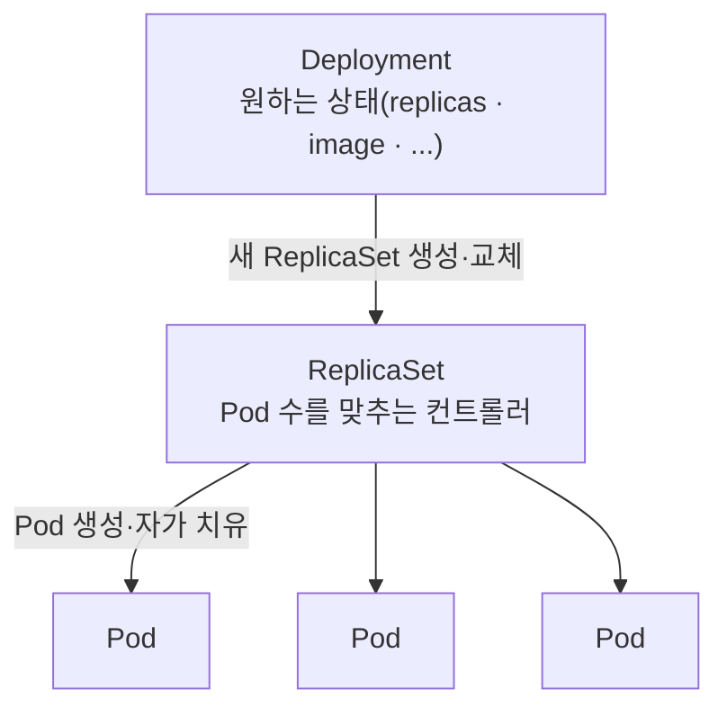
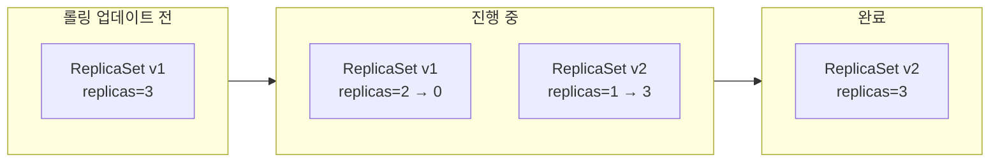

# 7. Deployment와 ReplicaSet

Deployment · ReplicaSet · Pod 세 계층이 자가 치유와 롤링 업데이트를 어떻게 수행하는지, Pod 하나를 지우거나 이미지를 바꾸면 무엇이 자동으로 일어나는지 손으로 확인하는 실습 공간입니다.

## 핵심 다이어그램





- **Deployment**는 원하는 상태(`replicas`, 컨테이너 이미지, 라벨 등)를 선언합니다. 직접 Pod를 만들지 않습니다.
- **ReplicaSet**은 자기 라벨에 맞는 Pod 개수가 `replicas`와 같아지도록 유지합니다. Pod 하나가 사라지면 새로 만듭니다.
- **Deployment**는 이미지를 바꾸거나 템플릿을 갱신하면 새 ReplicaSet을 만들고, 옛 ReplicaSet을 천천히 줄입니다 — 이게 rolling update입니다.
- Pod는 ReplicaSet이 소유하고, ReplicaSet은 Deployment가 소유합니다. `kubectl delete deployment`만 해도 그 아래 ReplicaSet · Pod가 같이 사라지는 이유입니다.

아래 시연이 이 그림의 각 지점을 한 줄씩 손으로 확인합니다.

## 사전 준비물

이 실습은 **macOS** 환경을 기준으로 합니다.

- **Docker** — Docker Desktop, OrbStack 등. `docker ps`가 에러 없이 돌아가면 OK.
- **Homebrew** — macOS 패키지 관리자.

### kind · kubectl 설치

```bash
brew install kind kubectl
```

### rosa-lab 클러스터 준비

```bash
kind create cluster --name rosa-lab
```

이미 클러스터가 있으면 건너뜁니다.

```bash
kind get clusters   # rosa-lab이 보이면 OK
```

### rosa-lab namespace 준비

```bash
kubectl create namespace rosa-lab
kubectl config set-context --current --namespace=rosa-lab
```

이미 namespace가 있고 기본값으로 설정되어 있으면 건너뜁니다.

```bash
kubectl config get-contexts   # NAMESPACE 열에 rosa-lab이 보이면 OK
```

## 실습 환경

| 파일 | 내용 |
|---|---|
| `manifests/replicaset.yaml` | ReplicaSet 단독 — 자가 치유만 확인용 |
| `manifests/deployment.yaml` | Deployment — 스케일·롤링 업데이트·롤백 확인용 |

## 여기서 직접 확인할 수 있는 것

### ReplicaSet은 Pod 개수를 약속과 같게 유지합니다

먼저 Deployment 없이 ReplicaSet만 만듭니다.

```yaml
apiVersion: apps/v1
kind: ReplicaSet
metadata:
  name: nginx-rs
spec:
  replicas: 3
  selector:
    matchLabels:
      app: nginx-rs
  template:
    metadata:
      labels:
        app: nginx-rs
    spec:
      containers:
        - name: nginx
          image: nginx:1.27
```

`spec.selector.matchLabels`와 `spec.template.metadata.labels`는 같은 값이어야 합니다. ReplicaSet은 이 라벨을 기준으로 자기가 관리할 Pod를 식별합니다.

```bash
$ kubectl apply -f manifests/replicaset.yaml
replicaset.apps/nginx-rs created

$ kubectl get rs
NAME       DESIRED   CURRENT   READY   AGE
nginx-rs   3         3         3       21s

$ kubectl get pods -l app=nginx-rs
NAME             READY   STATUS    RESTARTS   AGE
nginx-rs-n6pxg   1/1     Running   0          21s
nginx-rs-pt569   1/1     Running   0          21s
nginx-rs-q46g2   1/1     Running   0          21s
```

Pod 이름은 `<ReplicaSet 이름>-<랜덤 5자>` 형태입니다.

### Pod 하나를 지워도 ReplicaSet이 새로 만듭니다

```bash
$ kubectl delete pod nginx-rs-n6pxg
pod "nginx-rs-n6pxg" deleted from rosa-lab namespace

$ kubectl get pods -l app=nginx-rs
NAME             READY   STATUS    RESTARTS   AGE
nginx-rs-btvqk   1/1     Running   0          4s
nginx-rs-pt569   1/1     Running   0          31s
nginx-rs-q46g2   1/1     Running   0          31s
```

지운 Pod(`n6pxg`)는 사라지고, 한 번도 본 적 없는 이름(`btvqk`)이 새로 생겼습니다. ReplicaSet 이벤트에 그 흔적이 남습니다.

```bash
$ kubectl describe rs nginx-rs | grep -A 10 Events:
Events:
  Type    Reason            Age   From                   Message
  ----    ------            ----  ----                   -------
  Normal  SuccessfulCreate  34s   replicaset-controller  Created pod: nginx-rs-n6pxg
  Normal  SuccessfulCreate  34s   replicaset-controller  Created pod: nginx-rs-q46g2
  Normal  SuccessfulCreate  34s   replicaset-controller  Created pod: nginx-rs-pt569
  Normal  SuccessfulCreate  7s    replicaset-controller  Created pod: nginx-rs-btvqk
```

`replicaset-controller`는 컨트롤 플레인의 `kube-controller-manager` 안에 들어 있는 컨트롤러 중 하나입니다. ReplicaSet의 `replicas`와 실제 Pod 개수를 끊임없이 비교해 차이를 메웁니다.

ReplicaSet은 정리합니다.

```bash
kubectl delete -f manifests/replicaset.yaml
```

### Deployment는 ReplicaSet을 만들어 관리합니다

```yaml
apiVersion: apps/v1
kind: Deployment
metadata:
  name: nginx
spec:
  replicas: 3
  selector:
    matchLabels:
      app: nginx
  template:
    metadata:
      labels:
        app: nginx
    spec:
      containers:
        - name: nginx
          image: nginx:1.27
```

```bash
$ kubectl apply -f manifests/deployment.yaml
deployment.apps/nginx created

$ kubectl get deploy,rs,pods
NAME                    READY   UP-TO-DATE   AVAILABLE   AGE
deployment.apps/nginx   3/3     3            3           5s

NAME                               DESIRED   CURRENT   READY   AGE
replicaset.apps/nginx-775786f995   3         3         3       5s

NAME                         READY   STATUS    RESTARTS   AGE
pod/nginx-775786f995-hwz6z   1/1     Running   0          5s
pod/nginx-775786f995-l4f72   1/1     Running   0          5s
pod/nginx-775786f995-w4vxv   1/1     Running   0          5s
```

`nginx-775786f995`의 `775786f995`는 **pod-template-hash** — 현재 Pod 템플릿(이미지·환경·포트 등) 내용을 해시한 값입니다. 템플릿이 바뀌면 새 해시가 나오고, 새 해시 이름으로 또 다른 ReplicaSet이 만들어집니다.

### 소유 관계 — Deployment → ReplicaSet → Pod

각 객체의 `ownerReferences`에 위 계층이 그대로 적혀 있습니다.

```bash
$ kubectl get rs nginx-775786f995 -o yaml | grep -A 5 ownerReferences
  ownerReferences:
  - apiVersion: apps/v1
    blockOwnerDeletion: true
    controller: true
    kind: Deployment
    name: nginx
```

```bash
$ kubectl get pod -l app=nginx -o name | head -1 | xargs kubectl get -o yaml | grep -A 5 ownerReferences
  ownerReferences:
  - apiVersion: apps/v1
    blockOwnerDeletion: true
    controller: true
    kind: ReplicaSet
    name: nginx-775786f995
```

`kubectl delete deployment nginx`를 하면 가비지 컬렉터가 이 owner 관계를 따라 ReplicaSet과 Pod까지 같이 지웁니다.

### `kubectl scale` — Pod 수만 바꾸기

```bash
$ kubectl scale deployment nginx --replicas=5
deployment.apps/nginx scaled

$ kubectl get pods
NAME                     READY   STATUS    RESTARTS   AGE
nginx-775786f995-hwz6z   1/1     Running   0          18s
nginx-775786f995-l4f72   1/1     Running   0          18s
nginx-775786f995-ngsnb   1/1     Running   0          5s
nginx-775786f995-twqhm   1/1     Running   0          5s
nginx-775786f995-w4vxv   1/1     Running   0          18s
```

새로 뜬 Pod 둘(`ngsnb`, `twqhm`)도 같은 해시(`775786f995`)의 ReplicaSet에 속합니다. 템플릿이 안 바뀌었기 때문입니다.

다시 3개로 줄입니다.

```bash
kubectl scale deployment nginx --replicas=3
```

### `kubectl set image` — rolling update

이미지를 `nginx:1.27` → `nginx:1.28`로 바꿉니다.

```bash
$ kubectl set image deployment/nginx nginx=nginx:1.28
deployment.apps/nginx image updated
```

진행 중에 `kubectl get rs`를 보면 ReplicaSet이 두 개 동시에 있습니다 — 옛 것이 줄고, 새 것이 늘어납니다.

```bash
$ kubectl get rs
NAME               DESIRED   CURRENT   READY   AGE
nginx-775786f995   0         0         0       45s
nginx-859b74487b   3         3         3       18s
```

옛 ReplicaSet(`775786f995`)은 0으로 줄고, 새 ReplicaSet(`859b74487b` — `nginx:1.28` 템플릿 해시)이 3으로 올라왔습니다. 같은 Deployment 안에서 두 ReplicaSet의 라벨이 다른 이유는 자동으로 붙는 `pod-template-hash` 라벨 덕분입니다 — selector가 서로를 침범하지 않습니다.

진행이 끝났는지 확인합니다.

```bash
$ kubectl rollout status deployment/nginx
deployment "nginx" successfully rolled out
```

Deployment 이벤트에 한 단계씩 남습니다.

```bash
$ kubectl describe deployment nginx | grep -A 8 Events:
Events:
  Type    Reason             Age   From                   Message
  ----    ------             ----  ----                   -------
  Normal  ScalingReplicaSet  70s   deployment-controller  Scaled up replica set nginx-775786f995 from 0 to 3
  Normal  ScalingReplicaSet  43s   deployment-controller  Scaled up replica set nginx-859b74487b from 0 to 1
  Normal  ScalingReplicaSet  34s   deployment-controller  Scaled down replica set nginx-775786f995 from 3 to 2
  Normal  ScalingReplicaSet  34s   deployment-controller  Scaled up replica set nginx-859b74487b from 1 to 2
```

옛 RS를 1 줄이고 새 RS를 1 올리는 식으로 번갈아 진행됩니다. 이때 동시에 죽일 수 있는 개수와 동시에 더 띄울 수 있는 개수는 Deployment의 RollingUpdate 전략으로 정합니다.

```bash
$ kubectl describe deployment nginx | grep -A 2 "StrategyType"
StrategyType:           RollingUpdate
MinReadySeconds:        0
RollingUpdateStrategy:  25% max unavailable, 25% max surge
```

기본값은 `maxUnavailable: 25%` · `maxSurge: 25%`입니다 — replicas가 3이면 진행 중에 최소 2개(75%)는 항상 떠 있고, 최대 4개(125%)까지 잠깐 더 뜰 수 있다는 뜻입니다.

### `kubectl rollout history` — 어떤 변경이 있었는지

```bash
$ kubectl rollout history deployment/nginx
deployment.apps/nginx
REVISION  CHANGE-CAUSE
1         <none>
2         <none>
```

각 revision의 Pod 템플릿을 볼 수 있습니다.

```bash
$ kubectl rollout history deployment/nginx --revision=2
deployment.apps/nginx with revision #2
Pod Template:
  Labels:	app=nginx
	pod-template-hash=859b74487b
  Containers:
   nginx:
    Image:	nginx:1.28
    Port:	80/TCP
    ...
```

`CHANGE-CAUSE`가 `<none>`인 이유는 `kubectl ... --record`(deprecated) 없이 변경했기 때문입니다. annotation `kubernetes.io/change-cause`를 직접 붙이면 채울 수 있습니다.

### `kubectl rollout undo` — 이전 버전으로 되돌리기

```bash
$ kubectl rollout undo deployment/nginx
deployment.apps/nginx rolled back

$ kubectl get rs
NAME               DESIRED   CURRENT   READY   AGE
nginx-775786f995   3         3         3       62s
nginx-859b74487b   0         0         0       35s
```

옛 ReplicaSet(`775786f995` — `nginx:1.27`)이 다시 3으로 올라오고, 새 것은 0으로 내려갔습니다. 새 ReplicaSet은 사라지지 않고 그대로 남아 있습니다 — 다음에 다시 `undo`로 돌아갈 수 있도록입니다.

history도 다시 확인합니다.

```bash
$ kubectl rollout history deployment/nginx
deployment.apps/nginx
REVISION  CHANGE-CAUSE
2         <none>
3         <none>
```

revision 1이 사라지고 3이 새로 생긴 것처럼 보이지만, 실제로는 "revision 1의 템플릿이 revision 3으로 재번호 매겨진" 결과입니다. Deployment의 revision 번호는 단조 증가합니다.

### 정리

```bash
kubectl delete -f manifests
```
