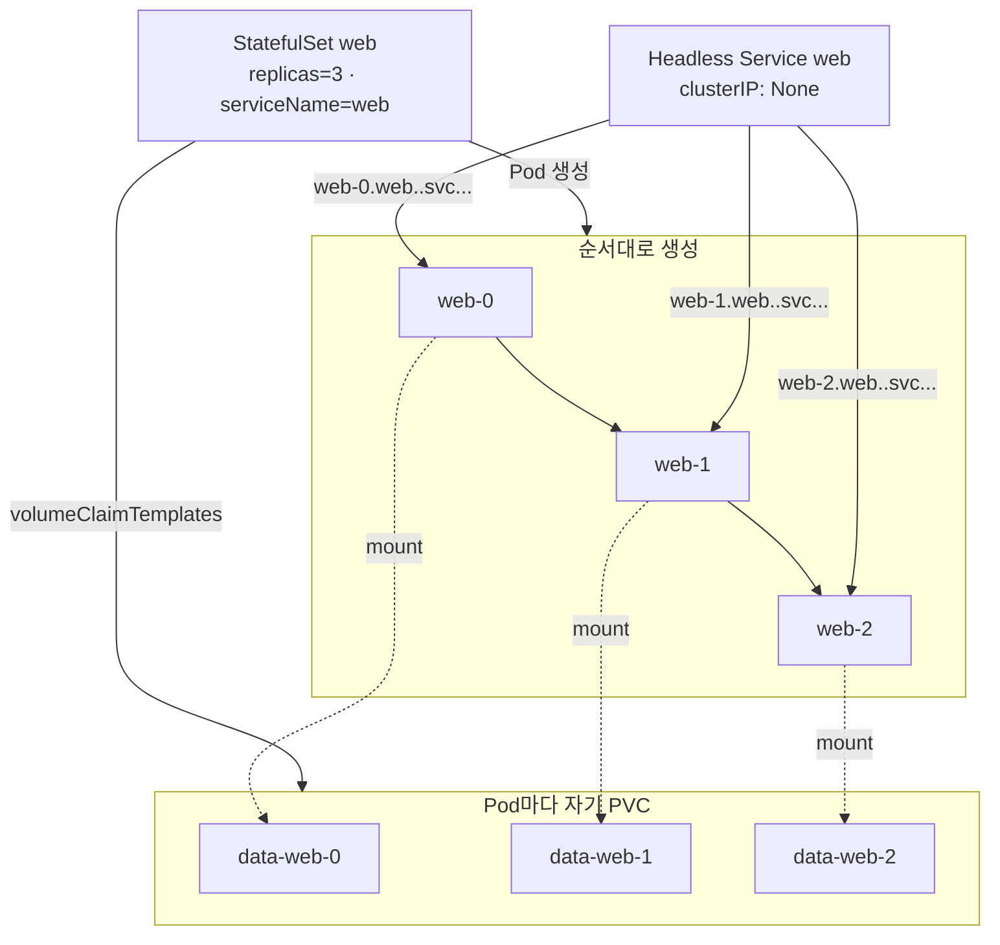

# 8. StatefulSet — identity 있는 Pod

Pod에 안정적인 이름·순서·스토리지를 주는 StatefulSet이 Deployment와 어떻게 다른지, Pod를 지워도 같은 이름과 같은 데이터로 돌아오는 흔적을 손으로 확인하는 실습 공간입니다.

## 핵심 다이어그램



- **StatefulSet**은 Pod에 `<sts 이름>-<번호>` 형태의 고정된 이름을 줍니다. ReplicaSet이 만드는 `<rs>-<랜덤 5자>`와 다릅니다.
- **순서가 있다.** 생성은 0 → 1 → 2 차례로, 종료(스케일 다운)는 큰 번호부터(2 → 1 → 0) 일어납니다. 앞 Pod가 Ready가 되어야 다음 Pod를 만듭니다.
- **Pod별 PVC.** `volumeClaimTemplates`에 적은 한 벌의 청구서가 Pod마다 하나씩 만들어집니다 — `data-web-0`, `data-web-1`, `data-web-2`. Pod가 죽었다 살아나도 같은 PVC를 다시 마운트합니다.
- **Headless Service**(`clusterIP: None`)는 Pod 하나하나에 DNS 이름을 줍니다. `web-0.web.<ns>.svc.cluster.local`은 정확히 web-0만 가리킵니다 — Deployment + 일반 Service의 "어느 Pod로 갈지 모르는" 동작과 다릅니다.

아래 시연이 이 그림의 각 지점을 한 줄씩 손으로 확인합니다.

## 사전 준비물

이 실습은 **macOS** 환경을 기준으로 합니다.

- **Docker** — Docker Desktop, OrbStack 등. `docker ps`가 에러 없이 돌아가면 OK.
- **Homebrew** — macOS 패키지 관리자.

### kind · kubectl 설치

```bash
brew install kind kubectl
```

### rosa-lab 클러스터 준비

```bash
kind create cluster --name rosa-lab
```

이미 클러스터가 있으면 건너뜁니다.

```bash
kind get clusters   # rosa-lab이 보이면 OK
```

### rosa-lab namespace 준비

```bash
kubectl create namespace rosa-lab
kubectl config set-context --current --namespace=rosa-lab
```

이미 namespace가 있고 기본값으로 설정되어 있으면 건너뜁니다.

```bash
kubectl config get-contexts   # NAMESPACE 열에 rosa-lab이 보이면 OK
```

### default StorageClass 확인

kind 클러스터는 기본 StorageClass `standard`를 제공합니다(provisioner: `rancher.io/local-path`). PVC가 동적으로 PV를 받으려면 default StorageClass가 있어야 합니다.

```bash
$ kubectl get sc
NAME                 PROVISIONER             RECLAIMPOLICY   VOLUMEBINDINGMODE      ALLOWVOLUMEEXPANSION   AGE
standard (default)   rancher.io/local-path   Delete          WaitForFirstConsumer   false                  17h
```

## 실습 환경

| 파일 | 내용 |
|---|---|
| `manifests/headless-service.yaml` | Headless Service `web` — Pod별 DNS 이름의 진입점 |
| `manifests/statefulset.yaml` | StatefulSet `web` — replicas 3, Pod별 PVC `data-web-N` |

## 여기서 직접 확인할 수 있는 것

### Headless Service — 개별 Pod에 DNS 이름을 주려고 둡니다

```yaml
apiVersion: v1
kind: Service
metadata:
  name: web
spec:
  clusterIP: None
  selector:
    app: web
  ports:
    - port: 80
      targetPort: 80
```

`clusterIP: None`이 핵심입니다. 가상 IP를 만들지 않고, 대신 DNS에 selector에 맞는 모든 Pod의 IP를 직접 등록합니다. StatefulSet의 `spec.serviceName`이 이 Service 이름을 가리킬 때, Pod마다 `<pod>.<svc>.<ns>.svc.cluster.local` 형태의 고정 DNS도 같이 만들어집니다.

### StatefulSet — 이름과 PVC를 묶어서 만듭니다

```yaml
apiVersion: apps/v1
kind: StatefulSet
metadata:
  name: web
spec:
  serviceName: web
  replicas: 3
  selector:
    matchLabels:
      app: web
  template:
    metadata:
      labels:
        app: web
    spec:
      containers:
        - name: nginx
          image: nginx:1.27
          ports:
            - containerPort: 80
          volumeMounts:
            - name: data
              mountPath: /usr/share/nginx/html
  volumeClaimTemplates:
    - metadata:
        name: data
      spec:
        accessModes: ["ReadWriteOnce"]
        resources:
          requests:
            storage: 100Mi
```

| 항목 | 역할 |
|---|---|
| `serviceName: web` | 어떤 Headless Service의 도메인 아래에 Pod DNS를 만들지 |
| `volumeClaimTemplates` | Pod마다 하나씩 만들 PVC 템플릿 — 이름은 `<template>-<sts>-<번호>` 형태 |
| `volumeMounts.name: data` | `volumeClaimTemplates`의 이름과 같아야 함 |

### 순서대로 생성됩니다

Service와 StatefulSet을 같이 적용한 직후를 빠르게 봅니다.

```bash
$ kubectl apply -f manifests/headless-service.yaml
service/web created

$ kubectl apply -f manifests/statefulset.yaml
statefulset.apps/web created

$ kubectl get pods -l app=web
NAME    READY   STATUS    RESTARTS   AGE
web-0   1/1     Running   0          6s
web-1   0/1     Pending   0          1s
```

web-0이 먼저 Running으로 가고 나서야 web-1이 만들어집니다. web-2는 web-1이 Ready가 된 다음에 등장합니다.

조금 더 기다리면 셋 다 뜹니다.

```bash
$ kubectl get pods,pvc -l app=web
NAME        READY   STATUS    RESTARTS   AGE
pod/web-0   1/1     Running   0          31s
pod/web-1   1/1     Running   0          26s
pod/web-2   1/1     Running   0          23s

NAME                               STATUS   VOLUME                                     CAPACITY   ACCESS MODES   STORAGECLASS
persistentvolumeclaim/data-web-0   Bound    pvc-39669de8-...                           100Mi      RWO            standard
persistentvolumeclaim/data-web-1   Bound    pvc-a2a381b8-...                           100Mi      RWO            standard
persistentvolumeclaim/data-web-2   Bound    pvc-2016b70b-...                           100Mi      RWO            standard
```

AGE 차이가 그대로 생성 순서입니다. StatefulSet 컨트롤러가 한 단계씩 진행한 흔적은 이벤트에 남습니다.

```bash
$ kubectl describe sts web | grep -A 10 Events:
Events:
  Type    Reason            Age   From                    Message
  ----    ------            ----  ----                    -------
  Normal  SuccessfulCreate  34s   statefulset-controller  Create Claim data-web-0 Pod web-0 in StatefulSet web success
  Normal  SuccessfulCreate  34s   statefulset-controller  Create Pod web-0 in StatefulSet web successful
  Normal  SuccessfulCreate  29s   statefulset-controller  Create Claim data-web-1 Pod web-1 in StatefulSet web success
  Normal  SuccessfulCreate  29s   statefulset-controller  Create Pod web-1 in StatefulSet web successful
  Normal  SuccessfulCreate  26s   statefulset-controller  Create Claim data-web-2 Pod web-2 in StatefulSet web success
  Normal  SuccessfulCreate  26s   statefulset-controller  Create Pod web-2 in StatefulSet web successful
```

각 Pod 직전에 Claim(PVC)을 먼저 만드는 점이 보입니다. PVC가 Bound된 뒤에야 Pod가 만들어집니다.

### Headless DNS — Pod 하나를 이름으로 골라 부릅니다

이름이 `<pod>.<svc>.<namespace>.svc.cluster.local`인 DNS가 Pod마다 존재합니다. 임시 BusyBox Pod로 nslookup을 해 봅니다.

```bash
$ kubectl run dnsutil --image=busybox:1.37 --restart=Never -- sleep 60
pod/dnsutil created

$ kubectl exec dnsutil -- nslookup web-0.web.rosa-lab.svc.cluster.local
Server:		10.96.0.10
Address:	10.96.0.10:53

Name:	web-0.web.rosa-lab.svc.cluster.local
Address: 10.244.0.21
```

`web-0`의 Pod IP 하나만 돌아옵니다. Service 이름만으로 부르면 Pod 셋의 IP가 모두 나옵니다.

```bash
$ kubectl exec dnsutil -- nslookup web.rosa-lab.svc.cluster.local
Server:		10.96.0.10
Address:	10.96.0.10:53

Name:	web.rosa-lab.svc.cluster.local
Address: 10.244.0.23
Name:	web.rosa-lab.svc.cluster.local
Address: 10.244.0.25
Name:	web.rosa-lab.svc.cluster.local
Address: 10.244.0.21
```

```bash
kubectl delete pod dnsutil
```

일반 ClusterIP Service는 가상 IP 하나(→ 클러스터 내부에서 kube-proxy가 Pod 셋 중 하나로 분배)지만, Headless Service는 가상 IP가 아예 없고 Pod IP 목록을 DNS에 그대로 노출합니다 — 클라이언트가 어느 Pod에 갈지 직접 고를 수 있게 됩니다.

### Pod를 지워도 같은 이름·같은 데이터로 돌아옵니다

web-0의 마운트 디렉토리에 파일을 하나 씁니다.

```bash
$ kubectl exec web-0 -- sh -c 'echo "hello from web-0" > /usr/share/nginx/html/index.html'
$ kubectl exec web-0 -- cat /usr/share/nginx/html/index.html
hello from web-0
```

web-0의 IP를 확인합니다.

```bash
$ kubectl get pod web-0 -o wide
NAME    READY   STATUS    RESTARTS   AGE    IP            NODE
web-0   1/1     Running   0          97s    10.244.0.21   rosa-lab-control-plane
```

이제 web-0을 강제로 지웁니다.

```bash
$ kubectl delete pod web-0
pod "web-0" deleted from rosa-lab namespace
```

잠시 후 다시 봅니다.

```bash
$ kubectl get pod web-0 -o wide
NAME    READY   STATUS    RESTARTS   AGE   IP            NODE
web-0   1/1     Running   0          8s    10.244.0.30   rosa-lab-control-plane

$ kubectl exec web-0 -- cat /usr/share/nginx/html/index.html
hello from web-0
```

이름은 `web-0` 그대로, IP는 `10.244.0.21` → `10.244.0.30`으로 바뀌었지만 `data-web-0` PVC를 다시 마운트했기 때문에 파일이 살아 있습니다. 클라이언트가 `web-0.web.<ns>.svc.cluster.local`로 부르면 DNS가 새 IP를 가르쳐 줍니다.

### 스케일 다운은 큰 번호부터 종료합니다

```bash
$ kubectl scale sts web --replicas=1
statefulset.apps/web scaled
```

`kubectl get pods -l app=web -w`로 변화를 봅니다.

```
NAME    READY   STATUS        RESTARTS   AGE
web-0   1/1     Running       0          30s
web-1   1/1     Running       0          2m3s
web-2   1/1     Terminating   0          2m
web-2   0/1     Completed     0          2m
web-1   1/1     Terminating   0          2m4s
web-1   0/1     Completed     0          2m4s
```

web-2가 먼저, 그다음 web-1이 종료됩니다. 생성과 반대 순서입니다.

남는 것은 web-0 한 개입니다 — 하지만 PVC는 그대로입니다.

```bash
$ kubectl get pods,pvc -l app=web
NAME        READY   STATUS    RESTARTS   AGE
pod/web-0   1/1     Running   0          42s

NAME                               STATUS   VOLUME             CAPACITY   ACCESS MODES   STORAGECLASS
persistentvolumeclaim/data-web-0   Bound    pvc-39669de8-...   100Mi      RWO            standard
persistentvolumeclaim/data-web-1   Bound    pvc-a2a381b8-...   100Mi      RWO            standard
persistentvolumeclaim/data-web-2   Bound    pvc-2016b70b-...   100Mi      RWO            standard
```

다시 `kubectl scale sts web --replicas=3` 하면 web-1, web-2가 살아나면서 기존 `data-web-1`, `data-web-2`를 다시 마운트합니다 — 안에 있던 데이터가 그대로 보입니다. 데이터베이스나 로그를 다루는 워크로드가 StatefulSet을 쓰는 이유입니다.

### StatefulSet을 지워도 PVC는 남습니다

```bash
$ kubectl delete sts web
statefulset.apps "web" deleted from rosa-lab namespace

$ kubectl get pvc
NAME         STATUS   VOLUME             CAPACITY   ACCESS MODES   STORAGECLASS
data-web-0   Bound    pvc-39669de8-...   100Mi      RWO            standard
data-web-1   Bound    pvc-a2a381b8-...   100Mi      RWO            standard
data-web-2   Bound    pvc-2016b70b-...   100Mi      RWO            standard
```

데이터 보호 기본값입니다. 같은 이름의 StatefulSet을 다시 만들면 옛 PVC들에 다시 붙습니다. 정말로 데이터를 버리려면 PVC를 명시적으로 지워야 합니다.

### 정리

```bash
kubectl delete -f manifests
kubectl delete pvc data-web-0 data-web-1 data-web-2
```
