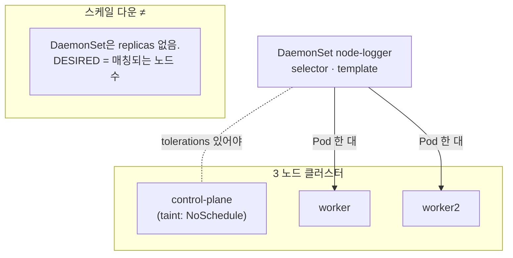

# 9. DaemonSet — 노드마다 한 대

모든 노드에 같이 떠 있어야 하는 워크로드(로그 수집기·노드 메트릭·CNI 에이전트 등)를 DaemonSet으로 어떻게 배치하는지, 노드를 늘리고 줄이고 라벨을 붙이면 Pod가 어디로 따라가는지 손으로 확인하는 실습 공간입니다.

## 핵심 다이어그램



- **DaemonSet은 `replicas`를 쓰지 않습니다.** 대신 "어떤 노드에 떠야 하는가?"를 판단해 매칭되는 노드마다 한 대씩 Pod를 만듭니다.
- 노드의 **taint**는 기본적으로 Pod 배치를 막습니다. kind의 control-plane에는 `node-role.kubernetes.io/control-plane:NoSchedule` taint가 붙어 있어서, toleration 없는 DaemonSet은 control-plane에 뜨지 않습니다.
- **`nodeSelector`(또는 affinity)** 로 매칭 대상을 좁힐 수 있습니다. 예) "라벨 `rosa-lab/logger=enabled` 붙은 노드만".
- 노드가 추가되면 DaemonSet 컨트롤러가 그 노드에 새 Pod를 만들고, 노드가 사라지면 그 위의 Pod도 같이 정리됩니다.

아래 시연이 이 그림의 각 지점을 한 줄씩 손으로 확인합니다.

## 사전 준비물

이 실습은 **macOS** 환경을 기준으로 합니다.

- **Docker** — Docker Desktop, OrbStack 등. `docker ps`가 에러 없이 돌아가면 OK.
- **Homebrew** — macOS 패키지 관리자.

### kind · kubectl 설치

```bash
brew install kind kubectl
```

### 멀티노드 rosa-lab 클러스터 준비

DaemonSet은 "노드마다 한 대"가 핵심이라 단일 노드 클러스터로는 의미 있는 그림이 안 나옵니다. control-plane 1개 + worker 2개로 다시 만듭니다.

이미 같은 이름의 클러스터가 있으면 먼저 지웁니다.

```bash
kind delete cluster --name rosa-lab
```

이 폴더의 `kind-cluster.yaml`로 새로 만듭니다.

```bash
kind create cluster --config kind-cluster.yaml
```

3 노드가 모두 Ready 상태인지 확인합니다.

```bash
$ kubectl get nodes
NAME                     STATUS   ROLES           AGE     VERSION
rosa-lab-control-plane   Ready    control-plane   2m52s   v1.36.1
rosa-lab-worker          Ready    <none>          2m37s   v1.36.1
rosa-lab-worker2         Ready    <none>          2m37s   v1.36.1
```

### rosa-lab namespace 준비

```bash
kubectl create namespace rosa-lab
kubectl config set-context --current --namespace=rosa-lab
```

이미 namespace가 있고 기본값으로 설정되어 있으면 건너뜁니다.

```bash
kubectl config get-contexts   # NAMESPACE 열에 rosa-lab이 보이면 OK
```

## 실습 환경

| 파일 | 내용 |
|---|---|
| `kind-cluster.yaml` | 멀티노드 클러스터 설정 (control-plane 1 + worker 2) |
| `manifests/daemonset.yaml` | 기본 DaemonSet — toleration 없음, worker에만 배치 |
| `manifests/daemonset-with-toleration.yaml` | + control-plane toleration — 모든 노드에 배치 |
| `manifests/daemonset-nodeselector.yaml` | + nodeSelector — 라벨 붙은 노드에만 배치 |

## 여기서 직접 확인할 수 있는 것

### 이미 떠 있는 DaemonSet — kindnet, kube-proxy

DaemonSet을 새로 만들기 전에, kube-system에는 이미 시스템 DaemonSet 두 개가 떠 있습니다.

```bash
$ kubectl get ds -n kube-system
NAME         DESIRED   CURRENT   READY   UP-TO-DATE   AVAILABLE   NODE SELECTOR            AGE
kindnet      3         3         3       3            3           kubernetes.io/os=linux   2m48s
kube-proxy   3         3         3       3            3           kubernetes.io/os=linux   2m49s
```

`DESIRED 3`은 매칭되는 노드 수(`kubernetes.io/os=linux`인 노드 3개) 그대로입니다. Deployment의 `replicas`와 다르게, DaemonSet은 명시한 숫자가 아니라 "노드 수"가 곧 Pod 수입니다.

각 Pod가 어느 노드에 떠 있는지 봅니다.

```bash
$ kubectl get pods -n kube-system -l app=kindnet -o wide
NAME            READY   STATUS    RESTARTS   AGE     IP           NODE
kindnet-2dzvn   1/1     Running   0          2m48s   172.19.0.2   rosa-lab-control-plane
kindnet-lm4tg   1/1     Running   0          2m43s   172.19.0.4   rosa-lab-worker2
kindnet-pdhlb   1/1     Running   0          2m43s   172.19.0.3   rosa-lab-worker
```

control-plane을 포함해 모든 노드에 정확히 하나씩 있습니다.

### 기본 DaemonSet — control-plane에는 뜨지 않습니다

```yaml
apiVersion: apps/v1
kind: DaemonSet
metadata:
  name: node-logger
spec:
  selector:
    matchLabels:
      app: node-logger
  template:
    metadata:
      labels:
        app: node-logger
    spec:
      containers:
        - name: logger
          image: busybox:1.37
          command: ["sh", "-c", "while true; do echo \"hello from $(hostname) on node ${NODE_NAME}\"; sleep 30; done"]
          env:
            - name: NODE_NAME
              valueFrom:
                fieldRef:
                  fieldPath: spec.nodeName
```

`env.NODE_NAME`은 Downward API로 자기 Pod가 떠 있는 노드 이름을 컨테이너 안에 주입합니다. 로그 수집 에이전트가 자기 노드를 알아야 할 때 흔히 쓰는 패턴입니다.

```bash
$ kubectl apply -f manifests/daemonset.yaml
daemonset.apps/node-logger created

$ kubectl get ds node-logger
NAME          DESIRED   CURRENT   READY   UP-TO-DATE   AVAILABLE   NODE SELECTOR   AGE
node-logger   2         2         2       2            2           <none>          5s

$ kubectl get pods -l app=node-logger -o wide
NAME                READY   STATUS    RESTARTS   AGE   IP           NODE
node-logger-8tslj   1/1     Running   0          5s    10.244.1.2   rosa-lab-worker
node-logger-qltpd   1/1     Running   0          5s    10.244.2.2   rosa-lab-worker2
```

`DESIRED 2` — control-plane 노드는 제외됐습니다. 왜인지 노드 taint를 보면 분명합니다.

```bash
$ kubectl get nodes -o custom-columns=NAME:.metadata.name,TAINTS:.spec.taints
NAME                     TAINTS
rosa-lab-control-plane   [map[effect:NoSchedule key:node-role.kubernetes.io/control-plane]]
rosa-lab-worker          <none>
rosa-lab-worker2         <none>
```

control-plane에는 `node-role.kubernetes.io/control-plane:NoSchedule` taint가 붙어 있습니다. toleration이 없는 Pod는 이 taint를 받아들이지 않으므로 그 노드에 스케줄되지 않습니다. kindnet은 같은 노드에 떠 있는데, 그건 kindnet DaemonSet이 모든 taint를 받아들이는 toleration(`operator: Exists`)을 갖고 있기 때문입니다.

### toleration 추가 — control-plane에도 뜹니다

같은 DaemonSet에 toleration을 붙입니다.

```yaml
spec:
  template:
    spec:
      tolerations:
        - key: node-role.kubernetes.io/control-plane
          operator: Exists
          effect: NoSchedule
      containers:
        ...
```

```bash
$ kubectl apply -f manifests/daemonset-with-toleration.yaml
daemonset.apps/node-logger configured

$ kubectl get ds node-logger
NAME          DESIRED   CURRENT   READY   UP-TO-DATE   AVAILABLE   NODE SELECTOR   AGE
node-logger   3         3         3       3            3           <none>          2m
```

`DESIRED 3`으로 늘어났고 control-plane에도 Pod가 떴습니다.

```bash
$ kubectl get pods -l app=node-logger -o wide
NAME                READY   STATUS    RESTARTS   AGE   IP           NODE
node-logger-dqxm8   1/1     Running   0          35s   10.244.1.3   rosa-lab-worker
node-logger-fkkzx   1/1     Running   0          70s   10.244.0.5   rosa-lab-control-plane
node-logger-xw75q   1/1     Running   0          4s    10.244.2.3   rosa-lab-worker2
```

DaemonSet 컨트롤러 이벤트에서 한 단계씩 흔적이 남습니다.

```bash
$ kubectl describe ds node-logger | grep -A 8 Events:
Events:
  Type    Reason            Age   From                  Message
  ----    ------            ----  ----                  -------
  Normal  SuccessfulCreate  85s   daemonset-controller  Created pod: node-logger-8tslj
  Normal  SuccessfulCreate  85s   daemonset-controller  Created pod: node-logger-qltpd
  Normal  SuccessfulCreate  75s   daemonset-controller  Created pod: node-logger-fkkzx
  Normal  SuccessfulDelete  70s   daemonset-controller  Deleted pod: node-logger-8tslj
  Normal  SuccessfulCreate  40s   daemonset-controller  Created pod: node-logger-dqxm8
  Normal  SuccessfulDelete  40s   daemonset-controller  Deleted pod: node-logger-qltpd
```

`daemonset-controller`는 `kube-controller-manager` 안의 컨트롤러 중 하나입니다. 새 매니페스트로 바뀔 때 옛 Pod를 한 대씩 지우고 새 Pod를 다시 띄우는 식으로 진행합니다(기본 update strategy `RollingUpdate`).

### nodeSelector — 특정 노드에만 배치합니다

운영에서 자주 쓰는 패턴: "GPU 노드에만 GPU 드라이버 DaemonSet을 띄운다", "특정 라벨 붙은 노드만 로그 수집 Pod를 받는다" 같은 식입니다.

```yaml
spec:
  template:
    spec:
      nodeSelector:
        rosa-lab/logger: enabled
      containers:
        ...
```

```bash
$ kubectl apply -f manifests/daemonset-nodeselector.yaml
daemonset.apps/node-logger configured

$ kubectl get ds node-logger
NAME          DESIRED   CURRENT   READY   UP-TO-DATE   AVAILABLE   NODE SELECTOR             AGE
node-logger   0         0         0       0            0           rosa-lab/logger=enabled   95s
```

`DESIRED 0` — 매칭되는 노드가 하나도 없으니 Pod도 0입니다. 노드에 라벨을 붙입니다.

```bash
$ kubectl label node rosa-lab-worker rosa-lab/logger=enabled
node/rosa-lab-worker labeled

$ kubectl get ds node-logger
NAME          DESIRED   CURRENT   READY   UP-TO-DATE   AVAILABLE   NODE SELECTOR             AGE
node-logger   1         1         1       1            1           rosa-lab/logger=enabled   109s
```

라벨이 붙자마자 DaemonSet 컨트롤러가 그 노드에 Pod 하나를 만듭니다. 두 번째 worker에도 라벨을 붙입니다.

```bash
$ kubectl label node rosa-lab-worker2 rosa-lab/logger=enabled
node/rosa-lab-worker2 labeled

$ kubectl get pods -l app=node-logger -o wide
NAME                READY   STATUS    RESTARTS   AGE   IP           NODE
node-logger-bcdt9   1/1     Running   0          9s    10.244.1.4   rosa-lab-worker
node-logger-jsmkr   1/1     Running   0          9s    10.244.2.4   rosa-lab-worker2
```

반대로 라벨을 떼면 그 노드의 Pod도 같이 정리됩니다.

```bash
kubectl label node rosa-lab-worker rosa-lab/logger-
kubectl label node rosa-lab-worker2 rosa-lab/logger-
```

`<라벨키>-` 문법이 라벨 제거입니다. 다시 봤을 때 `DESIRED 0` · Pod 0개로 돌아가 있어야 합니다.

### 로그 — Downward API로 노드 이름이 메시지에 들어갑니다

DaemonSet Pod가 자기 노드 이름을 어떻게 알았는지 로그로 확인합니다.

```bash
$ kubectl logs node-logger-bcdt9 | head -3
[Tue Jun 23 01:49:19 UTC 2026] hello from node-logger-bcdt9 on node rosa-lab-worker
[Tue Jun 23 01:49:49 UTC 2026] hello from node-logger-bcdt9 on node rosa-lab-worker
```

`fieldRef.fieldPath: spec.nodeName`이 컨테이너 안에서 `$NODE_NAME`이 됩니다. 로그를 중앙으로 보낼 때 라벨에 노드 이름을 끼워 두면, 어느 노드에서 난 사건인지 추적할 수 있습니다.

### 정리

```bash
kubectl delete -f manifests
kubectl label node rosa-lab-worker rosa-lab/logger- --ignore-not-found
kubectl label node rosa-lab-worker2 rosa-lab/logger- --ignore-not-found
```
