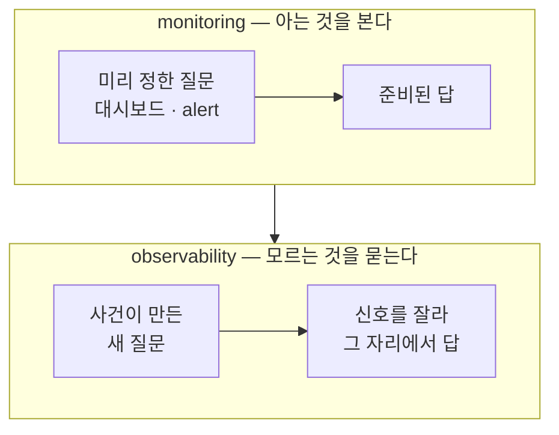
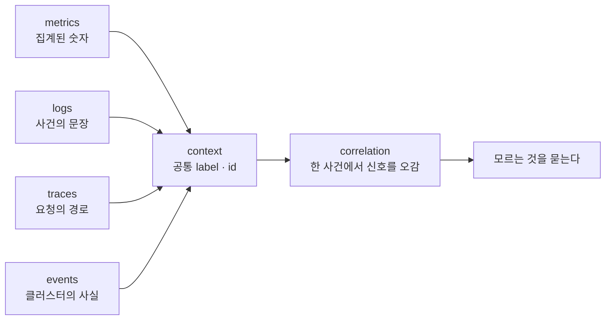

# 1. 왜 Observability인가 — Signals와 질문 가능성

Observability는 `metrics + logs + traces`를 모으는 일이 아닙니다. 신호를 아무리 많이 모아도, 방금 생긴 질문에 답하지 못하면 그건 관측이 아니라 수집입니다. 이 편은 같은 앱 하나를 두고 두 종류의 질문을 던집니다 — "에러가 났는가?"처럼 미리 정해 둔 질문(monitoring)과, "그 에러는 어느 경로 요청이었는가?"처럼 사건이 나서야 생긴 질문(observability). 앞 질문은 metric 하나로 끝나지만, 뒤 질문에서 metric은 막힙니다. 그 막히는 지점에서 observability가 무엇인지 — **signals + context + correlation**, 그리고 "묻고 싶은 만큼이 아니라 계측한 만큼만 답할 수 있다"는 경계 — 가 드러납니다. 이 편의 산출물은 "metric이 답하는 질문과 막히는 질문을 한 앱에서 직접 가른 경험"과 "RED·USE라는 두 표준 렌즈를 손에 쥔 상태"입니다.

## 핵심 다이어그램





- **monitoring은 아는 것을 본다.** CPU가 80%를 넘으면 알린다, 에러율 그래프를 띄운다 — 무엇을 볼지 미리 정해 두고 그 답을 준비한다. 질문이 고정돼 있으므로 답도 고정돼 있다.
- **observability는 모르는 것을 묻는다.** 사건이 터진 뒤에야 생기는 질문("왜 이 사용자만 느린가", "어느 경로가 404를 내는가")에, 신호를 그 자리에서 잘라 답할 수 있는 능력이다.
- **신호는 네 가지다.** metrics(집계된 숫자), logs(사건의 문장), traces(요청이 서비스들을 지난 경로), events(클러스터가 한 일). 각각 보는 각도가 다르다.
- **observability는 신호의 합이 아니다.** 신호에 **context**(서비스·환경·요청 id 같은 공통 label)가 붙고, 그 label로 신호 사이를 오가는 **correlation**이 될 때 비로소 "모르는 것을 묻는" 능력이 된다. `signals + context + correlation`이 정의다.

아래 시연이 이 경계를 한 줄씩 손으로 확인합니다.

## 사전 준비물

이 실습은 **macOS** 환경을 기준으로 합니다.

- **Docker** — Docker Desktop, OrbStack 등. `docker ps`가 에러 없이 돌아가면 OK.
- **Homebrew** — macOS 패키지 관리자.

### kind · kubectl 설치

```bash
brew install kind kubectl
```

### rosa-lab 클러스터 · namespace 준비

```bash
kind create cluster --name rosa-lab
kubectl create namespace rosa-lab
kubectl config set-context --current --namespace=rosa-lab
```

이미 있으면 건너뜁니다 (`kind get clusters`, `kubectl config get-contexts`로 확인).

## 실습 환경

| 파일 | 내용 |
|---|---|
| `manifests/app.yaml` | `prometheus-example-app` Deployment + Service. `/`에 200, 그 외 경로에 404를 돌려주고, `http_requests_total`·`http_request_duration_seconds`를 노출 포맷으로 낸다 |

이 앱은 자기가 받은 요청을 **숫자(metric)로만** 내보냅니다. 요청 한 건 한 건을 로그로 남기지 않습니다 — 이 점이 뒤에서 결정적입니다.

```bash
kubectl apply -f manifests/app.yaml
kubectl rollout status deploy/web -n rosa-lab
```

## 여기서 직접 확인할 수 있는 것

먼저 요청을 흘려보냅니다. 정상 경로(`/`) 20번, 없는 경로(`/err`) 4번을 Pod 안에서 호출합니다.

```bash
POD=$(kubectl get pod -n rosa-lab -l app=web -o jsonpath='{.items[0].metadata.name}')
kubectl exec -n rosa-lab "$POD" -- sh -c '
  for i in $(seq 1 20); do wget -qO- localhost:8080/ >/dev/null; done
  for i in 1 2 3 4; do wget -qO- localhost:8080/err >/dev/null 2>&1 || true; done
'
```

### 아는 것을 본다 — metric이 답하는 질문

"에러가 났는가? 얼마나?"는 미리 정해 둘 수 있는 질문입니다. 앱이 요청 수를 `http_requests_total`이라는 counter로 세어 두므로, `/metrics`를 읽어 바로 답합니다.

```bash
kubectl exec -n rosa-lab "$POD" -- wget -qO- localhost:8080/metrics \
  | grep -E '^(# (HELP|TYPE) http_requests_total|http_requests_total)'
```

```
# HELP http_requests_total Count of all HTTP requests
# TYPE http_requests_total counter
http_requests_total{code="200",method="get"} 20
http_requests_total{code="404",method="get"} 4
```

`code` label로 결과가 갈립니다 — 정상 20, 404가 4. 전체 24건 중 에러 4건, 에러율 약 16.7%. "에러가 났는가?"라는 **준비된 질문**에 metric 한 줄이 답합니다. 이게 monitoring이 잘하는 일입니다.

### RED와 USE — 무엇을 보는 두 렌즈인가

위에서 본 "요청 수·에러 수"는 임의로 고른 숫자가 아니라 표준 렌즈의 일부입니다. 무엇을 봐야 하는지에는 두 가지 정형화된 묶음이 있습니다.

| 렌즈 | 보는 대상 | 구성 | 답하는 질문 |
|---|---|---|---|
| **RED** | 요청 (서비스를 밖에서 본 경험) | **R**ate · **E**rrors · **D**uration | "사용자가 받는 경험이 괜찮은가?" |
| **USE** | 자원 (서비스 안의 살림) | **U**tilization · **S**aturation · **E**rrors | "자원이 부족하거나 포화됐는가?" |

RED는 방금 본 `http_requests_total`로 두 축이 채워집니다 — Rate는 이 counter가 늘어나는 속도, Errors는 `code="404"`의 비율. 세 번째 축 Duration은 같은 앱이 히스토그램으로 따로 잽니다.

```bash
kubectl exec -n rosa-lab "$POD" -- wget -qO- localhost:8080/metrics \
  | grep -E '^http_request_duration_seconds_(count|sum)'
```

```
http_request_duration_seconds_sum{code="200",handler="found",method="get"} 0.0024926640000000003
http_request_duration_seconds_count{code="200",handler="found",method="get"} 20
```

20건의 처리 시간 합이 약 0.0025초 — 평균 약 0.12ms. Rate·Errors·Duration이 모두 이 앱의 `/metrics` 한 곳에서 나옵니다.

USE는 자원 쪽 렌즈입니다. 그런데 이 앱의 `/metrics`에는 USE를 채울 숫자가 없습니다 — CPU 포화도, 메모리 압박, 디스크 큐 같은 자원 신호를 이 앱이 내보내지 않기 때문입니다. 그 숫자는 노드·런타임을 재는 다른 출처에서 와야 합니다. 즉 같은 사건도 RED로는 "요청 경험이 나쁘다"를, USE로는 "자원이 포화됐다"를 봅니다. Errors는 두 렌즈에 공통으로 들어가 둘을 잇는 축입니다.

### 모르는 것을 묻는다 — metric이 막히는 지점

이번엔 사건이 만든 질문을 던집니다. "방금 그 404 4건은 **어느 경로** 요청이었는가?" 누가 `/err`를 부른 건지, 아니면 다른 잘못된 URL인지. metric에서 path를 찾아봅니다.

```bash
kubectl exec -n rosa-lab "$POD" -- wget -qO- localhost:8080/metrics \
  | grep '^http_requests_total' | grep -iE 'path|url|uri|route' \
  || echo "(path류 label 없음)"
```

```
(path류 label 없음)
```

`http_requests_total`이 들고 있는 label은 `code`와 `method`뿐입니다. 어느 경로였는지는 이 숫자에 없습니다. 그럼 요청 한 건 한 건의 기록, 로그를 봅니다.

```bash
kubectl logs -n rosa-lab "$POD"
```

```

```

비어 있습니다. 이 앱은 요청을 숫자로만 세고, 문장으로는 남기지 않습니다. metric에도, log에도 답이 없으니 "어느 경로가 404였나"는 **어디서도 답할 수 없습니다.**

여기서 두 가지가 드러납니다. 첫째, metric은 미리 정한 차원(`code`·`method`)으로 **집계된** 숫자라, 그 차원 밖의 질문("어느 경로")에는 구조적으로 답하지 못합니다. 둘째, 그렇다고 path를 label로 추가하면 — `/err`·`/checkout`·`/api/v2/orders/9c1f...`처럼 — 값마다 새로운 시계열이 생겨 수가 폭발합니다(cardinality). 그래서 "어느 경로, 어느 요청"같이 끝이 열린 질문의 답은 metric의 label을 무한히 늘리는 게 아니라, 요청 단위 맥락을 담는 **다른 신호** — log와 trace — 에 있습니다.

### 그래서 signals + context + correlation

방금 막힌 자리를 메우는 게 나머지 신호입니다.

- **log**가 있었다면 그 404 요청의 경로·시각·클라이언트가 한 줄로 남았을 것입니다.
- **trace**가 있었다면 그 요청이 어느 서비스에서 404로 끝났는지 경로가 남았을 것입니다.
- 그리고 이 신호들에 **공통 label·id**(context)가 붙어 있어야, metric의 에러율 상승 → 그 시각의 log → 그 요청의 trace로 **오갈(correlation)** 수 있습니다.

핵심은 마지막 시연이 보여 준 경계입니다 — **묻고 싶은 만큼이 아니라, 계측한 만큼만 답할 수 있습니다.** 이 앱은 RED 모양의 metric만 내보내도록 만들어졌으므로 "에러율"에는 답하고 "어느 경로"에는 답하지 못했습니다. observability는 도구를 깔면 생기는 게 아니라, 어떤 신호를 어떤 context와 함께 내보낼지 설계할 때 생깁니다. monitoring이 "아는 것을 본다"라면, observability는 그 신호들로 **모르는 것을 물을 수 있는** 상태입니다.

### 정리

```bash
kubectl delete -f manifests/app.yaml --ignore-not-found
```

클러스터까지 정리하려면:

```bash
kind delete cluster --name rosa-lab
```

## 이 편의 산출물

- 같은 앱 하나에서 **metric이 답하는 질문**("에러가 났는가" → `http_requests_total`의 `code` label)과 **metric이 막히는 질문**("어느 경로였는가" → path label 없음, log 없음)을 직접 갈라 본 경험.
- observability를 `metrics+logs+traces`의 합이 아니라 **signals + context + correlation**으로 정의하고, monitoring("아는 것을 본다")과의 경계를 한 문장으로 그을 수 있는 상태.
- **RED**(Rate·Errors·Duration, 요청 렌즈)와 **USE**(Utilization·Saturation·Errors, 자원 렌즈)를 구분하고, RED 세 축이 이 앱의 `/metrics`에서 어떻게 나오는지 확인한 상태. Errors가 두 렌즈를 잇는 공통 축임을 본 것.
- 끝이 열린 질문의 답이 metric label을 무한히 늘리는 데(cardinality 폭발) 있지 않고 log·trace 같은 요청 단위 신호에 있다는 것, 그리고 "계측한 만큼만 답할 수 있다"는 경계를 손으로 확인한 경험.
</content>
</invoke>
