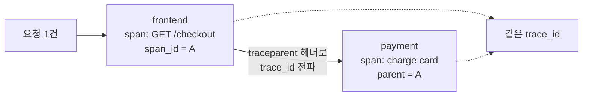
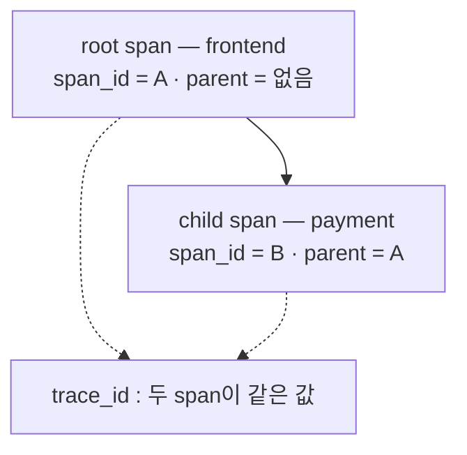

# 10. Traces · OpenTelemetry — 요청 하나가 서비스들을 어떻게 통과하는가

metric은 "에러율이 올랐다"를, 로그는 "이 줄에서 실패했다"를 말합니다. 하지만 요청 하나가 frontend → payment → DB로 흐르다 어디서 느려졌는지는, 그 요청을 **처음부터 끝까지 따라간 기록**이 있어야 답합니다. 그게 trace입니다. trace는 한 요청이 만든 span들의 트리입니다 — 각 서비스가 자기 작업을 span으로 남기고, 모든 span이 같은 `trace_id`를 들고, 자식 span은 부모의 `span_id`를 가리켜 호출 관계를 이룹니다. 핵심은 그 `trace_id`가 서비스 경계를 넘어 어떻게 유지되느냐(context propagation)와, 모든 trace를 다 저장할 수는 없으니 무엇을 남길까(sampling)입니다. 이 편은 Tempo를 띄워 frontend → payment 모양의 trace를 넣고, 한 `trace_id` 아래 두 서비스의 span이 부모-자식으로 묶이는 것을 조회로 확인한 뒤, sampling(head·tail·adaptive)을 검색 결과 위에서 가릅니다. 이 편의 산출물은 "한 요청이 두 서비스를 지나며 만든 trace를, 공유된 `trace_id`와 `parent_span_id` 연결로 Tempo에서 직접 본 상태"와 "TraceQL로 에러·지연 trace만 골라, 왜 모든 trace를 저장하지 않고 head·tail·adaptive로 sampling하는지 가른 경험"입니다.

## 핵심 다이어그램





- **trace는 span의 트리다.** 한 요청이 지나는 각 작업이 span 하나다. 모든 span은 같은 `trace_id`를 들고, 자식 span은 `parent_span_id`로 부모를 가리켜 "누가 누구를 불렀는지" 트리를 이룬다.
- **trace_id는 서비스 경계를 넘어 전파된다.** frontend가 payment를 호출할 때 `traceparent` 헤더(W3C 표준)에 `trace_id`와 자기 `span_id`를 실어 보낸다. payment는 그걸 받아 같은 `trace_id`로, 부모를 frontend span으로 하는 자식 span을 만든다. 이 전파가 흩어진 span들을 하나의 요청으로 잇는다.
- **span은 instrumentation으로 만든다.** OpenTelemetry SDK·에이전트가 만든다 — HTTP·DB 호출 같은 표준 지점은 auto로 코드 수정 없이, 비즈니스 구간은 manual span으로.
- **모든 trace를 저장하지는 않는다(sampling).** trace는 양이 많아 전부 보관하면 비용이 터진다. 그래서 일부만 남긴다 — 시작 때 정하는 head, 완성된 trace를 보고 정하는 tail, 정책으로 비율을 조정하는 adaptive.

아래 시연이 이 구조를 한 줄씩 손으로 확인합니다.

## 사전 준비물

이 실습은 **macOS** 환경을 기준으로 합니다.

- **Docker** — Docker Desktop, OrbStack 등. `docker ps`가 에러 없이 돌아가면 OK.
- **Homebrew** — macOS 패키지 관리자.

### kind · kubectl 설치

```bash
brew install kind kubectl
```

### rosa-lab 클러스터 · namespace 준비

```bash
kind create cluster --name rosa-lab
kubectl create namespace rosa-lab
kubectl config set-context --current --namespace=rosa-lab
```

이미 있으면 건너뜁니다 (`kind get clusters`, `kubectl config get-contexts`로 확인).

## 실습 환경

| 파일 | 내용 |
|---|---|
| `manifests/tempo.yaml` | Tempo(단일 바이너리) + Service. OTLP(4317/4318)로 span을 받고 HTTP(3200)로 검색·조회 |
| `send-traces.py` | frontend → payment 모양의 trace를 OTLP/HTTP로 보내는 작은 생성기 (정상 10·느림 2·에러 1) |

```bash
kubectl apply -f manifests/tempo.yaml
kubectl rollout status deploy/tempo -n rosa-lab
```

조회용(3200)과 OTLP 수신용(4318) 포트를 각각 엽니다.

```bash
kubectl port-forward -n rosa-lab svc/tempo 3200:3200 >/dev/null 2>&1 &
kubectl port-forward -n rosa-lab svc/tempo 4318:4318 >/dev/null 2>&1 &
sleep 20
curl -s localhost:3200/ready
```

```
ready
```

`ready`가 나온 뒤에 trace를 넣어야 합니다 — ingester가 준비되기 전 보낸 span은 버려집니다.

## 여기서 직접 확인할 수 있는 것

### trace를 넣는다

frontend → payment 모양의 trace를 보냅니다. 각 trace는 frontend의 root span과 payment의 child span으로 이뤄집니다.

```bash
python3 send-traces.py
```

```
pushed 13 frontend->payment traces (10 fast, 2 slow, 1 error)
```

(아래 검색이 비어 나오면 몇 초 뒤 `python3 send-traces.py`를 한 번 더 실행합니다 — 갓 들어온 trace는 검색 색인에 잠깐 뒤 잡힙니다.)

### 한 요청을 찾는다 — TraceQL 검색

payment가 관여한 trace를 검색합니다. `trace_id`를 미리 몰라도, 조건으로 찾습니다.

```bash
curl -s -G localhost:3200/api/search \
  --data-urlencode 'q={ resource.service.name = "payment" }' --data-urlencode 'limit=3' \
  | python3 -c "
import sys,json
for t in json.load(sys.stdin).get('traces',[]):
    print('traceID=%s  root=%s  rootSpan=%s' % (t['traceID'], t.get('rootServiceName'), t.get('rootTraceName')))
"
```

```
traceID=2e615cc5ee3133ae903f81845b2a36a2  root=frontend  rootSpan=GET /checkout
traceID=...  root=frontend  rootSpan=GET /checkout
traceID=...  root=frontend  rootSpan=GET /checkout
```

각 trace의 root는 frontend의 `GET /checkout`입니다. `trace_id` 하나를 골라(이후 `$TID`) 그 요청 전체를 가져옵니다.

### 한 요청이 두 서비스를 지난다 — 공유된 trace_id, parent로 연결

```bash
TID=2e615cc5ee3133ae903f81845b2a36a2   # 위 검색에서 나온 trace_id로 바꾸세요
curl -s "localhost:3200/api/traces/$TID" | python3 -c "
import sys,json,base64
def hx(b): return base64.b64decode(b).hex() if b else '(none/root)'
d=json.load(sys.stdin); rows=[]
for rs in d.get('batches', d.get('resourceSpans',[])):
    svc='?'
    for a in rs.get('resource',{}).get('attributes',[]):
        if a['key']=='service.name': svc=a['value'].get('stringValue')
    for ss in rs.get('scopeSpans', rs.get('instrumentationLibrarySpans',[])):
        for sp in ss.get('spans',[]):
            rows.append((hx(sp.get('traceId')),hx(sp.get('spanId')),hx(sp.get('parentSpanId','')),sp.get('name'),svc))
rows.sort(key=lambda r: r[2]!='(none/root)')
for tid,sid,par,name,svc in rows:
    print('  service=%-9s span_id=%s  parent=%s' % (svc,sid,par))
    print('            name=%-15s trace_id=%s' % (name,tid))
"
```

```
  service=frontend  span_id=15025a5757a93233  parent=(none/root)
            name=GET /checkout   trace_id=2e615cc5ee3133ae903f81845b2a36a2
  service=payment   span_id=fc53f399eebe5e81  parent=15025a5757a93233
            name=charge card     trace_id=2e615cc5ee3133ae903f81845b2a36a2
```

세 가지가 한눈에 드러납니다. 두 span의 **`trace_id`가 같습니다**(`2e615cc5...`) — 한 요청입니다. frontend span은 **parent가 없는 root**이고, payment span의 **`parent`가 frontend의 `span_id`(`15025a57...`)** 입니다 — frontend가 payment를 불렀다는 호출 관계입니다. 실제 서비스에서는 frontend가 payment를 호출할 때 `traceparent` 헤더에 이 `trace_id`와 자기 `span_id`를 실어 보내고(context propagation), payment가 그걸 받아 같은 `trace_id`로 자식 span을 만듭니다. 지금 본 트리가 바로 그 전파의 결과입니다.

### 무엇을 남길까 — sampling의 동기

trace는 양이 많습니다. 그런데 정작 보고 싶은 건 소수입니다. 에러가 난 trace만 찾아봅니다.

```bash
curl -s -G localhost:3200/api/search \
  --data-urlencode 'q={ status = error }' --data-urlencode 'limit=10' \
  | python3 -c "import sys,json; t=json.load(sys.stdin).get('traces',[]); print('에러 trace:', len(t)); [print(' ',x['traceID']) for x in t]"
```

```
에러 trace: 1
  6b7d93dfab1f5f6e7cd52f335cb00789
```

느린 trace(200ms 초과)만 찾습니다.

```bash
curl -s -G localhost:3200/api/search \
  --data-urlencode 'q={ duration > 200ms }' --data-urlencode 'limit=10' \
  | python3 -c "import sys,json; t=json.load(sys.stdin).get('traces',[]); print('느린 trace:', len(t)); [print(' ',x['traceID']) for x in t]"
```

```
느린 trace: 2
  ea1764b4f9449327ca3066ad81ddc6f7
  cbd8aa13a7a197d34a4a9e4181f08a9b
```

13개 중 에러는 1개, 느린 것은 2개입니다. 나머지 10개는 빠르고 정상이라, 사실 굳이 다 보관할 이유가 옅습니다. 운영 규모에서는 trace가 초당 수만 개씩 쏟아지므로 전부 저장하면 비용이 터집니다 — 그래서 일부만 남기는 sampling을 합니다.

| 방식 | 언제 정하나 | 무엇을 보고 정하나 | 성격 |
|---|---|---|---|
| **head** | trace 시작 때 | 결과를 보기 전, 확률·비율로 | 싸고 단순 / 드문 에러를 놓칠 수 있음 |
| **tail** | trace가 완성된 뒤 | 전체 trace(에러·지연 등) | 중요한 걸 골라 남김 / 전체를 버퍼링해야 함(보통 collector) |
| **adaptive** | 동적으로 | 정책(에러율·지연·속성·양) | 상황 따라 비율 조정 / 구현마다 다름·복잡 |

방금 검색으로 가른 "에러·느린 소수"가 tail sampling이 남기려는 바로 그 trace입니다 — 결과를 본 뒤 정하니 드문 에러도 잡습니다. head는 그 전에 비율로 자르니 싸지만 그 에러를 놓칠 수 있고, adaptive는 정책으로 그 사이를 동적으로 맞춥니다.

### 정리

```bash
pkill -f "port-forward.*tempo" 2>/dev/null
kubectl delete -f manifests/tempo.yaml --ignore-not-found
```

클러스터까지 정리하려면:

```bash
kind delete cluster --name rosa-lab
```

## 이 편의 산출물

- Tempo에 OTLP로 trace를 넣고, **한 요청이 frontend → payment 두 서비스를 지나며 만든 trace**를 조회해, 두 span이 같은 `trace_id`를 들고 payment의 `parent`가 frontend의 `span_id`임을 직접 본 상태 — trace = span 트리.
- `trace_id`가 서비스 경계를 넘어 유지되는 **context propagation**(`traceparent` 헤더)이 그 트리를 만든다는 것, span은 OpenTelemetry **instrumentation**(auto·manual)으로 생긴다는 것을 잡은 것.
- **TraceQL**로 `trace_id`를 몰라도 조건(`service.name`·`status = error`·`duration > 200ms`)으로 요청을 찾는 경험.
- 13개 중 에러 1·느림 2처럼 **보고 싶은 trace는 소수**임을 검색으로 확인하고, 그래서 모든 trace를 저장하지 않고 **head·tail·adaptive sampling**으로 남길 것을 고르는 이유(양·비용)와 셋의 차이를 가른 상태.
