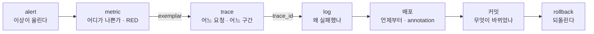
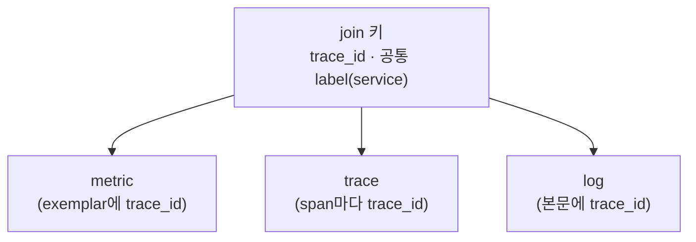

# 11. 상관 (correlation) — 세 신호를 한 사건에서 어떻게 오가는가

observability는 metric·log·trace를 모으는 일이 아니라, 한 사건에서 그 신호들 사이를 **오가는** 능력입니다. alert가 "에러율이 올랐다"라고 울립니다(metric). 어느 요청이 깨졌는지는 그 metric에 매달린 trace로 건너가 봅니다(metric → trace). 왜 깨졌는지는 그 요청의 로그로 건너가 봅니다(trace → log). 신호를 아무리 많이 모아도 이 건너뛰기가 안 되면 각각 따로 보는 데서 끝납니다. 건너뛰기를 가능하게 하는 건 **공통 키** — `trace_id`와 `service` 같은 공통 label입니다. 이 편은 같은 `trace_id`를 trace(Tempo)와 log(Loki) 양쪽에 심어, 에러 trace에서 그 요청의 로그로, 또 로그에서 그 trace로 실제로 오가는 것을 확인하고, exemplar(metric → trace)·spanmetrics(trace → metric)·배포 annotation을 엮어 `alert → metric → trace → log → 배포 → 커밋 → rollback`이라는 한 사건의 사슬을 세웁니다. 이 편의 산출물은 "`trace_id`를 키로 trace와 log를 양방향으로 오가 본 상태"와 "그 키가 신호들을 잇는 원리(exemplar·공통 label)와, 한 사건을 이상에서 되돌리기까지 잇는 사슬을 정리한 경험"입니다.

## 핵심 다이어그램





- **correlation은 신호의 합이 아니라 오감이다.** 같은 사건을 metric → trace → log로 건너뛰며 "이상 → 어디서 → 왜"를 잇는다. 이게 안 되면 세 신호는 그냥 세 개의 분리된 화면이다.
- **잇는 키는 `trace_id`와 공통 label이다.** 모든 신호가 같은 `trace_id`와 같은 `service` label을 들면, 한 신호에서 그 값을 들고 다른 신호로 건너갈 수 있다.
- **방향마다 메커니즘이 있다.** metric → trace는 **exemplar**(metric 표본에 매달린 `trace_id`), trace ↔ log는 **로그 본문의 `trace_id`**, trace → metric은 **span에서 RED metric 생성**(span metrics)이다.
- **배포는 타임라인에 얹는다.** 배포 시각을 **Grafana annotation**으로 그래프에 표시하면 "언제부터 나빠졌나"가 배포와 정렬돼, 사슬이 커밋·rollback까지 닫힌다.

아래 시연이 이 오감을 한 줄씩 손으로 확인합니다.

## 사전 준비물

이 실습은 **macOS** 환경을 기준으로 합니다.

- **Docker** — Docker Desktop, OrbStack 등. `docker ps`가 에러 없이 돌아가면 OK.
- **Homebrew** — macOS 패키지 관리자.

### kind · kubectl 설치

```bash
brew install kind kubectl
```

### rosa-lab 클러스터 · namespace 준비

```bash
kind create cluster --name rosa-lab
kubectl create namespace rosa-lab
kubectl config set-context --current --namespace=rosa-lab
```

이미 있으면 건너뜁니다 (`kind get clusters`, `kubectl config get-contexts`로 확인).

## 실습 환경

| 파일 | 내용 |
|---|---|
| `manifests/stack.yaml` | Loki(3100) + Tempo(3200 조회 · 4318 OTLP) + 각 Service |
| `send-signals.py` | 한 요청마다 trace(Tempo)와 log(Loki)를 **같은 trace_id**로 보내는 생성기 (정상 8·에러 1) |

```bash
kubectl apply -f manifests/stack.yaml
kubectl rollout status deploy/loki -n rosa-lab
kubectl rollout status deploy/tempo -n rosa-lab
```

조회용·수신용 포트를 엽니다.

```bash
kubectl port-forward -n rosa-lab svc/loki 3100:3100 >/dev/null 2>&1 &
kubectl port-forward -n rosa-lab svc/tempo 3200:3200 >/dev/null 2>&1 &
kubectl port-forward -n rosa-lab svc/tempo 4318:4318 >/dev/null 2>&1 &
sleep 20
curl -s localhost:3100/ready; echo " <- loki"
curl -s localhost:3200/ready; echo " <- tempo"
```

```
ready <- loki
ready <- tempo
```

두 `ready`가 나온 뒤에 신호를 보냅니다(준비 전 보낸 건 버려집니다).

```bash
python3 send-signals.py
```

```
에러 요청의 trace_id: 821e58002be1b11fc5e176183d48bb82
```

(검색이 비어 나오면 몇 초 뒤 `python3 send-signals.py`를 한 번 더 실행합니다.)

## 여기서 직접 확인할 수 있는 것

`trace_id`는 매번 달라지므로 아래 예시 값은 여러분 환경의 값으로 바꿔서 따라갑니다.

### 이상 → 어디서: 에러 trace를 찾는다

사건은 보통 "에러율이 올랐다"라는 metric alert에서 시작합니다. 그 이상이 어느 요청인지는 trace로 건너갑니다 — Tempo에서 에러 trace를 찾습니다.

```bash
curl -s -G localhost:3200/api/search \
  --data-urlencode 'q={ status = error }' --data-urlencode 'limit=5' \
  | python3 -c "
import sys,json
for t in json.load(sys.stdin).get('traces',[]):
    print('traceID=%s  root=%s' % (t['traceID'], t.get('rootServiceName')))
"
```

```
traceID=821e58002be1b11fc5e176183d48bb82  root=frontend
```

이 `trace_id`가 신호 사이를 오가는 키입니다. 셸 변수에 담습니다.

```bash
TID=821e58002be1b11fc5e176183d48bb82   # 위에서 나온 값으로 바꾸세요
```

### 어디서 → 왜: trace → log

그 요청이 왜 깨졌는지는 같은 `trace_id`를 들고 로그로 건너갑니다. Loki에서 그 `trace_id`가 담긴 로그를 찾습니다.

```bash
END=$(date +%s)000000000; START=$(( $(date +%s)-600 ))000000000
curl -s -G localhost:3100/loki/api/v1/query_range \
  --data-urlencode "query={service_name=\"checkout\"} | json | trace_id=\"$TID\"" \
  --data-urlencode "start=$START" --data-urlencode "end=$END" --data-urlencode 'limit=5' \
  | python3 -c "
import sys,json
for s in json.load(sys.stdin)['data']['result']:
    for ts,line in s['values']: print(line)
"
```

```
{"level": "error", "msg": "upstream failed", "code": 500, "trace_id": "821e58002be1b11fc5e176183d48bb82"}
```

수천 줄의 로그 중에서, 바로 그 요청의 로그 한 줄로 건너왔습니다 — `upstream failed`. metric이 "에러가 났다"까지였다면, trace가 "이 요청이었다"를, 로그가 "왜"를 채웁니다.

### 거꾸로: log → trace

반대 방향도 같은 키로 됩니다. 로그 한 줄에 박힌 `trace_id`를 들고 그 trace 전체를 가져옵니다.

```bash
curl -s "localhost:3200/api/traces/$TID" | python3 -c "
import sys,json,base64
def hx(b): return base64.b64decode(b).hex() if b else '(root)'
d=json.load(sys.stdin); rows=[]
for rs in d.get('batches',d.get('resourceSpans',[])):
    svc='?'
    for a in rs.get('resource',{}).get('attributes',[]):
        if a['key']=='service.name': svc=a['value'].get('stringValue')
    for ss in rs.get('scopeSpans',rs.get('instrumentationLibrarySpans',[])):
        for sp in ss.get('spans',[]):
            rows.append((svc, hx(sp.get('spanId')), hx(sp.get('parentSpanId','')), sp.get('name'), sp.get('status',{}).get('code')))
rows.sort(key=lambda r: r[2]!='(root)')
for svc,sid,par,name,st in rows:
    print('  %-9s span=%s parent=%s  %s  status=%s' % (svc,sid,par,name,st))
"
```

```
  frontend  span=b17de0579a396e28 parent=(root)  GET /checkout  status=STATUS_CODE_ERROR
  payment   span=0dbcf6f39fca82b1 parent=b17de0579a396e28  charge card  status=STATUS_CODE_ERROR
```

로그에서 trace로, trace에서 로그로 — 같은 `trace_id` 하나로 양방향을 오갔습니다. 이게 correlation의 핵심입니다.

### 키는 어디에 있나 — content와 공통 label

이 오감이 되려면 `trace_id`가 신호마다 들어 있어야 합니다. 그런데 `trace_id`는 값이 무한히 많아, Loki에서 label로 두면 안 됩니다. label 목록을 봅니다.

```bash
curl -s localhost:3100/loki/api/v1/labels \
  | python3 -c "import sys,json; ls=json.load(sys.stdin)['data']; print('labels:', ls); print('trace_id가 label인가?', 'trace_id' in ls)"
```

```
labels: ['service_name']
trace_id가 label인가? False
```

`trace_id`는 label이 아니라 **본문(content)** 에 있습니다 — 그래서 `| json | trace_id="..."`로 query-time에 거릅니다. 신호를 묶는 공통 label은 따로 있습니다: Loki의 stream label `service_name=checkout`, Tempo의 resource 속성 `service.name`. **공통 label(service)이 큰 범위를 묶고, `trace_id`가 한 요청을 콕 집습니다.**

### 나머지 방향들 — exemplar, span metrics

trace ↔ log는 위에서 직접 봤습니다. 사슬의 첫 칸인 **metric → trace**는 **exemplar**가 잇습니다. metric은 집계라 개별 요청을 버리지만, histogram bucket에 표본 하나의 `trace_id`를 매달아 둘 수 있습니다 — 이런 모양입니다.

```
http_request_duration_seconds_bucket{le="1.2"} 47 # {trace_id="821e58002be1b11fc5e176183d48bb82"} 1.07
```

`#` 뒤가 exemplar입니다. "느린 bucket을 채운 요청 중 하나가 이 `trace_id`였다" — latency 그래프의 한 점에서 그 trace로 바로 건너뛰는 다리입니다. 반대로 **trace → metric**은 **span metrics**가 잇습니다 — span들을 세어 서비스별 RED(요청수·에러·지연) metric을 만들어 내면, trace 데이터에서 곧장 metric이 나옵니다. 셋을 묶는 키는 모두 같습니다: `trace_id`와 공통 `service` label.

### 사건을 끝까지 잇는다

이제 한 사건의 사슬이 닫힙니다.

1. **alert (metric)** — 에러율·지연이 임계를 넘어 울린다. "이상이 있다."
2. **metric → trace (exemplar)** — 그 metric의 표본 trace로 건너간다. "어느 요청·어느 구간."
3. **trace → log (trace_id)** — 그 요청의 로그로 건너간다. "왜 실패했나."
4. **배포 (annotation)** — 그래프에 배포 시각이 표시돼 있어, 나빠진 시점이 어느 배포 직후인지 정렬된다. "언제부터."
5. **커밋** — 그 배포가 담은 코드 변경을 본다. "무엇이 바뀌었나."
6. **rollback** — 그 변경을 되돌린다. `git diff`로 확인하고 이전 상태로 돌린다.

observability의 목적은 관찰이 아니라 이 사슬을 끝까지 가 **복구**하는 것입니다. 그리고 그 사슬은 `trace_id`와 공통 label이라는 키가 있어야 끊기지 않고 이어집니다.

### 정리

```bash
pkill -f "port-forward.*rosa-lab" 2>/dev/null
kubectl delete -f manifests/stack.yaml --ignore-not-found
```

클러스터까지 정리하려면:

```bash
kind delete cluster --name rosa-lab
```

## 이 편의 산출물

- 같은 `trace_id`를 trace와 log 양쪽에 심어, **에러 trace → 그 요청의 로그(trace → log)** 와 **로그의 trace_id → 그 trace(log → trace)** 를 양방향으로 오가 본 상태 — correlation이 신호의 합이 아니라 키로 잇는 오감이라는 것.
- 잇는 키가 **`trace_id`**(한 요청을 콕 집음)와 **공통 label `service`**(큰 범위를 묶음)이고, `trace_id`는 고카디널리티라 label이 아니라 **본문**에 두고 query-time에 거른다는 것을 확인한 경험.
- **metric → trace**는 **exemplar**(metric 표본에 매달린 trace_id), **trace → metric**은 **span metrics**(span에서 RED 생성)가 잇는다는 것 — 모든 방향의 키가 결국 `trace_id`·공통 label로 같다는 것.
- 한 사건을 `alert → metric → trace → log → 배포(annotation) → 커밋 → rollback`으로 잇는 사슬을 세우고, observability의 목적이 관찰이 아니라 **복구**임을 잡은 상태.
