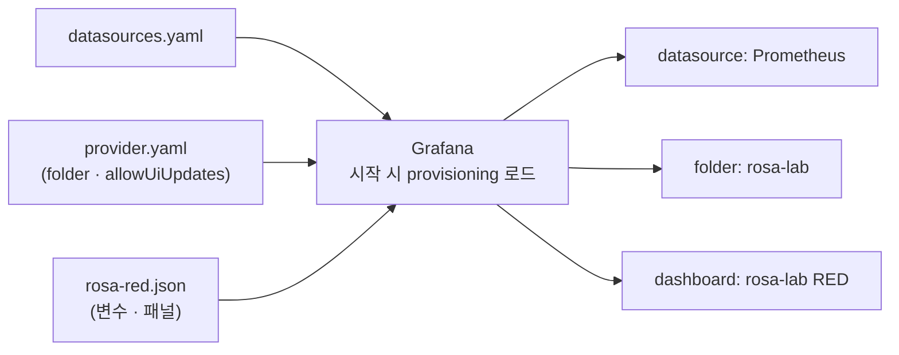

# 12. Grafana — 신호를 어떻게 보고 공유하는가

Grafana는 datasource에 물어 그 답을 패널로 그립니다. 흔히 UI에서 datasource를 추가하고 패널을 클릭으로 만드는데, 그러면 그 대시보드는 한 사람의 브라우저 안에서 만들어진 일회성 산출물이 됩니다 — 누가 무엇을 바꿨는지 추적되지 않고, 다른 환경에 옮기려면 다시 클릭해야 합니다. Grafana의 실무 운영 단위는 클릭이 아니라 **provisioning**입니다 — datasource·folder·dashboard·변수를 전부 파일로 선언해 시작 시 로드합니다. 대시보드가 JSON으로 표현되는 건 나쁜 게 아니라 그게 표현 형식이기 때문이고, 관리는 그 JSON 파일을 코드로 두는 것입니다. 이 편은 Grafana를 datasource·folder·dashboard 모두 provisioning으로 띄워, 클릭 한 번 없이 구성이 올라오는 것을 API로 확인하고, provisioned 대시보드는 파일이 유일한 수정 경로임을 — UI/API 저장이 거부되는 것으로 — 봅니다. 이 편의 산출물은 "datasource·folder·dashboard·변수를 파일로 선언해 클릭 없이 올린 상태"와 "provisioned 대시보드가 그 원본 파일에 묶여 UI/API 수정이 막힌다는 것을 직접 확인한 경험"입니다.

## 핵심 다이어그램




- **Grafana는 datasource에 물어 그린다.** 패널은 자기 데이터를 들고 있지 않다 — query를 datasource로 보내 받은 답을 그릴 뿐이다. datasource·dashboard·folder·변수·permission이 구성요소다.
- **관리 단위는 클릭이 아니라 파일이다(provisioning).** datasource·dashboard provider·대시보드 JSON을 파일로 선언하면 시작 시 로드된다. UI 클릭은 한 번도 필요 없다.
- **JSON은 표현 형식이지 문제가 아니다.** 대시보드는 JSON으로 표현된다. 이걸 손으로 클릭해 만들고 export하는 대신, JSON 파일 자체를 코드로 두고 provisioning이 로드하게 한다.
- **folder는 묶음이자 권한 단위, 변수는 재사용 손잡이다.** 대시보드는 folder로 묶이고 권한은 folder 단위로 준다. 변수($code)는 datasource에서 값을 받아 패널을 한 번에 여러 시계열로 펼친다.

아래 시연이 이 구성을 한 줄씩 손으로 확인합니다.

## 사전 준비물

이 실습은 **macOS** 환경을 기준으로 합니다.

- **Docker** — Docker Desktop, OrbStack 등. `docker ps`가 에러 없이 돌아가면 OK.
- **Homebrew** — macOS 패키지 관리자.

### kind · kubectl 설치

```bash
brew install kind kubectl
```

### rosa-lab 클러스터 · namespace 준비

```bash
kind create cluster --name rosa-lab
kubectl create namespace rosa-lab
kubectl config set-context --current --namespace=rosa-lab
```

이미 있으면 건너뜁니다 (`kind get clusters`, `kubectl config get-contexts`로 확인).

## 실습 환경

| 파일 | 내용 |
|---|---|
| `manifests/data.yaml` | Prometheus + web + load. Grafana가 물어볼 데이터를 만든다 |
| `manifests/grafana.yaml` | Grafana + provisioning(datasource·dashboard provider·대시보드 JSON). 전부 파일로 선언 |

```bash
kubectl apply -f manifests/data.yaml
kubectl apply -f manifests/grafana.yaml
kubectl rollout status deploy/prometheus -n rosa-lab
kubectl rollout status deploy/grafana -n rosa-lab
```

Grafana에 붙습니다(계정 admin / admin).

```bash
kubectl port-forward -n rosa-lab svc/grafana 3000:3000 >/dev/null 2>&1 &
sleep 8
curl -s localhost:3000/api/health
```

```
{
  "database": "ok",
  "version": "11.3.1",
  "commit": "..."
}
```

UI를 보려면 브라우저로 `http://localhost:3000`(admin/admin)에 접속합니다. 아래는 같은 것을 API로 확인합니다.

## 여기서 직접 확인할 수 있는 것

### 클릭 없이 datasource가 올라왔다

datasource를 UI에서 추가한 적이 없는데, 파일로 선언했으니 이미 있습니다.

```bash
curl -s -u admin:admin localhost:3000/api/datasources \
  | python3 -c "import sys,json; [print('name=%s type=%s uid=%s url=%s default=%s' % (d['name'],d['type'],d['uid'],d['url'],d.get('isDefault'))) for d in json.load(sys.stdin)]"
```

```
name=Prometheus type=prometheus uid=prometheus url=http://prometheus:9090 default=True
```

### folder와 dashboard도 파일에서 올라왔다

```bash
curl -s -u admin:admin localhost:3000/api/folders \
  | python3 -c "import sys,json; [print('folder:', f['title'], '| uid:', f['uid']) for f in json.load(sys.stdin)]"
curl -s -u admin:admin 'localhost:3000/api/search?type=dash-db' \
  | python3 -c "import sys,json; [print('dashboard:', d['title'], '| uid:', d['uid'], '| folder:', d.get('folderTitle','General')) for d in json.load(sys.stdin)]"
```

```
folder: rosa-lab | uid: afqne130aefi8e
dashboard: rosa-lab RED | uid: rosa-red | folder: rosa-lab
```

대시보드가 `rosa-lab` folder 안에 있습니다 — provider 파일에 적은 그대로입니다. 대시보드 안의 변수와 패널도 파일에 둔 그대로인지 봅니다.

```bash
curl -s -u admin:admin localhost:3000/api/dashboards/uid/rosa-red | python3 -c "
import sys,json
d=json.load(sys.stdin); db=d['dashboard']
print('변수:', [v['name'] for v in db.get('templating',{}).get('list',[])])
for p in db.get('panels',[]):
    print('패널:', p['title'], '| expr:', p['targets'][0]['expr'])
"
```

```
변수: ['code']
패널: request rate by code | expr: sum by(code) (rate(http_requests_total{code=~"$code"}[1m]))
```

### 그 datasource로 실제로 그린다

대시보드 패널은 query를 datasource로 보내 답을 받습니다. Grafana의 datasource proxy로 그 query를 직접 실행해, 패널이 받을 데이터를 봅니다.

```bash
curl -s -u admin:admin -G 'localhost:3000/api/datasources/proxy/uid/prometheus/api/v1/query' \
  --data-urlencode 'query=sum by(code)(rate(http_requests_total[1m]))' | python3 -c "
import sys,json
for r in json.load(sys.stdin)['data']['result']:
    print('  code=%s => %.3f req/s' % (r['metric'].get('code'), float(r['value'][1])))
"
```

```
  code=200 => 39.935 req/s
  code=404 => 4.437 req/s
```

변수 `$code`의 선택지도 datasource에서 채워집니다(`label_values`).

```bash
curl -s -u admin:admin 'localhost:3000/api/datasources/proxy/uid/prometheus/api/v1/label/code/values' \
  | python3 -c "import sys,json; print('  \$code 옵션:', json.load(sys.stdin)['data'])"
```

```
  $code 옵션: ['200', '404']
```

datasource·folder·dashboard·변수가 전부 파일에서 올라왔고, 그 datasource로 패널이 실제 데이터를 그립니다 — 클릭은 한 번도 없었습니다.

### 파일이 원본이다 — UI/API 수정은 거부된다

provisioned 대시보드는 자기가 어느 파일에서 왔는지 들고 있습니다.

```bash
curl -s -u admin:admin localhost:3000/api/dashboards/uid/rosa-red \
  | python3 -c "import sys,json; m=json.load(sys.stdin)['meta']; print('provisioned:', m.get('provisioned'), '| 원본 파일:', m.get('provisionedExternalId'))"
```

```
provisioned: True | 원본 파일: rosa-red.json
```

provider에 `allowUiUpdates: false`로 뒀으니, 이 대시보드를 UI나 API로 저장하려 하면 거부됩니다.

```bash
curl -s -u admin:admin -X POST localhost:3000/api/dashboards/db \
  -H 'Content-Type: application/json' \
  -d '{"dashboard":{"uid":"rosa-red","title":"손으로 바꾼 제목","schemaVersion":39,"panels":[]},"overwrite":true}' \
  -w '\nHTTP %{http_code}\n'
```

```
{"message":"Cannot save provisioned dashboard"}
HTTP 400
```

수정하려면 `rosa-red.json` 파일을 고쳐야 합니다. 대시보드의 원본은 Grafana 안의 DB가 아니라 그 파일입니다 — UI에서 누가 임의로 바꿔 원본과 어긋나는 일(drift)이 막힙니다. 이게 "dashboard as code"의 핵심이고, 같은 파일들을 Git에 두고 배포하면 곧 GitOps입니다.

### 정리

```bash
pkill -f "port-forward.*3000" 2>/dev/null
kubectl delete -f manifests/grafana.yaml --ignore-not-found
kubectl delete -f manifests/data.yaml --ignore-not-found
```

클러스터까지 정리하려면:

```bash
kind delete cluster --name rosa-lab
```

## 이 편의 산출물

- datasource·folder·dashboard·변수를 전부 **파일로 선언**해 Grafana가 시작 시 로드하게 하고, 클릭 한 번 없이 구성이 올라온 것을 `/api/datasources`·`/api/folders`·`/api/search`로 확인한 상태 — provisioning이 관리 단위라는 것.
- 대시보드가 **JSON으로 표현**되지만(변수·패널 PromQL 포함) 그 JSON 파일 자체를 코드로 두는 게 관리라는 것, 변수 `$code`의 선택지가 datasource의 `label_values`로 채워지는 것을 본 경험.
- datasource proxy로 패널 query를 실행해, provisioned datasource로 실제 데이터(code별 rate)가 그려짐을 확인한 것.
- provisioned 대시보드가 원본 파일(`provisionedExternalId`)에 묶여 있고, `allowUiUpdates: false`에서 UI/API 저장이 `Cannot save provisioned dashboard`로 **거부**되어 drift가 막힌다는 것 — 원본은 DB가 아니라 파일이며, 이게 GitOps로 가는 발판이라는 것.
