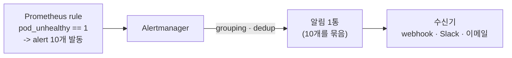
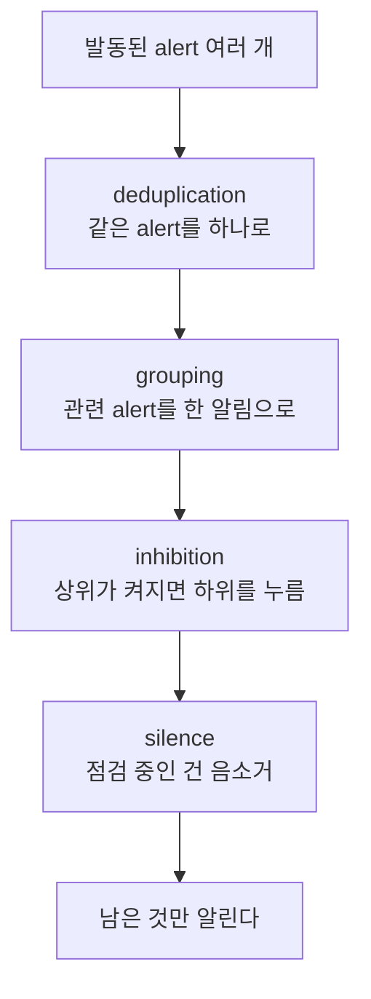

# 13. Alertmanager — 언제·누구에게 알리는가

alert는 Prometheus의 rule이 발동시키지만, 그걸 누구에게 어떻게 알릴지는 Alertmanager가 정합니다. 둘을 나눈 이유는 분명합니다 — pod 100개가 같은 이유로 동시에 죽으면 rule은 alert 100개를 발동시키는데, 그 100개를 그대로 100통의 알림으로 보내면 받는 사람은 신호가 아니라 소음을 받습니다. Alertmanager는 그 사이에서 같은 alert를 합치고(deduplication), 관련된 것을 묶고(grouping), 상위 사건이 있으면 하위를 누르고(inhibition), 점검 중인 건 음소거(silence)해서, **많은 alert를 적은 알림으로** 줄입니다. 이 편은 pod 10개가 동시에 unhealthy인 상황을 만들어, rule이 발동시킨 10개 alert가 Alertmanager를 지나 알림 1통으로 묶이는 것을 webhook 수신기에서 확인하고, routing·inhibition·silence를 함께 봅니다. 이 편의 산출물은 "10개 alert가 grouping으로 알림 1통이 되는 것을 발동부터 수신까지 직접 본 상태"와 "inhibition·silence로 알림이 억제되는 것을 Alertmanager API로 확인한 경험"입니다.

## 핵심 다이어그램





- **rule이 발동시키고, Alertmanager가 알린다.** Prometheus rule은 조건이 맞는 시계열마다 alert를 발동시킨다. 그걸 받아 언제·누구에게 보낼지 정하는 건 Alertmanager다.
- **deduplication·grouping이 핵심이다.** 같은 alert가 여러 번/여러 곳에서 와도 하나로 합치고(dedup), `group_by`로 묶인 alert들을 한 알림으로 보낸다(grouping). 그래서 pod 10개가 죽어도 알림은 1통이다.
- **routing은 알림을 보낼 곳을 가른다.** route 트리가 label(예: `severity`)을 보고 어느 receiver로 보낼지 정한다.
- **inhibition·silence는 알림을 누른다.** inhibition은 상위 사건(critical)이 켜지면 같은 맥락의 하위(warning)를 자동으로 억제하고, silence는 점검처럼 알고 있는 상황을 사람이 직접 음소거한다.

아래 시연이 이 정리 과정을 한 줄씩 손으로 확인합니다.

## 사전 준비물

이 실습은 **macOS** 환경을 기준으로 합니다.

- **Docker** — Docker Desktop, OrbStack 등. `docker ps`가 에러 없이 돌아가면 OK.
- **Homebrew** — macOS 패키지 관리자.

### kind · kubectl 설치

```bash
brew install kind kubectl
```

### rosa-lab 클러스터 · namespace 준비

```bash
kind create cluster --name rosa-lab
kubectl create namespace rosa-lab
kubectl config set-context --current --namespace=rosa-lab
```

이미 있으면 건너뜁니다 (`kind get clusters`, `kubectl config get-contexts`로 확인).

## 실습 환경

| 파일 | 내용 |
|---|---|
| `manifests/sources.yaml` | metrics(nginx, pod 10개 unhealthy + critical/degraded) + sink(webhook 수신기) |
| `manifests/alerting.yaml` | Prometheus(alert rule) + Alertmanager(route·group·inhibit) |

```bash
kubectl apply -f manifests/sources.yaml
kubectl apply -f manifests/alerting.yaml
kubectl rollout status deploy/metrics -n rosa-lab
kubectl rollout status deploy/sink -n rosa-lab
kubectl rollout status deploy/alertmanager -n rosa-lab
kubectl rollout status deploy/prometheus -n rosa-lab
```

Prometheus(9090)와 Alertmanager(9093)에 붙습니다.

```bash
kubectl port-forward -n rosa-lab svc/prometheus 9090:9090 >/dev/null 2>&1 &
kubectl port-forward -n rosa-lab svc/alertmanager 9093:9093 >/dev/null 2>&1 &
sleep 20
```

## 여기서 직접 확인할 수 있는 것

### rule이 alert를 발동시킨다 — 여러 개

pod 10개가 unhealthy라, `pod_unhealthy == 1` rule이 pod마다 하나씩 alert를 발동시킵니다.

```bash
curl -s localhost:9090/api/v1/alerts | python3 -c "
import sys,json,collections
a=json.load(sys.stdin)['data']['alerts']
c=collections.Counter(x['labels']['alertname'] for x in a if x['state']=='firing')
for name,n in sorted(c.items()): print('  %-16s %d firing' % (name,n))
print('  총 firing alert:', sum(c.values()))
"
```

```
  PodUnhealthy     10 firing
  ServiceDegraded  1 firing
  ServiceDown      1 firing
  총 firing alert: 12
```

12개가 발동했습니다. 이걸 그대로 12통 보내면 소음입니다.

### grouping — 10개가 한 그룹으로

Alertmanager가 같은 `alertname`을 한 그룹으로 묶습니다(`group_by: [alertname]`).

```bash
curl -s localhost:9093/api/v2/alerts/groups | python3 -c "
import sys,json
for g in json.load(sys.stdin):
    print('  group %s -> alert %d개' % (dict(g.get('labels',{})), len(g.get('alerts',[]))))
"
```

```
  group {'alertname': 'PodUnhealthy'} -> alert 10개
  group {'alertname': 'ServiceDegraded'} -> alert 1개
  group {'alertname': 'ServiceDown'} -> alert 1개
```

PodUnhealthy 10개가 한 그룹입니다. 이 그룹이 알림 1통이 됩니다 — 수신기(sink)가 실제로 몇 통 받았는지 봅니다.

```bash
kubectl logs -n rosa-lab deploy/sink | grep -oE '"body": "\{.*\}\\n"' | python3 -c "
import sys,json
seen={}
for line in sys.stdin:
    s=line.strip()[len('\"body\": '):]
    try: body=json.loads(json.loads(s))
    except Exception: continue
    seen[body.get('groupKey')]=(dict(body.get('groupLabels',{})), len(body.get('alerts',[])))
for gl,n in seen.values():
    print('  알림 1통: groupLabels=%s, 묶인 alert %d개' % (gl, n))
print('  서로 다른 알림 수:', len(seen))
"
```

```
  알림 1통: groupLabels={'alertname': 'ServiceDown'}, 묶인 alert 1개
  알림 1통: groupLabels={'alertname': 'PodUnhealthy'}, 묶인 alert 10개
  서로 다른 알림 수: 2
```

12개 alert가 알림 **2통**이 됐습니다. PodUnhealthy 10개는 한 통으로 묶였습니다(grouping). 받는 사람은 "PodUnhealthy 10건"이라는 알림 하나를 받지, 10통을 받지 않습니다 — 이게 알림 피로를 막는 핵심입니다. (세 번째였어야 할 ServiceDegraded는 아래 inhibition으로 사라졌습니다.)

### routing — critical은 다른 경로로

ServiceDown은 `severity=critical`이라, route 트리의 critical 하위 경로로 갈렸습니다. 그 알림의 `groupKey`에 그 경로가 찍혀 있습니다.

```bash
kubectl logs -n rosa-lab deploy/sink | grep -oE '"groupKey": "[^"]*"' | sort -u
```

```
"groupKey": "{}/{severity=\"critical\"}:{alertname=\"ServiceDown\"}"
"groupKey": "{}:{alertname=\"PodUnhealthy\"}"
```

ServiceDown의 키에는 `/{severity="critical"}`가 들어 있습니다 — critical 경로로 라우팅됐다는 뜻입니다. PodUnhealthy는 기본 경로입니다. label로 알림의 행선지가 갈립니다.

### inhibition — 상위가 켜지면 하위를 누른다

같은 `service="checkout"`에 ServiceDown(critical)과 ServiceDegraded(warning)가 둘 다 발동했습니다. inhibit rule이 "ServiceDown이 켜지면 같은 service의 ServiceDegraded는 누른다"이므로, ServiceDegraded는 억제됩니다.

```bash
curl -s localhost:9093/api/v2/alerts | python3 -c "
import sys,json
for x in json.load(sys.stdin):
    if x['labels']['alertname']=='ServiceDegraded':
        print('  ServiceDegraded state:', x['status']['state'], '| inhibitedBy:', x['status'].get('inhibitedBy'))
"
```

```
  ServiceDegraded state: suppressed | inhibitedBy: ['cf2226da1d475f8e']
```

`suppressed`이고 `inhibitedBy`에 ServiceDown alert의 fingerprint가 들어 있습니다. "서비스가 죽었다"라는 critical이 이미 울리는데 "성능이 저하됐다"라는 warning까지 따로 알릴 필요는 없습니다 — inhibition이 그 중복을 자동으로 막습니다.

### silence — 알고 있는 건 음소거한다

PodUnhealthy를 점검 중이라면, 그 alert를 한동안 음소거합니다. `alertname=PodUnhealthy`에 맞는 silence를 만듭니다.

```bash
NOW=$(date -u +%Y-%m-%dT%H:%M:%S.000Z)
END=$(date -u -v+1H +%Y-%m-%dT%H:%M:%S.000Z 2>/dev/null || date -u -d '+1 hour' +%Y-%m-%dT%H:%M:%S.000Z)
curl -s -X POST localhost:9093/api/v2/silences -H 'Content-Type: application/json' \
  -d "{\"matchers\":[{\"name\":\"alertname\",\"value\":\"PodUnhealthy\",\"isRegex\":false,\"isEqual\":true}],\"startsAt\":\"$NOW\",\"endsAt\":\"$END\",\"createdBy\":\"rosa\",\"comment\":\"점검 중\"}" \
  | python3 -c "import sys,json; print('  silenceID:', json.load(sys.stdin).get('silenceID'))"
sleep 6
curl -s localhost:9093/api/v2/alerts | python3 -c "
import sys,json,collections
c=collections.Counter()
for x in json.load(sys.stdin): c[(x['labels']['alertname'],x['status']['state'])]+=1
for (n,st),k in sorted(c.items()): print('  %-16s state=%s count=%d' % (n,st,k))
"
```

```
  silenceID: f7051507-3433-4a5e-b00e-b95cc5dc8ef8
  PodUnhealthy     state=suppressed count=10
  ServiceDegraded  state=suppressed count=1
  ServiceDown      state=active count=1
```

PodUnhealthy 10개가 모두 `suppressed`로 바뀌었습니다 — 음소거 동안엔 알림이 가지 않습니다. ServiceDown은 여전히 `active`라 알립니다. 점검처럼 "이미 아는 상황"을 사람이 직접 끄는 손잡이입니다.

### 정리

발동된 12개 alert가, grouping(10→1)·inhibition(ServiceDegraded 억제)·silence(PodUnhealthy 음소거)를 지나며 실제 알림으로는 ServiceDown 하나만 남았습니다. deduplication·grouping·inhibition·silence는 모두 같은 목적의 네 장치입니다 — 발동된 alert를 사람이 감당할 수 있는 적은 알림으로 줄여, 진짜 신호가 소음에 묻히지 않게 합니다.

```bash
pkill -f "port-forward.*rosa-lab" 2>/dev/null
kubectl delete -f manifests/alerting.yaml --ignore-not-found
kubectl delete -f manifests/sources.yaml --ignore-not-found
```

클러스터까지 정리하려면:

```bash
kind delete cluster --name rosa-lab
```

## 이 편의 산출물

- Prometheus rule이 pod마다 alert를 발동시켜 **12개가 firing**되는 것을 보고, 그걸 그대로 보내면 소음이 된다는 문제를 확인한 상태.
- Alertmanager의 **grouping**으로 같은 `alertname` 10개가 한 그룹이 되고, 수신기가 실제로 **알림 2통**(PodUnhealthy 10개를 1통으로)만 받는 것을 발동부터 수신까지 따라가 본 경험 — deduplication·grouping이 알림 피로를 막는 핵심.
- **routing**이 `severity=critical`을 별도 경로로 가르는 것을 `groupKey`로, **inhibition**이 ServiceDown(critical) 때문에 ServiceDegraded(warning)를 `suppressed`로 누르는 것을 `inhibitedBy`로 확인한 것.
- **silence**를 만들어 `alertname=PodUnhealthy`를 음소거하면 그 alert들이 `suppressed`로 바뀌어 알림이 멈추는 것을 본 상태 — 발동된 alert를 적은 알림으로 줄이는 네 장치(dedup·grouping·inhibition·silence)를 한 흐름에서 가른 것.
