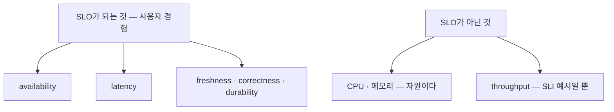

# 14. SLO/SLI — 얼마나 깨져도 되는가를 숫자로 정하기

"서비스가 괜찮은가"는 막연합니다. 100%는 불가능하고 99%로 충분한지도 알 수 없습니다. SLI/SLO는 이걸 숫자로 바꿉니다 — **SLI**는 사용자 경험을 재는 비율(좋은 요청 / 전체)이고, **SLO**는 그 SLI의 목표(예: 99.9%)이며, 100%에서 SLO를 뺀 **error budget**이 "얼마나 깨져도 되는가"입니다. budget이 있으니 0이 아니어도 되고, 그 budget을 얼마나 빨리 쓰는지가 **burn rate**입니다. 이 편은 약 10%가 실패하는 트래픽에서 availability SLI를 재고, SLO 99%에 대한 error budget과 burn rate를 recording rule로 계산해, "지금 속도면 30일치 예산을 며칠에 태우는가"를 숫자로 봅니다. 그리고 두 가지를 가릅니다 — CPU 99%가 왜 SLO가 아닌지(자원이 아니라 사용자 경험을 재야 한다), availability가 좋아도 왜 latency를 못 잡는지(둘은 다른 SLI다). 이 편의 산출물은 "SLI·error budget·burn rate를 실제 트래픽에서 계산해 본 상태"와 "SLO가 자원이 아닌 사용자 경험 기준이며 종류(availability·latency·…)가 나뉜다는 것, burn rate multi-window로 알림 피로를 줄이는 법을 가른 경험"입니다.

## 핵심 다이어그램




- **SLI는 사용자 경험을 재는 비율이다.** "좋은 요청 / 전체" 같은 숫자. availability(성공 비율), latency(빠르게 끝난 비율) 등 무엇을 "좋음"으로 보느냐에 따라 SLI가 갈린다.
- **SLO는 그 SLI의 목표, error budget은 그 여유다.** SLO 99.9%면 error budget은 0.1% — 그만큼은 깨져도 된다. 100%를 노리지 않기에 배포도 실험도 가능하다.
- **burn rate는 예산을 쓰는 속도다.** `(1 - SLI) / (1 - SLO)`. 1이면 윈도우 끝에 딱 맞춰 예산을 다 쓰는 속도, 10이면 10배 빠르게 태우는 중이다.
- **SLO는 자원이 아니라 사용자 경험을 잰다.** CPU 99%는 SLO가 아니다 — 사용자는 CPU를 느끼지 않는다. 그리고 availability와 latency는 서로 다른 SLI라, 하나가 좋아도 다른 게 나쁠 수 있다.

아래 시연이 이 숫자들을 한 줄씩 손으로 확인합니다.

## 사전 준비물

이 실습은 **macOS** 환경을 기준으로 합니다.

- **Docker** — Docker Desktop, OrbStack 등. `docker ps`가 에러 없이 돌아가면 OK.
- **Homebrew** — macOS 패키지 관리자.

### kind · kubectl 설치

```bash
brew install kind kubectl
```

### rosa-lab 클러스터 · namespace 준비

```bash
kind create cluster --name rosa-lab
kubectl create namespace rosa-lab
kubectl config set-context --current --namespace=rosa-lab
```

이미 있으면 건너뜁니다 (`kind get clusters`, `kubectl config get-contexts`로 확인).

## 실습 환경

| 파일 | 내용 |
|---|---|
| `manifests/stack.yaml` | web + load(약 10% 비200) + Prometheus(SLI·burn rate recording rule) |

```bash
kubectl apply -f manifests/stack.yaml
kubectl rollout status deploy/web -n rosa-lab
kubectl rollout status deploy/prometheus -n rosa-lab
```

SLI가 안정되려면 데이터가 2분쯤 쌓여야 합니다. Prometheus에 붙고 쿼리 헬퍼를 준비합니다.

```bash
kubectl port-forward -n rosa-lab svc/prometheus 9090:9090 >/dev/null 2>&1 &
sleep 5
q() { curl -s -G localhost:9090/api/v1/query --data-urlencode "query=$1" \
  | python3 -c "import sys,json; r=json.load(sys.stdin)['data']['result']; print(round(float(r[0]['value'][1]),5) if r else 'n/a')"; }
```

## 여기서 직접 확인할 수 있는 것

값은 살아 있는 부하라 시점마다 조금씩 다릅니다.

### SLI — 사용자 경험을 숫자로

availability SLI는 좋은 요청(200) 비율입니다.

```bash
q 'sli:availability:ratio_rate5m'
```

```
0.89997
```

약 0.90 — 100건 중 90건이 성공입니다(load가 10건 중 1건을 404로 내므로). 이 한 숫자가 "사용자가 받는 성공 경험"입니다. 자원이 아니라 요청 결과를 재는 게 핵심입니다.

### SLO와 error budget — 얼마나 깨져도 되는가

SLO를 99%로 정했다고 합시다. 그러면 error budget은 100% − 99% = **1%**입니다. 지금 실패율을 봅니다.

```bash
q '1 - sli:availability:ratio_rate5m'
```

```
0.10003
```

실패율이 **10%**입니다. 허용은 1%인데 실제는 10% — 예산을 한참 초과해 쓰고 있습니다. 얼마나 빨리 쓰는지가 burn rate입니다.

### burn rate — 예산을 태우는 속도

burn rate는 `(1 - SLI) / (1 - SLO)` = 실패율 / 허용율입니다.

```bash
q 'slo:burn:ratio_rate5m'
```

```
10.00279
```

burn rate ≈ **10**입니다. 허용 속도의 10배로 예산을 태우는 중입니다. SLO가 30일 윈도우라면, 30일 내내 쓸 수 있는 error budget을 이 속도면 **약 3일(30÷10)** 만에 다 써 버립니다. burn rate가 "이대로면 언제 예산이 바닥나는가"를 한 숫자로 말해 줍니다.

### multi-window — 급한 소진과 느린 소진을 가른다

burn rate를 짧은 창과 긴 창에서 함께 봅니다.

```bash
echo "5m: $(q 'slo:burn:ratio_rate5m')   1h: $(q 'slo:burn:ratio_rate1h')"
```

```
5m: 10.00279   1h: 10.00279
```

두 창 모두 높습니다. 왜 둘을 보냐면 — 짧은 창 하나만 보면 잠깐의 스파이크에도 호출기가 울려 알림 피로가 쌓이고, 긴 창 하나만 보면 급격한 사고를 늦게 잡습니다. 그래서 **짧은 창과 긴 창이 동시에 높을 때만** 급한 알림(page)을 보냅니다. 흔히 쓰는 기준은 이렇습니다.

| 성격 | 조건(예) | 뜻 | 대응 |
|---|---|---|---|
| 급한 소진 | 1h·5m burn > 14.4 | 1시간에 예산 2% 소진 | 즉시 page |
| 중간 | 6h·30m burn > 6 | 6시간에 5% 소진 | page |
| 느린 소진 | 1d·2h burn > 3 | 하루에 10% 소진 | ticket |

지금 burn 10은 6배 기준은 넘고 14.4배 기준엔 못 미칩니다 — 즉시 page까지는 아니어도 분명히 대응이 필요한 수준입니다. 이렇게 여러 창·여러 임계로 나누면, "잠깐 튀었다"와 "꾸준히 무너진다"를 구분해 알림 피로를 줄입니다.

### availability가 좋아도 latency는 못 잡는다

availability는 "성공했나"만 봅니다. "빨랐나"는 다른 SLI입니다 — 0.1초 안에 끝난 비율.

```bash
q 'sli:latency_under_100ms:ratio_rate5m'
```

```
1.0
```

latency SLI는 1.0(전부 0.1초 이내)인데 availability SLI는 0.90입니다 — 두 숫자가 따로 움직입니다. 거꾸로 된 경우가 실무에서 더 위험합니다: **성공률 99.9%인데 응답이 3초씩 걸리면**, availability SLO는 통과하지만 고객은 "느리다"라고 합니다. availability 하나로는 그걸 절대 못 잡습니다. 그래서 사용자 경험을 재는 SLI를 종류별로(성공·속도·신선도…) 따로 둡니다.

### CPU 99%는 왜 SLO가 아닌가

자원 사용률(CPU·메모리)은 높아도 사용자는 모릅니다 — CPU가 99%여도 요청이 빠르고 성공하면 사용자 경험은 멀쩡합니다. 반대로 CPU가 10%여도 버그로 에러를 내면 경험은 나쁩니다. **SLO는 자원이 아니라 사용자가 실제로 겪는 것**(성공·지연 등)을 기준으로 잡아야 합니다. 자원 지표는 원인 진단(USE)에는 쓰지만 SLO로는 쓰지 않습니다.

| | SLO 종류인가 | 이유 |
|---|---|---|
| availability · latency · freshness · correctness · durability | O | 사용자가 직접 겪는 경험 |
| throughput | X | SLI 예시일 뿐, 경험을 직접 재지 못함 |
| CPU · 메모리 사용률 | X | 자원이지 사용자 경험이 아님 |

### 정리

```bash
pkill -f "port-forward.*9090" 2>/dev/null
kubectl delete -f manifests/stack.yaml --ignore-not-found
```

클러스터까지 정리하려면:

```bash
kind delete cluster --name rosa-lab
```

## 이 편의 산출물

- 실제 트래픽에서 **availability SLI**(≈0.90)를 재고, SLO 99%에 대한 **error budget**(1%)과 실패율(10%)을 비교해, 예산을 초과해 쓰고 있음을 숫자로 확인한 상태.
- **burn rate**(≈10)를 recording rule로 계산해, "이 속도면 30일 예산을 약 3일에 소진"임을 읽고, **multi-window**(짧은 창·긴 창을 함께)로 급한 소진과 느린 소진을 나눠 알림 피로를 줄이는 법을 잡은 경험.
- availability SLI(0.90)와 latency SLI(1.0)가 **따로 움직이는 것**을 보고, 성공률만으론 지연을 못 잡으므로 SLI를 종류별로 둬야 한다는 것을 가른 것.
- **SLO는 자원이 아니라 사용자 경험 기준**임을 — CPU 99%가 SLO가 아닌 이유, throughput이 SLO 종류가 아니라 SLI 예시인 이유, SLO 종류(availability·latency·freshness·correctness·durability)를 — 정리한 상태.
