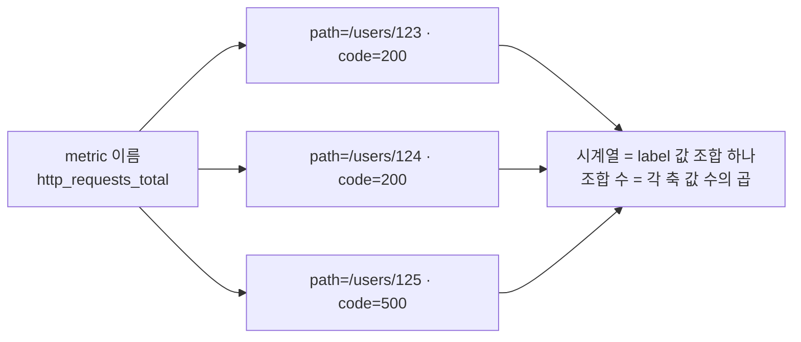
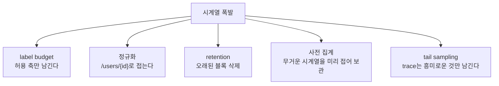

# 15. 카디널리티·비용·샘플링 — 왜 시계열이 폭발하고 비용이 터지는가

Prometheus의 저장 단위는 metric 이름이 아니라 **시계열**입니다 — label 값의 조합 하나가 시계열 하나입니다. 그래서 `http_requests_total` 하나처럼 보여도, 안에 든 label 값의 가짓수만큼 시계열이 갈라집니다. label에 값이 계속 바뀌는 것(사용자 id, 요청 id, 원시 경로)을 넣으면 값마다 새 시계열이 생겨 수가 폭발하고, 그게 곧 메모리·디스크·쿼리 비용입니다. 이 편은 같은 요청을 세 방식으로 노출하는 생성기를 띄워 — id를 경로에 박은 원시 카운터, id를 `{id}`로 접은 정규화 카운터, path와 code 두 축을 곱한 카운터 — 시계열 수를 직접 셉니다. 500개 원시 경로가 500 시계열이 되고 정규화하면 1이 되며, 축이 하나 더 붙으면 곱으로 늘어남을 눈으로 확인합니다. 그다음 폭발을 통제하는 손잡이 셋을 봅니다 — **label budget**(어떤 label을 허용/금지할지 미리 정한다), **정규화**(`/users/123`이 아니라 `/users/{id}`), 그리고 저장을 줄이는 **retention·사전 집계(downsampling)·tail sampling**. 이 편의 산출물은 "카디널리티가 왜 시계열 수 = 비용인지 직접 세어 본 상태"와 "원시 경로를 정규화하고 label budget으로 축을 통제하며, retention·사전 집계·tail sampling으로 저장을 줄이는 규칙을 잡은 경험"입니다.

## 핵심 다이어그램





- **시계열은 label 값의 조합 하나다.** metric 이름이 아니라 조합이 저장 단위라, 조합 수는 각 label 축이 가진 값 수의 **곱**으로 늘어난다. 이 수가 곧 메모리·디스크·쿼리 비용이다.
- **값이 계속 바뀌는 label이 폭발을 만든다.** 사용자 id·요청 id·원시 경로처럼 값이 무한히 늘어나는 축을 label에 넣으면, 값마다 새 시계열이 생겨 수가 통제 불능이 된다.
- **정규화와 label budget이 축을 통제한다.** `/users/123`을 `/users/{id}`로 접으면 경로 축이 1로 줄고, 어떤 label을 허용/금지할지 미리 정하면 곱이 커지는 걸 막는다.
- **저장은 retention·사전 집계·tail sampling으로 줄인다.** metric은 오래된 블록을 지우고(retention) 무거운 시계열을 미리 접어 보관하며(사전 집계), trace는 흥미로운 것만 남긴다(tail sampling).

아래 시연이 이 시계열 수를 한 줄씩 손으로 확인합니다.

## 사전 준비물

이 실습은 **macOS** 환경을 기준으로 합니다.

- **Docker** — Docker Desktop, OrbStack 등. `docker ps`가 에러 없이 돌아가면 OK.
- **Homebrew** — macOS 패키지 관리자.

### kind · kubectl 설치

```bash
brew install kind kubectl
```

### rosa-lab 클러스터 · namespace 준비

```bash
kind create cluster --name rosa-lab
kubectl create namespace rosa-lab
kubectl config set-context --current --namespace=rosa-lab
```

이미 있으면 건너뜁니다 (`kind get clusters`, `kubectl config get-contexts`로 확인).

## 실습 환경

| 파일 | 내용 |
|---|---|
| `manifests/stack.yaml` | metrics-gen(원시·정규화·곱 세 카운터) + Prometheus(자기 scrape·사전 집계 rule·retention 6h) |

```bash
kubectl apply -f manifests/stack.yaml
kubectl rollout status deploy/metrics-gen -n rosa-lab
kubectl rollout status deploy/prometheus -n rosa-lab
```

첫 scrape가 쌓이도록 15초쯤 기다린 뒤 Prometheus에 붙고 쿼리 헬퍼를 준비합니다.

```bash
kubectl port-forward -n rosa-lab svc/prometheus 9090:9090 >/dev/null 2>&1 &
sleep 5
q() { curl -s -G localhost:9090/api/v1/query --data-urlencode "query=$1" \
  | python3 -c "import sys,json; r=json.load(sys.stdin)['data']['result']; print(round(float(r[0]['value'][1]),5) if r else 'n/a')"; }
```

## 여기서 직접 확인할 수 있는 것

### 원시 경로가 시계열을 폭발시킨다

생성기는 사용자 id를 경로에 박은 카운터를 냅니다 — `http_requests_raw_total{path="/users/0"}`, `{path="/users/1"}`, … 500개. metric 이름은 하나지만 시계열이 몇 개인지 셉니다.

```bash
q 'count(http_requests_raw_total)'
```

```
500.0
```

**500개**입니다. metric 하나가 아니라 경로 값마다 시계열 하나 — id가 1만 명이면 1만 시계열입니다. 값이 계속 늘어나는 축(id)을 label에 넣는 순간 시계열 수는 그 축의 크기를 따라 무한히 커집니다.

### 정규화하면 하나로 접힌다

같은 요청을 id를 `{id}`로 접어 노출한 카운터를 봅니다 — `http_requests_normalized_total{path="/users/{id}"}`.

```bash
q 'count(http_requests_normalized_total)'
```

```
1.0
```

**1개**입니다. 경로가 어떤 id든 `/users/{id}` 하나로 접히니 시계열도 하나입니다. 같은 정보(사용자별 요청)를 세는데 저장 비용은 500배 차이가 납니다. 핵심은 경로를 label에서 빼는 게 아니라 **정규화** — 값이 무한한 raw path를 유한한 template로 접는 것입니다.

### 축이 하나 더 붙으면 곱으로 늘어난다

path에 code 축을 더한 카운터를 봅니다 — path 500개 × code 4개(200·404·500·503).

```bash
q 'count(http_requests_labeled_total)'
```

```
2000.0
```

**2000개** = 500 × 4입니다. label 축이 하나 늘 때 시계열은 더해지는 게 아니라 **곱해집니다**. 여기에 사용자 id(값 1000개)를 label로 더 넣으면 500 × 4 × 1000 = **200만** 시계열입니다 — 축 하나가 곱을 통째로 키웁니다. 그래서 label에 무엇을 넣을지는 "있으면 편한가"가 아니라 "이 축이 곱을 얼마나 키우는가"로 정합니다.

### Prometheus 전체 시계열과 가장 무거운 metric

Prometheus는 자기 자신도 scrape하므로, 지금 head에 살아 있는 전체 시계열 수를 쿼리로 볼 수 있습니다.

```bash
q 'prometheus_tsdb_head_series'
```

```
3078.0
```

약 3000 — 대부분이 방금 만든 `labeled`(2000)·`raw`(500)입니다. 어떤 metric이 시계열을 가장 많이 먹는지는 TSDB 상태 API가 바로 알려 줍니다.

```bash
curl -s localhost:9090/api/v1/status/tsdb \
  | python3 -c "import sys,json; d=json.load(sys.stdin)['data']['seriesCountByMetricName']; [print(x['value'], x['name']) for x in d[:5]]"
```

```
2000 http_requests_labeled_total
500 http_requests_raw_total
51 prometheus_http_requests_total
18 prometheus_sd_kubernetes_events_total
15 prometheus_tsdb_compaction_duration_seconds_bucket
```

카디널리티를 잡을 때 추측하지 않습니다 — 이 목록의 맨 위부터 봅니다. 대개 상위 몇 개 metric이 전체 시계열의 대부분을 차지하고, 그 label을 정규화하거나 축을 줄이는 것이 가장 큰 절감입니다.

### 사전 집계로 무거운 시계열을 미리 접는다

2000 시계열 전부를 오래 보관할 필요는 없습니다. path를 버리고 code별로 접는 recording rule을 미리 계산해 두면, 대시보드·alert가 그 결과만 읽습니다.

```bash
q 'count(code:http_requests_labeled:sum)'
```

```
4.0
```

2000 시계열이 code별 **4 시계열**로 접혔습니다. 이 4개를 길게 보관하고 원본 2000개는 짧게만 두면, 질문(code별 추이)은 그대로 답하면서 장기 저장 비용은 500배 줄어듭니다. 무거운 원본을 요약본으로 바꿔 보관하는 이 방식이 로컬 Prometheus에서 downsampling에 해당하는 손잡이입니다.

### 저장을 줄이는 나머지 손잡이 — retention과 tail sampling

카디널리티가 "시계열이 몇 개인가"라면, retention은 "그 시계열을 얼마나 오래 두는가"입니다. 이 스택의 Prometheus는 `--storage.tsdb.retention.time=6h`로 떠 있습니다.

```bash
kubectl get deploy prometheus -n rosa-lab \
  -o jsonpath='{.spec.template.spec.containers[0].args}'; echo
```

```
["--config.file=/etc/prometheus/prometheus.yml","--storage.tsdb.path=/prometheus","--storage.tsdb.retention.time=6h"]
```

최근 데이터는 메모리의 **head block**에 있다가 일정 시간마다 디스크 블록으로 압축되고, retention 창(여기선 6시간)을 넘긴 블록은 삭제됩니다. 즉 로컬 저장량은 대략 `시계열 수 × 표본 빈도 × retention`으로 정해집니다 — 세 값 중 무엇을 줄여도 저장이 준다는 뜻입니다.

trace는 결이 다릅니다. metric은 시계열을 접고 오래된 걸 지워 줄이지만, trace는 **tail sampling** — 요청이 끝난 뒤 그 trace가 흥미로운지(느렸는지·에러였는지) 보고 남길지 버릴지 정합니다. 정상 trace 대부분을 버리고 문제 있는 것만 보관하니, 원인 진단에 필요한 건 남기면서 저장은 크게 줍니다. metric은 "축을 줄인다", trace는 "표본을 고른다" — 신호마다 줄이는 손잡이가 다릅니다.

### label budget — 폭발하기 전에 정하는 규칙

지금까지 본 걸 규칙으로 굳히면 label budget입니다 — 어떤 label을 허용하고 어떤 걸 금지할지 미리 정하는 것입니다.

| label | 허용? | 이유 |
|---|---|---|
| `service` · `env` · `region` · `code` · `method` | O | 값의 가짓수가 유한하고 작다 |
| `path`(정규화된 `/users/{id}`) | O | template로 접어 축이 작다 |
| `path`(원시 `/users/123`) | X | 값이 무한 — 요청마다 새 시계열 |
| `user_id` · `request_id` · `session` · `query` | X | 값이 무한 — 곱을 통째로 키운다 |

원칙은 하나입니다 — **값의 가짓수가 유한하고 작은 축만 label로 둔다.** 개별 요청을 짚어야 할 정보(user_id·request_id)는 metric의 label이 아니라 로그나 trace에 둡니다. 거기선 값이 하나 늘어도 시계열이 곱해지지 않기 때문입니다.

### 정리

```bash
pkill -f "port-forward.*9090" 2>/dev/null
kubectl delete -f manifests/stack.yaml --ignore-not-found
```

클러스터까지 정리하려면:

```bash
kind delete cluster --name rosa-lab
```

## 이 편의 산출물

- 같은 요청을 원시·정규화·곱 세 방식으로 노출해, 원시 경로가 **500 시계열**, 정규화가 **1 시계열**, path×code가 **2000 시계열**(= 500 × 4)임을 직접 세어, "시계열 = label 값 조합의 곱 = 비용"을 확인한 상태.
- `prometheus_tsdb_head_series`와 `/api/v1/status/tsdb`로 **전체 시계열 수와 가장 무거운 metric**을 짚어, 카디널리티를 추측이 아니라 측정으로 잡는 법을 익힌 것.
- 무거운 2000 시계열을 recording rule로 **code별 4 시계열**로 접어(사전 집계), retention(오래된 블록 삭제)·tail sampling(trace는 흥미로운 것만)까지 — metric과 trace가 저장을 줄이는 손잡이가 다름을 정리한 상태.
- **label budget**을 규칙으로 잡은 것 — 값의 가짓수가 유한한 축만 label로 두고, user_id·request_id 같은 무한 축은 로그·trace로 보내 시계열 폭발을 막는다.
