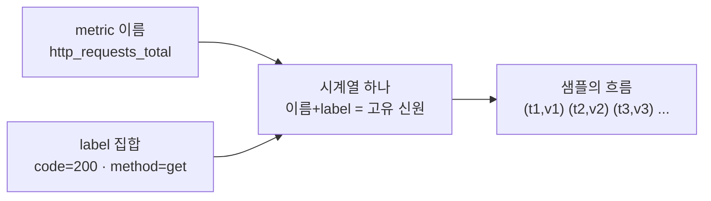
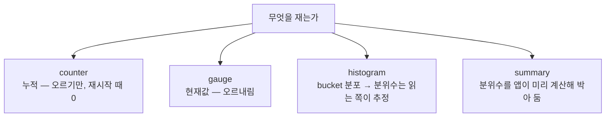

# 2. metric 데이터 모델 — 숫자는 어떤 모양으로 저장되는가

metric은 "숫자 하나"가 아닙니다. `http_requests_total{code="200"} 4820`이라는 한 줄에는 이름·label·값이 들어 있고, 같은 줄을 시간을 두고 다시 읽으면 값이 달라집니다. 이 한 줄이 시간 위에 쌓이는 것이 시계열(time series)이고, 그 시계열이 무엇을 재느냐에 따라 counter·gauge·histogram·summary 네 가지 모양으로 갈립니다. 이 편은 살아 있는 앱과 손으로 작성한 exposition 스냅샷을 함께 두고, 같은 latency 데이터를 histogram과 summary 두 모양으로 저장했을 때 무엇이 달라지는지 — 특히 "여러 인스턴스를 합쳐 p90을 볼 수 있는가", "평균 하나로는 왜 느린 요청을 못 찾는가" — 를 숫자로 가릅니다. 이 편의 산출물은 "네 가지 metric 타입을 exposition 포맷에서 직접 식별한 상태"와 "histogram bucket에서 분위수를 손으로 추정해, bucket 경계가 품질을 어떻게 가르는지 본 경험"입니다.

## 핵심 다이어그램





- **시계열은 이름 + label로 신원이 정해진다.** `http_requests_total{code="200",method="get"}`과 `http_requests_total{code="500",method="get"}`은 이름이 같아도 label이 다르므로 **서로 다른 시계열**이다. label 값 조합 하나마다 시계열이 하나 생긴다.
- **exposition은 한 장면일 뿐, 시계열은 시간이 만든다.** `/metrics`를 한 번 읽으면 "지금 값" 하나가 나온다. 같은 줄을 주기적으로 다시 읽어 (시각, 값) 쌍을 쌓는 것이 시계열이고, 시각은 읽는 쪽(Prometheus)이 붙인다.
- **무엇을 재느냐가 타입을 정한다.** 누적되는 횟수는 counter, 오르내리는 현재값은 gauge, 값의 분포는 histogram 또는 summary다.
- **histogram과 summary는 같은 분포를 다른 곳에서 계산한다.** histogram은 bucket(구간별 개수)만 저장하고 분위수는 읽는 쪽이 추정한다. summary는 앱이 분위수를 미리 계산해 값으로 박아 둔다. 이 차이가 "여러 인스턴스를 합칠 수 있는가"를 가른다.

아래 시연이 이 모양들을 한 줄씩 손으로 확인합니다.

## 사전 준비물

이 실습은 **macOS** 환경을 기준으로 합니다.

- **Docker** — Docker Desktop, OrbStack 등. `docker ps`가 에러 없이 돌아가면 OK.
- **Homebrew** — macOS 패키지 관리자.

### kind · kubectl 설치

```bash
brew install kind kubectl
```

### rosa-lab 클러스터 · namespace 준비

```bash
kind create cluster --name rosa-lab
kubectl create namespace rosa-lab
kubectl config set-context --current --namespace=rosa-lab
```

이미 있으면 건너뜁니다 (`kind get clusters`, `kubectl config get-contexts`로 확인).

## 실습 환경

| 파일 | 내용 |
|---|---|
| `manifests/app.yaml` | `prometheus-example-app` Deployment + Service. 살아 있는 scrape 대상으로, counter가 호출마다 누적되는 것을 직접 본다 |
| `manifests/sample.yaml` | 손으로 작성한 exposition 스냅샷(ConfigMap)을 nginx가 그대로 서빙. 분포가 퍼진 histogram·summary·exemplar를 한 화면에서 읽는다 |

```bash
kubectl apply -f manifests/app.yaml
kubectl apply -f manifests/sample.yaml
kubectl rollout status deploy/web -n rosa-lab
kubectl rollout status deploy/sample -n rosa-lab
```

## 여기서 직접 확인할 수 있는 것

### 시계열의 신원 — 이름 + label

먼저 살아 있는 앱에 요청을 흘려보냅니다. 정상 경로(`/`) 20번, 없는 경로(`/err`) 4번을 Pod 안에서 호출합니다.

```bash
POD=$(kubectl get pod -n rosa-lab -l app=web -o jsonpath='{.items[0].metadata.name}')
kubectl exec -n rosa-lab "$POD" -- sh -c '
  for i in $(seq 1 20); do wget -qO- localhost:8080/ >/dev/null; done
  for i in 1 2 3 4; do wget -qO- localhost:8080/err >/dev/null 2>&1 || true; done
'
kubectl exec -n rosa-lab "$POD" -- wget -qO- localhost:8080/metrics | grep '^http_requests_total'
```

```
http_requests_total{code="200",method="get"} 20
http_requests_total{code="404",method="get"} 4
```

이름은 둘 다 `http_requests_total`이지만 `code` label이 달라 **두 개의 시계열**입니다. 같은 이름 아래 label 조합마다 독립된 숫자가 흐릅니다. `code`에 들어갈 값이 늘수록(`200`·`404`·`500`…) 시계열도 그만큼 늘어납니다 — label은 신원이자 곱셈입니다.

### counter — 누적값, 그래서 값이 아니라 증가율을 본다

counter는 오르기만 하는 누적값입니다. 같은 시계열을 다시 읽으면 그동안의 호출이 더해져 커집니다. 정상 요청 13번을 더 보내고 같은 줄을 다시 읽습니다.

```bash
kubectl exec -n rosa-lab "$POD" -- sh -c 'for i in $(seq 1 13); do wget -qO- localhost:8080/ >/dev/null; done'
kubectl exec -n rosa-lab "$POD" -- wget -qO- localhost:8080/metrics | grep '^http_requests_total'
```

```
http_requests_total{code="200",method="get"} 33
http_requests_total{code="404",method="get"} 4
```

`200`이 20에서 33으로 올랐습니다. counter의 절대값 33 자체는 "이 Pod가 떠 있는 동안 누적된 합"일 뿐 의미가 옅습니다. 쓸모 있는 질문은 "초당 몇 건 늘었나"이고, 그건 두 시점의 차를 시간으로 나눠 얻습니다. counter를 재시작하면 0으로 떨어지므로, 읽는 쪽은 이 리셋을 감지해 증가분만 셉니다. **counter는 값이 아니라 변화율로 읽는다** — 이것이 counter 모양이 강제하는 사용법입니다.

### gauge — 현재값, 오르내린다

gauge는 지금 이 순간의 값입니다. counter와 달리 내려갈 수 있습니다. 손으로 작성한 스냅샷에서 읽습니다.

```bash
SAMPLE=$(kubectl get pod -n rosa-lab -l app=sample -o jsonpath='{.items[0].metadata.name}')
kubectl exec -n rosa-lab "$SAMPLE" -- wget -qO- localhost/metrics-sample.txt \
  | grep -E '^(# TYPE inflight_requests|inflight_requests)'
```

```
# TYPE inflight_requests gauge
inflight_requests 7
```

"지금 처리 중인 요청 7건". 1초 뒤엔 5건, 그다음엔 9건일 수 있습니다. gauge는 누적이 아니라 스냅샷이라, 증가율이 아니라 값 그 자체·최댓값·평균을 봅니다. 같은 숫자라도 "누적이냐 현재값이냐"가 읽는 법을 바꾸므로, TYPE 줄이 counter인지 gauge인지부터 확인합니다.

### histogram — bucket으로 분포를 담는다

latency처럼 "값의 분포"가 궁금한 신호는 histogram으로 잽니다. 스냅샷의 histogram을 읽습니다.

```bash
kubectl exec -n rosa-lab "$SAMPLE" -- wget -qO- localhost/metrics-sample.txt \
  | grep -E '^(# TYPE http_request_duration_seconds|http_request_duration_seconds)'
```

```
# TYPE http_request_duration_seconds histogram
http_request_duration_seconds_bucket{le="0.1"} 24
http_request_duration_seconds_bucket{le="0.3"} 33
http_request_duration_seconds_bucket{le="1.2"} 47 # {trace_id="a1b2c3d4e5f60718"} 1.07 1719300000.0
http_request_duration_seconds_bucket{le="5"} 50
http_request_duration_seconds_bucket{le="+Inf"} 50
http_request_duration_seconds_sum 41.7
http_request_duration_seconds_count 50
```

세 부분으로 읽습니다.

- **`_bucket{le="..."}`** — `le`는 "less than or equal", 그 시간 **이하**로 끝난 요청의 누적 개수입니다. `le="0.1"`이 24면 0.1초 이하가 24건, `le="0.3"`이 33이면 0.3초 이하가 33건 — 즉 0.1초와 0.3초 사이가 9건. bucket은 이렇게 **누적**이고, `le="+Inf"`는 전체입니다.
- **`_count`** — 전체 관측 수(50). 항상 `+Inf` bucket과 같습니다.
- **`_sum`** — 모든 관측값의 합(41.7초). 평균은 `_sum / _count = 41.7 / 50 = 0.834초`.

여기서 핵심은 histogram이 **분위수 값을 저장하지 않는다**는 것입니다. "p90이 몇 초인가"는 저장돼 있지 않고, bucket 개수에서 **추정**합니다.

### histogram에서 p90을 손으로 추정한다

50건 중 90번째 백분위는 45번째(0.9 × 50) 요청입니다. bucket 누적을 따라가 45번째가 어느 구간에 떨어지는지 찾습니다.

- `le="0.3"`까지 33건 — 45번째는 아직 안 옴.
- `le="1.2"`까지 47건 — 45번째는 여기, 즉 **0.3초와 1.2초 사이**.

그 구간 안에서 위치를 비례로 잡습니다(읽는 쪽이 쓰는 추정법과 같은 방식).

```
하한 0.3초(누적 33) → 상한 1.2초(누적 47), 목표 45번째
구간 내 비율 = (45 - 33) / (47 - 33) = 12 / 14 = 0.857
p90 ≈ 0.3 + 0.857 × (1.2 - 0.3) = 0.3 + 0.771 = 1.07초
```

p90 ≈ **1.07초**. 같은 추정을 도구로 하면 `histogram_quantile(0.9, ...)`가 이 계산을 대신합니다. 평균은 0.834초, 중앙값(p50, 25번째)은 같은 방식으로 약 0.12초가 나옵니다 — 절반은 0.12초 안에 끝나는데 상위 10%는 1초를 넘습니다. **평균 0.83초 하나로는 "빠른 다수"도 "느린 꼬리"도 가리킬 수 없습니다.** 분포를 담는 histogram이라야 이 꼬리가 보입니다.

### bucket 경계가 답을 정한다 — 거칠면 거짓말한다

방금 p90 ≈ 1.07초는 `0.3`과 `1.2` 사이에 경계가 있어서 나온 값입니다. 만약 bucket을 거칠게 잡아 `0.1`·`5`·`+Inf`만 있었다면, 45번째 요청은 `0.1`(24건)과 `5`(50건) 사이에 통째로 들어갑니다.

```
하한 0.1초(누적 24) → 상한 5초(누적 50), 목표 45번째
구간 내 비율 = (45 - 24) / (50 - 24) = 21 / 26 = 0.808
p90 ≈ 0.1 + 0.808 × (5 - 0.1) = 0.1 + 3.96 = 4.06초
```

같은 데이터인데 p90이 **1.07초에서 4.06초로** 뜁니다 — 거의 4배 부풀려진 거짓말입니다. 추정은 bucket **경계에서만** 꺾일 수 있으므로, 관심 있는 시간대(예: SLO 임계 1초 부근)에 경계가 없으면 그 구간을 직선으로 뭉개 버립니다. **bucket 설계는 나중에 묻고 싶은 분위수를 미리 정하는 일**입니다. 응답시간이라면 1초 근처를 촘촘히 두는 식으로, 답이 갈리는 자리에 경계를 둡니다.

### summary — 분위수를 앱이 미리 계산해 박는다

같은 분포를 summary는 다르게 저장합니다. 스냅샷의 summary를 읽습니다.

```bash
kubectl exec -n rosa-lab "$SAMPLE" -- wget -qO- localhost/metrics-sample.txt \
  | grep -E '^(# TYPE rpc_duration_seconds|rpc_duration_seconds)'
```

```
# TYPE rpc_duration_seconds summary
rpc_duration_seconds{quantile="0.5"} 0.21
rpc_duration_seconds{quantile="0.9"} 0.84
rpc_duration_seconds{quantile="0.99"} 1.98
rpc_duration_seconds_sum 41.7
rpc_duration_seconds_count 50
```

`quantile="0.9"} 0.84`는 "p90 = 0.84초"가 **이미 계산되어** 들어 있다는 뜻입니다. bucket이 아니라 분위수 값 자체입니다. 앱이 자기 안에서 분포를 들고 있다가 미리 정한 분위수(0.5·0.9·0.99)를 계산해 내보냅니다. `_sum`·`_count`는 histogram과 똑같이 있습니다. 읽는 쪽은 추정할 필요 없이 0.84를 그대로 씁니다 — 정확하고 간단해 보입니다. 문제는 인스턴스가 여러 개일 때 드러납니다.

### 합칠 수 있는가 — histogram이 latency의 기본이 된 이유

서비스가 Pod 3개로 떠 있고, 전체 p90을 알고 싶다고 합시다.

- **histogram**: 세 Pod의 `_bucket{le="1.2"}`를 **더하면** 됩니다. bucket은 개수라서 합산이 정의됩니다. 합친 bucket에서 p90을 추정하면 전체 분위수가 나옵니다.
- **summary**: Pod A의 p90이 0.84, Pod B가 1.5, Pod C가 0.6일 때 — 이 셋을 **평균 내도 전체 p90이 아닙니다.** 분위수는 더하거나 평균 낼 수 없습니다. 각 Pod 안에서 끝난 계산이라, 합치려면 원본 분포가 필요한데 그건 버려졌습니다.

| 축 | histogram | summary |
|---|---|---|
| 분위수 계산 위치 | 읽는 쪽(쿼리 시) | 앱(미리) |
| 저장 모양 | bucket 개수 + `_sum` + `_count` | 분위수 값 + `_sum` + `_count` |
| 여러 인스턴스 합산 | 가능(bucket을 더한다) | 불가(분위수는 못 더한다) |
| 분위수 유연성 | 읽을 때 아무 분위수나 | 미리 정한 것만 |
| 정확도 | bucket 경계에 의존(추정) | 인스턴스 안에서는 정확 |

분산된 서비스에서 "전체 p90"은 거의 항상 필요한 질문이고, summary로는 그 질문에 답할 수 없습니다. 그래서 **latency 측정의 기본 선택은 histogram**입니다 — 대신 bucket 경계를 잘 잡아야 하는 부담을 진다. summary는 인스턴스가 하나거나, 합산할 일이 없는 단일 지표에서 정확도가 필요할 때 자리를 가집니다.

### exemplar — 숫자에서 그 요청 하나로 건너뛴다

histogram을 다시 보면 한 줄에만 꼬리표가 붙어 있었습니다.

```
http_request_duration_seconds_bucket{le="1.2"} 47 # {trace_id="a1b2c3d4e5f60718"} 1.07 1719300000.0
```

`#` 뒤의 `{trace_id="..."} 1.07`이 **exemplar**입니다. "이 bucket을 채운 관측 중 하나는 `trace_id=a1b2...`였고 1.07초 걸렸다"는, 집계된 숫자에 매달린 **실제 요청 한 건의 좌표**입니다. p90 ≈ 1.07초라는 추정이 가리키는 바로 그 느린 구간에, 그 시간대 실제 요청의 trace_id가 박혀 있습니다.

이게 메우는 빈자리는 분명합니다. histogram은 "상위 10%가 1초를 넘는다"까지 말하지만 "**왜** 느렸나"는 말하지 못합니다 — 집계라서 개별 요청을 버렸기 때문입니다. exemplar는 그 집계 숫자에서 **하나의 trace로 건너뛸 다리**를 남깁니다: 느린 bucket → exemplar의 trace_id → 그 요청이 어느 서비스·어느 구간에서 시간을 썼는지. 평균 latency 그래프 하나만으로는 원인을 못 찾는 이유가 여기서 뒤집힙니다 — 분포(histogram)가 느린 꼬리를 보여 주고, exemplar가 그 꼬리의 실제 요청을 손에 쥐여 줍니다. exemplar는 OpenMetrics 포맷에서만 실리므로, scrape할 때 그 포맷을 받도록 켜 둬야 합니다.

### temporality — 누적이냐, 구간 증가분이냐

counter를 다시 읽었을 때 20에서 33으로 **누적**으로 오른 것을 봤습니다. 이것이 Prometheus의 기본 시간 모델 — **cumulative**입니다: 값은 시작부터의 총합이고, 읽는 쪽이 두 시점의 차로 증가율을 구합니다. 또 다른 모델은 **delta**입니다: 매 보고가 "지난 보고 이후 늘어난 만큼"만 담습니다. OpenTelemetry는 둘 다 표현할 수 있고, OTel로 계측한 신호를 Prometheus로 보낼 때는 이 temporality를 맞춰야 합니다 — delta로 들어온 값을 cumulative로 변환하지 않으면 증가율이 어긋납니다. 같은 "30"이라도 "시작부터 누적 30"인지 "이번 구간에 30 늘었다"인지에 따라 의미가 완전히 다르므로, 타입(counter/gauge)과 함께 temporality도 신호의 일부입니다.

### 정리

```bash
kubectl delete -f manifests/sample.yaml --ignore-not-found
kubectl delete -f manifests/app.yaml --ignore-not-found
```

클러스터까지 정리하려면:

```bash
kind delete cluster --name rosa-lab
```

## 이 편의 산출물

- exposition 포맷 한 화면에서 **counter·gauge·histogram·summary 네 타입을 TYPE 줄로 식별**하고, 각각이 강제하는 읽는 법(counter=증가율, gauge=현재값, histogram=분포 추정, summary=박힌 분위수)을 가른 상태.
- **시계열의 신원이 이름 + label**이고 label 값 조합마다 시계열이 하나씩 생긴다는 것, `/metrics`는 한 장면이고 시각은 읽는 쪽이 붙인다는 것을 확인한 경험.
- histogram의 `_bucket`/`_sum`/`_count`에서 **p90을 손으로 추정**하고, bucket 경계를 거칠게 잡으면 같은 데이터의 p90이 1.07초에서 4.06초로 뒤틀리는 것을 계산으로 본 것 — **bucket 설계가 답의 품질을 정한다**는 감각.
- **histogram vs summary**를 "여러 인스턴스를 합쳐 전체 분위수를 낼 수 있는가"로 가르고, latency의 기본 선택이 histogram인 이유를 잡은 상태.
- **exemplar**가 집계 숫자에서 실제 요청 하나(trace_id)로 건너뛰는 다리이고, 평균 그래프 하나로 원인을 못 찾던 빈자리를 분포 + exemplar가 메운다는 것, 그리고 **temporality**(cumulative vs delta)도 타입과 함께 읽어야 하는 신호의 일부임을 본 경험.
