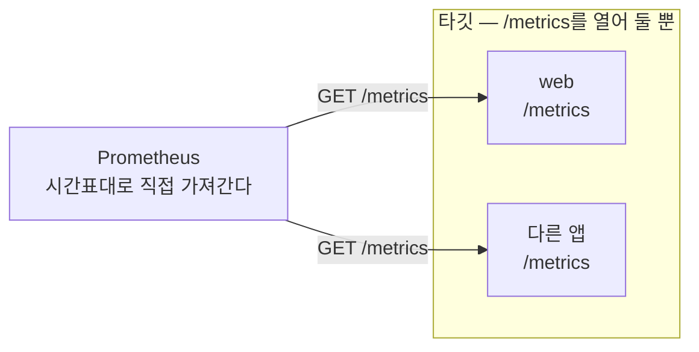
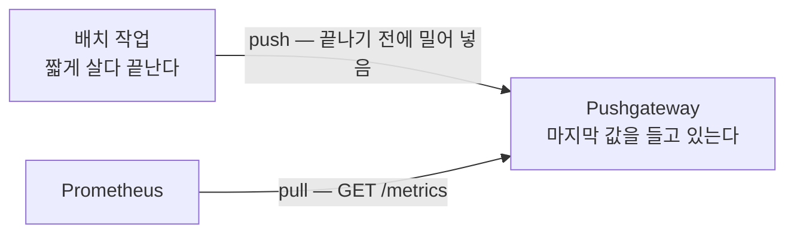

# 3. pull vs push — Prometheus는 왜 앱을 긁어가는가

앱은 자기 숫자를 Prometheus로 보내지 않습니다. `/metrics`를 열어 두기만 하고, Prometheus가 시간표대로 그 주소를 찾아와 직접 가져갑니다(pull). 보내는(push) 게 아니라 긁어가는 이 방향이 무엇을 바꾸는지 — 타깃은 누가 자기를 읽는지 모르고, 신원(job·instance)은 긁는 쪽이 붙이며, 타깃이 사라지면 그 사실 자체(`up=0`)가 신호가 된다 — 를 이 편에서 직접 봅니다. 그리고 이 모델이 안 맞는 한 곳, 짧게 살다 죽어 긁힐 시간이 없는 배치 작업을 위한 예외(Pushgateway)와, 그 예외를 일반 앱에 잘못 쓰면 왜 망가지는지를 가릅니다. 이 편의 산출물은 "plain Prometheus가 static 설정으로 타깃을 pull하는 것을 띄워 `up`과 긁힌 시계열을 확인한 상태"와 "ServiceMonitor가 Prometheus 기능이 아니라 Operator CRD임을, Pushgateway가 배치 전용 예외임을 손으로 가른 경험"입니다.

## 핵심 다이어그램





- **pull은 긁는 쪽이 주도한다.** Prometheus가 타깃 목록을 들고 주기마다 각 `/metrics`를 가져온다. 타깃은 응답만 할 뿐, 누가 언제 읽는지 모르고 어디로 보낼지도 정하지 않는다.
- **신원은 긁는 쪽이 붙인다.** 앱이 내보낸 label 위에, Prometheus가 scrape 설정에서 `job`·`instance`를 더한다. "이 숫자가 어느 타깃 것인가"는 타깃이 아니라 설정이 정한다.
- **사라짐도 신호다.** 타깃을 못 긁으면 Prometheus는 `up=0`을 남긴다. 매 scrape가 곧 liveness 확인이라, "지금 살아 있나"가 따로 만들지 않아도 따라온다.
- **push는 예외다.** 짧게 살다 죽는 배치 작업은 긁힐 틈이 없어, 끝나기 전에 Pushgateway로 밀어 넣고 Prometheus는 그 Pushgateway를 pull한다. push 구간은 작업→Pushgateway 한 칸뿐, Prometheus→Pushgateway는 여전히 pull이다.

아래 시연이 이 방향을 한 줄씩 손으로 확인합니다.

## 사전 준비물

이 실습은 **macOS** 환경을 기준으로 합니다.

- **Docker** — Docker Desktop, OrbStack 등. `docker ps`가 에러 없이 돌아가면 OK.
- **Homebrew** — macOS 패키지 관리자.

### kind · kubectl 설치

```bash
brew install kind kubectl
```

### rosa-lab 클러스터 · namespace 준비

```bash
kind create cluster --name rosa-lab
kubectl create namespace rosa-lab
kubectl config set-context --current --namespace=rosa-lab
```

이미 있으면 건너뜁니다 (`kind get clusters`, `kubectl config get-contexts`로 확인).

## 실습 환경

| 파일 | 내용 |
|---|---|
| `manifests/app.yaml` | `prometheus-example-app` Deployment + Service. pull 대상 — `/metrics`만 열어 둔다 |
| `manifests/prometheus.yaml` | plain `prom/prometheus` + static 설정 ConfigMap + Service. Operator 없이 타깃을 직접 pull한다 |
| `manifests/pushgateway.yaml` | `prom/pushgateway` Deployment + Service. 배치 작업이 밀어 넣을 곳 |
| `manifests/servicemonitor.yaml` | ServiceMonitor 한 장. Operator가 없는 클러스터에선 apply가 거절된다 |

```bash
kubectl apply -f manifests/app.yaml
kubectl apply -f manifests/pushgateway.yaml
kubectl apply -f manifests/prometheus.yaml
kubectl rollout status deploy/web -n rosa-lab
kubectl rollout status deploy/pushgateway -n rosa-lab
kubectl rollout status deploy/prometheus -n rosa-lab
```

## 여기서 직접 확인할 수 있는 것

### pull — Prometheus가 직접 긁는다

앱에 요청을 조금 흘려보내고, 앱이 여는 `/metrics`를 직접 읽습니다. 이게 Prometheus가 가져가는 바로 그 텍스트입니다.

```bash
WEB=$(kubectl get pod -n rosa-lab -l app=web -o jsonpath='{.items[0].metadata.name}')
kubectl exec -n rosa-lab "$WEB" -- sh -c 'for i in $(seq 1 15); do wget -qO- localhost:8080/ >/dev/null; done'
kubectl exec -n rosa-lab "$WEB" -- wget -qO- localhost:8080/metrics | grep '^http_requests_total'
```

```
http_requests_total{code="200",method="get"} 15
```

앱이 내보낸 label은 `code`·`method` 둘뿐입니다. 이제 Prometheus 쪽에서 같은 숫자를 봅니다. Prometheus에 붙어 쿼리하려고 port-forward를 띄웁니다.

```bash
kubectl port-forward -n rosa-lab svc/prometheus 9090:9090 >/dev/null 2>&1 &
sleep 6
curl -s 'http://localhost:9090/api/v1/query?query=up' \
  | python3 -c "import sys,json; [print(r['metric']['job'], r['metric']['instance'], '=>', r['value'][1]) for r in sorted(json.load(sys.stdin)['data']['result'], key=lambda r: r['metric']['job'])]"
```

```
pushgateway pushgateway:9091 => 1
web web:8080 => 1
```

`up`은 Prometheus가 만들어 내는 숫자입니다 — 앱에는 없습니다. scrape에 성공하면 1, 실패하면 0을 그 타깃 시계열에 적습니다. 두 타깃 모두 1이니 둘 다 잘 긁히고 있습니다. 같은 앱 숫자를 Prometheus 안에서 보면 label이 달라져 있습니다.

```bash
curl -s 'http://localhost:9090/api/v1/query?query=http_requests_total' \
  | python3 -c "import sys,json; [print(r['metric'], '=>', r['value'][1]) for r in json.load(sys.stdin)['data']['result']]"
```

```
{'__name__': 'http_requests_total', 'code': '200', 'instance': 'web:8080', 'job': 'web', 'method': 'get'} => 15
```

앱은 `code`·`method`만 냈는데 `job="web"`·`instance="web:8080"`이 더해졌습니다. 이 둘은 Prometheus가 scrape 설정(`static_configs`의 `targets`)에서 붙인 **타깃의 신원**입니다. 앱은 자기가 `web`이라는 job인지, 누구에게 긁히는지 전혀 모릅니다 — 그 정보는 긁는 쪽에만 있습니다.

### ServiceMonitor — Prometheus 기능이 아니라 Operator CRD

방금 타깃 주소는 `prometheus.yml`의 `static_configs`에 **손으로** 적었습니다. 쿠버네티스에서는 Service만 만들면 Prometheus가 알아서 긁게 하고 싶어지는데, 그걸 선언하는 게 ServiceMonitor입니다. 한 장 apply해 봅니다.

```bash
kubectl apply -f manifests/servicemonitor.yaml
```

```
error: resource mapping not found for name: "web" namespace: "rosa-lab" from "manifests/servicemonitor.yaml": no matches for kind "ServiceMonitor" in version "monitoring.coreos.com/v1"
ensure CRDs are installed first
```

거절당합니다. `monitoring.coreos.com/v1`이라는 종류를 클러스터가 모릅니다. 확인합니다.

```bash
kubectl api-resources --api-group=monitoring.coreos.com
```

```
NAME   SHORTNAMES   APIVERSION   NAMESPACED   KIND
```

비어 있습니다. ServiceMonitor는 쿠버네티스 기본 리소스도, Prometheus 자체 기능도 아닙니다. **Prometheus Operator가 설치하는 CRD**이고, Operator가 클러스터에서 ServiceMonitor를 지켜보다가 거기 적힌 selector·port를 읽어 방금 손으로 쓴 것과 같은 scrape 설정을 **대신 만들어** Prometheus에 넣어 줍니다. 즉 ServiceMonitor가 동작하려면 Operator와 그 CRD가 먼저 깔려 있어야 합니다. 지금 이 클러스터에는 plain Prometheus만 있으므로, 타깃은 static_configs로 직접 적는 방식만 동작합니다.

### 타깃이 사라지면 — 그 마지막 숫자는 누가 기억하는가

pull 모델에서 타깃이 죽으면 어떻게 되는지 봅니다. 앱을 0개로 내립니다.

```bash
kubectl scale deploy/web -n rosa-lab --replicas=0
kubectl rollout status deploy/web -n rosa-lab
sleep 8
curl -s 'http://localhost:9090/api/v1/query?query=up' \
  | python3 -c "import sys,json; [print(r['metric']['job'], r['metric']['instance'], '=>', r['value'][1]) for r in sorted(json.load(sys.stdin)['data']['result'], key=lambda r: r['metric']['job'])]"
```

```
pushgateway pushgateway:9091 => 1
web web:8080 => 0
```

`up{job="web"}`이 0이 됐습니다. Prometheus가 그 주소를 긁으려다 실패했고, 그 실패를 0으로 기록한 것입니다. 여기서 중요한 건 **사라지기 직전의 counter 값(15)은 아무도 보관하지 않는다**는 점입니다. 마지막으로 성공한 scrape까지만 남고, 죽는 순간에 늘어난 숫자는 긁힐 기회가 없어 사라집니다. long-running 서비스라면 이게 맞는 동작입니다 — 죽으면 `up=0`으로 그 사실을 알리면 되고, 마지막 한 방울의 카운트를 굳이 붙들 이유가 없습니다. 문제는 "죽기 전에 한 번만 보고하고 끝나는" 작업입니다.

### push 예외 — Pushgateway

매일 한 번 돌고 끝나는 백업 작업을 생각해 봅시다. Prometheus가 5초마다 긁으러 와도, 이 작업은 그 사이에 시작해서 끝나 버려 긁힐 틈이 없습니다. 그래서 작업이 **끝나기 전에 결과를 Pushgateway로 밀어 넣고** 종료합니다. Pushgateway에 port-forward를 띄우고, 배치 작업이 push하는 상황을 재현합니다.

```bash
kubectl port-forward -n rosa-lab svc/pushgateway 9091:9091 >/dev/null 2>&1 &
sleep 4
cat <<'METRICS' | curl -s --data-binary @- http://localhost:9091/metrics/job/nightly_backup
# TYPE backup_last_success_timestamp_seconds gauge
backup_last_success_timestamp_seconds 1782700000
# TYPE backup_rows_processed gauge
backup_rows_processed 48213
METRICS
curl -s localhost:9091/metrics | grep '^backup_'
```

```
backup_last_success_timestamp_seconds{instance="",job="nightly_backup"} 1.7827e+09
backup_rows_processed{instance="",job="nightly_backup"} 48213
```

작업은 이미 끝났는데도 그 결과가 Pushgateway에 남아 있습니다 — URL 경로 `/metrics/job/nightly_backup`에서 온 `job="nightly_backup"`이 붙어서. Pushgateway는 받은 마지막 값을 들고 있는 보관소입니다. Prometheus는 이 Pushgateway를 (다른 타깃과 똑같이) pull하므로, 그 숫자가 Prometheus로 들어옵니다.

```bash
sleep 6
curl -s 'http://localhost:9090/api/v1/query?query=backup_rows_processed' \
  | python3 -c "import sys,json; [print(r['metric'], '=>', r['value'][1]) for r in json.load(sys.stdin)['data']['result']]"
```

```
{'__name__': 'backup_rows_processed', 'job': 'nightly_backup'} => 48213
```

작업은 사라졌지만 숫자는 Prometheus에 도착했습니다. push가 일어난 구간은 **작업 → Pushgateway** 한 칸뿐이고, **Prometheus → Pushgateway**는 여전히 pull입니다. Pushgateway는 "긁힐 시간이 없는 것"에게 긁힐 수 있는 주소를 빌려주는 중계소입니다.

### 그래서 웹앱은 Pushgateway로 push하면 안 된다

같은 Pushgateway에 일반 웹앱을 밀어 넣으면 편할 것 같지만, 방금 본 성질들이 그대로 함정이 됩니다.

- **마지막 값이 영원히 남는다.** Pushgateway는 받은 값을 지우지 않습니다. 웹앱 Pod가 죽어도 그 마지막 숫자가 계속 남아, 죽은 인스턴스가 살아 있는 것처럼 보입니다.
- **`up`이 없다.** Prometheus가 보는 건 Pushgateway이지 그 뒤의 웹앱이 아닙니다. 웹앱이 죽어도 `up=0`이 뜨지 않습니다 — 죽음을 감지하는 신호 자체가 사라집니다.
- **단일 병목이 된다.** 모든 앱이 한 Pushgateway로 밀어 넣으면, 그 하나가 막히거나 죽을 때 전체 수집이 함께 무너집니다.

질문 하나로 가릴 수 있습니다 — **"이 Pod가 종료되면 그 마지막 숫자를 누가 기억해야 하는가?"** 배치 작업은 기억돼야 합니다(언제 마지막으로 성공했는지가 결과니까 → Pushgateway). 웹앱은 기억되면 안 됩니다(죽었으면 `up=0`으로 죽었다고 나와야 하니까 → pull). 그래서 long-running은 pull, 죽기 전에 한 번 보고하고 끝나는 것만 Pushgateway입니다.

| | pull (Prometheus가 긁음) | push (작업 → Pushgateway) |
|---|---|---|
| 누가 주도하나 | 긁는 쪽(Prometheus) | 보내는 쪽(작업) |
| 적합한 대상 | long-running 서비스 | 짧게 살다 죽는 배치 작업 |
| 신원(job/instance) | scrape 설정이 붙임 | push 경로/payload가 정함 |
| 죽으면 | `up=0` — 죽음이 신호 | 마지막 값이 남음 — 죽음이 안 보임 |
| 쿠버네티스 자동화 | ServiceMonitor(Operator CRD) | 해당 없음 |

### 정리

port-forward를 멈추고 리소스를 지웁니다.

```bash
pkill -f "port-forward.*rosa-lab" 2>/dev/null
kubectl delete -f manifests/prometheus.yaml --ignore-not-found
kubectl delete -f manifests/pushgateway.yaml --ignore-not-found
kubectl delete -f manifests/app.yaml --ignore-not-found
```

클러스터까지 정리하려면:

```bash
kind delete cluster --name rosa-lab
```

## 이 편의 산출물

- plain Prometheus를 static 설정으로 띄워 타깃을 **pull**하는 것을 직접 확인하고, `up`이 Prometheus가 매 scrape마다 만들어 내는 liveness 신호임을 본 상태.
- 앱이 낸 label(`code`·`method`) 위에 Prometheus가 **`job`·`instance`를 붙인다**는 것 — 타깃의 신원은 타깃이 아니라 긁는 쪽 설정이 정한다는 것을 확인한 경험.
- ServiceMonitor를 apply해 `no matches for kind`로 거절당하는 것을 보고, **ServiceMonitor가 쿠버네티스 기본도 Prometheus 기능도 아닌 Operator CRD**임을 가른 것.
- 타깃이 죽으면 `up=0`만 남고 마지막 카운트는 보관되지 않음을 확인하고, 그 빈자리를 메우는 **Pushgateway가 배치 전용 예외**임을 — push 구간은 작업→Pushgateway 한 칸이고 Prometheus→Pushgateway는 여전히 pull임을 — 손으로 본 경험.
- "이 Pod가 종료되면 그 마지막 숫자를 누가 기억해야 하는가"로 long-running(pull)과 배치(Pushgateway)를 가르고, 웹앱→Pushgateway가 왜 안티패턴인지(마지막 값 잔류·`up` 소멸·단일 병목) 정리한 상태.
