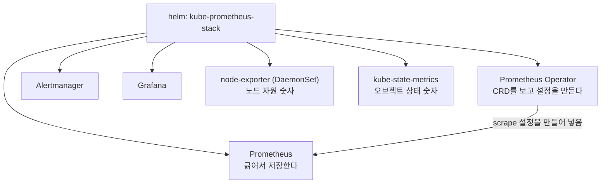
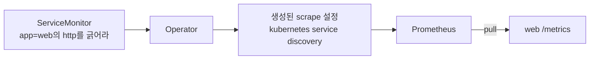

# 4. Prometheus 수집 — 스택을 어떻게 올리고 무엇을 scrape하는가

수집을 직접 운영하려면 Prometheus 하나로는 부족합니다. 노드 자원을 내보낼 exporter, 쿠버네티스 오브젝트 상태를 숫자로 바꿀 변환기, 타깃을 자동으로 찾아 설정을 만들어 줄 컨트롤러, 그리고 그 모든 설정의 표준 묶음이 함께 있어야 합니다. kube-prometheus-stack은 이 부품들을 Helm 한 번으로 깔아 줍니다. 이 편은 그 스택을 올리고, 설치 직후 **무엇을 긁고 있는지**(클러스터 자신 — apiserver·kubelet·node-exporter…)를 확인한 뒤, **내 앱을 타깃으로 추가**합니다. 핵심은 타깃 주소를 어디에도 적지 않는다는 점입니다 — ServiceMonitor로 "이 Service를 긁어라"라고 선언만 하면 Operator가 scrape 설정을 대신 만듭니다. 이 편의 산출물은 "kube-prometheus-stack을 올려 기본 scrape 대상과 `up`을 확인한 상태"와 "ServiceMonitor 한 장으로 내 앱이 자동 발견되어 긁히는 것을, Operator가 생성한 scrape 설정까지 직접 본 경험"입니다.

## 핵심 다이어그램





- **스택 하나가 수집 부품을 다 깐다.** Operator·Prometheus·Alertmanager·Grafana에 더해, 노드 자원을 내보내는 node-exporter(노드마다 도는 DaemonSet)와 쿠버네티스 오브젝트 상태(Deployment replica 수, Pod 상태…)를 숫자로 바꾸는 kube-state-metrics가 함께 들어온다.
- **설치 직후부터 클러스터 자신을 긁는다.** apiserver·kubelet·coredns·node-exporter·kube-state-metrics 같은 타깃이 스택이 깔아 둔 ServiceMonitor로 이미 정의돼 있어, 따로 설정하지 않아도 수집이 돈다.
- **정의됐다고 다 긁히는 건 아니다.** 타깃이 정의돼도 그 주소에 도달하지 못하면 `up=0`이다. kind에서는 kube-scheduler·kube-proxy·etcd·controller-manager가 노드 안쪽(localhost)에만 열려 있어 안 긁힌다 — "정의돼 있음"과 "도달 가능함"은 다른 문제다.
- **내 앱은 주소가 아니라 선언으로 붙인다.** ServiceMonitor에 "이 label을 가진 Service의 이 포트를 긁어라"라고 적으면, Operator가 그걸 쿠버네티스 service discovery 기반 scrape 설정으로 바꿔 Prometheus에 넣는다. Prometheus는 긁으면서 namespace·pod·service 같은 토폴로지 label을 자동으로 붙인다.

아래 시연이 이 흐름을 한 줄씩 손으로 확인합니다.

## 사전 준비물

이 실습은 **macOS** 환경을 기준으로 합니다.

- **Docker** — Docker Desktop, OrbStack 등. `docker ps`가 에러 없이 돌아가면 OK.
- **Homebrew** — macOS 패키지 관리자.

### kind · kubectl · helm 설치

```bash
brew install kind kubectl helm
```

### rosa-lab 클러스터 · namespace 준비

```bash
kind create cluster --name rosa-lab
kubectl create namespace rosa-lab
kubectl config set-context --current --namespace=rosa-lab
```

이미 있으면 건너뜁니다 (`kind get clusters`, `kubectl config get-contexts`로 확인).

## 스택 설치

Helm 레포를 더하고 kube-prometheus-stack을 `monitoring` namespace에 올립니다. 릴리스 이름은 `monitoring`으로 둡니다 — 뒤에서 Service·ServiceMonitor 이름이 이 릴리스 이름을 따릅니다.

```bash
helm repo add prometheus-community https://prometheus-community.github.io/helm-charts
helm repo update
helm install monitoring prometheus-community/kube-prometheus-stack \
  --version 87.3.0 \
  -n monitoring --create-namespace
```

```
NAMESPACE: monitoring
STATUS: deployed
REVISION: 1
NOTES:
kube-prometheus-stack has been installed. Check its status by running:
  kubectl --namespace monitoring get pods -l "release=monitoring"
```

이미지 받고 Pod가 다 뜰 때까지 1~3분 걸립니다. 준비를 기다립니다.

```bash
kubectl wait --for=condition=Ready pod --all -n monitoring --timeout=300s
```

## 실습 환경

| 파일 | 내용 |
|---|---|
| `manifests/app.yaml` | `prometheus-example-app` Deployment + Service. Service에 `app=web` label과 이름 있는 포트 `http`를 둔다 |
| `manifests/servicemonitor.yaml` | ServiceMonitor 한 장. "app=web Service의 http 포트를 긁어라"를 선언한다 |

## 여기서 직접 확인할 수 있는 것

### 스택이 올린 것

설치가 깐 Pod들을 봅니다.

```bash
kubectl get pods -n monitoring
```

```
NAME                                                     READY   STATUS    RESTARTS   AGE
alertmanager-monitoring-kube-prometheus-alertmanager-0   2/2     Running   0          69s
monitoring-grafana-5c45cddbbd-tbxrt                      3/3     Running   0          83s
monitoring-kube-prometheus-operator-646d749967-wvnxk     1/1     Running   0          83s
monitoring-kube-state-metrics-559db896bf-nfkqs           1/1     Running   0          83s
monitoring-prometheus-node-exporter-7sghv                1/1     Running   0          83s
prometheus-monitoring-kube-prometheus-prometheus-0       2/2     Running   0          70s
```

Operator·Prometheus·Alertmanager·Grafana·kube-state-metrics는 Deployment/StatefulSet으로 하나씩, node-exporter는 노드마다 도는 DaemonSet(여기선 노드 1개라 1개)입니다.

### 기본으로 무엇을 긁고 있는가

Prometheus에 붙어 어떤 job들이 실제로 긁히는지(`up==1`) 봅니다.

```bash
kubectl port-forward -n monitoring svc/monitoring-kube-prometheus-prometheus 9090:9090 >/dev/null 2>&1 &
sleep 7
curl -s -G 'http://localhost:9090/api/v1/query' --data-urlencode 'query=count by(job)(up==1)' \
  | python3 -c "import sys,json; rows=json.load(sys.stdin)['data']['result']; [print(r['metric'].get('job')) for r in sorted(rows, key=lambda r:r['metric'].get('job',''))]"
```

```
apiserver
coredns
kube-state-metrics
kubelet
monitoring-grafana
monitoring-kube-prometheus-alertmanager
monitoring-kube-prometheus-operator
monitoring-kube-prometheus-prometheus
node-exporter
```

내 앱은 하나도 없는데 이미 클러스터의 핵심 컴포넌트가 다 긁히고 있습니다. 이 타깃들은 스택이 함께 깐 ServiceMonitor가 정의한 것입니다. 반대로, 정의는 됐지만 안 긁히는 것(`up==0`)도 봅니다.

```bash
curl -s -G 'http://localhost:9090/api/v1/query' --data-urlencode 'query=up==0' \
  | python3 -c "import sys,json; rows=json.load(sys.stdin)['data']['result']; [print(r['metric'].get('job')) for r in sorted(rows, key=lambda r:r['metric'].get('job',''))]"
```

```
kube-controller-manager
kube-etcd
kube-proxy
kube-scheduler
```

이 control-plane 컴포넌트들은 kind에서 노드 안쪽 주소(localhost)에만 metric을 열어, 스택의 타깃 정의는 있어도 Prometheus가 도달하지 못해 `up=0`입니다. 타깃 목록에 있다는 것과 실제로 긁힌다는 것은 별개임이 여기서 드러납니다.

### 내 앱을 타깃으로 추가 — ServiceMonitor

이제 내 앱을 붙입니다. 앱과, 그 앱을 긁으라는 ServiceMonitor를 올리고 트래픽을 조금 흘려보냅니다.

```bash
kubectl apply -f manifests/app.yaml
kubectl apply -f manifests/servicemonitor.yaml
kubectl rollout status deploy/web -n rosa-lab
WEB=$(kubectl get pod -n rosa-lab -l app=web -o jsonpath='{.items[0].metadata.name}')
kubectl exec -n rosa-lab "$WEB" -- sh -c 'for i in $(seq 1 17); do wget -qO- localhost:8080/ >/dev/null; done'
```

ServiceMonitor를 Operator가 읽어 설정을 만들고 Prometheus가 그 설정을 다시 읽기까지 몇십 초 걸립니다. 잠시 기다린 뒤 내 앱 타깃을 확인합니다(비어 있으면 조금 더 기다렸다 다시 실행).

```bash
sleep 30
curl -s -G 'http://localhost:9090/api/v1/query' --data-urlencode 'query=up{namespace="rosa-lab"}' \
  | python3 -c "import sys,json; rows=json.load(sys.stdin)['data']['result']; print('(아직 없음 — 다시 시도)' if not rows else ''); [print('job=%s service=%s namespace=%s => %s'%(r['metric'].get('job'),r['metric'].get('service'),r['metric'].get('namespace'),r['value'][1])) for r in rows]"
```

```
job=web service=web namespace=rosa-lab => 1
```

`up{job="web"}=1` — 내 앱이 긁히고 있습니다. 긁힌 metric을 봅니다.

```bash
curl -s -G 'http://localhost:9090/api/v1/query' --data-urlencode 'query=http_requests_total{namespace="rosa-lab"}' \
  | python3 -c "import sys,json; rows=json.load(sys.stdin)['data']['result']; [print(r['metric'],'=>',r['value'][1]) for r in rows]"
```

```
{'__name__': 'http_requests_total', 'code': '200', 'container': 'app', 'endpoint': 'http', 'instance': '10.244.0.15:8080', 'job': 'web', 'method': 'get', 'namespace': 'rosa-lab', 'pod': 'web-76dbb484c8-zmgqh', 'service': 'web'} => 17
```

앱이 내보낸 label은 `code`·`method`뿐인데, `namespace`·`pod`·`service`·`container`·`endpoint`·`instance`·`job`이 더 붙어 있습니다. 이건 Prometheus가 쿠버네티스 service discovery로 긁으면서 붙인 **토폴로지 label**입니다 — 이 숫자가 어느 namespace의 어느 Pod 것인지가 자동으로 따라옵니다.

### 주소를 안 적었는데 어떻게 긁히나 — Operator가 만든 설정

ServiceMonitor 어디에도 IP나 호스트를 적지 않았습니다. Operator가 그 선언을 실제 scrape 설정으로 바꿔 Prometheus의 설정에 넣었습니다. 그 설정은 Operator가 관리하는 Secret 안에 압축돼 있습니다. 내 앱 부분만 꺼내 봅니다.

```bash
kubectl get secret -n monitoring prometheus-monitoring-kube-prometheus-prometheus \
  -o jsonpath='{.data.prometheus\.yaml\.gz}' | base64 -d | gunzip \
  | grep -A8 'job_name: serviceMonitor/rosa-lab/web'
```

```
- job_name: serviceMonitor/rosa-lab/web/0
  honor_labels: false
  kubernetes_sd_configs:
  - role: endpoints
    namespaces:
      names:
      - rosa-lab
  scrape_interval: 5s
```

`static_configs`에 박힌 주소가 아니라 `kubernetes_sd_configs`(role: endpoints)입니다 — Prometheus가 쿠버네티스 API에 "rosa-lab namespace의 endpoint를 찾아라"라고 물어 타깃을 동적으로 알아냅니다. `scrape_interval: 5s`는 ServiceMonitor에 적은 값 그대로입니다. Service 뒤의 Pod가 늘거나 줄면 타깃도 자동으로 따라 바뀝니다. 그래서 ServiceMonitor가 주소를 적지 않고도 동작합니다 — 주소는 Operator가 만든 이 설정과 쿠버네티스 발견이 채웁니다.

### 정리

내 앱과 ServiceMonitor를 지우고 스택을 제거합니다.

```bash
pkill -f "port-forward.*monitoring" 2>/dev/null
kubectl delete -f manifests/servicemonitor.yaml --ignore-not-found
kubectl delete -f manifests/app.yaml --ignore-not-found
helm uninstall monitoring -n monitoring
kubectl delete namespace monitoring --ignore-not-found
```

helm uninstall은 차트가 깐 CRD(ServiceMonitor 등)는 남겨 둡니다. 끝까지 비우려면:

```bash
kubectl get crd -o name | grep monitoring.coreos.com | xargs -r kubectl delete
```

클러스터까지 정리하려면:

```bash
kind delete cluster --name rosa-lab
```

## 이 편의 산출물

- kube-prometheus-stack을 Helm으로 올려, 스택이 Operator·Prometheus·Alertmanager·Grafana·node-exporter·kube-state-metrics를 한 번에 깐다는 것을 확인한 상태.
- 설치 직후부터 **클러스터 자신**(apiserver·kubelet·coredns·node-exporter·kube-state-metrics…)이 긁히고 있음을 `up==1`로 보고, 동시에 kind에서 control-plane 일부가 `up=0`임을 확인해 **"타깃 정의"와 "도달 가능"이 별개**임을 가른 경험.
- ServiceMonitor 한 장으로 내 앱이 자동 발견되어 `up{job="web"}=1`로 긁히고, Prometheus가 `namespace`·`pod`·`service` 같은 **토폴로지 label**을 붙이는 것을 확인한 것.
- Operator가 ServiceMonitor를 `kubernetes_sd_configs`(role: endpoints) 기반 scrape 설정으로 변환해 Prometheus에 넣는다는 것을, 생성된 설정을 직접 꺼내 본 경험 — 주소를 적지 않고 선언만으로 수집이 붙는 이유.
