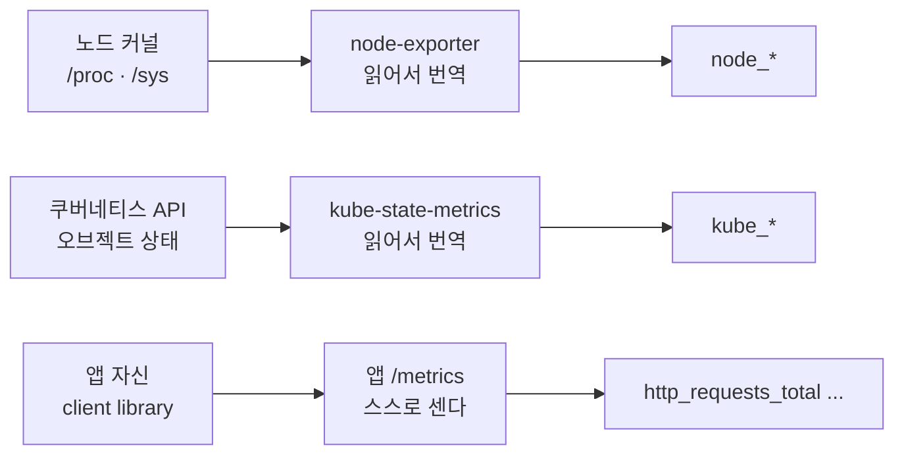
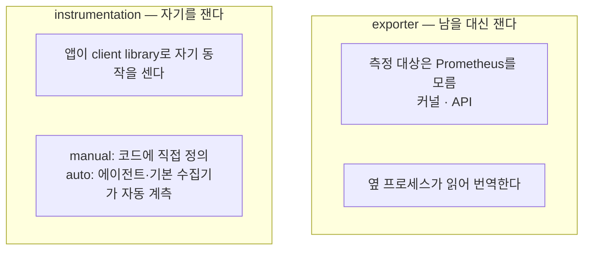

# 5. exporter·instrumentation — 노드·k8s·내 앱의 숫자는 어디서 나오는가

Prometheus는 `/metrics`를 긁어 갈 뿐, 그 숫자를 만들지 않습니다. 그렇다면 노드의 CPU·메모리, Deployment의 replica 수, 내 앱의 요청 수 — 이 숫자들은 각각 누가 만들어 어디에 내놓는 걸까요. 출처는 셋으로 갈립니다. 노드 자원은 커널의 `/proc`·`/sys`를 읽어 번역하는 **node-exporter**가, 쿠버네티스 오브젝트 상태는 API를 읽어 번역하는 **kube-state-metrics**가 냅니다 — 둘 다 측정 대상(커널·API)이 Prometheus를 모르는 채 옆에서 대신 재는 **exporter**입니다. 반면 "이 앱이 요청을 몇 건 처리했나" 같은 건 앱 자신만 알고, 앱이 client library로 스스로 세어 내놓습니다 — 이게 **instrumentation**이고, 그 안에서 코드에 직접 쓰는 manual과 에이전트가 자동으로 붙는 auto가 갈립니다. 이 편의 산출물은 "세 출처(node-exporter·kube-state-metrics·앱 자신)를 각각 직접 읽고, kube-state-metrics가 API 상태를 비추는 거울임을 replica 변경으로 확인한 상태"와 "exporter와 instrumentation, manual과 auto 계측의 경계를 한 화면의 `/metrics`로 가른 경험"입니다.

## 핵심 다이어그램





- **노드 자원은 node-exporter가 낸다.** CPU·메모리·디스크는 커널이 `/proc`·`/sys`에 들고 있고, node-exporter가 그걸 읽어 `node_*` metric으로 번역한다. 노드는 자기가 측정당하는지 모른다.
- **쿠버네티스 오브젝트 상태는 kube-state-metrics가 낸다.** Deployment의 replica 수, Pod의 phase 같은 상태를 API에서 list/watch해 `kube_*`로 번역한다. 오브젝트가 바뀌면 metric도 따라 바뀐다 — 자기가 세는 게 아니라 API를 비추는 거울이다.
- **내 앱 숫자는 앱이 스스로 낸다.** "요청 몇 건, 어떤 코드로 끝났나"는 앱만 안다. 앱이 client library로 자기 동작을 세어 `/metrics`로 내놓는 게 instrumentation이고, 이건 옆 프로세스가 대신 못 한다.
- **계측에는 manual과 auto가 있다.** manual은 개발자가 코드에 counter를 정의하고 증가시키는 것, auto는 에이전트·SDK(또는 client library의 기본 수집기)가 알려진 런타임·프레임워크를 코드 수정 없이 자동으로 계측하는 것이다.

아래 시연이 세 출처를 한 줄씩 손으로 확인합니다.

## 사전 준비물

이 실습은 **macOS** 환경을 기준으로 합니다.

- **Docker** — Docker Desktop, OrbStack 등. `docker ps`가 에러 없이 돌아가면 OK.
- **Homebrew** — macOS 패키지 관리자.

### kind · kubectl 설치

```bash
brew install kind kubectl
```

### rosa-lab 클러스터 · namespace 준비

```bash
kind create cluster --name rosa-lab
kubectl create namespace rosa-lab
kubectl config set-context --current --namespace=rosa-lab
```

이미 있으면 건너뜁니다 (`kind get clusters`, `kubectl config get-contexts`로 확인).

## 실습 환경

| 파일 | 내용 |
|---|---|
| `manifests/node-exporter.yaml` | node-exporter DaemonSet. 노드의 `/proc`·`/sys`를 읽어 `node_*`를 낸다 |
| `manifests/kube-state-metrics.yaml` | kube-state-metrics + RBAC + Service. API를 읽어 `kube_*`를 낸다 |
| `manifests/app.yaml` | `prometheus-example-app` Deployment(replicas 2) + Service. 자기를 계측해 도메인 metric을 낸다 |

```bash
kubectl apply -f manifests/node-exporter.yaml
kubectl apply -f manifests/kube-state-metrics.yaml
kubectl apply -f manifests/app.yaml
kubectl rollout status ds/node-exporter -n rosa-lab
kubectl rollout status deploy/kube-state-metrics -n rosa-lab
kubectl rollout status deploy/web -n rosa-lab
```

## 여기서 직접 확인할 수 있는 것

### 노드 숫자 — node-exporter가 커널을 읽는다

node-exporter에 붙어 노드 자원 metric을 읽습니다.

```bash
kubectl port-forward -n rosa-lab ds/node-exporter 9100:9100 >/dev/null 2>&1 &
sleep 4
curl -s localhost:9100/metrics | grep -E '^node_cpu_seconds_total\{cpu="0",mode="(idle|system|user)"'
```

```
node_cpu_seconds_total{cpu="0",mode="idle"} 25674.71
node_cpu_seconds_total{cpu="0",mode="system"} 212.3
node_cpu_seconds_total{cpu="0",mode="user"} 480.53
```

`/proc/stat`이 들고 있는 CPU 시간이 `node_cpu_seconds_total`로 나왔습니다(값은 환경마다 다릅니다). 디스크 여유도 같은 방식입니다.

```bash
curl -s localhost:9100/metrics | grep '^node_filesystem_avail_bytes{' | head -2
```

```
node_filesystem_avail_bytes{device="/dev/vda1",device_error="",fstype="ext4",mountpoint="/etc/hostname"} 2.19773431808e+11
node_filesystem_avail_bytes{device="/dev/vda1",device_error="",fstype="ext4",mountpoint="/etc/hosts"} 2.19773431808e+11
```

이 숫자들은 node-exporter가 만든 게 아니라 커널이 들고 있던 걸 읽어 번역한 것입니다. node-exporter는 `/metrics`에 런타임 숫자도 함께 냅니다.

```bash
curl -s localhost:9100/metrics | grep -E '^(go_goroutines |process_resident_memory_bytes |process_cpu_seconds_total )'
```

```
go_goroutines 9
process_cpu_seconds_total 0.11
process_resident_memory_bytes 1.9386368e+07
```

`go_goroutines`·`process_*`는 node-exporter 개발자가 한 줄도 안 쓴 숫자입니다 — client library의 기본 수집기가 런타임에서 자동으로 채운 것입니다. 이 "자동으로 따라오는 metric"이 뒤에서 auto 계측을 가릅니다.

### 쿠버네티스 오브젝트 숫자 — kube-state-metrics가 API를 읽는다

kube-state-metrics에 붙어 방금 띄운 `web` Deployment의 상태를 읽습니다. replicas는 2로 띄웠습니다.

```bash
kubectl port-forward -n rosa-lab svc/kube-state-metrics 8080:8080 >/dev/null 2>&1 &
sleep 4
curl -s localhost:8080/metrics | grep -E '^kube_deployment_(spec_replicas|status_replicas_available)\{[^}]*deployment="web"'
```

```
kube_deployment_status_replicas_available{namespace="rosa-lab",deployment="web"} 2
kube_deployment_spec_replicas{namespace="rosa-lab",deployment="web"} 2
```

`spec_replicas`(원하는 수)도 2, `status_replicas_available`(실제 가용 수)도 2입니다. 이게 정말 API를 비추는 거울인지, replica를 바꿔 봅니다.

```bash
kubectl scale deploy/web -n rosa-lab --replicas=4
kubectl rollout status deploy/web -n rosa-lab
sleep 3
curl -s localhost:8080/metrics | grep -E '^kube_deployment_(spec_replicas|status_replicas_available)\{[^}]*deployment="web"'
```

```
kube_deployment_status_replicas_available{namespace="rosa-lab",deployment="web"} 4
kube_deployment_spec_replicas{namespace="rosa-lab",deployment="web"} 4
```

둘 다 4로 따라 올라갔습니다. kube-state-metrics는 어떤 횟수를 누적해 세는 게 아니라, API의 오브젝트 상태를 매번 그대로 비춥니다. 그래서 `kubectl scale` 한 번이 곧 metric 변화로 나타납니다.

### 내 앱 숫자 — 앱이 자기를 계측한다

앱에 요청을 흘려보내고, 앱이 스스로 낸 metric을 읽습니다.

```bash
WEB=$(kubectl get pod -n rosa-lab -l app=web -o jsonpath='{.items[0].metadata.name}')
kubectl exec -n rosa-lab "$WEB" -- sh -c 'for i in $(seq 1 12); do wget -qO- localhost:8080/ >/dev/null; done'
kubectl exec -n rosa-lab "$WEB" -- wget -qO- localhost:8080/metrics | grep -E '^(# TYPE http_requests_total|http_requests_total)'
```

```
# TYPE http_requests_total counter
http_requests_total{code="200",method="get"} 12
```

`http_requests_total`은 이 앱의 개발자가 코드에 직접 정의하고 요청마다 증가시키는 counter입니다(manual instrumentation). node-exporter나 kube-state-metrics가 대신 낼 수 없는 숫자입니다 — "이 앱이 요청을 처리했다"는 앱 안에서만 일어나는 일이니까요. 그런데 이 앱의 `/metrics`에는 아까 node-exporter엔 있던 런타임 숫자가 없습니다.

```bash
kubectl exec -n rosa-lab "$WEB" -- wget -qO- localhost:8080/metrics | grep -cE '^(go_|process_)'
```

```
0
```

`go_*`·`process_*`가 한 줄도 없습니다. 이 앱이 무엇을 내는지 전부 봅니다.

```bash
kubectl exec -n rosa-lab "$WEB" -- wget -qO- localhost:8080/metrics | grep '^# TYPE'
```

```
# TYPE http_request_duration_seconds histogram
# TYPE http_requests_total counter
# TYPE version gauge
```

개발자가 등록한 세 가지(요청 수·요청 시간·버전)뿐입니다. 같은 Go로 짠 node-exporter는 런타임 수집기를 켜서 `go_*`를 자동으로 냈지만, 이 앱은 그걸 등록하지 않아 자기가 정의한 것만 냅니다. **`/metrics`에 무엇이 나오는지는 선택의 결과입니다** — 직접 쓴 manual metric에, 자동으로 따라오는 auto 계층을 얼마나 켜느냐의 합입니다.

### auto와 manual — 어디까지 자동이고 어디부터 손인가

방금 본 두 앱의 차이가 그대로 auto와 manual의 경계입니다.

- **auto**: node-exporter의 `go_*`·`process_*`는 아무도 per-metric 코드를 안 썼는데 나왔습니다. 실무의 auto 계측은 여기서 더 나아가, OpenTelemetry 에이전트·SDK가 Spring Boot·Node.js·Python 같은 앱에 붙어 **HTTP 요청 시간(경로별)·DB 호출·GC 같은 표준 metric을 코드 수정 없이** 내보냅니다. 프레임워크가 하는 일은 에이전트가 알아서 잽니다.
- **manual**: "주문이 완료됐다", "장바구니에 담긴 항목 수", "결제 실패 사유" 같은 건 프레임워크가 모릅니다. 앱의 비즈니스 의미라서, 개발자가 client library로 직접 counter·gauge를 정의하고 그 자리에 증가 코드를 넣어야 합니다.

| | auto (에이전트·기본 수집기) | manual (코드에 직접) |
|---|---|---|
| 코드 수정 | 없음 | 있음 |
| 나오는 것 | 표준 런타임·프레임워크 metric(HTTP·GC·DB) | 도메인 metric(주문·결제·큐 깊이) |
| 강점 | 빠르게 붙고 이름이 일관됨 | 비즈니스 의미를 정확히 잰다 |
| 한계 | 앱만 아는 사건은 못 잰다 | 잴 지점마다 직접 써야 한다 |

실무 선택은 둘 중 하나가 아니라 합입니다 — 프레임워크·런타임은 auto로 빠르게 덮고, 비즈니스 핵심 지표는 manual로 더합니다.

| | exporter | instrumentation |
|---|---|---|
| 누가 재나 | 옆 프로세스가 남을 잰다 | 앱이 자기를 잰다 |
| 대상이 Prometheus를 아나 | 모른다(커널·API) | 안다(스스로 노출) |
| 예 | node-exporter, kube-state-metrics | `http_requests_total` |
| 못 재는 것 | 앱 내부의 의미(주문 완료) | 앱 밖의 자원(노드 CPU는 exporter가) |

### 정리

```bash
pkill -f "port-forward.*rosa-lab" 2>/dev/null
kubectl delete -f manifests/app.yaml --ignore-not-found
kubectl delete -f manifests/kube-state-metrics.yaml --ignore-not-found
kubectl delete -f manifests/node-exporter.yaml --ignore-not-found
```

클러스터까지 정리하려면:

```bash
kind delete cluster --name rosa-lab
```

## 이 편의 산출물

- 같은 클러스터에서 세 출처를 각각 직접 읽어 본 경험 — 노드 자원은 **node-exporter**가 `/proc`·`/sys`를, 오브젝트 상태는 **kube-state-metrics**가 API를, 도메인 숫자는 **앱 자신**이 client library를 통해 낸다는 것.
- kube-state-metrics가 누적 계수기가 아니라 **API 상태를 비추는 거울**임을, `kubectl scale`로 replica를 2→4로 바꿔 `kube_deployment_*`가 그대로 따라 바뀌는 것으로 확인한 것.
- **exporter**(측정 대상은 Prometheus를 모르고 옆 프로세스가 대신 잰다)와 **instrumentation**(앱이 자기를 잰다)의 경계, 그리고 각자가 못 재는 영역(exporter는 앱 내부 의미를, instrumentation은 앱 밖 자원을)을 가른 상태.
- 한 앱의 `/metrics`에 무엇이 나오는지가 **manual(직접 쓴 도메인 metric) + auto(자동으로 따라오는 런타임·프레임워크 metric)** 의 합임을, node-exporter엔 있고 example-app엔 없는 `go_*`/`process_*`의 대비로 확인하고, 실무에선 둘을 합쳐 쓴다는 기준을 잡은 것.
