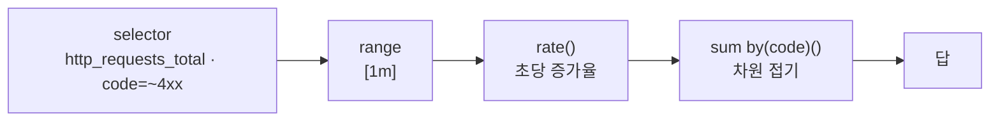
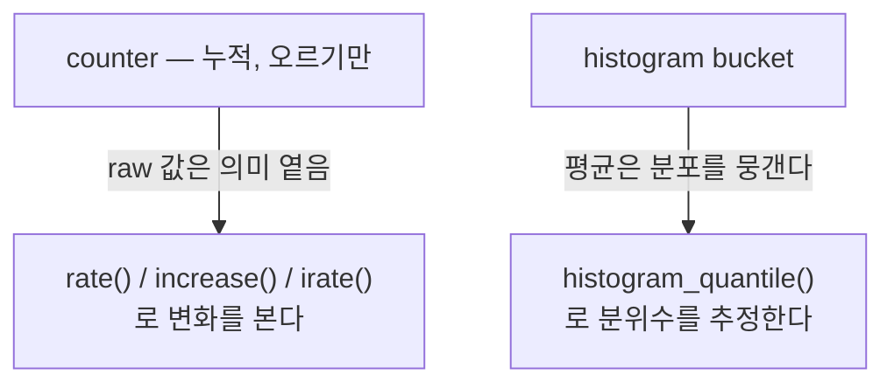

# 6. PromQL — 시계열을 어떻게 묻는가

Prometheus에 숫자가 쌓여 있어도, 물을 줄 모르면 답이 안 나옵니다. `http_requests_total`의 값 13878은 그 자체로는 거의 쓸모가 없습니다 — counter는 누적값이라 "지금까지 다 합쳐서 13878"일 뿐이고, 정작 알고 싶은 건 "초당 몇 건 들어오나", "그중 에러는 몇 %인가", "느린 10%는 얼마나 느린가"입니다. PromQL은 그런 질문을 시계열에 던지는 언어입니다. 이 편은 selector로 시계열을 고르고, counter를 `rate()`로 변화율로 바꾸고, `by()`로 집계하고, latency를 `histogram_quantile()`로 분위수로 읽고, 두 시계열을 나눌 때 vector matching이 어떻게 작동하는지를 살아 있는 데이터에 직접 쿼리합니다. 이 편의 산출물은 "counter는 raw가 아니라 `rate()`로, latency는 평균이 아니라 `histogram_quantile()`로 읽는다는 두 기준을 손으로 확인한 상태"와 "`rate`/`increase`/`irate`의 차이, 그리고 `on()`·`group_left()` 같은 vector matching을 비율 쿼리로 직접 돌려 본 경험"입니다.

## 핵심 다이어그램





- **PromQL의 기본 단위는 벡터다.** instant vector는 한 시점의 시계열 값들, range vector는 구간(`[5m]`)의 샘플 묶음, scalar는 숫자 하나다. 함수마다 받는 입력이 정해져 있다 — `rate()`는 range vector를 받는다.
- **counter는 raw 값으로 읽지 않는다.** 누적값이라 절대 숫자는 의미가 옅고, `rate()`(초당 평균 증가율)·`increase()`(구간 총 증가량)·`irate()`(마지막 두 점의 순간 변화율)로 변화를 본다. 셋 다 counter 리셋(재시작 시 0으로 떨어짐)을 알아서 보정한다.
- **aggregation은 차원을 접는다.** `sum`·`avg`·`max`·`min`·`count`를 `by()`(남길 label)나 `without()`(뺄 label)와 함께 써, 여러 시계열을 원하는 단위로 합친다.
- **latency는 평균이 아니라 분위수로 본다.** 평균은 분포를 한 숫자로 뭉개 느린 꼬리를 가린다. `histogram_quantile()`은 bucket 분포에서 p90 같은 분위수를 추정한다.
- **두 시계열을 나눌 땐 vector matching이 작동한다.** 양쪽 label이 같으면 자동 1:1 매칭, 다르면 `on()`·`ignoring()`으로 매칭 기준을 정하고 `group_left()`로 다대일을 연결한다.

아래 시연이 이 질문들을 한 줄씩 손으로 확인합니다.

## 사전 준비물

이 실습은 **macOS** 환경을 기준으로 합니다.

- **Docker** — Docker Desktop, OrbStack 등. `docker ps`가 에러 없이 돌아가면 OK.
- **Homebrew** — macOS 패키지 관리자.

### kind · kubectl 설치

```bash
brew install kind kubectl
```

### rosa-lab 클러스터 · namespace 준비

```bash
kind create cluster --name rosa-lab
kubectl create namespace rosa-lab
kubectl config set-context --current --namespace=rosa-lab
```

이미 있으면 건너뜁니다 (`kind get clusters`, `kubectl config get-contexts`로 확인).

## 실습 환경

| 파일 | 내용 |
|---|---|
| `manifests/stack.yaml` | `web`(counter·histogram 노출) + `prometheus`(5초 scrape) + `load`(약 10% 에러율로 끊임없이 호출). PromQL을 물어볼 시계열을 만든다 |

```bash
kubectl apply -f manifests/stack.yaml
kubectl rollout status deploy/web -n rosa-lab
kubectl rollout status deploy/prometheus -n rosa-lab
kubectl rollout status deploy/load -n rosa-lab
```

`rate`·`increase`가 의미 있는 답을 내려면 데이터가 2분쯤 쌓여야 합니다. Prometheus에 port-forward로 붙고, 닿는지부터 확인합니다.

```bash
kubectl port-forward -n rosa-lab svc/prometheus 9090:9090 >/dev/null 2>&1 &
sleep 5
curl -s localhost:9090/-/ready
```

```
Prometheus Server is Ready.
```

이 한 줄이 안 나오고 비어 있으면 port-forward가 안 떠 있는 것입니다(아래 쿼리가 전부 빈 응답이 됩니다). 다시 띄운 뒤 진행합니다. 이제 쿼리를 보내 결과만 추려 출력하는 헬퍼를 준비합니다. 빈 응답·쿼리 에러·빈 결과를 구분해 알려 줍니다.

```bash
promql() {
  curl -s -G localhost:9090/api/v1/query --data-urlencode "query=$1" | python3 -c "
import sys, json
raw = sys.stdin.read()
if not raw.strip():
    print('응답이 비었습니다 — port-forward가 떠 있는지 확인하세요'); sys.exit(0)
try:
    d = json.loads(raw)
except ValueError:
    print('JSON이 아닙니다:', raw[:200]); sys.exit(0)
if d.get('status') != 'success':
    print('쿼리 에러:', d.get('error', '?')); sys.exit(0)
res = d['data']['result']
if not res:
    print('(빈 결과)'); sys.exit(0)
for r in res:
    v = r['value'][1]
    try:
        f = float(v); v = int(f) if f == int(f) else round(f, 6)
    except ValueError:
        pass
    print(r['metric'], '=>', v)
"
}
```

## 여기서 직접 확인할 수 있는 것

아래 값들은 살아 있는 부하에서 나온 실제 결과라 절대 숫자(누적 counter 등)는 시점마다 다릅니다. 흐름이 안정적이라 초당 비율·에러율은 거의 일정합니다.

### selector — 어떤 시계열을 고르나

이름만 쓰면 그 이름의 모든 시계열이 나옵니다(instant vector).

```bash
promql 'http_requests_total'
```

```
{'__name__': 'http_requests_total', 'code': '200', 'instance': 'web:8080', 'job': 'web', 'method': 'get'} => 13878
{'__name__': 'http_requests_total', 'code': '404', 'instance': 'web:8080', 'job': 'web', 'method': 'get'} => 1542
```

`code`가 달라 두 시계열입니다. label matcher로 좁힙니다 — `=`(같다)·`!=`(다르다)·`=~`(정규식 매치)·`!~`(정규식 불일치).

```bash
promql 'http_requests_total{code=~"4.."}'
```

```
{'__name__': 'http_requests_total', 'code': '404', 'instance': 'web:8080', 'job': 'web', 'method': 'get'} => 1542
```

`code=~"4.."`로 4xx만 골랐습니다. 여기에 `[1m]` 같은 구간을 붙이면 한 시점 값이 아니라 그 구간의 샘플 묶음(range vector)이 되고, `rate()` 같은 함수가 그걸 받습니다.

### counter — raw가 아니라 rate로 읽는다

위 13878은 "이 Pod가 뜬 뒤 누적된 전체"라 그 자체로는 트래픽을 말해 주지 못합니다. `rate()`로 초당 증가율을 봅니다.

```bash
promql 'rate(http_requests_total[1m])'
```

```
{'code': '200', 'instance': 'web:8080', 'job': 'web', 'method': 'get'} => 40.092367
{'code': '404', 'instance': 'web:8080', 'job': 'web', 'method': 'get'} => 4.454707
```

초당 약 40건(200)과 4.5건(404)이 들어오고 있습니다. 같은 구간의 총 증가량은 `increase()`입니다.

```bash
promql 'increase(http_requests_total[2m])'
```

```
{'code': '200', 'instance': 'web:8080', 'job': 'web', 'method': 'get'} => 4817.990504
{'code': '404', 'instance': 'web:8080', 'job': 'web', 'method': 'get'} => 535.332278
```

`increase`는 사실상 `rate × 구간 초`입니다(정수가 아닌 건 구간 경계를 보정·외삽하기 때문). `rate`/`increase`가 구간 전체를 평균 낸다면, `irate`는 마지막 두 샘플만 봅니다.

```bash
promql 'rate(http_requests_total{code="200"}[1m])'
promql 'irate(http_requests_total{code="200"}[1m])'
```

```
{'code': '200', 'instance': 'web:8080', 'job': 'web', 'method': 'get'} => 40.092367
{'code': '200', 'instance': 'web:8080', 'job': 'web', 'method': 'get'} => 39.623774
```

값이 비슷하지만 의미가 다릅니다. `irate`는 마지막 두 점만 보므로 **순간 변화에 즉각 반응**하지만 그만큼 들쭉날쭉합니다. `rate`는 구간 전체를 평균 내 **노이즈를 누르고 안정적**입니다. 그래서 짧은 스파이크를 잡아낼 땐 `irate`, 대시보드나 판단 기준처럼 흔들리면 곤란한 곳엔 `rate`를 더 자주 씁니다 — 고정 규칙이 아니라 "순간 반응이냐 안정성이냐"의 선택입니다.

### aggregation — 차원을 접는다

`rate()` 결과는 시계열마다 하나씩입니다. `by()`로 원하는 label만 남겨 합칩니다.

```bash
promql 'sum by(code)(rate(http_requests_total[1m]))'
```

```
{'code': '200'} => 40.092367
{'code': '404'} => 4.454707
```

`instance`·`job` 같은 다른 label은 접히고 `code`만 남았습니다. label을 다 접으면 전체 초당 요청 수입니다.

```bash
promql 'sum(rate(http_requests_total[1m]))'
```

```
{} => 44.547074
```

`by(...)`가 "남길 label"을 고른다면, `without(...)`은 "뺄 label"을 고릅니다. `sum` 자리에 `avg`·`max`·`min`·`count`도 같은 방식으로 들어갑니다.

### latency — 평균이 아니라 histogram_quantile

응답시간의 평균은 두 시계열을 나눠 구합니다 — 누적 시간 합의 증가율을, 요청 수의 증가율로.

```bash
promql 'rate(http_request_duration_seconds_sum[2m]) / rate(http_request_duration_seconds_count[2m])'
```

```
{'code': '200', 'handler': 'found', 'instance': 'web:8080', 'job': 'web', 'method': 'get'} => 1.7e-05
```

여기서 나눗셈은 양변 label이 똑같아(`code`·`handler`·`method`…) 자동으로 1:1 매칭된 결과입니다. 그런데 이 평균 하나는 "느린 10%가 얼마나 느린가"에는 답하지 못합니다 — 분포를 한 숫자로 뭉갰기 때문입니다. 분위수는 bucket에서 추정합니다.

```bash
promql 'histogram_quantile(0.9, sum by(le)(rate(http_request_duration_seconds_bucket[5m])))'
```

```
{} => 0.0045
```

세 겹으로 읽습니다. 안쪽 `rate(..._bucket[5m])`는 bucket도 counter이므로 초당 증가율로 바꾸고, `sum by(le)(...)`는 여러 시계열을 `le`(bucket 경계)만 남겨 합치고, 바깥 `histogram_quantile(0.9, ...)`는 그 bucket 곡선에서 p90을 추정합니다. **latency를 물을 땐 `avg`가 아니라 이 형태가 기본**입니다. 다만 이 실습의 요청은 전부 첫 bucket(≤5ms) 안에서 끝나서, 추정값은 그 bucket 안을 선형으로 채운 위치(0.0045s)이고 평균(0.000017s)이 실제 평균에 가깝습니다 — 추정의 정밀도는 bucket 경계가 어디 있느냐를 따라갑니다. 쿼리의 형태가 핵심이고, 값의 정밀도는 bucket 설계의 몫입니다.

### vector matching — 두 시계열을 나눌 때

에러율은 4xx의 비율을 전체로 나눈 값입니다. 양변을 label 없이(`{}`) 집계했으니 단일 값 / 단일 값입니다.

```bash
promql 'sum(rate(http_requests_total{code=~"4.."}[2m])) / sum(rate(http_requests_total[2m]))'
```

```
{} => 0.1
```

에러율 10%입니다. 이제 양변의 label이 다른 경우를 봅니다 — 각 `code`가 그 `method` 안에서 차지하는 비율.

```bash
promql 'sum by(code,method)(rate(http_requests_total[2m])) / on(method) group_left sum by(method)(rate(http_requests_total[2m]))'
```

```
{'code': '200', 'method': 'get'} => 0.9
{'code': '404', 'method': 'get'} => 0.1
```

왼쪽은 `{code, method}`로 여러 개, 오른쪽은 `{method}`로 하나입니다. label 집합이 다르면 기본 1:1 매칭은 짝을 못 찾습니다. `on(method)`는 "method만 보고 맞춰라", `group_left`는 "왼쪽이 여럿이고 오른쪽이 하나인 다대일이며, 왼쪽의 남는 label(`code`)을 결과에 남겨라"입니다. 결과는 각 code가 그 method 전체에서 차지하는 몫(200은 0.9, 404는 0.1)입니다. `on(...) group_left` 없이 그냥 나누면:

```bash
promql 'sum by(code,method)(rate(http_requests_total[2m])) / sum by(method)(rate(http_requests_total[2m]))'
```

```
(빈 결과)
```

양변 label 집합(`{code,method}` vs `{method}`)이 달라 매칭되는 짝이 하나도 없어 결과가 빕니다. 두 시계열을 나누는데 답이 비면, 거의 항상 label 매칭 문제입니다.

### 정리

```bash
pkill -f "port-forward.*rosa-lab" 2>/dev/null
kubectl delete -f manifests/stack.yaml --ignore-not-found
```

클러스터까지 정리하려면:

```bash
kind delete cluster --name rosa-lab
```

## 이 편의 산출물

- selector(이름·label matcher `=`/`!=`/`=~`/`!~`·range `[5m]`)로 시계열을 고르고, instant vector와 range vector의 차이를 손에 쥔 상태.
- counter를 raw로 읽지 않고 `rate()`(초당 평균)·`increase()`(구간 총량)·`irate()`(순간 변화)로 읽는 것, 그리고 "순간 반응엔 irate, 안정적 판단엔 rate"라는 선택 기준을 직접 비교로 확인한 경험.
- `sum ... by()/without()`로 차원을 접어 "code별 rps", "전체 rps"를 만들어 본 것.
- latency를 `avg`가 아니라 `histogram_quantile(0.9, sum by(le)(rate(_bucket[5m])))`로 읽는 형태와 그 세 겹의 의미를 잡고, 추정 정밀도가 bucket 경계에 달렸음을 본 상태.
- 비율 쿼리에서 **vector matching**이 작동하는 것 — 동일 label은 자동 1:1, 다른 label은 `on()`으로 기준을 정하고 `group_left()`로 다대일을 연결하며, 매칭이 어긋나면 결과가 빈다는 것 — 을 에러율·몫 쿼리로 확인한 경험.
