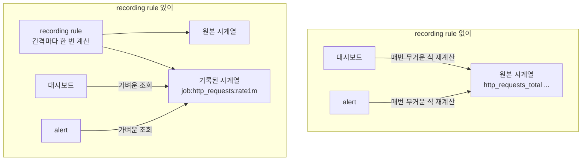

# 7. recording rule — 무거운 쿼리를 미리 계산하기

대시보드 패널 하나, alert 규칙 하나가 `sum by(job)(rate(http_requests_total[1m]))` 같은 식을 쓴다고 합시다. 패널은 새로고침할 때마다, alert는 평가할 때마다 이 식을 수천 개 시계열 위에서 다시 계산합니다. 같은 무거운 계산이 곳곳에서 반복되는 셈입니다. recording rule은 이 식을 Prometheus가 일정 간격마다 **한 번 계산해 새 시계열로 저장**해 두는 장치입니다 — 대시보드도 alert도 그다음부터는 무거운 식을 다시 돌리지 않고 미리 계산된 가벼운 시계열을 읽습니다. 이 편은 recording rule을 등록해, 기록된 metric이 어떤 scrape에서도 오지 않는 새 시계열로 나타나고, 원본 식과 같은 값을 내며, 시간에 걸쳐 저장된다는 것을 직접 확인합니다. 이 편의 산출물은 "무거운 PromQL 식을 recording rule로 미리 계산해 `level:metric:operations` 이름의 새 시계열로 저장한 상태"와 "기록된 metric이 scrape가 아니라 Prometheus 계산에서 나온 저장된 시계열임을, 원본 쿼리·`/api/v1/rules`·`query_range`로 가른 경험"입니다.

## 핵심 다이어그램



- **recording rule은 식을 미리 계산해 저장한다.** `record:`에 새 metric 이름을, `expr:`에 PromQL 식을 적으면, Prometheus가 `evaluation_interval`마다 그 식을 평가해 결과를 그 이름의 시계열로 기록한다.
- **그래서 계산 캐시다.** 무거운 집계를 여러 대시보드·alert가 매번 다시 돌리는 대신, 한 번 계산된 가벼운 시계열을 공유해 읽는다. 원본을 누적해 두는 게 아니라 "자주 묻는 계산"을 미리 해 두는 것이다.
- **기록된 시계열은 어떤 scrape에서도 오지 않는다.** exporter나 앱이 내보내는 게 아니라 Prometheus가 자기 안에서 만들어 낸 새 metric이다.
- **이름은 `level:metric:operations` 관례를 쓴다.** `job:http_requests:rate1m`처럼 — 집계 수준(job)·기반 metric(http_requests)·적용한 연산(rate1m). 콜론(`:`)은 기록 metric의 표식이라, 원본 metric 이름과 섞이지 않는다.

아래 시연이 이 동작을 한 줄씩 손으로 확인합니다.

## 사전 준비물

이 실습은 **macOS** 환경을 기준으로 합니다.

- **Docker** — Docker Desktop, OrbStack 등. `docker ps`가 에러 없이 돌아가면 OK.
- **Homebrew** — macOS 패키지 관리자.

### kind · kubectl 설치

```bash
brew install kind kubectl
```

### rosa-lab 클러스터 · namespace 준비

```bash
kind create cluster --name rosa-lab
kubectl create namespace rosa-lab
kubectl config set-context --current --namespace=rosa-lab
```

이미 있으면 건너뜁니다 (`kind get clusters`, `kubectl config get-contexts`로 확인).

## 실습 환경

| 파일 | 내용 |
|---|---|
| `manifests/stack.yaml` | `web`(counter 노출) + `prometheus`(5초 scrape·5초 평가, `rules.yml`의 recording rule 2개 등록) + `load`(약 10% 에러율 지속 호출) |

```bash
kubectl apply -f manifests/stack.yaml
kubectl rollout status deploy/web -n rosa-lab
kubectl rollout status deploy/prometheus -n rosa-lab
kubectl rollout status deploy/load -n rosa-lab
```

`rate[2m]`까지 의미 있는 값이 나오려면 데이터가 2분쯤 쌓여야 합니다. Prometheus에 붙고 닿는지부터 확인합니다.

```bash
kubectl port-forward -n rosa-lab svc/prometheus 9090:9090 >/dev/null 2>&1 &
sleep 5
curl -s localhost:9090/-/ready
```

```
Prometheus Server is Ready.
```

비어 있으면 port-forward가 안 떠 있는 것입니다. 쿼리 결과만 추려 출력하는 헬퍼를 준비합니다.

```bash
promql() {
  curl -s -G localhost:9090/api/v1/query --data-urlencode "query=$1" | python3 -c "
import sys, json
raw = sys.stdin.read()
if not raw.strip():
    print('응답이 비었습니다 — port-forward가 떠 있는지 확인하세요'); sys.exit(0)
d = json.loads(raw)
if d.get('status') != 'success':
    print('쿼리 에러:', d.get('error', '?')); sys.exit(0)
res = d['data']['result']
if not res:
    print('(빈 결과)'); sys.exit(0)
for r in res:
    v = r['value'][1]
    try:
        f = float(v); v = int(f) if f == int(f) else round(f, 6)
    except ValueError:
        pass
    print(r['metric'], '=>', v)
"
}
```

## 여기서 직접 확인할 수 있는 것

절대 숫자는 살아 있는 부하라 시점마다 다릅니다. 비율은 거의 일정합니다.

### 기록된 metric을 읽는다

룰이 만든 metric 이름을 그대로 묻습니다.

```bash
promql 'job:http_requests:rate1m'
```

```
{'__name__': 'job:http_requests:rate1m', 'job': 'web'} => 44.728086
```

이 값이 정말 그 무거운 식의 결과인지, 원본 식을 지금 직접 돌려 비교합니다.

```bash
promql 'sum by(job)(rate(http_requests_total[1m]))'
```

```
{'job': 'web'} => 44.542215
```

두 값이 거의 같습니다. 미세한 차이는, 기록된 값은 룰이 마지막으로 평가한 순간의 값이고 원본 쿼리는 지금 이 순간 계산한 값이라 평가 시점이 조금 어긋나기 때문입니다 — 같은 식을 추적합니다. 에러율 룰도 마찬가지입니다.

```bash
promql 'job:http_request_errors:ratio_rate2m'
```

```
{'__name__': 'job:http_request_errors:ratio_rate2m', 'job': 'web'} => 0.1
```

대시보드나 alert는 이제 이 한 줄(`job:http_request_errors:ratio_rate2m`)만 읽으면 됩니다 — 매번 두 개의 `rate`와 나눗셈을 다시 계산하지 않고.

### 이 metric은 어디서 왔나 — scrape가 아니라 계산

기록된 이름이 어떤 타깃에서 오는지 metadata를 봅니다. scrape로 들어온 metric이면 타입·도움말이 붙어 있습니다.

```bash
curl -s 'localhost:9090/api/v1/metadata?metric=job:http_requests:rate1m' \
  | python3 -c "import sys,json; print('metadata:', json.load(sys.stdin)['data'])"
```

```
metadata: {}
```

비어 있습니다 — 이 이름을 내보내는 scrape 타깃이 없기 때문입니다. 저장된 metric 이름 전체에서, scrape로 들어온 것과 룰이 만든 것을 갈라 봅니다.

```bash
curl -s 'localhost:9090/api/v1/label/__name__/values' | python3 -c "
import sys,json
names=json.load(sys.stdin)['data']
print('scrape 계열:', [n for n in names if n.startswith('http_requests')])
print('룰이 만든 계열(이름에 : 포함):', [n for n in names if ':' in n])
"
```

```
scrape 계열: ['http_requests_total']
룰이 만든 계열(이름에 : 포함): ['job:http_request_errors:ratio_rate2m', 'job:http_requests:rate1m']
```

앱이 내보낸 건 `http_requests_total` 하나뿐인데, `job:`으로 시작하는 두 계열이 더 있습니다. 이건 Prometheus가 룰로 계산해 만든 새 시계열입니다.

### 룰이 등록됐는지 — /api/v1/rules

Prometheus가 어떤 룰을 들고 평가하는지 확인합니다.

```bash
curl -s localhost:9090/api/v1/rules | python3 -c "
import sys,json
d=json.load(sys.stdin)
for g in d['data']['groups']:
    print('group:', g['name'], '| interval:', g['interval'], 's')
    for r in g['rules']:
        print('  -', r['type'], '|', r['name'], '| health:', r['health'])
        print('     expr:', r['query'])
"
```

```
group: http | interval: 5 s
  - recording | job:http_requests:rate1m | health: ok
     expr: sum by (job) (rate(http_requests_total[1m]))
  - recording | job:http_request_errors:ratio_rate2m | health: ok
     expr: sum by (job) (rate(http_requests_total{code=~"4..|5.."}[2m])) / sum by (job) (rate(http_requests_total[2m]))
```

두 룰 모두 `recording` 타입, `health: ok`이고, 그룹은 5초마다 평가됩니다. 룰의 식에 문법 오류가 있거나 평가에 실패하면 `health`가 `err`로 바뀝니다.

### 일회성이 아니라 저장된 시계열

기록된 값은 한 번 계산되고 버려지는 게 아니라, 평가 때마다 시계열에 쌓입니다. 최근 30초를 10초 간격으로 봅니다.

```bash
END=$(date +%s); START=$((END-30))
curl -s -G localhost:9090/api/v1/query_range \
  --data-urlencode 'query=job:http_requests:rate1m' \
  --data-urlencode "start=$START" --data-urlencode "end=$END" --data-urlencode 'step=10' \
  | python3 -c "
import sys,json,datetime
for r in json.load(sys.stdin)['data']['result']:
    print('series:', r['metric'])
    for ts,val in r['values']:
        t=datetime.datetime.fromtimestamp(ts).strftime('%H:%M:%S')
        print('  ', t, '=>', round(float(val),4))
"
```

```
series: {'__name__': 'job:http_requests:rate1m', 'job': 'web'}
   16:52:05 => 44.5471
   16:52:15 => 44.5463
   16:52:25 => 44.7289
   16:52:35 => 44.7273
```

시점마다 값이 저장돼 있습니다. 기록된 metric은 원본과 똑같이 시간 축을 가진 정상 시계열이라, 그 위에서 다시 `rate`·`avg_over_time` 같은 함수를 쓸 수도 있습니다.

### 정리

```bash
pkill -f "port-forward.*rosa-lab" 2>/dev/null
kubectl delete -f manifests/stack.yaml --ignore-not-found
```

클러스터까지 정리하려면:

```bash
kind delete cluster --name rosa-lab
```

## 이 편의 산출물

- 무거운 PromQL 식을 `record:`/`expr:`로 적어 Prometheus가 `evaluation_interval`마다 미리 계산하게 하고, 그 결과를 새 시계열로 읽어 본 상태 — recording rule이 **계산 캐시**라는 것.
- 기록된 metric(`job:http_requests:rate1m`)이 원본 식(`sum by(job)(rate(...[1m]))`)과 같은 값을 내며, 미세한 차이는 평가 시점 차이임을 확인한 경험.
- 기록된 metric이 **scrape가 아니라 Prometheus 계산**에서 나온 새 시계열임을, metadata가 비어 있고 `__name__` 목록에 `:`를 포함한 이름으로만 나타나는 것으로 가른 것.
- `/api/v1/rules`로 룰이 `recording` 타입·`health: ok`로 등록돼 일정 간격에 평가됨을 보고, `query_range`로 그 결과가 시간 축을 가진 저장된 시계열임을 확인한 상태.
- 이름 관례 `level:metric:operations`(집계 수준·기반 metric·적용 연산)와, 그것이 원본 metric 이름과 섞이지 않게 하는 콜론의 역할을 잡은 것.
