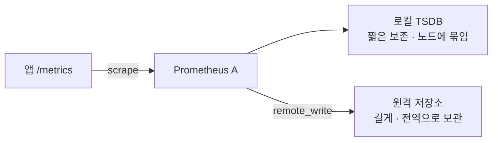
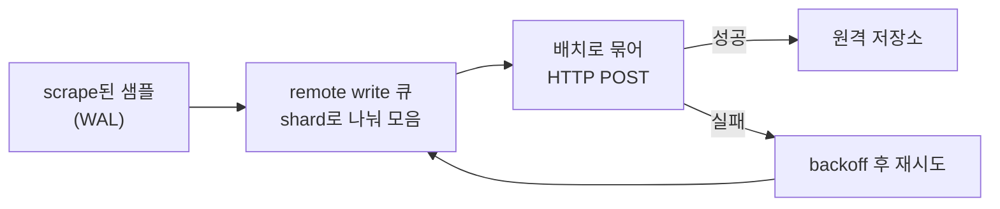

# 8. remote write — 장기 저장을 어떻게 준비하는가

한 대의 Prometheus가 로컬 디스크에 들고 있는 데이터는 길지 않습니다 — 보존 기간이 짧고, 노드 하나의 디스크에 묶이고, 그 노드가 죽으면 함께 사라집니다. 그래서 샘플을 밖으로 부쳐 오래·전역으로 보관하려고 remote write를 씁니다. Prometheus는 scrape한 샘플을 로컬에 저장하는 동시에, remote write로 원격 저장소에 HTTP로 흘려보냅니다. 그런데 이 "부치기"는 네트워크 너머라 항상 잘되지는 않습니다 — 원격이 느려지거나 죽으면? 샘플이 쌓이는 속도가 부치는 속도보다 빠르면? 이 편은 보내는 Prometheus와 받는 Prometheus를 띄워, remote write가 샘플을 부치는 것을 확인하고, 원격을 일부러 죽여 보내는 쪽의 queue·retry·buffer가 어떻게 버티는지를 지표로 직접 봅니다. 이 편의 산출물은 "scrape하지 않는 원격 Prometheus가 remote write로만 데이터를 받는 것을 확인한 상태"와 "원격이 죽었을 때 보내는 쪽이 재시도·버퍼로 버티며 로컬은 멀쩡하고, 복구되면 따라잡는 것을 `prometheus_remote_storage_*` 지표로 가른 경험"입니다.

## 핵심 다이어그램





- **remote write는 로컬 저장을 대체하지 않고 더한다.** Prometheus는 평소처럼 로컬에 저장하면서, 같은 샘플을 원격으로도 부친다. 로컬은 빠른 조회·짧은 보존, 원격은 길게·전역 보관을 맡는다.
- **부치기는 큐를 거친다.** scrape된 샘플은 WAL에 적히고, remote write가 그걸 읽어 shard로 나눈 큐에 모았다가, `max_samples_per_send`만큼 배치로 묶어 HTTP POST한다.
- **원격이 느리면 backpressure가 걸린다.** POST가 실패하면 backoff 후 재시도하고, 그동안 샘플은 큐(buffer)에 쌓인다. 큐가 `capacity`까지 차면 더 못 받고, 부하가 높으면 shard를 `max_shards`까지 늘려 병렬로 더 밀어낸다.
- **버티지 못하면 결국 떨어뜨린다.** 원격이 오래 죽어 있거나 생성 속도가 쓰기 속도를 계속 앞지르면, 버퍼가 빠지지 못하고 WAL이 잘릴 때 못 보낸 샘플은 원격에서 유실된다. 로컬 데이터는 그와 무관하게 남는다.

아래 시연이 이 동작을 한 줄씩 손으로 확인합니다.

## 사전 준비물

이 실습은 **macOS** 환경을 기준으로 합니다.

- **Docker** — Docker Desktop, OrbStack 등. `docker ps`가 에러 없이 돌아가면 OK.
- **Homebrew** — macOS 패키지 관리자.

### kind · kubectl 설치

```bash
brew install kind kubectl
```

### rosa-lab 클러스터 · namespace 준비

```bash
kind create cluster --name rosa-lab
kubectl create namespace rosa-lab
kubectl config set-context --current --namespace=rosa-lab
```

이미 있으면 건너뜁니다 (`kind get clusters`, `kubectl config get-contexts`로 확인).

## 실습 환경

| 파일 | 내용 |
|---|---|
| `manifests/stack.yaml` | `web`+`load`(트래픽) · `prometheus-a`(보내는 쪽, web·자기 자신 scrape 후 B로 remote_write) · `prometheus-b`(받는 쪽, remote-write-receiver, scrape 안 함) |

```bash
kubectl apply -f manifests/stack.yaml
kubectl rollout status deploy/web -n rosa-lab
kubectl rollout status deploy/prometheus-b -n rosa-lab
kubectl rollout status deploy/prometheus-a -n rosa-lab
```

A(9090)와 B(9091)에 각각 붙습니다.

```bash
kubectl port-forward -n rosa-lab svc/prometheus-a 9090:9090 >/dev/null 2>&1 &
kubectl port-forward -n rosa-lab svc/prometheus-b 9091:9090 >/dev/null 2>&1 &
sleep 6
curl -s localhost:9090/-/ready && curl -s localhost:9091/-/ready
```

```
Prometheus Server is Ready.
Prometheus Server is Ready.
```

A의 지표를 추려 보는 헬퍼를 준비합니다.

```bash
rwa() {
  curl -s -G localhost:9090/api/v1/query --data-urlencode "query=$1" | python3 -c "
import sys, json
raw = sys.stdin.read()
if not raw.strip():
    print('응답이 비었습니다 — port-forward가 떠 있는지 확인하세요'); sys.exit(0)
d = json.loads(raw)
res = d['data']['result']
if not res:
    print('(빈 결과)'); sys.exit(0)
for r in res:
    v = r['value'][1]
    try:
        f = float(v); v = int(f) if f == int(f) else round(f, 4)
    except ValueError:
        pass
    print(' ', r['metric'].get('__name__', ''), '=>', v)
"
}
```

## 여기서 직접 확인할 수 있는 것

절대 숫자는 살아 있는 부하라 시점마다 다릅니다.

### remote write가 샘플을 부친다

받는 쪽 B는 아무것도 scrape하지 않습니다. 정말 그런지 확인합니다.

```bash
curl -s 'localhost:9091/api/v1/targets?state=active' \
  | python3 -c "import sys,json; print('B의 active 타깃 수:', len(json.load(sys.stdin)['data']['activeTargets']))"
```

```
B의 active 타깃 수: 0
```

그런데 B에 앱의 metric이 있는지 봅니다.

```bash
curl -s -G localhost:9091/api/v1/query --data-urlencode 'query=http_requests_total' \
  | python3 -c "import sys,json; [print(' ',r['metric'].get('code'),'job='+str(r['metric'].get('job')),'=>',r['value'][1]) for r in json.load(sys.stdin)['data']['result']]"
```

```
  200 job=web => 1836
  404 job=web => 204
```

B는 web을 한 번도 긁지 않았는데 `http_requests_total`을 들고 있습니다. A가 자기가 긁은 샘플을 remote write로 B에 부쳤기 때문입니다.

### 보내는 파이프라인 — 정상 상태

A의 remote write 지표를 봅니다. 보낸 샘플 누적, 아직 못 보내고 대기 중인 샘플, 활성 shard 수, 실패 누적입니다.

```bash
rwa 'prometheus_remote_storage_samples_total'
rwa 'prometheus_remote_storage_samples_pending'
rwa 'prometheus_remote_storage_shards'
rwa 'prometheus_remote_storage_samples_failed_total'
```

```
  prometheus_remote_storage_samples_total => 1800
  prometheus_remote_storage_samples_pending => 69
  prometheus_remote_storage_shards => 1
  prometheus_remote_storage_samples_failed_total => 0
```

보낸 누적은 계속 오르고, 대기(pending)는 작게 유지되고, shard는 1개(부하가 낮아 하나로 충분), 실패는 0입니다. 정상적으로 흐르고 있습니다.

### 원격이 죽으면 보내는 쪽은 어떻게 되나

원격 저장소 B를 0으로 내립니다.

```bash
kubectl scale deploy/prometheus-b -n rosa-lab --replicas=0
kubectl rollout status deploy/prometheus-b -n rosa-lab
```

A의 지표를 15초 간격으로 몇 번 봅니다.

```bash
for i in 1 2 3; do
  echo "--- ${i} ---"
  rwa 'prometheus_remote_storage_samples_retried_total'
  rwa 'prometheus_remote_storage_samples_pending'
  rwa 'prometheus_remote_storage_samples_failed_total'
  sleep 15
done
```

```
--- 1 ---
  prometheus_remote_storage_samples_retried_total => 800
  prometheus_remote_storage_samples_pending => 699
  prometheus_remote_storage_samples_failed_total => 0
--- 2 ---
  prometheus_remote_storage_samples_retried_total => 1100
  prometheus_remote_storage_samples_pending => 699
  prometheus_remote_storage_samples_failed_total => 0
--- 3 ---
  prometheus_remote_storage_samples_retried_total => 1500
  prometheus_remote_storage_samples_pending => 699
  prometheus_remote_storage_samples_failed_total => 0
```

세 가지가 한꺼번에 드러납니다. **`retried_total`이 계속 오릅니다** — POST가 실패하자 A가 포기하지 않고 재시도하고 있습니다. **`pending`은 큐 한도(`capacity`)까지 차서 멈춰 있습니다** — 못 보낸 샘플이 버퍼에 쌓인 채 대기합니다. 그리고 **`failed_total`은 여전히 0입니다** — 재시도 중이라 아직 "실패로 버린" 게 아닙니다. 원격이 못 받는 만큼 보내는 쪽은 점점 뒤처집니다.

```bash
rwa 'prometheus_remote_storage_highest_timestamp_in_seconds - ignoring(remote_name,url) prometheus_remote_storage_queue_highest_sent_timestamp_seconds'
```

```
  => 70
```

가진 데이터의 최신 시각과, 원격에 보낸 최신 시각의 차 — 지연(lag)이 70초까지 벌어졌습니다. 그동안 A의 **로컬** 데이터는 멀쩡한지 봅니다.

```bash
curl -s -G localhost:9090/api/v1/query --data-urlencode 'query=http_requests_total{job="web"}' \
  | python3 -c "import sys,json; [print(' ',r['metric'].get('code'),'=>',r['value'][1]) for r in json.load(sys.stdin)['data']['result']]"
```

```
  200 => 8757
  404 => 973
```

A는 계속 scrape하고 로컬에 저장하므로 로컬 조회는 정상입니다. **원격이 죽어도 Prometheus는 죽지 않습니다** — 재시도하며 버퍼에 쌓고, 원격만 뒤처질 뿐입니다.

### 복구되면 따라잡는다

B를 다시 올립니다.

```bash
kubectl scale deploy/prometheus-b -n rosa-lab --replicas=1
kubectl rollout status deploy/prometheus-b -n rosa-lab
sleep 25
rwa 'prometheus_remote_storage_samples_pending'
rwa 'prometheus_remote_storage_highest_timestamp_in_seconds - ignoring(remote_name,url) prometheus_remote_storage_queue_highest_sent_timestamp_seconds'
```

```
  prometheus_remote_storage_samples_pending => 21
  => 0
```

대기가 21로 빠지고 지연이 0으로 돌아왔습니다. 버퍼에 쌓였던 것을 밀어내 따라잡은 것입니다. 다만 원격이 버퍼·WAL이 버티는 시간보다 오래 죽어 있었다면, 그 구간의 샘플은 원격에서 영영 비어 있게 됩니다.

### 두 운영 질문에 대한 답, 그리고 손잡이

- **원격 저장소가 느려지면?** 보내는 쪽은 재시도(`retried_total`↑)하며 버퍼(`pending`)에 쌓고, 원격은 뒤처집니다(lag↑). 로컬은 영향받지 않고, 원격이 돌아오면 따라잡습니다. 오래 지속되면 그 구간은 원격에서 유실됩니다.
- **생성 속도가 쓰기 속도를 앞지르면?** 위에서 원격을 죽인 건 "쓰기 속도 0"이라는 극단입니다. 일반적으로도 생성이 쓰기보다 빠르면 같은 일이 벌어집니다 — 큐(`pending`)가 `capacity`까지 차고, shard를 `max_shards`까지 늘려 더 밀어내려 하고, 그래도 못 따라가면 결국 떨어뜨립니다. 가장 먼저 차는 건 큐(buffer)입니다.

| queue_config 손잡이 | 뜻 |
|---|---|
| `capacity` | shard 하나가 들고 있을 수 있는 대기 샘플 수 — 버퍼 크기 |
| `max_shards` | 병렬로 밀어낼 shard 최대 수 — 원격이 느릴수록 늘려 따라잡으려 함 |
| `max_samples_per_send` | 한 번의 POST에 묶는 샘플 수 — 배치 크기 |

### 정리

```bash
pkill -f "port-forward.*rosa-lab" 2>/dev/null
kubectl delete -f manifests/stack.yaml --ignore-not-found
```

클러스터까지 정리하려면:

```bash
kind delete cluster --name rosa-lab
```

## 이 편의 산출물

- 보내는 Prometheus와 받는 Prometheus(`--web.enable-remote-write-receiver`)를 띄워, **scrape하지 않는 원격 쪽이 remote write로만 데이터를 받는 것**을 확인한 상태 — remote write가 로컬 저장에 더해 샘플을 밖으로 부치는 장치라는 것.
- 정상 상태에서 `samples_total`(보낸 누적)·`samples_pending`(대기)·`shards`·`samples_failed_total`로 파이프라인이 흐르는 모습을 읽은 것.
- 원격을 죽였을 때 보내는 쪽이 **`retried_total`↑로 재시도하고 `pending`이 `capacity`까지 차서 버티며 `failed_total`은 0**(아직 안 버림)이고, 지연(highest_timestamp − queue_highest_sent)이 커지는 반면 **로컬 데이터는 멀쩡**함을 확인한 경험 — "원격이 느려지면?"의 답.
- 원격이 복구되면 `pending`이 빠지고 지연이 0으로 돌아와 **따라잡는** 것, 그러나 장기 outage는 그 구간을 원격에서 유실시킨다는 것을 본 상태.
- 생성>쓰기일 때 **가장 먼저 차는 건 큐(buffer)**이고, `capacity`·`max_shards`·`max_samples_per_send`가 그 backpressure를 조절하는 손잡이임을 잡은 것.
