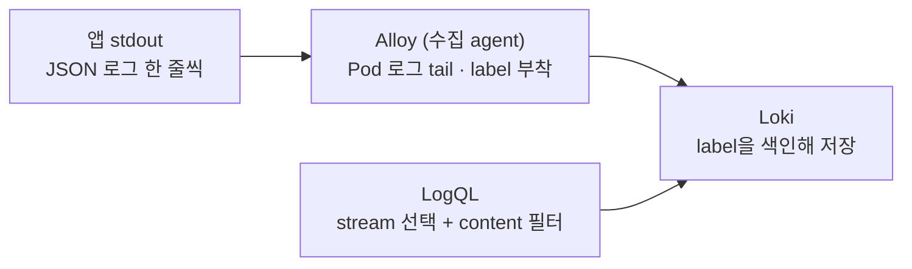
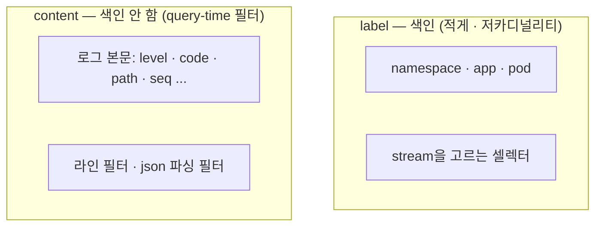

# 9. Logs · Loki — 로그를 어떻게 모아 묻는가

로그는 사건의 문장입니다 — "어느 경로가 500을 냈나", "그때 무슨 메시지였나"처럼 metric이 뭉개 버린 개별 사건을 담습니다. 문제는 양입니다. Pod 수백 개가 초당 수천 줄을 쏟아 내는데, 이걸 전부 색인하면 비용이 폭발합니다. Loki는 그래서 다르게 합니다 — **로그 본문은 색인하지 않고, 적은 수의 label만 색인**합니다. label로 어느 stream(어느 app·namespace·pod의 로그 묶음)을 볼지 고른 다음, 본문은 읽는 시점에 필터합니다. 이 편은 로그를 내는 앱, 그 로그를 모아 label을 붙여 Loki로 보내는 수집 agent(Grafana Alloy), 그리고 LogQL을 띄워 — stream을 label로 고르고 content를 query-time에 거르는 — 그 경계를 직접 확인합니다. 이 편의 산출물은 "Alloy가 Pod 로그를 모아 namespace·app·pod label과 함께 Loki에 넣은 상태"와 "label은 색인(stream 선택)이고 content는 query-time 필터(`|=`·`| json`)라는 Loki의 핵심 규칙을, `code`가 label이 아님과 stream selector 없이는 질의가 거부됨으로 가른 경험"입니다.

## 핵심 다이어그램





- **Loki는 로그를 stream 단위로 본다.** metric의 시계열처럼, 로그도 label 집합으로 식별되는 stream으로 묶인다. LogQL 질의는 항상 stream을 고르는 label 셀렉터로 시작한다.
- **Loki는 label만 색인한다.** 로그 본문은 색인하지 않는다. 그래서 질의는 "어느 stream인가"(label, 색인)를 먼저 좁히고, "그 안에서 무엇을 찾나"(content, 본문)는 읽는 시점에 필터한다.
- **그래서 label은 적고 저카디널리티여야 한다.** namespace·app·pod처럼 값이 한정된 것만 label로 둔다. `code`·`path`·`request_id`처럼 값이 무한히 많은 건 label로 만들지 않는다 — stream이 폭발한다. 그런 건 본문에 두고 LogQL로 거른다.
- **수집은 agent가 한다.** Grafana Alloy가 Pod 로그를 tail해 label을 붙여 Loki로 push한다. (이전 agent Promtail은 유지보수 모드라, 새 구성은 Alloy를 쓴다.)

아래 시연이 이 경계를 한 줄씩 손으로 확인합니다.

## 사전 준비물

이 실습은 **macOS** 환경을 기준으로 합니다.

- **Docker** — Docker Desktop, OrbStack 등. `docker ps`가 에러 없이 돌아가면 OK.
- **Homebrew** — macOS 패키지 관리자.

### kind · kubectl 설치

```bash
brew install kind kubectl
```

### rosa-lab 클러스터 · namespace 준비

```bash
kind create cluster --name rosa-lab
kubectl create namespace rosa-lab
kubectl config set-context --current --namespace=rosa-lab
```

이미 있으면 건너뜁니다 (`kind get clusters`, `kubectl config get-contexts`로 확인).

## 실습 환경

| 파일 | 내용 |
|---|---|
| `manifests/loki.yaml` | Loki(단일 바이너리) + Service. label만 색인하는 로그 저장소 |
| `manifests/alloy.yaml` | Grafana Alloy + RBAC + config. Pod 로그를 tail해 label 붙여 Loki로 push |
| `manifests/logger.yaml` | 매초 JSON 로그(info/warn/error, code 200/404/500)를 내는 앱 |

```bash
kubectl apply -f manifests/loki.yaml
kubectl apply -f manifests/logger.yaml
kubectl apply -f manifests/alloy.yaml
kubectl rollout status deploy/loki -n rosa-lab
kubectl rollout status deploy/logger -n rosa-lab
kubectl rollout status deploy/alloy -n rosa-lab
```

앱이 내는 로그는 이렇게 생겼습니다.

```bash
kubectl logs -n rosa-lab deploy/logger --tail=4
```

```
{"level":"info","msg":"request handled","code":200,"path":"/","seq":6}
{"level":"info","msg":"request handled","code":200,"path":"/","seq":7}
{"level":"warn","msg":"not found","code":404,"path":"/missing","seq":5}
{"level":"info","msg":"request handled","code":200,"path":"/","seq":8}
```

Loki에 붙고, 닿는지부터 확인합니다. Alloy가 로그를 모아 보내기까지 20초쯤 걸립니다.

```bash
kubectl port-forward -n rosa-lab svc/loki 3100:3100 >/dev/null 2>&1 &
sleep 20
curl -s localhost:3100/ready
```

```
ready
```

로그 줄을 추려 보는 헬퍼를 준비합니다(최근 5분 창에서 조회).

```bash
lq() {
  local end=$(date +%s)000000000
  local start=$(( $(date +%s) - 300 ))000000000
  curl -s -G localhost:3100/loki/api/v1/query_range \
    --data-urlencode "query=$1" \
    --data-urlencode "start=$start" --data-urlencode "end=$end" \
    --data-urlencode "limit=${2:-5}" | python3 -c "
import sys, json
raw = sys.stdin.read()
if not raw.strip():
    print('빈 응답 — port-forward 확인'); sys.exit(0)
try:
    d = json.loads(raw)
except ValueError:
    print('Loki 거절:', raw[:120]); sys.exit(0)
if d.get('status') != 'success':
    print('에러:', d.get('error', '?')); sys.exit(0)
res = d['data']['result']
if not res:
    print('(빈 결과)'); sys.exit(0)
for stream in res:
    for ts, line in stream['values']:
        print(line)
"
}
```

## 여기서 직접 확인할 수 있는 것

### Alloy가 무엇을 모았나 — 색인된 label

Loki가 색인하고 있는 label 이름들을 봅니다.

```bash
curl -s localhost:3100/loki/api/v1/labels | python3 -c "import sys,json; print(json.load(sys.stdin)['data'])"
```

```
['app', 'instance', 'job', 'namespace', 'pod', 'service_name']
```

Alloy가 붙인 `namespace`·`app`·`pod`가 보입니다(나머지는 Alloy·Loki가 기본으로 붙인 것). `app` label이 어떤 값을 갖는지 — 즉 어떤 stream들로 갈리는지 봅니다.

```bash
curl -s 'localhost:3100/loki/api/v1/label/app/values' | python3 -c "import sys,json; print(json.load(sys.stdin)['data'])"
```

```
['alloy', 'kindnet', 'local-path-provisioner', 'logger', 'loki']
```

클러스터의 Pod들이 app별 stream으로 갈려 있습니다. 이 label들이 "어느 로그 묶음을 볼까"를 고르는 색인입니다.

### stream을 고른다 — label 셀렉터

`app="logger"` stream의 로그를 봅니다.

```bash
lq '{app="logger"}' 3
```

```
{"level":"error","msg":"upstream failed","code":500,"path":"/checkout","seq":99}
{"level":"info","msg":"request handled","code":200,"path":"/","seq":100}
{"level":"warn","msg":"not found","code":404,"path":"/missing","seq":100}
```

`{app="logger"}`가 stream 셀렉터입니다 — Loki는 색인된 label로 이 묶음을 바로 찾습니다. 그런데 로그 본문 안의 `code`·`path`·`seq`는 label일까요?

```bash
curl -s localhost:3100/loki/api/v1/labels \
  | python3 -c "import sys,json; ls=json.load(sys.stdin)['data']; print('code가 label인가?', 'code' in ls); print('path가 label인가?', 'path' in ls)"
```

```
code가 label인가? False
path가 label인가? False
```

아닙니다. `code`·`path`는 본문에만 있고 색인되지 않습니다 — 값이 무한히 많아질 수 있어 label로 두면 stream이 폭발하기 때문입니다. 이런 건 읽는 시점에 필터합니다.

### content를 필터한다 — query-time

본문에서 "error"가 들어간 줄만 — 라인 필터(`|=`)입니다.

```bash
lq '{app="logger"} |= "error"' 3
```

```
{"level":"error","msg":"upstream failed","code":500,"path":"/checkout","seq":121}
{"level":"error","msg":"upstream failed","code":500,"path":"/checkout","seq":110}
{"level":"error","msg":"upstream failed","code":500,"path":"/checkout","seq":99}
```

JSON으로 파싱해 특정 필드로 거를 수도 있습니다 — `| json`으로 본문을 풀고 `code="500"`으로 필터합니다.

```bash
lq '{app="logger"} | json | code="500"' 3
```

```
{"level":"error","msg":"upstream failed","code":500,"path":"/checkout","seq":110}
{"level":"error","msg":"upstream failed","code":500,"path":"/checkout","seq":121}
{"level":"error","msg":"upstream failed","code":500,"path":"/checkout","seq":99}
```

```bash
lq '{app="logger"} | json | level="warn"' 3
```

```
{"level":"warn","msg":"not found","code":404,"path":"/missing","seq":110}
{"level":"warn","msg":"not found","code":404,"path":"/missing","seq":115}
{"level":"warn","msg":"not found","code":404,"path":"/missing","seq":120}
```

`code`·`level`은 색인된 label이 아닌데도 거를 수 있습니다 — Loki가 그 stream의 본문을 읽으며 query-time에 파싱·필터하기 때문입니다. 색인은 stream을 좁히는 데 쓰고, 정밀한 조건은 본문에서 풉니다.

### 로그에서 metric을 뽑는다

LogQL은 로그를 세어 metric으로도 만듭니다. 최근 1분간 level별 로그 수입니다.

```bash
curl -s -G localhost:3100/loki/api/v1/query \
  --data-urlencode 'query=sum by(level) (count_over_time({app="logger"} | json [1m]))' \
  | python3 -c "
import sys,json
for r in json.load(sys.stdin)['data']['result']:
    print('level=%s => %s' % (r['metric'].get('level','?'), r['value'][1]))
"
```

```
level=error => 5
level=info => 60
level=warn => 12
```

본문을 파싱해(`| json`) 그 안의 `level`로 묶어 셌습니다. 로그가 PromQL 비슷한 집계의 입력이 됩니다.

### stream selector는 빠질 수 없다

색인이 stream 선택이라는 건, 그게 없으면 질의가 성립하지 않는다는 뜻이기도 합니다. label 셀렉터 없이 content 필터만 던져 봅니다.

```bash
lq '|= "error"'
```

```
Loki 거절: parse error at line 0, col 1: syntax error: unexpected |=
```

거부됩니다(HTTP 400). content 필터는 혼자 설 수 없고, 항상 stream을 고르는 label 셀렉터 뒤에 와야 합니다. label이 색인이자 모든 질의의 출발점이라는 게 여기서 드러납니다.

### 실무 규칙

지금까지가 그대로 Loki의 운영 규칙입니다. **label은 적게, 저카디널리티로** 둡니다 — namespace·app·pod처럼 값이 한정된 것만. `code`·`path`·`user_id`·`request_id`처럼 값이 끝없이 늘 수 있는 건 label로 만들지 않습니다(stream 폭발 → 색인 비대 → 비용·성능 붕괴). 그런 세부는 본문에 두고 `|=`·`| json`으로 query-time에 거릅니다. "이 값을 label로 둘까?"의 답은 "값의 가짓수가 한정돼 있는가"입니다.

### 정리

```bash
pkill -f "port-forward.*3100" 2>/dev/null
kubectl delete -f manifests/alloy.yaml --ignore-not-found
kubectl delete -f manifests/logger.yaml --ignore-not-found
kubectl delete -f manifests/loki.yaml --ignore-not-found
```

클러스터까지 정리하려면:

```bash
kind delete cluster --name rosa-lab
```

## 이 편의 산출물

- Grafana Alloy가 Pod 로그를 tail해 `namespace`·`app`·`pod` label과 함께 Loki로 보내는 것을 확인하고, `app` label 값으로 클러스터의 stream들이 갈리는 것을 본 상태 — 수집 agent의 역할.
- LogQL 질의가 **label 셀렉터(`{app="logger"}`)로 stream을 고르는 데서 시작**하고, 그 label만 Loki가 색인한다는 것을 label 목록으로 확인한 경험.
- 로그 본문의 `code`·`path`가 **label이 아니며**(색인 안 됨), `|=`(라인)·`| json | code="500"`(파싱 필터)로 query-time에 거른다는 것 — label은 색인, content는 query-time 필터라는 경계.
- `count_over_time`으로 로그를 세어 level별 metric을 뽑아, 로그가 집계의 입력이 됨을 본 것.
- stream selector 없이 content 필터만 던지면 `parse error`로 거부됨을 확인해, label이 모든 질의의 출발점임을 가른 것. 그리고 "값의 가짓수가 한정됐는가"로 label/content를 나누는 실무 규칙을 잡은 상태.
