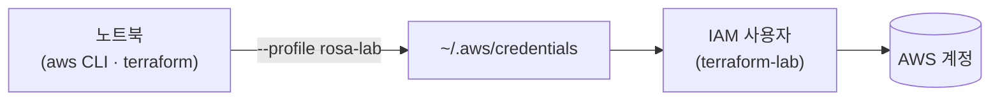

# 0. AWS 프로필 준비

Terraform 시리즈에서 사용할 AWS 환경을 준비합니다.

## 핵심 다이어그램



- **IAM 사용자 `terraform-lab`** — Terraform이 AWS API를 호출할 때 이 사용자의 권한으로 동작합니다.
- **프로필 `rosa-lab`** — 사용자의 access key를 로컬 `~/.aws/credentials` 에 저장한 묶음. CLI·Terraform 명령에 `--profile rosa-lab` 또는 `AWS_PROFILE=rosa-lab` 를 붙여 호출하면 이 프로필이 사용됩니다.

## 사전 준비

- **macOS + Homebrew** — AWS CLI 설치에 사용
- **AWS 계정** — IAM 사용자 생성 권한으로 콘솔 로그인이 가능해야 합니다.

## 진행 단계

### 1. IAM 사용자 만들기

AWS 콘솔에서 **IAM** → **Users** → "Create user":

- **User name**: `terraform-lab`
- **Provide user access to the AWS Management Console**: 끔 (CLI/Terraform 전용)
- **Permissions options**: "Attach policies directly" → `AdministratorAccess`

### 2. Access key 발급

방금 만든 `terraform-lab` 사용자 → **Security credentials** 탭 → **Create access key**:

- **Use case**: "Command Line Interface (CLI)"
- 안내 체크박스에 동의하고 생성

**Access key ID** 와 **Secret access key** 가 화면에 한 번만 표시됩니다.

> 키가 노출되면 제3자가 무단으로 리소스를 생성해 비용을 발생시킬 수 있습니다. **절대 깃에 커밋하지 말 것.** access key는 `~/.aws/` 아래에만 저장합니다.

### 3. AWS CLI 설치

```bash
brew install awscli
aws --version
# aws-cli/2.x.x ...
```

### 4. 프로필로 자격증명 저장

```bash
aws configure --profile rosa-lab
# AWS Access Key ID [None]: AKIA...
# AWS Secret Access Key [None]: ...
# Default region name [None]: ap-northeast-2
# Default output format [None]: json
```

리전은 서울(`ap-northeast-2`)을 사용합니다. 비용·지연을 고려해 시리즈 전체를 한 리전으로 통일합니다.

저장되는 위치:

```bash
cat ~/.aws/credentials
# [rosa-lab]
# aws_access_key_id = AKIA...
# aws_secret_access_key = ...

cat ~/.aws/config
# [profile rosa-lab]
# region = ap-northeast-2
# output = json
```

### 5. 동작 확인

```bash
aws sts get-caller-identity --profile rosa-lab
# {
#     "UserId": "AIDA...",
#     "Account": "123456789012",
#     "Arn": "arn:aws:iam::123456789012:user/terraform-lab"
# }
```

`Arn` 끝이 `:user/terraform-lab` 로 나오면 CLI가 이 사용자로 동작하고 있다는 뜻입니다.

매번 `--profile rosa-lab` 를 붙이는 게 번거롭다면, 세션 환경변수로 지정합니다.

```bash
export AWS_PROFILE=rosa-lab
aws sts get-caller-identity   # --profile 없이도 같은 결과
```
