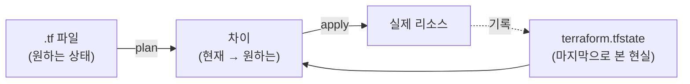

# 1. `terraform apply` 한 줄에서 리소스까지

코드 한 묶음이 어떻게 실제 리소스가 되는지, Terraform의 기본 사이클(init → plan → apply → destroy)을 직접 실행합니다.

## 핵심 다이어그램



- Terraform은 **선언형** 도구입니다. `.tf` 에 원하는 상태를 적으면, Terraform이 현재 상태(state)와 비교해 차이를 채웁니다.
- **`terraform init`** 은 `.tf` 에 적힌 provider를 다운로드합니다.
- **`terraform plan`** 은 state와 `.tf` 를 비교해 생성·변경·삭제할 항목을 보여줍니다. 실제로 만들지는 않습니다.
- **`terraform apply`** 는 plan을 실제로 실행하고 결과를 `terraform.tfstate` 에 기록합니다.

## 사전 준비

- **macOS + Homebrew** — Terraform CLI 설치에 사용
- 이 편에서는 AWS 자격증명을 사용하지 않습니다.

## 빠른 시작

```bash
brew install terraform
terraform -version
# Terraform v1.x.x

mkdir -p /tmp/tf-lab && cd /tmp/tf-lab
```

작업 폴더에 `main.tf` 를 만듭니다.

```hcl
# main.tf
terraform {
  required_providers {
    local = {
      source  = "hashicorp/local"
      version = "2.9.0"
    }
    random = {
      source  = "hashicorp/random"
      version = "3.9.0"
    }
  }
}

resource "random_pet" "name" {
  length = 2
}

resource "local_file" "hello" {
  filename = "${path.module}/hello.txt"
  content  = "안녕, ${random_pet.name.id}\n"
}
```

- `terraform` 블록 — 어떤 provider를 어떤 버전으로 쓸지 선언
- `random_pet` 리소스 ([hashicorp/random](https://registry.terraform.io/providers/hashicorp/random/latest)) — 두 단어짜리 랜덤 이름 (예: `happy-otter`)
- `local_file` 리소스 ([hashicorp/local](https://registry.terraform.io/providers/hashicorp/local/latest)) — 위 이름을 담은 텍스트 파일

이후 모든 명령은 이 폴더에서 실행합니다.

## 여기서 직접 확인할 수 있는 것

### `terraform init` 은 provider를 받아옵니다

```bash
terraform init
# Initializing provider plugins found in the configuration...
# - Finding hashicorp/local versions matching "2.9.0"...
# - Finding hashicorp/random versions matching "3.9.0"...
# - Installing hashicorp/local v2.9.0...
# - Installed hashicorp/local v2.9.0 (signed by HashiCorp)
# - Installing hashicorp/random v3.9.0...
# - Installed hashicorp/random v3.9.0 (signed by HashiCorp)
#
# Initializing the backend...
#
# Terraform has created a lock file .terraform.lock.hcl to record the provider
# selections it made above. ...
#
# Terraform has been successfully initialized!
```

`.terraform/` 폴더가 생기고 그 안에 provider 바이너리가 들어옵니다.

```bash
ls .terraform/providers/registry.terraform.io/hashicorp/
# local  random
```

`.terraform.lock.hcl` 도 함께 생깁니다. provider 버전을 고정해, 다른 환경에서도 같은 버전으로 init할 수 있게 만듭니다.

### `terraform plan` 은 차이를 보여줍니다 (아직 만들지 않습니다)

```bash
terraform plan
# Terraform will perform the following actions:
#
#   # local_file.hello will be created
#   + resource "local_file" "hello" {
#       + content              = (known after apply)
#       + filename             = "./hello.txt"
#       + ...
#     }
#
#   # random_pet.name will be created
#   + resource "random_pet" "name" {
#       + id     = (known after apply)
#       + length = 2
#       + ...
#     }
#
# Plan: 2 to add, 0 to change, 0 to destroy.
```

- `+` 는 생성, `-` 는 삭제, `~` 는 변경
- `(known after apply)` 는 apply 때 결정되는 값 (`random_pet.id`, 그걸 참조하는 `local_file.content` 등)
- 마지막 줄 `Plan: 2 to add` 가 요약

이 시점에 폴더에는 새 파일이 없습니다.

```bash
ls
# main.tf
```

### `terraform apply` 는 차이를 적용하고 state에 기록합니다

```bash
terraform apply
# (위 plan 다시 보여줌)
# Do you want to perform these actions?
#   Enter a value: yes
#
# random_pet.name: Creating...
# random_pet.name: Creation complete after 0s [id=happy-otter]
# local_file.hello: Creating...
# local_file.hello: Creation complete after 0s
#
# Apply complete! Resources: 2 added, 0 changed, 0 destroyed.
```

```bash
ls
# main.tf  hello.txt  terraform.tfstate

cat hello.txt
# 안녕, happy-otter
```

`terraform.tfstate` 안에는 방금 만든 리소스의 속성이 그대로 들어가 있습니다.

```bash
cat terraform.tfstate | head -30
# {
#   "version": 4,
#   "terraform_version": "1.x.x",
#   "serial": 1,
#   "lineage": "...",
#   "outputs": {},
#   "resources": [
#     {
#       "mode": "managed",
#       "type": "random_pet",
#       "name": "name",
#       ...
#       "instances": [
#         {
#           "attributes": { "id": "happy-otter", "length": 2, ... }
#         }
#       ]
#     },
#     ...
#   ]
# }
```

state는 "Terraform이 마지막으로 본 현실 상태" 의 기록입니다. 다음 plan은 이 state와 `.tf` 를 비교해 차이를 계산합니다.

### 같은 코드로 다시 plan 하면 변경이 없습니다

```bash
terraform plan
# random_pet.name: Refreshing state... [id=happy-otter]
# local_file.hello: Refreshing state... [id=...]
#
# No changes. Your infrastructure matches the configuration.
```

state와 `.tf` 가 일치하니 할 일이 없습니다.

### 코드를 바꾸면 plan 이 새 차이를 보여줍니다

`main.tf` 의 `random_pet.name.length` 를 `3` 으로 바꿉니다.

```hcl
resource "random_pet" "name" {
  length = 3
}
```

```bash
terraform plan
# random_pet.name: Refreshing state... [id=happy-otter]
# local_file.hello: Refreshing state... [id=...]
#
# Terraform will perform the following actions:
#
#   # local_file.hello must be replaced
#   -/+ resource "local_file" "hello" {
#         ~ content = "안녕, happy-otter" -> (known after apply) # forces replacement
#         ~ id      = "..." -> (known after apply)
#         ~ ...
#       }
#
#   # random_pet.name must be replaced
#   -/+ resource "random_pet" "name" {
#         ~ id     = "happy-otter" -> (known after apply)
#         ~ length = 2 -> 3 # forces replacement
#       }
#
# Plan: 2 to add, 0 to change, 2 to destroy.
```

- `random_pet`: `length` 변경이 새 리소스를 강제하므로 (`# forces replacement`) → **삭제 후 재생성** (`-/+`)
- `local_file`: `content` 변경도 새 파일을 강제 → **삭제 후 재생성**
- `random_pet.name.id` 가 바뀌니, 그걸 참조하던 `local_file.hello.content` 도 따라 바뀝니다. 한 리소스의 변경이 의존하는 다른 리소스로 번지는 모습이 plan에 그대로 드러납니다.

```bash
terraform apply
#   Enter a value: yes
#
# local_file.hello: Destroying...
# random_pet.name: Destroying...
# random_pet.name: Creating...
# random_pet.name: Creation complete after 0s [id=happily-rare-walleye]
# local_file.hello: Creating...
# local_file.hello: Creation complete after 0s
#
# Apply complete! Resources: 2 added, 0 changed, 2 destroyed.

cat hello.txt
# 안녕, happily-rare-walleye
```

### `terraform destroy` 는 만든 리소스를 되돌립니다

```bash
terraform destroy
# (...삭제 계획...)
# Do you really want to destroy all resources?
#   Enter a value: yes
#
# local_file.hello: Destroying...
# random_pet.name: Destroying...
#
# Destroy complete! Resources: 2 destroyed.

ls
# main.tf  terraform.tfstate  terraform.tfstate.backup
```

`hello.txt` 가 사라졌고, 새로 `terraform.tfstate.backup` 이 생겼습니다.

- **`terraform.tfstate`** — 현재 state. `resources` 배열이 비었습니다.
- **`terraform.tfstate.backup`** — 직전 state. destroy 직전엔 리소스 2개가 있던 상태였고, 그게 그대로 남아 있습니다. Terraform이 state를 덮어쓰기 직전(apply · destroy · refresh) 에 자동으로 백업해둡니다.

```bash
cat terraform.tfstate | grep -A1 '"resources"'
# "resources": [],
# "check_results": null

cat terraform.tfstate.backup | grep -A30 '"resources"'
# "resources": [
#   {
```

다음 apply는 비어 있는 `terraform.tfstate` 를 보고 "처음부터 다시 만들어야 한다" 고 판단합니다.

### 실습 폴더 정리

`terraform destroy` 는 Terraform이 만든 리소스(`hello.txt`)를 되돌릴 뿐입니다. 작업 폴더 자체와 provider 캐시(`.terraform/`) · lock 파일(`.terraform.lock.hcl`) · state 파일(`terraform.tfstate`, `terraform.tfstate.backup`) · `main.tf` 는 그대로 남아 있습니다. 실습을 마쳤다면 작업 폴더를 통째로 지웁니다.

```bash
cd ..
rm -rf /tmp/tf-lab
```
