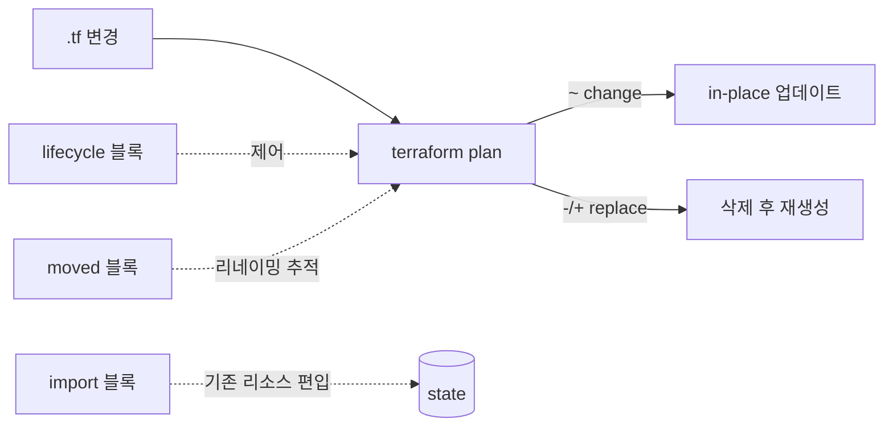

# 10. 리소스 라이프사이클

코드를 고칠 때 무엇이 in-place 로 바뀌고 무엇이 replace 되는지, 어디까지를 막거나 무시할지, 주소를 어떻게 갈아 끼우는지, 그리고 콘솔에서 이미 만들어진 리소스를 어떻게 state 에 들여오는지 — 라이프사이클을 다루는 도구 네 가지(`lifecycle` · `moved` · `import` · plan 의 in-place/replace 표시) 를 손으로 만져봅니다.

## 핵심 다이어그램



- **in-place update** — 리소스를 그 자리에서 수정. 무중단.
- **replace** — 삭제 후 재생성. 새 ID, 다운타임 가능.
- **`lifecycle` 블록** — 라이프사이클 동작을 코드로 제어 (`create_before_destroy` · `prevent_destroy` · `ignore_changes` · `replace_triggered_by`).
- **`moved` 블록** — 리소스 주소 변경(리네임 · 모듈 이동) 을 state 에 알려줘 불필요한 destroy/recreate 방지.
- **`import` 블록** — 콘솔 · CLI 로 이미 만들어진 리소스를 state 에 편입.

## 빠른 시작

```bash
mkdir -p /tmp/tf-lab-10 && cd /tmp/tf-lab-10
```

```hcl
# main.tf
terraform {
  required_providers {
    aws = {
      source  = "hashicorp/aws"
      version = "~> 5.0"
    }
  }
}

provider "aws" {
  region  = "ap-northeast-2"
  profile = "rosa-lab"
}

data "aws_caller_identity" "current" {}

locals {
  prefix = "rosa-lab-tf-10"
  tags = {
    Project = "rosa-hands-on"
    Edition = "terraform-10"
  }
}

resource "aws_s3_bucket" "logs" {
  bucket        = "${local.prefix}-logs-${data.aws_caller_identity.current.account_id}"
  force_destroy = true
  tags          = local.tags
}

output "bucket" {
  value = aws_s3_bucket.logs.bucket
}

output "account_id" {
  value = data.aws_caller_identity.current.account_id
}
```

```bash
terraform init
terraform apply
#   Enter a value: yes
# Apply complete! Resources: 1 added, 0 changed, 0 destroyed.
```

## 여기서 직접 확인할 수 있는 것

### in-place(`~`) vs replace(`-/+`) — plan 의 두 가지 모양

`tags` 에 항목을 하나 추가하면 in-place.

```hcl
tags = merge(local.tags, { Owner = "rosa" })
```

```bash
terraform plan
#   # aws_s3_bucket.logs will be updated in-place
#   ~ resource "aws_s3_bucket" "logs" {
#       ~ tags = {
#         + "Owner" = "rosa"
#       }
#     }
#
# Plan: 0 to add, 1 to change, 0 to destroy.
```

`bucket` 이름을 바꾸면 replace.

```hcl
bucket = "${local.prefix}-logs2-${data.aws_caller_identity.current.account_id}"
```

```bash
terraform plan
#   # aws_s3_bucket.logs must be replaced
#   -/+ resource "aws_s3_bucket" "logs" {
#       ~ bucket = "rosa-lab-tf-10-logs-..." -> "rosa-lab-tf-10-logs2-..." # forces replacement
#       ...
```

`# forces replacement` 가 어느 속성에 붙는지가 핵심 단서. S3 의 `bucket` 은 immutable 이므로 통째로 갈아 끼우는 수밖에 없습니다.

이름 변경은 되돌리고, 다음 데모로 갑니다 (`bucket` 을 원래 값으로 복구).

### `lifecycle` 블록 — 네 가지 설정

라이프사이클 블록 안에 둘 수 있는 설정은 네 가지입니다.

- **`create_before_destroy = true`** — replace 시, 새 리소스를 먼저 만든 뒤 옛 것을 지움. SG · ASG 등에 유용 (옛 리소스 끊기 전에 새 것이 받아주도록).
- **`prevent_destroy = true`** — destroy 가 필요한 plan 자체를 막음. 운영 잠금.
- **`ignore_changes = [...]`** — 특정 속성의 drift 를 무시.
- **`replace_triggered_by = [...]`** — 다른 리소스가 바뀌면 이 리소스를 replace.

이 중 둘(`prevent_destroy`, `ignore_changes`) 을 만져봅니다.

### `prevent_destroy = true` 로 실수 차단

운영 버킷처럼 절대 사라지면 안 되는 리소스에는 `prevent_destroy` 를 걸어둡니다.

```hcl
resource "aws_s3_bucket" "logs" {
  bucket        = "..."
  force_destroy = true
  tags          = local.tags

  lifecycle {
    prevent_destroy = true
  }
}
```

```bash
terraform apply
# (변화 없음 — lifecycle 만 state 메타에 반영)

terraform destroy
# Error: Instance cannot be destroyed
#
#   on main.tf line ...:
#  ...: resource "aws_s3_bucket" "logs" {
#
# Resource aws_s3_bucket.logs has lifecycle.prevent_destroy set, but the plan
# calls for this resource to be destroyed.
```

이름 변경처럼 replace 가 필요한 변경도 같이 막힙니다. 진짜 지우거나 갈아 끼우려면 lifecycle 블록을 먼저 제거해야 합니다.

다음 데모로 가기 위해 lifecycle 블록을 제거합니다.

### `ignore_changes` 로 외부 관리 필드 무시

태그 일부를 다른 시스템(Cost Allocation · AWS Config · 콘솔 운영자) 이 자동으로 붙이는 경우, Terraform 은 매 plan 마다 "이 태그가 코드에 없네, 제거" 라며 drift 로 보고합니다. `ignore_changes` 로 특정 키만 무시합니다.

```hcl
resource "aws_s3_bucket" "logs" {
  ...
  lifecycle {
    ignore_changes = [tags["AutoTag"]]
  }
}
```

외부에서 태그 추가를 흉내:

```bash
aws s3api put-bucket-tagging \
  --bucket $(terraform output -raw bucket) \
  --tagging 'TagSet=[{Key=Project,Value=rosa-hands-on},{Key=Edition,Value=terraform-10},{Key=AutoTag,Value=cost-42}]' \
  --profile rosa-lab

terraform plan
# No changes. Your infrastructure matches the configuration.
```

`AutoTag` drift 는 ignore_changes 가 가려줍니다. 다른 태그 변경은 정상적으로 감지됩니다.

> `ignore_changes = all` 로 모든 변경을 무시할 수도 있지만 위험합니다 — "한 번 만들고 다시는 안 들여다본다" 는 의미가 되므로.

(이 데모 후 lifecycle 블록 제거)

### `moved` 블록 — 리소스 주소 변경

`aws_s3_bucket.logs` 라는 이름이 어색해서 `aws_s3_bucket.access_logs` 로 바꾸고 싶다고 합시다. 그냥 이름만 바꾸면 Terraform 은 "logs 가 사라지고 access_logs 가 새로 생긴다" 로 해석해 destroy + create.

`moved` 블록으로 "이건 주소만 바뀐 것" 이라고 알려줍니다.

```hcl
resource "aws_s3_bucket" "access_logs" {   # logs → access_logs
  bucket        = "${local.prefix}-logs-${data.aws_caller_identity.current.account_id}"
  force_destroy = true
  tags          = local.tags
}

moved {
  from = aws_s3_bucket.logs
  to   = aws_s3_bucket.access_logs
}

output "bucket" {
  value = aws_s3_bucket.access_logs.bucket
}
```

```bash
terraform plan
#   # aws_s3_bucket.logs has moved to aws_s3_bucket.access_logs
#     resource "aws_s3_bucket" "access_logs" {
#         id    = "..."
#         ...
#     }
#
# Plan: 0 to add, 0 to change, 0 to destroy.

terraform apply
#   Enter a value: yes
# Apply complete! Resources: 0 added, 0 changed, 0 destroyed.
```

destroy/create 없이 state 안의 주소만 바뀝니다.

```bash
terraform state list
# data.aws_caller_identity.current
# aws_s3_bucket.access_logs
```

moved 블록은 적용된 뒤에도 한동안 코드에 남겨두는 게 안전합니다 (다른 동료가 옛 코드를 받아 apply 할 때 같은 효과). 모두가 옮겨가면 그때 정리.

> 8편의 for_each 모듈 refactor 도 같은 원리. `module.logs` → `module.buckets["logs"]` 변경을 moved 블록으로 알리면 destroy/recreate 없이 흡수됩니다.

### `import` 블록 — 콘솔로 만들어진 리소스를 state 에 편입

이미 콘솔/CLI 로 만들어진 리소스를 Terraform 으로 관리하고 싶을 때.

먼저 AWS CLI 로 버킷 하나 만들기 (콘솔 작업을 흉내):

```bash
ACCOUNT=$(terraform output -raw account_id)
aws s3 mb "s3://${ACCOUNT}-rosa-lab-tf-10-imported" --profile rosa-lab
```

`import` 블록과 resource 블록을 코드로 선언 (Terraform 1.5+):

```hcl
import {
  to = aws_s3_bucket.imported
  id = "<ACCOUNT_ID>-rosa-lab-tf-10-imported"
}

resource "aws_s3_bucket" "imported" {
  bucket        = "<ACCOUNT_ID>-rosa-lab-tf-10-imported"
  force_destroy = true
}
```

```bash
terraform plan
#   # aws_s3_bucket.imported will be imported
#     resource "aws_s3_bucket" "imported" { ... }
#
# Plan: 1 to import, 0 to add, 0 to change, 0 to destroy.

terraform apply
#   Enter a value: yes
# aws_s3_bucket.imported: Importing... [id=...]
# aws_s3_bucket.imported: Import complete after 0s
# Apply complete! Resources: 1 imported, 0 added, 0 changed, 0 destroyed.
```

이제 state 에 들어왔습니다.

```bash
terraform state show aws_s3_bucket.imported
```

코드와 실제 리소스의 차이가 있다면 plan 으로 보이고, 코드를 채워가며 일치시켜 갑니다.

선언적 `import` 블록은 PR 에서 리뷰할 수 있어, 옛 명령형 `terraform import <addr> <id>` 보다 권장됩니다. import 가 적용된 뒤에는 블록을 제거해도 됩니다.

### `terraform destroy` 로 정리합니다

prevent_destroy 가 남아 있다면 먼저 제거. 그 뒤:

```bash
terraform destroy
#   Enter a value: yes
# (access_logs · imported 둘 다 삭제)
# Destroy complete! Resources: 2 destroyed.
```

### 실습 폴더 정리

```bash
cd ..
rm -rf /tmp/tf-lab-10
```
