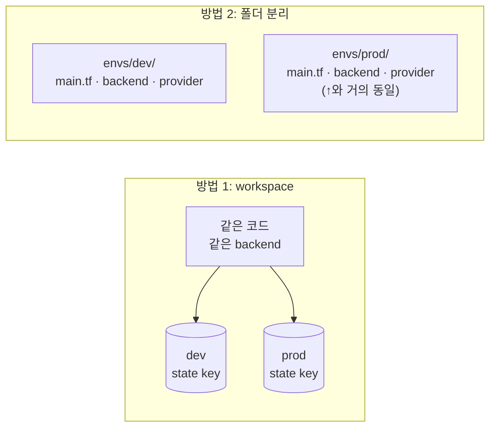

# 11. 환경이 둘이 되면 무엇이 깨지는가

한 환경에서 두 환경(dev · prod) 으로 늘어날 때 Terraform 의 어떤 한계가 드러나는지 직접 확인합니다. workspace 와 폴더 분리, 두 가지 방법을 만져보며 각각의 trade-off 와 중복을 봅니다.

## 핵심 다이어그램



- **workspace** — 한 코드 / 한 backend / 여러 state. 가볍지만 환경별 차이를 다 같은 backend 안에 맞춰야 합니다.
- **폴더 분리** — 환경별 폴더에 코드와 backend 를 따로 둠. 격리는 깨끗하지만 backend · provider · 모듈 호출이 매번 반복됩니다.
- 둘 다 **공통 부분의 중복** 을 코드로 못 막는다는 한계 — Terragrunt 가 풀려는 문제.

## 빠른 시작 — workspace 직접 만져보기

```bash
mkdir -p /tmp/tf-lab-11 && cd /tmp/tf-lab-11
```

```hcl
# main.tf
terraform {
  required_providers {
    aws = {
      source  = "hashicorp/aws"
      version = "~> 5.0"
    }
  }
}

provider "aws" {
  region  = "ap-northeast-2"
  profile = "rosa-lab"
}

data "aws_caller_identity" "current" {}

locals {
  prefix = "rosa-lab-tf-11"
  env    = terraform.workspace   # 활성 workspace 이름
}

resource "aws_s3_bucket" "lab" {
  bucket        = "${local.prefix}-${local.env}-${data.aws_caller_identity.current.account_id}"
  force_destroy = true
  tags = {
    Project = "rosa-hands-on"
    Edition = "terraform-11"
    Env     = local.env
  }
}

output "bucket" {
  value = aws_s3_bucket.lab.bucket
}
```

```bash
terraform init
```

기본 workspace 는 `default`. 새 workspace 를 만듭니다.

```bash
terraform workspace list
# * default

terraform workspace new dev
# Created and switched to workspace "dev"!

terraform workspace new prod
# Created and switched to workspace "prod"!

terraform workspace list
#   default
#   dev
# * prod
```

각 workspace 에서 apply 하면 같은 코드가 활성 workspace 이름에 따라 다른 버킷을 만듭니다.

```bash
terraform workspace select dev
terraform apply
# bucket = "rosa-lab-tf-11-dev-..."

terraform workspace select prod
terraform apply
# bucket = "rosa-lab-tf-11-prod-..."
```

## 여기서 직접 확인할 수 있는 것

### state 는 backend 안에서 key 만 갈립니다

`terraform.workspace` 가 바뀌면 state 파일의 경로(key) 가 바뀝니다. backend 자체는 그대로.

local backend 에서는:

```bash
ls terraform.tfstate.d/
# dev/  prod/

ls terraform.tfstate.d/dev/
# terraform.tfstate

ls terraform.tfstate.d/prod/
# terraform.tfstate
```

S3 backend 라면 `env:/dev/terraform.tfstate`, `env:/prod/terraform.tfstate` 같은 키. **같은 버킷 / 같은 lock 메커니즘 / 같은 자격증명**. 가벼움이 장점이자 한계.

### workspace 의 한계는 명확합니다

같은 backend · 같은 provider · 같은 권한이 강제됩니다.

- **계정 분리 불가** — 운영 환경은 보통 별도 AWS 계정. workspace 로는 한 계정 안의 한 backend 만 허용.
- **provider 차이 어려움** — dev 는 ap-northeast-2, prod 는 us-east-1 처럼 분리하려면 코드에 `terraform.workspace` 분기를 많이 짜야 함.
- **backend 차이 어려움** — 환경별로 state 버킷을 따로 두고 싶어도 backend 블록은 literal 만 받음 (9편 참고).
- **실수 확률 높음** — 활성 workspace 가 prod 인데 dev 로 착각해 apply 한 사고가 흔합니다. 출력만 봐서는 어느 환경에 작업 중인지 분간이 어렵습니다.

운영 환경을 진지하게 분리하려면 폴더로 가르는 게 표준입니다.

### 폴더로 가르면 무엇이 중복되는가

표준 구조:

```
envs/
├── dev/
│   └── main.tf
└── prod/
    └── main.tf
modules/
└── bucket/
    └── ...
```

`envs/dev/main.tf`:

```hcl
terraform {
  required_providers { aws = { source = "hashicorp/aws", version = "~> 5.0" } }
  backend "s3" {
    bucket       = "rosa-lab-tf-state-<ACCOUNT_ID>"
    key          = "dev/terraform.tfstate"
    region       = "ap-northeast-2"
    profile      = "rosa-lab"
    use_lockfile = true
    encrypt      = true
  }
}

provider "aws" {
  region  = "ap-northeast-2"
  profile = "rosa-lab"
}

module "bucket" {
  source = "../../modules/bucket"
  env    = "dev"
}
```

`envs/prod/main.tf`:

```hcl
terraform {
  required_providers { aws = { source = "hashicorp/aws", version = "~> 5.0" } }
  backend "s3" {
    bucket       = "rosa-lab-tf-state-<ACCOUNT_ID>"
    key          = "prod/terraform.tfstate"        # ← 한 줄만 다름
    region       = "ap-northeast-2"
    profile      = "rosa-lab"
    use_lockfile = true
    encrypt      = true
  }
}

provider "aws" {
  region  = "ap-northeast-2"
  profile = "rosa-lab"
}

module "bucket" {
  source = "../../modules/bucket"
  env    = "prod"                                  # ← 한 줄만 다름
}
```

두 파일이 거의 똑같습니다. 환경이 셋 · 넷으로 늘면 모든 변경(예: provider version bump) 이 모든 파일에서 같이 일어나야 합니다.

특히 **backend 블록은 literal 만** 받아 변수로 못 빼냅니다. 환경마다 `key` 한 줄, 경우에 따라 `bucket` 까지 직접 박아야 합니다.

이 한 줄들의 반복을 코드 한 곳에 모으는 것이 Terragrunt 의 주된 동기입니다.

### `terraform destroy` 로 정리합니다

각 workspace 에서 destroy 후, default 로 돌아와 workspace 자체를 삭제합니다.

```bash
terraform workspace select prod
terraform destroy
#   Enter a value: yes

terraform workspace select dev
terraform destroy
#   Enter a value: yes

terraform workspace select default
terraform workspace delete dev
terraform workspace delete prod
```

> workspace delete 는 state 가 비어 있을 때만 동작합니다. destroy 를 먼저 한 뒤에 해야 합니다.

### 실습 폴더 정리

```bash
cd ..
rm -rf /tmp/tf-lab-11
```
