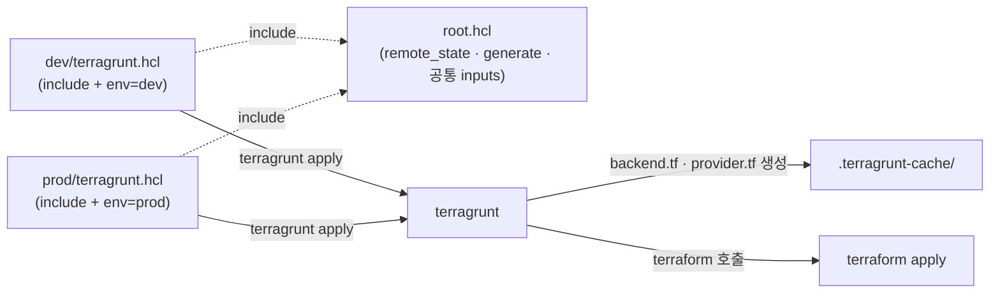

# 12. Terragrunt 첫 걸음

11편에서 본 환경별 중복(backend · provider 도배) 을 한 곳으로 모읍니다. Terragrunt 의 `terragrunt.hcl`, `include`, `generate` 세 가지를 손에 익혀, dev / prod 두 환경을 root 설정 하나에 묶습니다.

## 핵심 다이어그램



- **`terragrunt.hcl`** — Terragrunt 의 설정 파일. live 폴더마다 하나씩.
- **`include` 블록** — 부모(root) 설정을 끌어옴. 공통 설정을 한 곳에 둠.
- **`generate` 블록** — `provider.tf` 같은 .tf 파일을 캐시 폴더에 자동 작성. Terraform 코드를 안 건드리고 환경별 차이를 끼워 넣음.
- **`remote_state` 블록** — backend 전용 generate. `path_relative_to_include()` 같은 함수로 env 별 state key 가 자동 분기.
- 결과: 11편에서 각 env 의 main.tf 에 도배되던 backend · provider 가 root.hcl 한 곳으로.

## 사전 준비 — Terragrunt 설치 + state 버킷 부트스트랩

```bash
brew install terragrunt
terragrunt --version
# terragrunt version 1.0.8

# Terragrunt 함수(get_aws_account_id 등)는 SDK credential chain 을 따라갑니다.
# root.hcl 안의 profile 설정은 Terraform 의 backend·provider 용이라 별개입니다.
export AWS_PROFILE=rosa-lab

# state 버킷을 한 번 수동으로 만듭니다 (이 편에서는 부트스트랩 단순화)
ACCOUNT=$(aws sts get-caller-identity --query Account --output text)
aws s3 mb "s3://rosa-lab-tg-state-${ACCOUNT}" --region ap-northeast-2
# 버킷 versioning · 암호화는 운영에선 켜야 함 — 이 편에선 생략
```

## 빠른 시작 — 폴더와 파일

```
/tmp/tf-lab-12/
├── root.hcl                  # 모든 환경이 include 할 공통 설정
├── modules/
│   └── bucket/               # 진짜 Terraform 모듈
│       ├── main.tf
│       ├── variables.tf
│       └── outputs.tf
├── dev/
│   └── terragrunt.hcl        # dev — include + source + inputs
└── prod/
    └── terragrunt.hcl        # prod — 위와 거의 같음
```

```bash
mkdir -p /tmp/tf-lab-12/modules/bucket /tmp/tf-lab-12/dev /tmp/tf-lab-12/prod
cd /tmp/tf-lab-12
```

### `modules/bucket/` — Terragrunt 가 호출할 Terraform 모듈

```hcl
# modules/bucket/main.tf
terraform {
  required_providers {
    aws = {
      source  = "hashicorp/aws"
      version = "~> 5.0"
    }
  }
}

data "aws_caller_identity" "current" {}

resource "aws_s3_bucket" "this" {
  bucket        = "${var.prefix}-${var.env}-${data.aws_caller_identity.current.account_id}"
  force_destroy = true
  tags          = merge(var.tags, { Env = var.env })
}
```

```hcl
# modules/bucket/variables.tf
variable "prefix" {
  type = string
}

variable "env" {
  type = string
}

variable "tags" {
  type    = map(string)
  default = {}
}
```

```hcl
# modules/bucket/outputs.tf
output "bucket" { value = aws_s3_bucket.this.bucket }
```

이 모듈에는 `backend` 블록도 `provider` 블록도 없습니다. 두 블록 모두 Terragrunt 가 환경별로 만들어 끼워 넣을 것입니다.

### `root.hcl` — 모든 환경의 공통 설정

```hcl
# root.hcl
remote_state {
  backend = "s3"
  config = {
    bucket       = "rosa-lab-tg-state-${get_aws_account_id()}"
    key          = "${path_relative_to_include()}/terraform.tfstate"
    region       = "ap-northeast-2"
    profile      = "rosa-lab"
    use_lockfile = true
    encrypt      = true
  }
  generate = {
    path      = "backend.tf"
    if_exists = "overwrite_terragrunt"
  }
}

generate "provider" {
  path      = "provider.tf"
  if_exists = "overwrite_terragrunt"
  contents  = <<EOF
provider "aws" {
  region  = "ap-northeast-2"
  profile = "rosa-lab"
}
EOF
}

# 공통 inputs — child 가 덮어쓸 수 있습니다
inputs = {
  prefix = "rosa-lab-tg-12"
  tags = {
    Project = "rosa-hands-on"
    Edition = "terragrunt-12"
  }
}
```

- `remote_state` 의 `key = "${path_relative_to_include()}/terraform.tfstate"` — child 가 dev/ 에 있으면 `dev/terraform.tfstate`, prod/ 면 `prod/terraform.tfstate` 로 자동 분기.
- `generate "provider"` — `provider.tf` 를 캐시 폴더에 작성. `if_exists = "overwrite_terragrunt"` 는 Terragrunt 가 만든 파일이면 덮어쓰고, 다른 파일이면 보존.

### `dev/terragrunt.hcl` 와 `prod/terragrunt.hcl`

```hcl
# dev/terragrunt.hcl
include "root" {
  path = find_in_parent_folders("root.hcl")
}

terraform {
  source = "../modules/bucket"
}

inputs = {
  env = "dev"
}
```

```hcl
# prod/terragrunt.hcl
include "root" {
  path = find_in_parent_folders("root.hcl")
}

terraform {
  source = "../modules/bucket"
}

inputs = {
  env = "prod"
}
```

두 파일이 거의 동일합니다. 환경별 차이는 `inputs.env` 한 줄. 11편에서 도배되던 backend / provider / required_providers 는 root.hcl 안으로 사라졌습니다.

### apply

```bash
cd dev
terragrunt apply
#   Enter a value: yes
# (terragrunt 가 backend.tf · provider.tf 생성 → terraform init → apply)
# Apply complete! Resources: 1 added.

cd ../prod
terragrunt apply
#   Enter a value: yes
# Apply complete! Resources: 1 added.
```

확인:

```bash
aws s3 ls --profile rosa-lab | grep rosa-lab-tg-12
# 2026-... rosa-lab-tg-12-dev-...
# 2026-... rosa-lab-tg-12-prod-...
```

## 여기서 직접 확인할 수 있는 것

### `terragrunt apply` 는 안에서 어떤 순서로 동작하는가

대략:

1. 현재 폴더의 `terragrunt.hcl` 을 읽음
2. `include` 가 가리키는 root.hcl 을 끌어와 병합
3. `terraform.source` 의 모듈을 `.terragrunt-cache/<hash>/<source>/` 에 복사
4. `remote_state` · `generate` 블록을 보고 그 캐시 폴더에 `backend.tf` · `provider.tf` 작성
5. `inputs` 의 각 키를 `TF_VAR_<key>` 환경변수로 만들어 terraform 프로세스에 주입
6. 그 캐시 폴더에서 `terraform init` + `terraform apply` 실행

캐시 폴더를 들여다보면 4번까지의 결과가 그대로 보입니다.

```bash
find .terragrunt-cache -name '*.tf' | head
# .terragrunt-cache/<hash>/.../backend.tf       ← generated
# .terragrunt-cache/<hash>/.../provider.tf      ← generated
# .terragrunt-cache/<hash>/.../main.tf          ← modules/bucket 복사본
# .terragrunt-cache/<hash>/.../variables.tf     ← modules/bucket 복사본
# .terragrunt-cache/<hash>/.../outputs.tf       ← modules/bucket 복사본
```

### `generate` 가 만들어낸 backend.tf · provider.tf 직접 보기

```bash
# dev 의 캐시에서
cat $(find .terragrunt-cache -name backend.tf | head -1)
# terraform {
#   backend "s3" {
#     bucket       = "rosa-lab-tg-state-..."
#     key          = "dev/terraform.tfstate"
#     region       = "ap-northeast-2"
#     profile      = "rosa-lab"
#     use_lockfile = true
#     encrypt      = true
#   }
# }

cat $(find .terragrunt-cache -name provider.tf | head -1)
# provider "aws" {
#   region  = "ap-northeast-2"
#   profile = "rosa-lab"
# }
```

같은 명령을 `prod/` 의 캐시에 돌리면 backend.tf 의 `key` 만 `prod/terraform.tfstate` 로 다릅니다. **root.hcl 한 줄짜리 함수 호출** 이 환경별 분기를 처리합니다.

### `inputs` 는 어떻게 Terraform 변수가 되는가

Terragrunt v1 은 inputs 를 캐시 폴더의 파일로 떨어뜨리지 않습니다. 각 키를 `TF_VAR_<key>` 환경변수로 만들어 terraform 자식 프로세스에 주입하고, Terraform 이 `TF_VAR_*` 를 `var.*` 로 읽어 들입니다 (문서: <https://docs.terragrunt.com/features/inputs>).

병합 결과는 `terragrunt render` 로 확인할 수 있습니다.

```bash
terragrunt render --format json | jq .inputs
# {
#   "env": "prod",
#   "prefix": "rosa-lab-tg-12",
#   "tags": {
#     "Edition": "terragrunt-12",
#     "Project": "rosa-hands-on"
#   }
# }
```

root.hcl 의 inputs (`prefix`, `tags`) 와 child 의 inputs (`env`) 가 한 묶음으로 합쳐졌습니다. 같은 키가 양쪽에 있으면 child 가 이깁니다.

### 11편과 비교 — 무엇이 한 곳으로 모였나

11편의 envs/{dev,prod}/main.tf 에서 환경마다 도배되던:

- `terraform` 블록 + `required_providers`
- `backend "s3"` 블록 (key 한 줄만 달랐음)
- `provider "aws"` 블록

이 모두가 **root.hcl 한 곳** 으로 들어왔습니다. dev/terragrunt.hcl 과 prod/terragrunt.hcl 에는 환경별 차이(`env` 한 줄) 만 남았습니다.

backend literal-only 제약(9편) 도 자연스럽게 우회됩니다 — Terragrunt 가 함수 결과를 literal 로 변환해 backend.tf 에 박아 줍니다.

## destroy 와 정리

```bash
cd /tmp/tf-lab-12/dev
terragrunt destroy
#   Enter a value: yes

cd /tmp/tf-lab-12/prod
terragrunt destroy
#   Enter a value: yes
```

state 버킷도 같이 정리:

```bash
ACCOUNT=$(aws sts get-caller-identity --query Account --output text --profile rosa-lab)
aws s3 rb "s3://rosa-lab-tg-state-${ACCOUNT}" --force --profile rosa-lab
```

### 실습 폴더 정리

```bash
cd /tmp && rm -rf tf-lab-12
```
