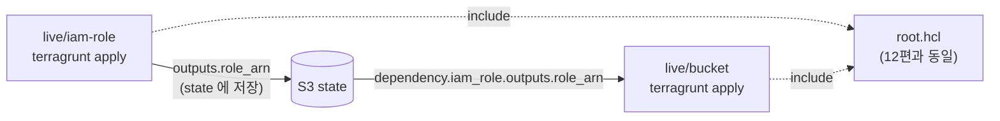

# 13. 모듈 의존성 — dependency, mock_outputs, run --all

12편에서 dev/prod 두 환경을 root 하나에 묶었습니다. 이번엔 한 환경 안에서 모듈 둘이 서로 의존할 때 — A 의 output 이 B 의 input 이 되는 흐름을 다룹니다. Terragrunt 의 `dependency` 블록, `mock_outputs`, `run --all` 세 가지가 주제입니다.

## 핵심 다이어그램



- **`dependency` 블록** — 다른 모듈의 `outputs` 를 읽어와 현재 모듈의 `inputs` 로 주입. terragrunt 가 의존 모듈의 state 를 직접 읽음.
- **`mock_outputs`** — 의존 모듈이 아직 apply 되지 않았을 때 plan/validate 만 흘려보내기 위한 가짜 값.
- **`run --all`** — DAG 를 만들어 의존성 순서대로 한 번에 apply/destroy.

## 사전 준비

12편에서 만든 state 버킷 (`rosa-lab-tg-state-<account>`) 을 그대로 씁니다. 12편을 정리했다면 다시 만들어주세요.

```bash
export AWS_PROFILE=rosa-lab
ACCOUNT=$(aws sts get-caller-identity --query Account --output text)

# 버킷이 있는지 확인, 없으면 생성
aws s3api head-bucket --bucket "rosa-lab-tg-state-${ACCOUNT}" 2>/dev/null \
  || aws s3 mb "s3://rosa-lab-tg-state-${ACCOUNT}" --region ap-northeast-2
```

## 빠른 시작 — 폴더와 파일

```
/tmp/tf-lab-13/
├── root.hcl                  # 12편과 동일
├── modules/
│   ├── iam-role/             # IAM role — output: role_arn
│   │   ├── main.tf
│   │   ├── variables.tf
│   │   └── outputs.tf
│   └── bucket/               # S3 bucket + bucket policy — input: read_role_arn
│       ├── main.tf
│       ├── variables.tf
│       └── outputs.tf
└── live/
    ├── iam-role/
    │   └── terragrunt.hcl    # source = ../../modules/iam-role
    └── bucket/
        └── terragrunt.hcl    # dependency "iam_role" 사용
```

```bash
mkdir -p /tmp/tf-lab-13/modules/{iam-role,bucket} /tmp/tf-lab-13/live/{iam-role,bucket}
cd /tmp/tf-lab-13
```

### `root.hcl`

12편과 같습니다. `path_relative_to_include()` 가 child 위치에 따라 state key 를 자동 분기합니다 — live/iam-role 은 `live/iam-role/terraform.tfstate`, live/bucket 은 `live/bucket/terraform.tfstate`.

```hcl
# root.hcl
remote_state {
  backend = "s3"
  config = {
    bucket       = "rosa-lab-tg-state-${get_aws_account_id()}"
    key          = "${path_relative_to_include()}/terraform.tfstate"
    region       = "ap-northeast-2"
    profile      = "rosa-lab"
    use_lockfile = true
    encrypt      = true
  }
  generate = {
    path      = "backend.tf"
    if_exists = "overwrite_terragrunt"
  }
}

generate "provider" {
  path      = "provider.tf"
  if_exists = "overwrite_terragrunt"
  contents  = <<EOF
provider "aws" {
  region  = "ap-northeast-2"
  profile = "rosa-lab"
}
EOF
}

inputs = {
  tags = {
    Project = "rosa-hands-on"
    Edition = "terragrunt-13"
  }
}
```

### `modules/iam-role/`

```hcl
# modules/iam-role/main.tf
terraform {
  required_providers {
    aws = {
      source  = "hashicorp/aws"
      version = "~> 5.0"
    }
  }
}

resource "aws_iam_role" "this" {
  name = var.name

  assume_role_policy = jsonencode({
    Version = "2012-10-17"
    Statement = [{
      Effect    = "Allow"
      Principal = { Service = "ec2.amazonaws.com" }
      Action    = "sts:AssumeRole"
    }]
  })

  tags = var.tags
}
```

```hcl
# modules/iam-role/variables.tf
variable "name" {
  type = string
}

variable "tags" {
  type    = map(string)
  default = {}
}
```

```hcl
# modules/iam-role/outputs.tf
output "role_arn" {
  value = aws_iam_role.this.arn
}
```

### `modules/bucket/`

```hcl
# modules/bucket/main.tf
terraform {
  required_providers {
    aws = {
      source  = "hashicorp/aws"
      version = "~> 5.0"
    }
  }
}

data "aws_caller_identity" "current" {}

resource "aws_s3_bucket" "this" {
  bucket        = "${var.prefix}-${data.aws_caller_identity.current.account_id}"
  force_destroy = true
  tags          = var.tags
}

resource "aws_s3_bucket_policy" "read_for_role" {
  bucket = aws_s3_bucket.this.id
  policy = jsonencode({
    Version = "2012-10-17"
    Statement = [{
      Effect    = "Allow"
      Principal = { AWS = var.read_role_arn }
      Action    = ["s3:GetObject", "s3:ListBucket"]
      Resource = [
        aws_s3_bucket.this.arn,
        "${aws_s3_bucket.this.arn}/*",
      ]
    }]
  })
}
```

```hcl
# modules/bucket/variables.tf
variable "prefix" {
  type = string
}

variable "read_role_arn" {
  type        = string
  description = "이 bucket 을 읽을 IAM role 의 ARN"
}

variable "tags" {
  type    = map(string)
  default = {}
}
```

```hcl
# modules/bucket/outputs.tf
output "bucket" {
  value = aws_s3_bucket.this.bucket
}
```

### `live/iam-role/terragrunt.hcl`

```hcl
include "root" {
  path = find_in_parent_folders("root.hcl")
}

terraform {
  source = "../../modules/iam-role"
}

inputs = {
  name = "rosa-lab-tg-13-reader"
}
```

### `live/bucket/terragrunt.hcl` — dependency 사용

```hcl
include "root" {
  path = find_in_parent_folders("root.hcl")
}

dependency "iam_role" {
  config_path = "../iam-role"
}

terraform {
  source = "../../modules/bucket"
}

inputs = {
  prefix        = "rosa-lab-tg-13"
  read_role_arn = dependency.iam_role.outputs.role_arn
}
```

`dependency.iam_role.outputs.role_arn` 한 줄로 두 모듈을 묶었습니다. Terragrunt 는 bucket 의 apply 직전에 iam-role 의 state 를 읽어 `role_arn` 을 가져와 `TF_VAR_read_role_arn` 으로 주입합니다.

## apply — 두 가지 방식

### 한 폴더씩

의존이 먼저인 쪽을 먼저:

```bash
cd live/iam-role
terragrunt apply
#   Enter a value: yes

cd ../bucket
terragrunt apply
#   Enter a value: yes
```

### `run --all` — 한 번에

DAG 를 따라 알아서 순서를 잡습니다:

```bash
cd /tmp/tf-lab-13/live
terragrunt run --all -- apply
```

`--all` 은 현재 폴더 아래의 모든 unit 을 대상으로 명령을 돌립니다. `-auto-approve` 가 기본으로 붙으므로 prompt 가 안 뜹니다 (`--no-auto-approve` 로 끌 수 있음).

## 여기서 직접 확인할 수 있는 것

### `dependency` 가 안에서 어떻게 동작하는가

bucket 의 `terragrunt apply` 직전, terragrunt 는 다음을 합니다.

1. `dependency "iam_role"` 의 `config_path` 를 읽고 그 모듈의 state 위치를 알아냄
2. iam-role 의 state 에서 outputs 를 읽음 (사실상 `terragrunt output -json` 과 동일)
3. 그 값을 `dependency.iam_role.outputs.<key>` 로 노출
4. bucket 의 `inputs.read_role_arn` 으로 들어가 `TF_VAR_read_role_arn` 환경변수가 됨

state 가 없으면 (= iam-role 을 한 번도 apply 안 했다면) 에러:

```
Error: cannot read outputs from module ../iam-role
```

### `mock_outputs` — plan 만 해보고 싶을 때

iam-role 을 아직 apply 하지 않은 채로 bucket 의 plan 을 보고 싶다면, `dependency` 블록에 `mock_outputs` 를 추가:

```hcl
dependency "iam_role" {
  config_path = "../iam-role"

  mock_outputs = {
    role_arn = "arn:aws:iam::000000000000:role/MOCK"
  }
  mock_outputs_allowed_terraform_commands = ["plan", "validate"]
}
```

- `mock_outputs` — 실제 state 가 없을 때 쓰일 가짜 값.
- `mock_outputs_allowed_terraform_commands` — 가짜 값이 허용될 명령 목록. `apply` 를 빼면 실수로 mock 값으로 apply 되는 일을 막을 수 있음.

```bash
# iam-role 을 destroy 한 상태에서
cd live/bucket
terragrunt plan
# mock 의 ARN 으로 plan 이 나옴

terragrunt apply
# Error — apply 는 mock 허용 목록에 없음
```

### `run --all` 의 DAG 를 직접 보기

```bash
cd /tmp/tf-lab-13/live
terragrunt dag graph
# (DOT 형식 출력)
```

Graphviz 가 있으면 PNG 로:

```bash
terragrunt dag graph | dot -Tpng > /tmp/tg-dag.png
open /tmp/tg-dag.png
```

### destroy 순서

`bucket` 이 `iam_role` 의 role_arn 을 참조하므로 destroy 도 bucket 이 먼저여야 합니다. `run --all -- destroy` 는 DAG 를 뒤집어 자동으로 잡습니다.

```bash
cd /tmp/tf-lab-13/live
terragrunt run --all -- destroy
# bucket → iam-role 순서로 destroy
```

## destroy 와 정리

```bash
cd /tmp/tf-lab-13/live
terragrunt run --all -- destroy
```

state 버킷도 이번 편으로 끝낸다면:

```bash
ACCOUNT=$(aws sts get-caller-identity --query Account --output text)
aws s3 rb "s3://rosa-lab-tg-state-${ACCOUNT}" --force
```

### 실습 폴더 정리

```bash
cd /tmp && rm -rf tf-lab-13
```
